## ML Algorithms

## CLOUD big data & ai

## 10 Machine Learning Algorithms You Should Know in 2018

In 2017, the word big data became quite popular and it will continue to prevail even in the coming years. This article provides a list of the most commonly used ML algorithms which you should be aware of.

1.  **Random forest**

First, from the original data, select randomly and form different subsets.

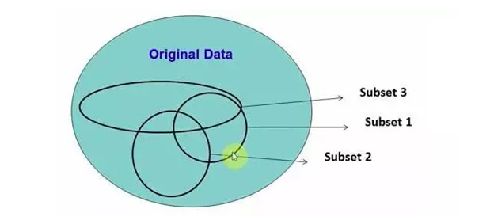

The original data is called Matrix S and contains1-N rows. A, B, C are the features and C stands for categories.

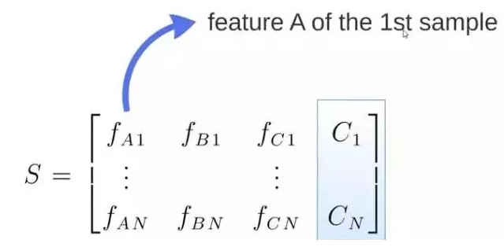

Create, let's say, M sets of random subsets from S.  

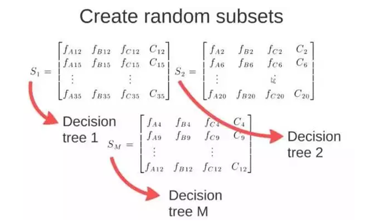

From these subsets, we then get M sets of decision trees. When you add new data into these trees, it is possible to get M sets of results.

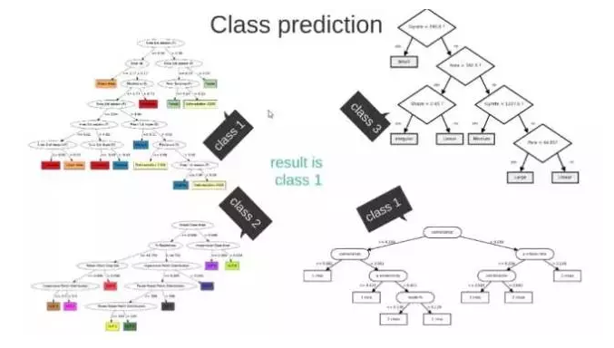

Using certain attributes, classify a data set into groups. At each node, execute a test using branch judgment. Further split the data into two groups. Tests are carried out based on the existing data, and the new data being added is classified to the corresponding group. Group data according to some features. Each time the process takes a step forward, there is a judging branch. The work of the judgment is to divide the data into two phases, and the process repeats itself. When there is incoming data, the computer categorizes it into the right leaves.

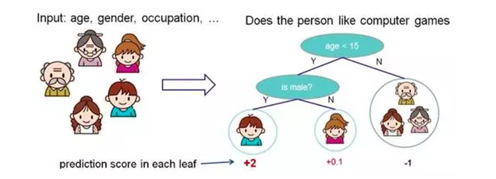

3.  **K-NearestNeighbour**

When a new datum comes in, determining the category in which it falls involves looking at the category that has the most points nearest to it. An example is distinguishing between a cat and dog. We base on our judgment on these two features- claws and sound.

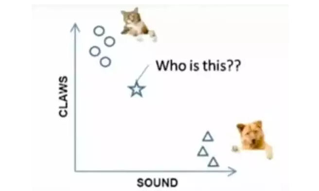

The known symbols used to represent categories are circles and rectangles. This brings us to our next question- what do stars represent?

When K=3, the nearest three points are connected by these three lines. The circles are also more. This means the star belongs to the cat.

4.  **Markov**

Markov Chain is made up of states and transitions. An example is a Markov Chain that is based on 'the quick brown fox jumps over the lazy dog' '.

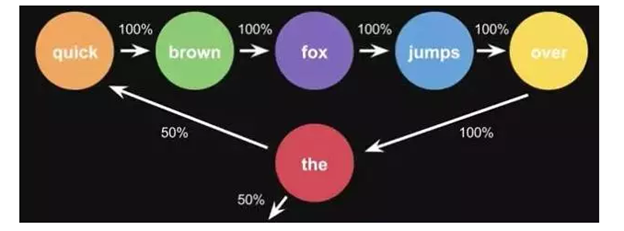

The first step is to set every word under a state, then to calculate the probability of state transitions. By just a single sentence, these probabilities can be calculated. By using large data of texts in the computer, you want to get a larger state transition matrix.

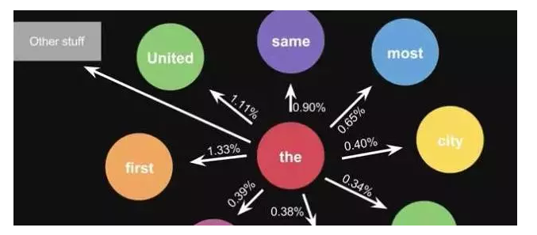

5.  **Neural Network**

The neural network is made up of neures and neures connections. The first layer is called the input layer while the last is called the output layer. Hidden and output layers both have their own classifiers.

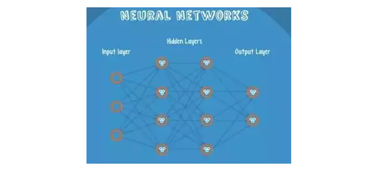

In Neutral Network, an input can end up into at least two classes. Once an input comes in the network, it is activated, and the result passed down to the layer that is next. Scores in the output layer are the same as the scores for each class.

**Example**

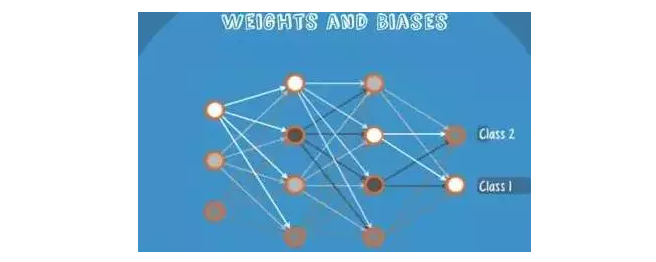

From the example above, input passes through different knots to generate different scores.

6.  **Logistic Regression**

If the probability of the predicting target is greater than zero and equal to or less than 1, the simple linear model is cannot be used. This is because when the domain of division does not lie within a given level, the range could be bigger than the laid out interval.

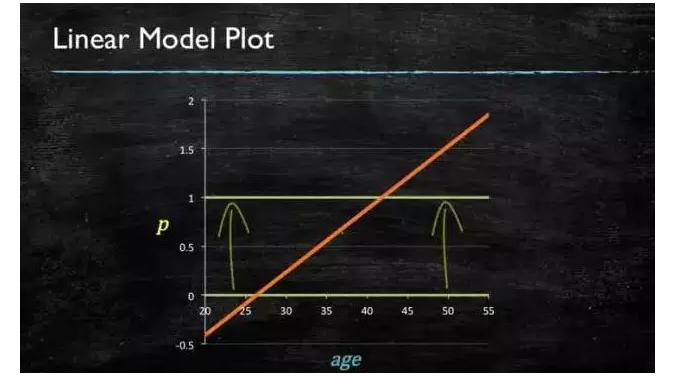

Therefore, we would have to go with this one.

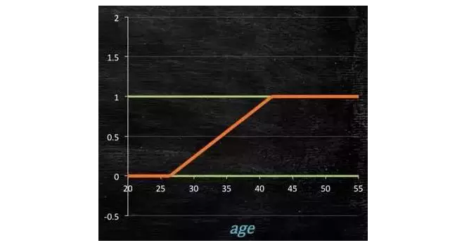

How does one get this model? It should be noted that the model has to either be larger than or equal to zero and less than or equal to one

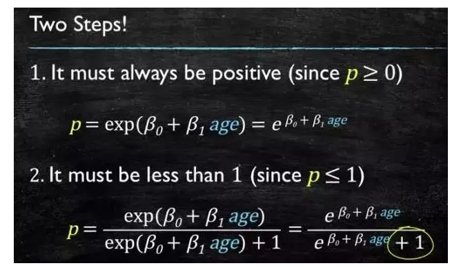

Transforming the formula gives us the logistic regression model

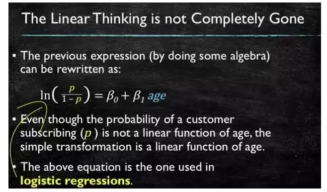

We can get the corresponding coefficients by calculating the original data. This is the logistic model we get.

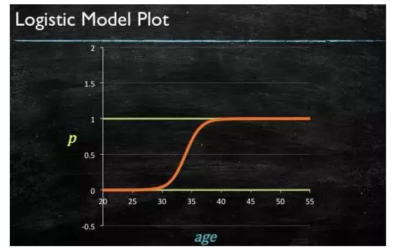

7.  **Support Vector Machine**

In order to separate the two classes from hyperplane, it's best to use the hyperplane that leaves the maximum margin from both classes. Given that Z2 is greater than Z1, the green one is a better choice.

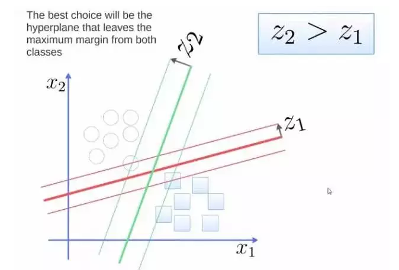

The class that is above the line is greater than or equal to one while the one below it is less than or equal to -1.

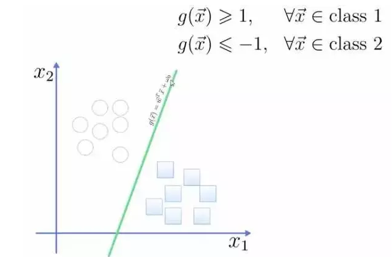

Find the distance from the point to the surface using the equation in the graph

The result is the expression of total margin. The goal is to maximize the margin, which we do by minimizing the denominator.

,

Example:

Using 3 points to determine the optimal hyperplane, define weight vector=(2, 3)-(1, 1)

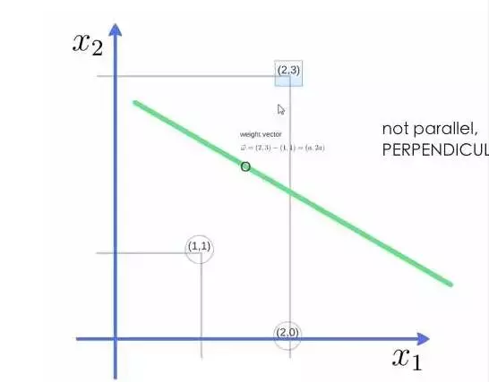

We get a weight factor (a, 2a) and substitute in the equation.

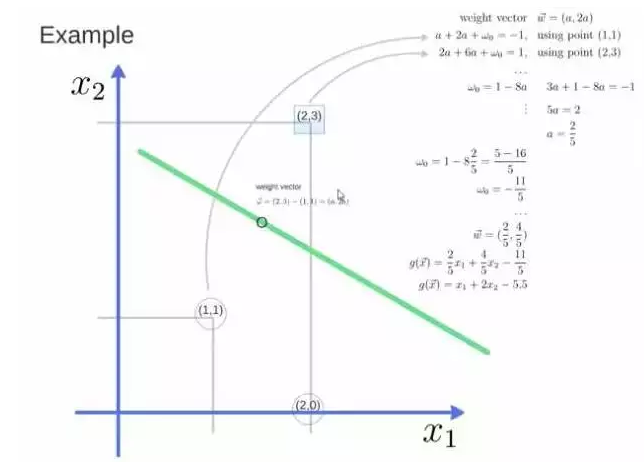

8.  **Adaboost**

It is a boosting measure. Boosting refers to the process of gathering the classifiers that lacked satisfied results and generating a classifier with better effects.

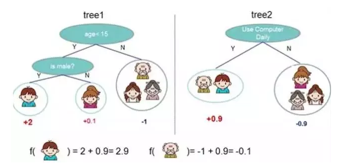

From the illustration above, you can see that the individual trees 1 and 2 have no good effects when put independently. However, when we input the same data and add up the results, we get some more convincing results.

Taking a handwriting recognition below as an example, the panel extracts a lot of features such as beginning direction and distance from beginning to the ending point.

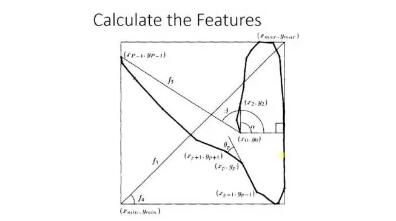

When training the machine, it gets each feature’s weight. It, therefore, does little classification, so it has little weight.

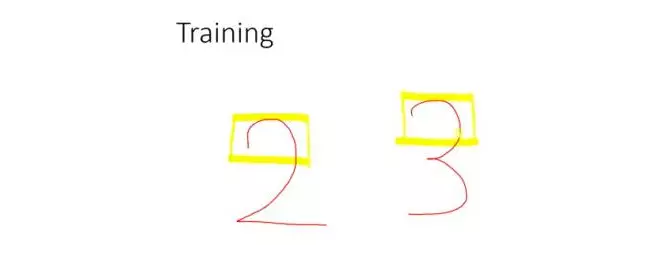

But the alpha angle here has great recognizability so the weight issue will be dealt with. The result will be achieved considering all these features.

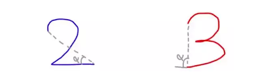

9.  **K-means**

The first step is to divide the data into three different classes. The biggest part is the pink one while the smallest is the yellow one. Select 3, 2, 1 as the default, then calculate the distance between the rest of the data and the defaults. After that, classify it into the class with the shortest distance.

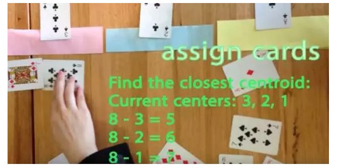

Once you classify, calculate the means of every class and make it the new center.

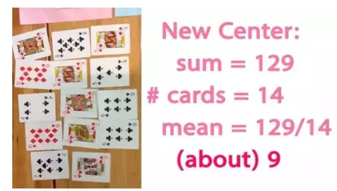

Stop when there are no more changes.

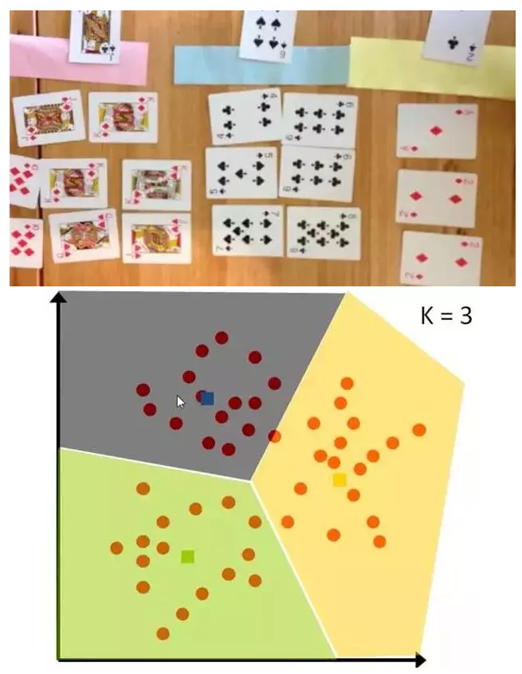

10. **Naive Bayes**

Below is an NLP example;

Determine if the texts' attitude is positive or negative.

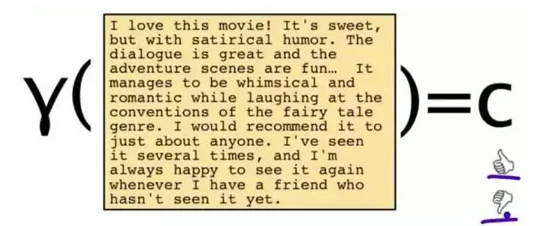

To solve the problem, choose a few words

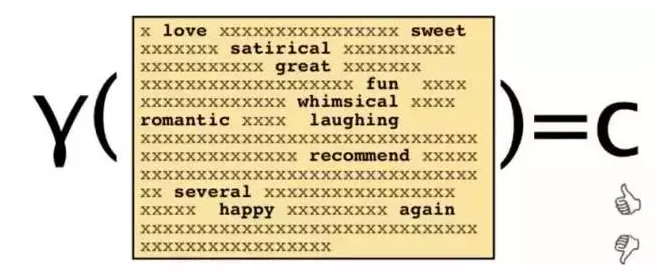

Words and their count

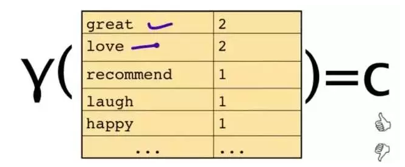

You may be given a question and asked the category in which it belongs. Using the Bayes rule, you can easily solve it.

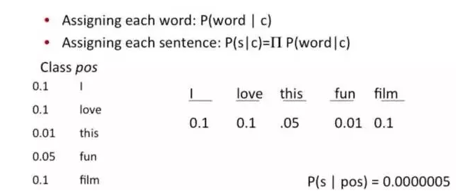

In this class, that question becomes “what’s the probability of occurrence of the sentence?”

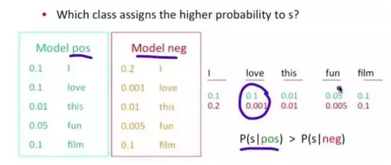

## [Weitere Beiträge](https://thinkport.digital/blog)

### [Warum Terraform eines Ihrer DevOps Tools sein sollte](https://thinkport.digital/warum-terraform-einer-ihrer-devops-tools-sein-sollte/ 'Warum Terraform eines Ihrer DevOps Tools sein sollte')

[AWS Cloud](https://thinkport.digital/category/aws-cloud/)

### [Warum Terraform eines Ihrer DevOps Tools sein sollte](https://thinkport.digital/warum-terraform-einer-ihrer-devops-tools-sein-sollte/ 'Warum Terraform eines Ihrer DevOps Tools sein sollte')

[AWS Cloud](https://thinkport.digital/category/aws-cloud/)

[')](https://thinkport.digital/cloud_infrastructure_with_crossplane/)

### [Crossplane – composing cloud infrastructure in a more effective way](https://thinkport.digital/cloud_infrastructure_with_crossplane/ 'Crossplane – composing cloud infrastructure in a more effective way')

[AWS Cloud](https://thinkport.digital/category/aws-cloud/)

### [Crossplane – composing cloud infrastructure in a more effective way](https://thinkport.digital/cloud_infrastructure_with_crossplane/ 'Crossplane – composing cloud infrastructure in a more effective way')

[AWS Cloud](https://thinkport.digital/category/aws-cloud/)

[')](https://thinkport.digital/16-things-to-avoid-when-writing-for-your-ui/)

### [16 Things to Avoid When Writing For Your UI](https://thinkport.digital/16-things-to-avoid-when-writing-for-your-ui/ '16 Things to Avoid When Writing For Your UI')

[Frontend](https://thinkport.digital/category/frontend/)

### [16 Things to Avoid When Writing For Your UI](https://thinkport.digital/16-things-to-avoid-when-writing-for-your-ui/ '16 Things to Avoid When Writing For Your UI')

[Frontend](https://thinkport.digital/category/frontend/)

[')](https://thinkport.digital/cheat-sheets-for-ai-machine-learning-neural-networks-big-data-deep-learning/)

### [Cheat Sheets for AI, Machine Learning, Neural Networks, Big Data & Deep Learning](https://thinkport.digital/cheat-sheets-for-ai-machine-learning-neural-networks-big-data-deep-learning/ 'Cheat Sheets for AI, Machine Learning, Neural Networks, Big Data & Deep Learning')

[Disrupt](https://thinkport.digital/category/disrupt/)

### [Cheat Sheets for AI, Machine Learning, Neural Networks, Big Data & Deep Learning](https://thinkport.digital/cheat-sheets-for-ai-machine-learning-neural-networks-big-data-deep-learning/ 'Cheat Sheets for AI, Machine Learning, Neural Networks, Big Data & Deep Learning')

[Disrupt](https://thinkport.digital/category/disrupt/)

[')](https://thinkport.digital/10-machine-learning-algorithms-you-should-know-in-2018/)

### [10 Machine Learning Algorithms You Should Know in 2018](https://thinkport.digital/10-machine-learning-algorithms-you-should-know-in-2018/ '10 Machine Learning Algorithms You Should Know in 2018')

[Disrupt](https://thinkport.digital/category/disrupt/)

### [10 Machine Learning Algorithms You Should Know in 2018](https://thinkport.digital/10-machine-learning-algorithms-you-should-know-in-2018/ '10 Machine Learning Algorithms You Should Know in 2018')

[Disrupt](https://thinkport.digital/category/disrupt/)

[')](https://thinkport.digital/aws-elastic-beanstalk-2/)

### [AWS Elastic Beanstalk](https://thinkport.digital/aws-elastic-beanstalk-2/ 'AWS Elastic Beanstalk')

[AWS Cloud](https://thinkport.digital/category/aws-cloud/)

### [AWS Elastic Beanstalk](https://thinkport.digital/aws-elastic-beanstalk-2/ 'AWS Elastic Beanstalk')

[AWS Cloud](https://thinkport.digital/category/aws-cloud/)

## Blog Kurator

### Christina Friede

### Business Development

## Email:

## [cfriede@thinkport.digital](mailto:cfriede@thinkport.digital)

- 
