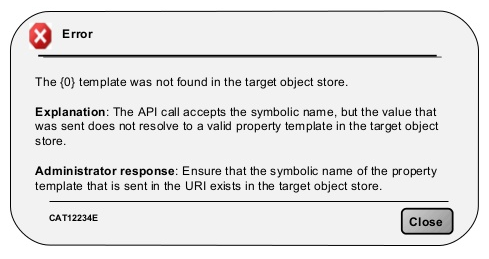

## Don'ts in UI Design

### frontend ui design

### 16 Things to Avoid When Writing For Your UI​

[Linkedin](https://www.linkedin.com/company/11759873) [Instagram](https://www.instagram.com/thinkport/) [Youtube](https://www.youtube.com/channel/UCnke3WYRT6bxuMK2t4jw2qQ) [Envelope](mailto:tdrechsel@thinkport.digital)

You write for your UI with an intention of making it useful to people, right? Therefore, you should ensure that it is simple, clear, and concise to enhance usability. Below are **16 things to avoid when writing.**

01. **Technical Terms and Specific Words**

Use of words that are meant for specific professions should be avoided. Words that are specifically meant to describe certain things should also be left out since the reader will not be able to understand them easily. Therefore, use simple terms that all users can understand without any difficulty. By doing so, you will be catering for all readers, whether beginners or advanced users.

The following is an example of using technical terms in error message:

It's hard to tell the targeted audience in the above statements, right? Is it system administrators or office workers? 

However, if your audience is familiar with the terms you intend to use, it is okay. If not, avoid them.

02. **Use of Future Tense to Describe The Action** Avoid using any other tense to explain product behavior. Use simple verb form whenever you want to write in the past or future. **Avoid** : " _Information has been received"_ **Use** : " _Information received"_  
      
      
    

03. **Avoid Long Detailed Information**

There is no need to explain every detail in the initial stages of interaction. It is more important to disclose information on features.

Empirical tips:

* Put down segments that can be scanned to enhance easy finding. Keep statements under 30 words.
* In each message, always ask yourself if the user really needs to know it.

04. **Usage of Pronoun "We"**

Rather than focusing on the user and what they are doing with their app.

**Avoid** : " _To help you get started, we are showing you these tweets_ ."

**Use** : " _Get started with these tweets."_

This rule can be exempted when a person does an action for a user. A good example is shown below. Here, usage of "we" is right.

**Avoid** : " _Your application will be revealed, and you will receive the feedback in a few hours."_

**Use** : " _We want to review your application and give the feedback within a few hours."_

05. **Combining Pronouns**

"Me" / "My" and "You" / "Your" are usually confused because they are in a similar scenario.

**Avoid** : " _Edit your choices in My Portal."_

**Use** : " _Edit choices in My Portal."_

06. **Replacing Numbers with Words**

Avoid replacing numbers with words.

**Avoid:** " _I have_ **_seven_** _templates"_

**Use:** _"I have_ **_7_** _templates"_

07. **Avoid Capitalizing All Letters**

As Miles Tinker puts it in his work: Legacy of Print, written in all-capital letters. However, when a normal sentence case is used, readers read fast saving time. Capital letters should only be used in logos and acronyms. It is advisable to use sentence-style capital letters for titles, headings, labels, and menus.

**Avoid**: “_BROWSE MENU”_  
**Use**: “_Browse menu”_  
**8\. Avoid Exclamation Language**

Avoid using exclamations as they appear as shouting. Instead, use polite words.

**Avoid:** _“See the improved features of the software!”_

**Use:** _“Welcome”_

09. **Avoid Totality and Over-promising**

**Avoid:** _“We’ll_ **_never_** _give you irrelevant information”_

**Use:** _“You’ll receive only crucial information”_

Avoid disclosing how great a feature is but rather what it does.

**Avoid:** _“_**_Great_** _transactions at shops you will like”_

**Use:** _“All your files in one folder”_

10.  **Avoid Unclear Error Messages**

Error messages are inevitable. However, you can incorporate them as part of user experience. Ensure the error messages sounds like they are put down for humans. Let the message clearly state:

_What went wrong_ and _why?_

What’s should the user do to solve the error?

A typical error may indicate “data is invalid” but fails to give the reason. Ensure the message is clear. Image credit: Material Design

11. **Blaming User**

If you want to retain your users, never blame them. Yes, they can make mistakes, but pointing fingers will only make the matter worse.

Instead, design the message in such a way that you don’t directly blame the user. Shift attention to user problem not error.

Image credit: usabilla

**Avoid:** _“You’ve entered a wrong password”_

**Use:** _“The password cannot be used. Please ensure its 8 characters long.”_

12. **Wordiness**

Avoid using lots of words. Be simple and direct for users to understand you. Leave out extra words that do not add value.

**Avoid:** _“_**_You must_** _enroll for classes?”_

**Use:** _“Enrol for classes?”_

13.  **Avoid “Are You Sure”**

The phrase adds no value in effective writing for your UI. Therefore, avoid it.

**Avoid:** _“Are you sure you want to move the file?”_

**Write:** _“Move the file”_

14. **Avoid Gender Discrimination**

Avoid words that create gender ambiguity.

Avoid: _I saw their mails_

Use: _I saw his mail_

Always specify gender by use of **his**/**her** to create a clear difference

15. **“OK” Button in Dialogs**

An effective dialog box isn’t only about asking users what to implement but clarifying each button. Though the ‘OK’ button is the convention for many dialogs, many apps use more user-friendly approach to dialog boxes. Since some users ignore dialogue box messages, you should give users specifically labeled buttons for certain actions instead of ‘OK ’buttons to confirm an action, as it reduces use errors.

For instance, buttons for _“Add photo”_ dialog

**Avoid:** _“OK|Cancel”_

**Use:** _“Remove|Keep”_

16. **Culture-Based Language**

Avoid culturally specific language as it may be hard to understand, therefore, inappropriate.

**Avoid:** _“She has hit it out of the park!”_

**Use:** _“She did a good job”_

**Summary**

When writing text in your app, it should complement your visual UI. Therefore, ensure simplicity, conciseness, directness, and efficiency. Everyone, regardless of culture, geographical location and language should be able to understand the writing without any struggle.

  
  

## [Weitere Beiträge](https://thinkport.digital/blog)

[")](https://thinkport.digital/aws-iam-2/)

### [AWS IAM](https://thinkport.digital/aws-iam-2/ "AWS IAM")

[AWS Cloud](https://thinkport.digital/category/aws-cloud/)

### [AWS IAM](https://thinkport.digital/aws-iam-2/ "AWS IAM")

[AWS Cloud](https://thinkport.digital/category/aws-cloud/)

[")](https://thinkport.digital/9-best-mobile-app-ui-design-trends-in-2018/)

### [9 Best Mobile App UI Design Trends in 2018](https://thinkport.digital/9-best-mobile-app-ui-design-trends-in-2018/ "9 Best Mobile App UI Design Trends in 2018")

[Frontend](https://thinkport.digital/category/frontend/)

### [9 Best Mobile App UI Design Trends in 2018](https://thinkport.digital/9-best-mobile-app-ui-design-trends-in-2018/ "9 Best Mobile App UI Design Trends in 2018")

[Frontend](https://thinkport.digital/category/frontend/)

[")](https://thinkport.digital/16-things-to-avoid-when-writing-for-your-ui/)

### [16 Things to Avoid When Writing For Your UI](https://thinkport.digital/16-things-to-avoid-when-writing-for-your-ui/ "16 Things to Avoid When Writing For Your UI")

[Frontend](https://thinkport.digital/category/frontend/)

### [16 Things to Avoid When Writing For Your UI](https://thinkport.digital/16-things-to-avoid-when-writing-for-your-ui/ "16 Things to Avoid When Writing For Your UI")

[Frontend](https://thinkport.digital/category/frontend/)

[")](https://thinkport.digital/cheat-sheets-for-ai-machine-learning-neural-networks-big-data-deep-learning/)

### [Cheat Sheets for AI, Machine Learning, Neural Networks, Big Data & Deep Learning](https://thinkport.digital/cheat-sheets-for-ai-machine-learning-neural-networks-big-data-deep-learning/ "Cheat Sheets for AI, Machine Learning, Neural Networks, Big Data & Deep Learning")

[Disrupt](https://thinkport.digital/category/disrupt/)

### [Cheat Sheets for AI, Machine Learning, Neural Networks, Big Data & Deep Learning](https://thinkport.digital/cheat-sheets-for-ai-machine-learning-neural-networks-big-data-deep-learning/ "Cheat Sheets for AI, Machine Learning, Neural Networks, Big Data & Deep Learning")

[Disrupt](https://thinkport.digital/category/disrupt/)

### [Managed Security für AWS-Umgebungen](https://thinkport.digital/neue-aws-funktionen-fur-speicher-und-dateisysteme-2/ "Managed Security für AWS-Umgebungen")

[AWS Cloud](https://thinkport.digital/category/aws-cloud/)

### [Managed Security für AWS-Umgebungen](https://thinkport.digital/neue-aws-funktionen-fur-speicher-und-dateisysteme-2/ "Managed Security für AWS-Umgebungen")

[AWS Cloud](https://thinkport.digital/category/aws-cloud/)

### [Home Office wegen Covid-19? So kann AWS helfen](https://thinkport.digital/home-office-covid-19-aws-losungen/ "Home Office wegen Covid-19? So kann AWS helfen")

[AWS Cloud](https://thinkport.digital/category/aws-cloud/)

### [Home Office wegen Covid-19? So kann AWS helfen](https://thinkport.digital/home-office-covid-19-aws-losungen/ "Home Office wegen Covid-19? So kann AWS helfen")

[AWS Cloud](https://thinkport.digital/category/aws-cloud/)

## Blog Kurator

### Christina Friede

### Business Development

## Email:

## [cfriede@thinkport.digital](mailto:cfriede@thinkport.digital)

* 
