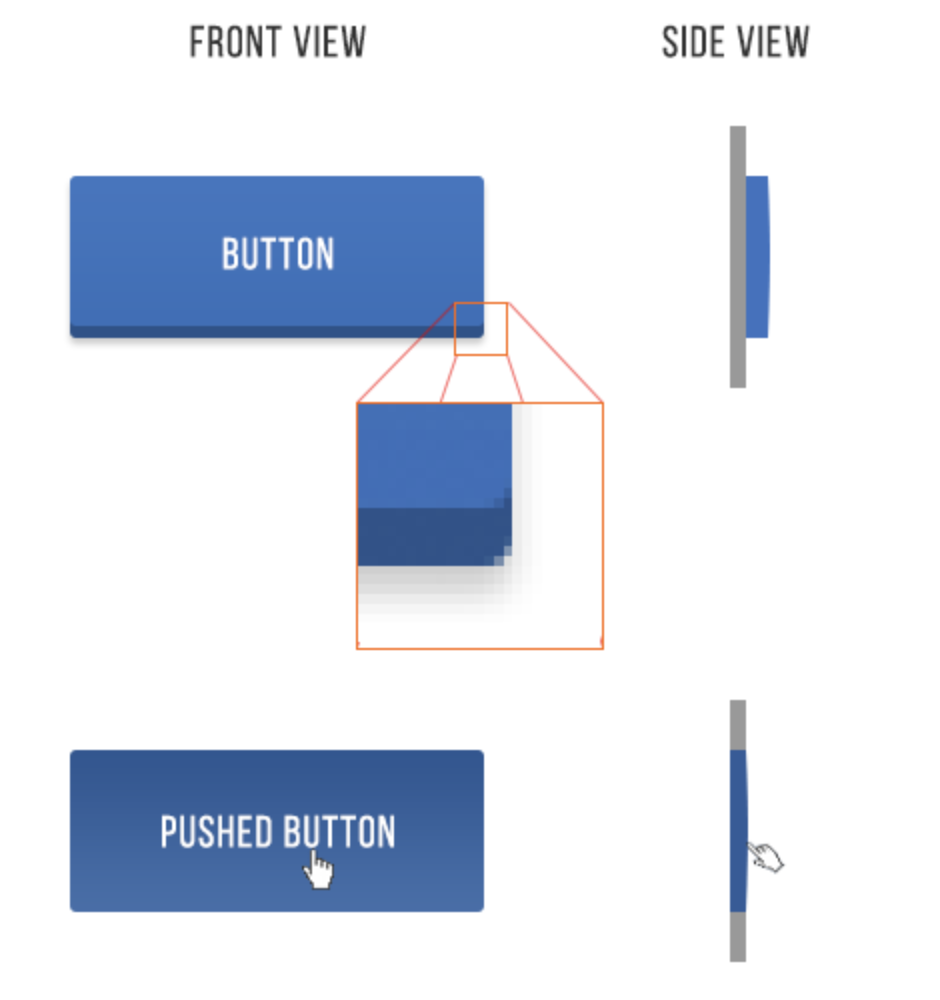

 

## Guidelines for a stunning UI

## Frontend UI Design

# 7 Golden Rules for Creating Great UI

[Linkedin](https://www.linkedin.com/company/11759873) [Instagram](https://www.instagram.com/thinkport/) [Youtube](https://www.youtube.com/channel/UCnke3WYRT6bxuMK2t4jw2qQ) [Envelope](mailto:tdrechsel@thinkport.digital)

The User Interface is one of the most critical parts of any software product. To increase the chances of success, designers and developers follow a few fundamental interface design principles. These principles represent crucial concepts used to guide software design. In this guide, I’ll share seven golden rules to help you create a beautiful user interface.

**Who will benefit from this guide?**

This guide is meant for:

1\.  Developers looking to design their own amazing user interface

2\.  UX designers seeking to give their portfolio a better appearance

**Why I decided to get UI skills**

As a UX designer, I thought I had everything I needed to succeed. Unfortunately, I didn’t have UI skills, and I came to learn the importance of creating beautiful user interfaces the hard way. First, my UX consulting clients preferred to hire someone with a variety of skills. Secondly, my portfolio was terrible, and it portrayed a bad impression about my work and skills. Having majored in engineering, it became my main excuse for failing to build something that looks good.

But soon I realized that I couldn’t let my excuses be the cause of my failures. Without any knowledge about aesthetics, I decided to learn through hard analysis everything there is to know about the aesthetics of apps. After hours of digging, practicing, and detailing what works, I picked up a few lessons for building a great UI.

**How these rules can help you**

As a nerd, you might not have an intuitive understanding of beauty and balance, but with these guide, you’ll be able to create a good-looking interface. This guide focuses solely on application rather than theory.

**Light comes from the sky**

Did you know that the human brain can tell what user elements we are looking at from shadows?

Light from the sky illuminates the upper part of objects, thereby casting shadows below the objects. As a result, the top side is always lighter and the bottom side darker. For instance, the lower eyelids of a person do not appear shaded, but if you happen to shine some light on them, you will notice the difference.

Everything works under this principle, including user interface. All UI elements have shadows below them. Though screens are flat, people have been able to make things on the screens appear to be 3-D.

## [Weitere Beiträge](https://thinkport.digital/blog)

[")](https://thinkport.digital/aws-s3-2/)

### [AWS S3](https://thinkport.digital/aws-s3-2/ "AWS S3")

[AWS Cloud](https://thinkport.digital/category/aws-cloud/)

### [AWS S3](https://thinkport.digital/aws-s3-2/ "AWS S3")

[AWS Cloud](https://thinkport.digital/category/aws-cloud/)

### [AWS EC2](https://thinkport.digital/aws-ec2-3/ "AWS EC2")

[AWS Cloud](https://thinkport.digital/category/aws-cloud/)

### [AWS EC2](https://thinkport.digital/aws-ec2-3/ "AWS EC2")

[AWS Cloud](https://thinkport.digital/category/aws-cloud/)

[")](https://thinkport.digital/cloud_infrastructure_with_crossplane/)

### [Crossplane – composing cloud infrastructure in a more effective way](https://thinkport.digital/cloud_infrastructure_with_crossplane/ "Crossplane – composing cloud infrastructure in a more effective way")

[AWS Cloud](https://thinkport.digital/category/aws-cloud/)

### [Crossplane – composing cloud infrastructure in a more effective way](https://thinkport.digital/cloud_infrastructure_with_crossplane/ "Crossplane – composing cloud infrastructure in a more effective way")

[AWS Cloud](https://thinkport.digital/category/aws-cloud/)

[")](https://thinkport.digital/9-best-mobile-app-ui-design-trends-in-2018/)

### [9 Best Mobile App UI Design Trends in 2018](https://thinkport.digital/9-best-mobile-app-ui-design-trends-in-2018/ "9 Best Mobile App UI Design Trends in 2018")

[Frontend](https://thinkport.digital/category/frontend/)

### [9 Best Mobile App UI Design Trends in 2018](https://thinkport.digital/9-best-mobile-app-ui-design-trends-in-2018/ "9 Best Mobile App UI Design Trends in 2018")

[Frontend](https://thinkport.digital/category/frontend/)

### [10 Big Data Trends to watch in 2018](https://thinkport.digital/10-big-data-trends-to-watch-in-2018/ "10 Big Data Trends to watch in 2018")

[Big Data](https://thinkport.digital/category/big-data/)

### [10 Big Data Trends to watch in 2018](https://thinkport.digital/10-big-data-trends-to-watch-in-2018/ "10 Big Data Trends to watch in 2018")

[Big Data](https://thinkport.digital/category/big-data/)

[")](https://thinkport.digital/aws-iam-2/)

### [AWS IAM](https://thinkport.digital/aws-iam-2/ "AWS IAM")

[AWS Cloud](https://thinkport.digital/category/aws-cloud/)

### [AWS IAM](https://thinkport.digital/aws-iam-2/ "AWS IAM")

[AWS Cloud](https://thinkport.digital/category/aws-cloud/)

## Blog Kurator

### Christina Friede

### Business Development

## Email:

## [cfriede@thinkport.digital](mailto:cfriede@thinkport.digital)

* 
