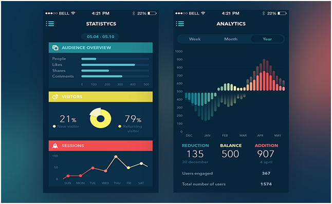
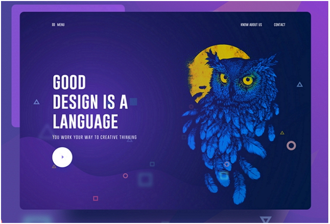
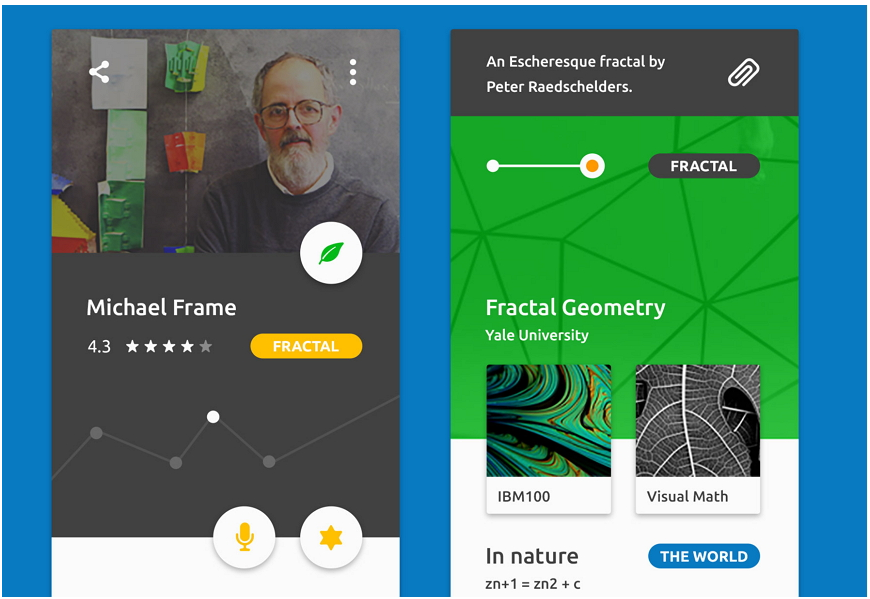
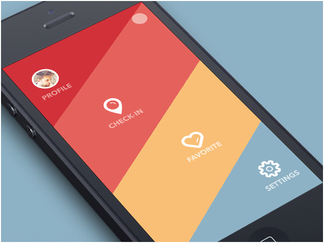
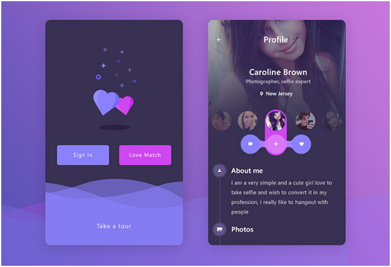
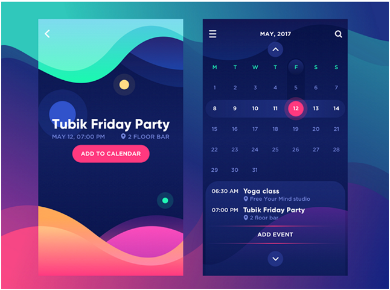

## Design Trends

## frontend UI Design

# 9 Best Mobile App UI Design Trends in 2018

[Linkedin](https://www.linkedin.com/company/11759873) [Instagram](https://www.instagram.com/thinkport/) [Youtube](https://www.youtube.com/channel/UCnke3WYRT6bxuMK2t4jw2qQ) [Envelope](mailto:tdrechsel@thinkport.digital)

Are you having a problem catching up with the dynamic trends in mobile app UI designs? Below are the top 9 UI design trends to look out for in 2018.

Mobile app User Interface design trends are changing now and then due to changing user needs. This is not, however, mean that mobile ap ++ ps UI design trends in 2018 are unpredictable. After a keen analysis of UI design trends and innovations in the past few years, we found some common factors that could help predict trends in 2018 were discovered. Therefore, below are 9 trends in mobile app UI designs for you in 2018.

**1). Strong Color and Font Contrast to enhance Legibility**

An excellent UI design should attract a user's attention. This can be created by using a strong color and better font contrast. For instance, making use of fonts of different types, sizes, orders, and styles creates a sense of hierarchy and space. Use of different strengths of colors creates sharp contrasts. The two aspects also make the UI design very attractive.

**2). Custom illustration interfaces**

UI design, and it will undoubtedly play even a bigger role and gain more popularity in 2018. You can expect mobile application interfaces with different styles of illustrations like simple style, handwriting, popular painting style illustration, and hand-drawing. These styles are very interesting, distinctive and impressive to the application users.

**3). Simple curves and geometries**

When compared to a complex and changeable UI design style, quite a huge number of designers opt for a simplistic and inherent style in mobile app UI design. For instance, compared to a phone app interface covered by different graphics, colors, pictures, animations, and quite sophisticated elements, a phone interface with simple curves, geometries, and buttons could be more effective. Such an interface enables the user to focus on the major functions and features of a mobile app.

**4). Level of Transparency**

Modifying the transparency of components can make them have different results. Therefore, when designing an interface, opacity setting of various components is a good way to create an impressive design. Adjusting settings of transparency for various graphics or colors can thus bring out a beautiful glass texture in different components of the app interface. This is the reason behind the making of this method in designing mobile app logo. 

Generally, in spite of the fact that they are in the process of becoming effective, the UI design works, the transparency of various components will increase in 2018.

**5). Voice-Enabled interfaces**

Voice-enabled interfaces make it easy for users to use the applications. Similar to using Siri, a user can simply start or log in a voice-activated mobile app. In fact, mobile apps with voice ordering services were the most popular on the internet in 2017, and will undoubtedly be the most popular again in 2018.

Fingerprint enabled interfaces will therefore play a crucial role in mobile app interface designs in days to come.

**6). Functional animations and interactions**

UI interface can help improve the user's experience with the app This is a trend that will not stop at 2017 but will spill all the way to 2018.

In addition, micro-interaction, which was first introduced and highly endorsed by Dan Saffer, will continue to be updated and used by designers in the coming of 2018.

Micro-interactions are meant to improve our interaction designs for some details of mobile app interfaces. They enable users to communicate with them quickly and obtain immediate feedback. This is undoubtedly a positive trend that designers should continue using their mobile app UI designs.

**7). Overlapping Effects**

Overlapping of colors, fonts, and graphics makes the UI designs more attractive and unique to the user and creates a sense of space. This explains why using different mobile app UI design elements has become popular with designers.

In addition, sometimes overlapping of colors, fonts, and graphics and combining with shadows makes the entire mobile app interface designs fantastic and impressive.

**8). Color gradients**  

In an attempt to design great backgrounds, logos, and buttons for mobile app interfaces, an increasing number of designers are using color gradients in their works. Have you discovered why? The response is simple. Despite selecting one color, you can also display a picture on a white background.

As a result, the color gradient will therefore be popular in 2018.

**9). Mixing trends**

In 2018, designers do not just use a single method in designing mobile app UI designs. Instead, they will combine two, three or even four methods to produce wholesomely combined designs with improved and unexpected effects.

**Conclusion**

Mobile app UI designs are complex and usually changeable to suit user needs. Therefore, whether or not these trends will take roots in 2018, a mobile app UI designer is always expected to be creative and innovative. The designer should therefore also have the needs of the app in mind as well as to combine scientific and technological aspects on a timely basis in developing new designs. If all these methods are considered and put to practice, it will be easy to come up with amazing mobile app UI designs.

## [Weitere Beiträge](https://thinkport.digital/blog)

[')](https://thinkport.digital/cloud_infrastructure_with_crossplane/)

### [Crossplane – composing cloud infrastructure in a more effective way](https://thinkport.digital/cloud_infrastructure_with_crossplane/ 'Crossplane – composing cloud infrastructure in a more effective way')

[AWS Cloud](https://thinkport.digital/category/aws-cloud/)

### [Crossplane – composing cloud infrastructure in a more effective way](https://thinkport.digital/cloud_infrastructure_with_crossplane/ 'Crossplane – composing cloud infrastructure in a more effective way')

[AWS Cloud](https://thinkport.digital/category/aws-cloud/)

[')](https://thinkport.digital/10-machine-learning-algorithms-you-should-know-in-2018/)

### [10 Machine Learning Algorithms You Should Know in 2018](https://thinkport.digital/10-machine-learning-algorithms-you-should-know-in-2018/ '10 Machine Learning Algorithms You Should Know in 2018')

[Disrupt](https://thinkport.digital/category/disrupt/)

### [10 Machine Learning Algorithms You Should Know in 2018](https://thinkport.digital/10-machine-learning-algorithms-you-should-know-in-2018/ '10 Machine Learning Algorithms You Should Know in 2018')

[Disrupt](https://thinkport.digital/category/disrupt/)

### [Neue AWS-Funktionen für Speicher- und Dateisysteme](https://thinkport.digital/neue-aws-funktionen-fur-speicher-und-dateisysteme/ 'Neue AWS-Funktionen für Speicher- und Dateisysteme')

[AWS Cloud](https://thinkport.digital/category/aws-cloud/)

### [Neue AWS-Funktionen für Speicher- und Dateisysteme](https://thinkport.digital/neue-aws-funktionen-fur-speicher-und-dateisysteme/ 'Neue AWS-Funktionen für Speicher- und Dateisysteme')

[AWS Cloud](https://thinkport.digital/category/aws-cloud/)

[')](https://thinkport.digital/aws-s3-2/)

### [AWS S3](https://thinkport.digital/aws-s3-2/ 'AWS S3')

[AWS Cloud](https://thinkport.digital/category/aws-cloud/)

### [AWS S3](https://thinkport.digital/aws-s3-2/ 'AWS S3')

[AWS Cloud](https://thinkport.digital/category/aws-cloud/)

### [Managed Security für AWS-Umgebungen](https://thinkport.digital/neue-aws-funktionen-fur-speicher-und-dateisysteme-2/ 'Managed Security für AWS-Umgebungen')

[AWS Cloud](https://thinkport.digital/category/aws-cloud/)

### [Managed Security für AWS-Umgebungen](https://thinkport.digital/neue-aws-funktionen-fur-speicher-und-dateisysteme-2/ 'Managed Security für AWS-Umgebungen')

[AWS Cloud](https://thinkport.digital/category/aws-cloud/)

### [The 6 Most Important Things I have learned in my 6 Months using Server-less](https://thinkport.digital/the-6-most-important-things-i-have-learned-in-my-6-months-using-server-less/ 'The 6 Most Important Things I have learned in my 6 Months using Server-less')

[Big Data](https://thinkport.digital/category/big-data/)

### [The 6 Most Important Things I have learned in my 6 Months using Server-less](https://thinkport.digital/the-6-most-important-things-i-have-learned-in-my-6-months-using-server-less/ 'The 6 Most Important Things I have learned in my 6 Months using Server-less')

[Big Data](https://thinkport.digital/category/big-data/)

## Blog Kurator

### Christina Friede

### Business Development

## Email:

## [cfriede@thinkport.digital](mailto:cfriede@thinkport.digital)

- 
