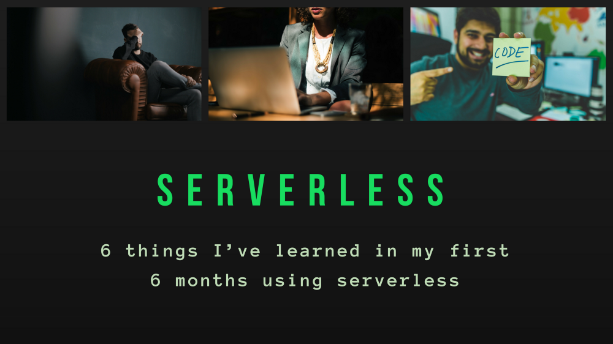

## AWS Relational Database Service

### CLOUD Amazon web services

#### Hack with AWS RDS

[Linkedin](https://www.linkedin.com/company/11759873) [Instagram](https://www.instagram.com/thinkport/) [Youtube](https://www.youtube.com/channel/UCnke3WYRT6bxuMK2t4jw2qQ) [Envelope](mailto:tdrechsel@thinkport.digital)

Amazon Relational Database Service (Amazon RDS) is a managed service that makes it easy to set up, operate, and scale a relational database in the cloud. It provides cost-efficient and resizable capacity, while managing time-consuming database administration tasks, freeing you up to focus on your applications and business.  
Amazon RDS gives you access to the capabilities of a familiar MySQL, MariaDB, Oracle, SQL Server, or PostgreSQL database. This means that the code, applications, and tools you already use today with your existing databases should work seamlessly with Amazon RDS. Amazon RDS can automatically backup your database and keep your database software up to date with the latest version. You benefit from the flexibility of being able to easily scale the compute resources or storage capacity associated with your relational database instance. In addition, Amazon RDS makes it easy to use replication to enhance database availability, improve data durability, or scale beyond the capacity constraints of a single database instance for read-heavy database workloads. As with all Amazon Web Services, there are no up-front investments required, and you pay only for the resources you use.

 **When to use**

Amazon RDS manages the work involved in setting up a relational database: from provisioning the infrastructure capacity you request to installing the database software. Once your database is up and running, Amazon RDS automates common administrative tasks such as performing backups and patching the software that powers your database. With optional Multi-AZ deployments, Amazon RDS also manages synchronous data replication across Availability Zones with automatic failover.  

Since Amazon RDS provides native database access, you interact with the relational database software as you normally would. This means you're still responsible for managing the database settings that are specific to your application. You'll need to build the relational schema that best fits your use case and are responsible for any performance tuning to optimize your database for your application’s workflow.  
Amazon Web Services provides a number of database alternatives for developers. Amazon RDS enables you to run a fully featured relational database while offloading database administration. Using one of our many relational database AMIs on Amazon EC2 allows you to manage your own relational database in the cloud.  

**Features**

    •    Enhanced Monitoring: Amazon RDS provides multiple ways to manage automation of many DBA activities and has many different capabilities to do detailed performance analysis of the overall system.  

    •    AWS Database Migration Service (DMS): DMS can help in migrating to cloud in virtually no downtime so you can take advantage of the scale, operational efficiency, and the multitude of data storage options available

    •    Multi-Availability Zone (Multi-AZ) RDS Deployments: AWS RDS will automatically switch from the primary instance to the available standby replica in the event of a failure, such as an Availability Zone outage, an internal hardware or network outage, a software failure; or in case of planned interruptions, such as software patching or changing the RDS instance type.

    •    Amazon RDS Resources Encryption: With RDS encryption enabled, the data stored on the instance underlying storage, the automated backups, read replicas, and snapshots all become encrypted. The RDS encryption keys implement the AES-256 algorithm and are entirely managed and protected by the AWS key management infrastructure through AWS Key Management Service (AWS KMS).

    •    Cross-Region Read Replicas for Amazon RDS: Amazon RDS Read Replicas provide enhanced performance and durability for database (DB) instances. Cross-region read replicas can yield tremendous performance benefits for read-only applications for users based out in multiple regions.  

**Benefits**

    •    Availability: AWS RDS is a highly available relational database that offers a feature called Multi-AZ, which provides a SLA up-time of 99.95%.  

    •    Scalability: Database scalability can prove to be a real challenge if you try to scale your own, self-hosted database.

    •    Vertical Scalability /Scaling Up: With RDS, Amazon enables push-button vertical scaling. This means that you can scale the size of an RDS instance \[memory, CPU, PIOPS etc\] or disk, either up or down, with the click of a button.

    •    Horizontal Scalability/Scaling Out: Horizontal scalability is an approach that distributes the total database across many RDS instances that will work together.

    •    Performance: AWS RDS offers PIOPS (Provisioned IOPS) in order to achieve fast, consistent and predictable Input/Output (I/O) performance.

    •    Backup: AWS RDS provides two types of backup mechanisms which are both very easy to setup:  
Automated backup – This functionality automatically performs a full daily snapshot of a database’s data (during a preferred window of time set up by the user). It also captures your transaction logs as well as any updates to your RDS database.  
Point-in-Time snapshots – RDS database snapshots are user initiated. Unlike automated backup, which is performed once a day, point-in-time snapshots can be performed as many times as desired. Generally, they are useful to backup set database states, like before a major release or an application upgrade.  

**Getting Started**

  
Tutorials on how to start with AWS RDS can be found below  

[https://docs.aws.amazon.com/AmazonRDS/latest/UserGuide/CHAP\_GettingStarted.html](https://docs.aws.amazon.com/AmazonRDS/latest/UserGuide/CHAP_GettingStarted.html)  
[https://docs.aws.amazon.com/AmazonRDS/latest/UserGuide/CHAP\_Tutorials.html](https://docs.aws.amazon.com/AmazonRDS/latest/UserGuide/CHAP_Tutorials.html)  

**Best Practices**

The best practices and tips can be found in the below link  
[https://docs.aws.amazon.com/AmazonRDS/latest/UserGuide/CHAP\_BestPractices.html](https://docs.aws.amazon.com/AmazonRDS/latest/UserGuide/CHAP_BestPractices.html)  

**Pricing**

  
Amazon RDS is free to try. Pay only for what you use. There is no minimum fee. You can pay for Amazon RDS using On-Demand or Reserved Instances. Additional information can be found below.  
  
[https://aws.amazon.com/rds/pricing/](https://aws.amazon.com/rds/pricing/)  
  

## [Weitere Beiträge](https://thinkport.digital/blog)

[")](https://thinkport.digital/cloud_infrastructure_with_crossplane/)

### [Crossplane – composing cloud infrastructure in a more effective way](https://thinkport.digital/cloud_infrastructure_with_crossplane/ "Crossplane – composing cloud infrastructure in a more effective way")

[AWS Cloud](https://thinkport.digital/category/aws-cloud/)

### [Crossplane – composing cloud infrastructure in a more effective way](https://thinkport.digital/cloud_infrastructure_with_crossplane/ "Crossplane – composing cloud infrastructure in a more effective way")

[AWS Cloud](https://thinkport.digital/category/aws-cloud/)

### [The 6 Most Important Things I have learned in my 6 Months using Server-less](https://thinkport.digital/the-6-most-important-things-i-have-learned-in-my-6-months-using-server-less/ "The 6 Most Important Things I have learned in my 6 Months using Server-less")

[Big Data](https://thinkport.digital/category/big-data/)

### [The 6 Most Important Things I have learned in my 6 Months using Server-less](https://thinkport.digital/the-6-most-important-things-i-have-learned-in-my-6-months-using-server-less/ "The 6 Most Important Things I have learned in my 6 Months using Server-less")

[Big Data](https://thinkport.digital/category/big-data/)

[")](https://thinkport.digital/10-machine-learning-algorithms-you-should-know-in-2018/)

### [10 Machine Learning Algorithms You Should Know in 2018](https://thinkport.digital/10-machine-learning-algorithms-you-should-know-in-2018/ "10 Machine Learning Algorithms You Should Know in 2018")

[Disrupt](https://thinkport.digital/category/disrupt/)

### [10 Machine Learning Algorithms You Should Know in 2018](https://thinkport.digital/10-machine-learning-algorithms-you-should-know-in-2018/ "10 Machine Learning Algorithms You Should Know in 2018")

[Disrupt](https://thinkport.digital/category/disrupt/)

[")](https://thinkport.digital/thinkport-solace-partnership/)

### [Thinkport and Solace announce Partnership](https://thinkport.digital/thinkport-solace-partnership/ "Thinkport and Solace announce Partnership")

[AWS Cloud](https://thinkport.digital/category/aws-cloud/)

### [Thinkport and Solace announce Partnership](https://thinkport.digital/thinkport-solace-partnership/ "Thinkport and Solace announce Partnership")

[AWS Cloud](https://thinkport.digital/category/aws-cloud/)

[")](https://thinkport.digital/16-things-to-avoid-when-writing-for-your-ui/)

### [16 Things to Avoid When Writing For Your UI](https://thinkport.digital/16-things-to-avoid-when-writing-for-your-ui/ "16 Things to Avoid When Writing For Your UI")

[Frontend](https://thinkport.digital/category/frontend/)

### [16 Things to Avoid When Writing For Your UI](https://thinkport.digital/16-things-to-avoid-when-writing-for-your-ui/ "16 Things to Avoid When Writing For Your UI")

[Frontend](https://thinkport.digital/category/frontend/)

### [Warum Terraform eines Ihrer DevOps Tools sein sollte](https://thinkport.digital/warum-terraform-einer-ihrer-devops-tools-sein-sollte/ "Warum Terraform eines Ihrer DevOps Tools sein sollte")

[AWS Cloud](https://thinkport.digital/category/aws-cloud/)

### [Warum Terraform eines Ihrer DevOps Tools sein sollte](https://thinkport.digital/warum-terraform-einer-ihrer-devops-tools-sein-sollte/ "Warum Terraform eines Ihrer DevOps Tools sein sollte")

[AWS Cloud](https://thinkport.digital/category/aws-cloud/)

## Blog Kurator

### Christina Friede

### Business Development

## Email:

## [cfriede@thinkport.digital](mailto:cfriede@thinkport.digital)

* 
