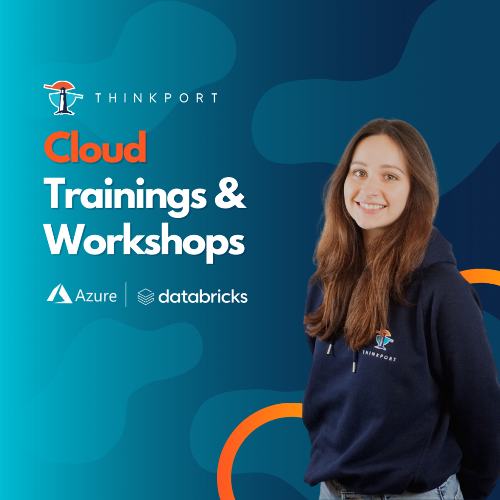

# Was ist Azure Databricks?

\- Leistungen, Hinweise und Checklisten -

Azure Databricks ist eine Analyseplattform, die bei Microsoft als Cloud-Dienst angeboten wird. Sie ist eine der führenden Plattformen für die Verarbeitung und Auswertung von großen Datenmengen in der Cloud. Es ist eine Kombination aus Apache Spark und einer für die Cloud optimierten Version von Microsoft. Es bietet eine umfassende Plattform für Big Data-Analysen, Data Engineering, Machine Learning und mehr.

Im Vergleich zu vergleichbaren Anwendungen in der Cloud wie Amazon EMR (Elastic MapReduce) und Google Cloud Dataproc bietet Azure Databricks eine integrierte Arbeitsumgebung, die es Unternehmen ermöglicht, Daten schneller zu analysieren und Entscheidungen zu treffen.

Das Kostenmodell von Azure Databricks basiert auf der Verwendung von virtuellen Clustern, die für die Verarbeitung von Daten genutzt werden. Die Kosten setzen sich aus den Kosten für die virtuellen Clustern, den Datenspeicher und anderen zusätzlichen Funktionen wie Überwachung und Sicherheit zusammen. Es ist möglich, die Kosten mit einer Pay-as-you-go-Option oder durch das Kaufen von Vorauszahlungen zu minimieren.

## Welche Leistungen bietet Databricks?

Dies sind spezifische Leistungen von Azure Databricks:

- Integrierte Arbeitsumgebung für die Entwicklung von Datenwissenschaft und maschinelles Lernen auf der Apache Spark-Engine.
- Ermöglicht schnelle und einfache Verarbeitung großer Datenmengen durch die Verwendung von Spark-Notebooks und -Arbeitsbereichen.
- Unterstützt Echtzeit-Datenanalyse, was die Zeit bis zur Entscheidungsfindung erheblich verkürzt.
- Starke Sicherheitsfunktionalität, wie die Unterstützung von Azure Active Directory, die Möglichkeit, Daten auf Netzwerkebene zu isolieren und die Möglichkeit, Datenverschlüsselung und Zugriffskontrollen zu verwenden.
- Möglichkeit, Azure Databricks mit anderen Azure-Diensten wie Azure Data Lake Storage und Azure Machine Learning zu kombinieren, um Datenanalyseprozesse zu automatisieren und zu optimieren.
- Flexible Skalierbarkeit durch die Anpassung der Anzahl der Clusterknoten an die aktuelle Last zur Kostenoptimierung.
- Kompatibilität mit einer Vielzahl von Programmiersprachen wie Python, R, Scala und SQL, ermöglicht Entwicklern die Verwendung der für sie am besten geeigneten Sprache.

## Konkrete Anwendungsbeispiele

Daraus folgend gibt es eine Reihe bekannter Anwendungsbeispiele für Azure Databricks:

- **1\. Datenanalyse:** Azure Databricks kann verwendet werden, um große Datenmengen zu analysieren und zu verarbeiten. Dazu gehören Funktionen wie Datenaggregation, Verarbeitung und Transformierung.
- **2\. Machine Learning:** Azure Databricks kann verwendet werden, um Machine Learning-Modelle zu entwickeln und auszuführen. Es unterstützt eine Vielzahl von Algorithmen und Tools für den Aufbau und die Überwachung von Machine Learning-Modellen.
- **3\. Data Engineering:** Azure Databricks kann verwendet werden, um Datenpipelines zu erstellen, die Daten aus verschiedenen Quellen sammeln, bereinigen und an ein Ziel senden.
- **4\. Customer Analytics:** Azure Databricks kann verwendet werden, um Kundendaten zu analysieren und zu verstehen, wie Kunden mit einem Unternehmen interagieren. Dies kann dazu beitragen, die Kundenerfahrung zu verbessern und bessere Geschäftsentscheidungen zu treffen.

Diese Anwendungsbeispiele zeigen nur einige der Möglichkeiten, wie Azure Databricks verwendet werden kann. Es ist wichtig zu beachten, dass jedes Unternehmen seine eigenen spezifischen Anforderungen hat, und es ist ratsam, sorgfältig zu prüfen, wie Azure Databricks am besten für die eigenen Anforderungen eingesetzt werden kann.

## Worauf ist zu achten beim Einsatz von Databricks?

Hierauf ist bei Azure Databricks zu achten:

- Abhängigkeit von einer stabilen Internetverbindung, um auf die Plattform zugreifen zu können.
- Mögliche Kostenexplosion, wenn die Anzahl der Clusterknoten nicht sorgfältig verwaltet wird.
- Mögliche Sicherheitsrisiken, wenn die Sicherheitsfunktionalitäten nicht richtig konfiguriert oder verwaltet werden.
- Mögliche Kompatibilitätsprobleme mit bestehenden Systemen und Tools im Unternehmen.

## Checkliste

Nutzen Sie diese Checkliste für die Verwendung von Azure Databricks:

- Überprüfung der Internetverbindung: Stellen Sie sicher, dass Sie über eine zuverlässige Internetverbindung verfügen, um auf Azure Databricks zugreifen zu können.
- Überprüfung der Kosten: Überprüfen Sie die Kostenmodelle für die Verwendung von Azure Databricks und stellen Sie sicher, dass Sie über das erforderliche Budget verfügen.
- Sicherheitsüberprüfung: Überprüfen Sie die verfügbaren Sicherheitsfunktionalitäten von Azure Databricks und stellen Sie sicher, dass Sie diese korrekt konfigurieren und verwalten.
- Überprüfung der Integrationsfähigkeit: Überprüfen Sie, ob Azure Databricks mit anderen Systemen und Tools im Unternehmen kompatibel ist und stellen Sie sicher, dass es möglich ist, Daten zwischen den Systemen auszutauschen.
- Überprüfung der Skalierbarkeit: Überprüfen Sie die Möglichkeiten, die Anzahl der Clusterknoten in Azure Databricks anzupassen, um eine optimale Kosten-Leistungs-Balance zu erreichen.
- Überprüfung der Programmiersprachen: Überprüfen Sie, welche Programmiersprachen von Azure Databricks unterstützt werden und stellen Sie sicher, dass Sie über die erforderlichen Fähigkeiten und Ressourcen verfügen, um mit diesen Sprachen zu arbeiten.
- Überprüfung der Datenmengen: Überprüfen Sie die Menge an Daten, die Sie analysieren möchten, und stellen Sie sicher, dass Azure Databricks die erforderliche Verarbeitungsleistung bietet.

Diese Punkte können je nach Anforderungen und Bedürfnissen eines Unternehmens variieren und entsprechend angepasst werden.

Das letzte Release von Azure Databricks fand im Dezember 2022 statt. Es brachte eine Reihe von neuen Funktionen und Verbesserungen wie Unterstützung für neue Datenformate, vereinfachte Verwaltung von Clusterknoten und verbesserte Integration mit anderen Azure-Diensten. Funktionen und Funktionalitäten von Azure Databricks werden ständig weiterentwickelt, um den Anforderungen der Kunden gerecht zu werden und neueste Technologien zu unterstützen.

Powered by human and artificial intelligence.

## Azure Databricks – Training für den Einstieg

Für weitergehende Fragen zum Artikel steht Ihnen Thinkport gerne zur Verfügung. Ein passendes und speziell auf Ihre Ziele zugeschnittenes Trainingsangebot finden Sie **[hier](https://thinkport.digital/datenplattform-mit-azure-und-databricks/)**.

## Weitere Artikel

## [Weitere Beiträge](https://thinkport.digital/blog)

### [Sustainability of the Cloud](https://thinkport.digital/sustainability-of-the-cloud/ 'Sustainability of the Cloud')

[Cloud General](https://thinkport.digital/category/cloud-general/)

### [Sustainability of the Cloud](https://thinkport.digital/sustainability-of-the-cloud/ 'Sustainability of the Cloud')

[Cloud General](https://thinkport.digital/category/cloud-general/)

### [Kafka-Fundamentals](https://thinkport.digital/kafka-fundamentals/ 'Kafka-Fundamentals')

[Streaming](https://thinkport.digital/category/streaming/)

### [Kafka-Fundamentals](https://thinkport.digital/kafka-fundamentals/ 'Kafka-Fundamentals')

[Streaming](https://thinkport.digital/category/streaming/)

### [Azure Databricks](https://thinkport.digital/azure-databricks/ 'Azure Databricks')

[Azure Cloud](https://thinkport.digital/category/azure-cloud/), [Cloud General](https://thinkport.digital/category/cloud-general/)

### [Azure Databricks](https://thinkport.digital/azure-databricks/ 'Azure Databricks')

[Azure Cloud](https://thinkport.digital/category/azure-cloud/), [Cloud General](https://thinkport.digital/category/cloud-general/)

### [Apache Airflow](https://thinkport.digital/apache-airflow/ 'Apache Airflow')

[Cloud General](https://thinkport.digital/category/cloud-general/), [Hybrid-Cloud](https://thinkport.digital/category/hybrid-cloud/)

### [Apache Airflow](https://thinkport.digital/apache-airflow/ 'Apache Airflow')

[Cloud General](https://thinkport.digital/category/cloud-general/), [Hybrid-Cloud](https://thinkport.digital/category/hybrid-cloud/)

### [Kafka Streams](https://thinkport.digital/kafka-streams/ 'Kafka Streams')

[Cloud General](https://thinkport.digital/category/cloud-general/), [Streaming](https://thinkport.digital/category/streaming/)

### [Kafka Streams](https://thinkport.digital/kafka-streams/ 'Kafka Streams')

[Cloud General](https://thinkport.digital/category/cloud-general/), [Streaming](https://thinkport.digital/category/streaming/)

### [Streaming-Services](https://thinkport.digital/streaming-services/ 'Streaming-Services')

[Cloud General](https://thinkport.digital/category/cloud-general/), [Streaming](https://thinkport.digital/category/streaming/)

### [Streaming-Services](https://thinkport.digital/streaming-services/ 'Streaming-Services')

[Cloud General](https://thinkport.digital/category/cloud-general/), [Streaming](https://thinkport.digital/category/streaming/)
