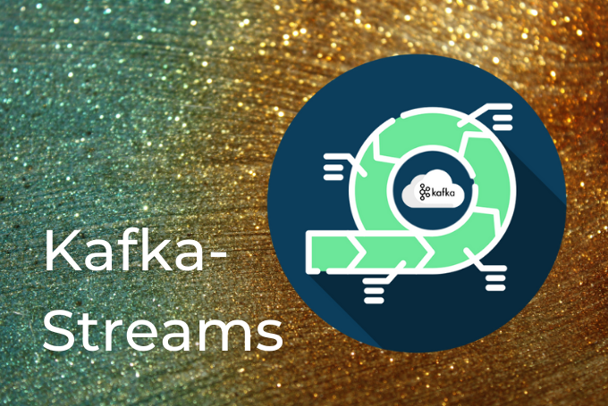

 

# What is cloud consulting for  

the development in the cloud?

Cloud computing has revolutionized the way businesses operate in today's digital landscape. The flexibility, scalability, and cost-effectiveness of cloud-based solutions make them an attractive option for companies looking to streamline their operations, increase efficiency, and reduce costs. However, navigating the complexities of the cloud can be challenging, which is where cloud consulting comes in.  
  
Cloud consulting involves working with a team of experts who provide guidance and support throughout the development process. This includes helping businesses optimize their cloud strategy, select the right cloud provider, improve their infrastructure, and ensure their cloud-based solutions are secure and compliant.  
  
By partnering with a cloud consulting firm, businesses can leverage the expertise of professionals who are well-versed in cloud computing. These experts can provide valuable insights and recommendations on how to develop cloud solutions to meet the unique needs of the organization.  
  
The journey to and in the cloud is not a one-size-fits-all approach. Different organizations have different requirements and goals when it comes to cloud adoption. The degree of development can be categorized into four stages: lift and shift, modernization, cloud optimization, and cloud-native. Each stage requires a mix of technologies and services, and cloud consulting can help businesses navigate these stages successfully.

## Lift and Shift

The first stage of cloud adoption is lift and shift, where businesses move their existing applications and data to the cloud without making significant changes to the architecture. This approach allows companies to take advantage of cloud infrastructure's scalability, flexibility, and cost-effectiveness without redesigning their applications.  
  
At this stage, cloud migration tools and infrastructure services provided by leading cloud service providers like AWS and Azure are the main technologies used. These tools make it easy for businesses to migrate their applications and data to the cloud while minimizing downtime and ensuring data security.  
  
Cloud consulting firms can help businesses assess their existing infrastructure and determine the best approach for lift and shift. They can also provide guidance on choosing the right cloud provider and services to ensure a smooth transition to the cloud.

Use this checklist for Lift and Shift:

* Identify applications and data to be moved to the cloud.
* Choose the right cloud provider based on your business needs and goals.
* Plan and execute a migration strategy using migration tools provided by the cloud provider.
* Optimize cloud infrastructure to reduce costs and improve performance.
* Ensure security and compliance requirements are met during the migration process.

## Modernization

The next stage of cloud adoption is modernization. At this stage, businesses make changes to their application architecture to take advantage of cloud-native features. Cloud-native applications are designed to run in the cloud, providing better scalability, reliability, and efficiency than traditional applications.  
  
Containerization and container orchestration platforms like Kubernetes, Docker, and AWS EKS or Azure AKS are the main technologies used in this stage. Containers provide a way to package applications and their dependencies into a portable format that can be run anywhere, making it easy to move applications between environments. Container orchestration platforms like Kubernetes provide a way to manage and scale containerized applications efficiently.  
  
Cloud consulting firms can help businesses design and implement a modernization strategy that aligns with their goals and objectives. They can also provide expertise in containerization and container orchestration platforms like Kubernetes, Docker, and AWS EKS or Azure AKS.

Checklist Modernization:

* Assess the architecture of your existing applications and identify areas for improvement.
* Determine the best containerization and orchestration platform based on your business needs and goals.
* Develop a migration plan for containerization of applications using tools like Docker.
* Deploy the applications to a container orchestration platform like Kubernetes.
* Optimize containerization and orchestration platform to improve performance and scalability.

## Cloud Optimization

The third stage of cloud adoption is cloud optimization. At this stage, businesses optimize their cloud environment for performance, cost, and efficiency. Cloud monitoring and management tools like AWS CloudWatch and Azure Monitor are the main technologies used in this stage. These tools provide visibility into cloud resources and allow businesses to monitor and manage performance, availability, and security.  
  
Cloud consulting firms can help businesses optimize their cloud environment by assessing the existing infrastructure and recommending changes to improve performance and reduce costs. They can also provide expertise in cloud monitoring and management tools like AWS CloudWatch and Azure Monitor.

Checklist Cloud Optimization:

* Monitor cloud resources using cloud monitoring tools like AWS CloudWatch and Azure Monitor.
* Analyze the data collected by monitoring tools to identify opportunities for optimization.
* Implement changes to cloud infrastructure to improve performance and reduce costs.
* Automate cloud management processes to improve efficiency and reduce the risk of human error.
* Continuously monitor and optimize cloud resources to ensure they meet the needs of the business.

## Cloud-Native

The final stage of cloud adoption is cloud-native. At this stage, businesses build and deploy applications specifically designed for the cloud using cloud-native technologies. This approach takes advantage of the full range of cloud-native features, such as elasticity, auto-scaling, and fault tolerance. Cloud-native applications are highly scalable, cost-effective, and provide a superior user experience.  
  
At this stage, businesses build and deploy applications specifically designed for the cloud using cloud-native technologies. The main technologies used in this stage include serverless computing platforms such as AWS Lambda or Azure Functions, container-based platforms such as Kubernetes, and cloud-native databases such as Amazon DynamoDB or Azure Cosmos DB. These technologies provide a highly scalable, cost-effective, and resilient way to build and deploy applications in the cloud.

Checklist Cloud-Native:

* Identify applications that can be re-architected as cloud-native applications.
* Choose a serverless computing platform or a container-based platform based on your business needs and goals.
* Develop and deploy cloud-native applications using cloud-native databases and serverless computing platforms like AWS Lambda or Azure Functions.
* Optimize cloud-native applications to ensure scalability, cost-effectiveness, and resiliency.
* Continuously monitor and optimize cloud-native applications to ensure they meet the needs of the business.

In summary, the development or adaption in the cloud is a journey that requires a mix of technologies and services. Businesses need to choose the right combination of tools and services that suit their needs and goals, from migration tools and cloud infrastructure to containers, cloud monitoring, and cloud-native technologies offered by leading cloud service providers like AWS and Azure.

As an excellent Cloud Consulting Partner for **[AWS](https://thinkport.digital/cloud-consulting-fuer-deutsche-grossunternehmen/aws/)** and **[Azure](https://thinkport.digital/cloud-consulting-fuer-deutsche-grossunternehmen/azure/)**, we offer your company a qualified, certified and dedicated team. Our extensive practical experience covers the complete spectrum of all services related to the cloud. Whether private, public, hybrid or multi-cloud - we are your partner at eye level. And work with you to find the best cloud solutions. We look forward to hearing from you.

## Weitere Artikel

## [Weitere Beiträge](https://thinkport.digital/blog)

### [Optimizing Kafka](https://thinkport.digital/optimizing-kafka/ "Optimizing Kafka")

[Cloud General](https://thinkport.digital/category/cloud-general/), [Streaming](https://thinkport.digital/category/streaming/)

### [Optimizing Kafka](https://thinkport.digital/optimizing-kafka/ "Optimizing Kafka")

[Cloud General](https://thinkport.digital/category/cloud-general/), [Streaming](https://thinkport.digital/category/streaming/)

### [Sustainability of the Cloud](https://thinkport.digital/sustainability-of-the-cloud/ "Sustainability of the Cloud")

[Cloud General](https://thinkport.digital/category/cloud-general/)

### [Sustainability of the Cloud](https://thinkport.digital/sustainability-of-the-cloud/ "Sustainability of the Cloud")

[Cloud General](https://thinkport.digital/category/cloud-general/)

### [Kafka Streams](https://thinkport.digital/kafka-streams/ "Kafka Streams")

[Cloud General](https://thinkport.digital/category/cloud-general/), [Streaming](https://thinkport.digital/category/streaming/)

### [Kafka Streams](https://thinkport.digital/kafka-streams/ "Kafka Streams")

[Cloud General](https://thinkport.digital/category/cloud-general/), [Streaming](https://thinkport.digital/category/streaming/)

### [Kafka Event-Streaming](https://thinkport.digital/kafka-event-streaming/ "Kafka Event-Streaming")

[Cloud General](https://thinkport.digital/category/cloud-general/), [Streaming](https://thinkport.digital/category/streaming/)

### [Kafka Event-Streaming](https://thinkport.digital/kafka-event-streaming/ "Kafka Event-Streaming")

[Cloud General](https://thinkport.digital/category/cloud-general/), [Streaming](https://thinkport.digital/category/streaming/)

### [Streaming-Services](https://thinkport.digital/streaming-services/ "Streaming-Services")

[Cloud General](https://thinkport.digital/category/cloud-general/), [Streaming](https://thinkport.digital/category/streaming/)

### [Streaming-Services](https://thinkport.digital/streaming-services/ "Streaming-Services")

[Cloud General](https://thinkport.digital/category/cloud-general/), [Streaming](https://thinkport.digital/category/streaming/)

### [Azure Databricks](https://thinkport.digital/azure-databricks/ "Azure Databricks")

[Azure Cloud](https://thinkport.digital/category/azure-cloud/), [Cloud General](https://thinkport.digital/category/cloud-general/)

### [Azure Databricks](https://thinkport.digital/azure-databricks/ "Azure Databricks")

[Azure Cloud](https://thinkport.digital/category/azure-cloud/), [Cloud General](https://thinkport.digital/category/cloud-general/)
