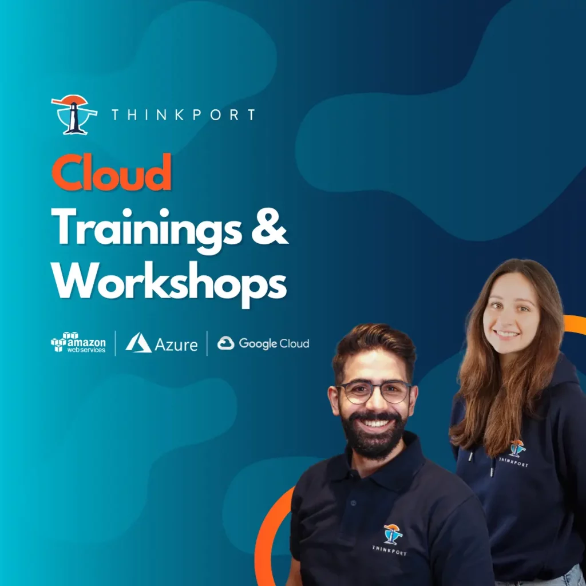

# Cloud Consulting for Migration to the Cloud - With focus on the Cloud Readiness Assessment -

A successful cloud consulting for migration to the cloud helps businesses migrate their IT systems and processes to the cloud and reap the benefits of cloud technology. It is important to choose an experienced and competent cloud consultant to ensure a smooth migration.

Cloud consulting for migration – which might takes several months – classically goes through the following five steps:

- **1\. Needs assessment:** The first phase is to understand the business needs and processes to develop an understanding of the cloud infrastructure requirements. This is also where the objectives for the migration are set.
- **2\. Analysis of the existing IT infrastructure:** In this phase, the existing IT systems and processes are examined to determine which applications and data are to be migrated. The performance, security and monitorability requirements of the cloud infrastructure are also assessed.
- **3\. Development of a migration plan:** Based on the analysis, a migration plan is developed that describes the steps and schedule for the migration. The necessary resources and costs are also taken into account here.
- **4\. Migration implementation:** The actual migration takes place in this phase. Here, the applications and data are migrated to the cloud and the IT systems and processes are adapted.
- **5\. Monitoring the operation:** After the migration, the cloud infrastructure is monitored to ensure that it meets the business requirements and functions optimally. Regular checks are also carried out here to.

Especially the first three steps listed are critical to success. Therefore, a professional cloud consultant recommends a systematic approach such as…

## Cloud Migration Readiness Assessment

is a process where organisations assess their readiness to migrate their on-premise computers to the public cloud. This process involves identifying and assessing factors that may affect migration and developing strategies and actions to address potential challenges.

As part of the Cloud Migration Readiness Assessment, the company's current IT systems are examined and the requirements for the cloud infrastructure are determined. Both technical and organisational aspects are taken into account. In addition, the risks of the migration are assessed and measures to minimise the risks are developed.

An important part of the Cloud Migration Readiness Assessment is the identification of workloads that are candidates for migration. This includes both critical workloads that require high availability and performance and less critical workloads that have lower demands on the cloud infrastructure.

Another important aspect is the evaluation of the costs of migration. Both the direct costs, such as the costs for the cloud infrastructure, and the indirect costs, such as the costs for adapting the IT systems, are taken into account.

Finally, a plan for the migration is created, which defines the necessary steps, resources and schedules. This plan serves as the basis for carrying out the migration and ensures the successful implementation of the company's cloud strategy.

## Checklist for Cloud Migration Readiness Assessment

Checklist for the steps and criteria in the Cloud Migration Readiness Assessment:

1\. Capture IT systems and requirements:

- **a.)** Identify existing IT systems and applications.
- **b.)** Gather requirements for the cloud infrastructure (e.g. availability, security, performance).
- **c.)** Identify workloads that are candidates for migration.

2\. Assess risks and challenges:

- **a.)** Assess the risks of migration (e.g. technical, organisational, financial).
- **b.)** Develop measures to minimise risks.

3\. Cost analysis:

- **a.)** Prepare a cost analysis for the migration (direct and indirect costs).

4\. Create migration plan:

- **a.)** Create a plan for the migration (incl. steps, resources, timelines).

5\. Technical audit:

- **a.)** Checking the technical compatibility of the IT systems with the cloud infrastructure.
- **b.)** Checking the security and compliance requirements.

6\. Organisational audit

- **a.)** Review of organisational requirements for migration (e.g. resource requirements, change management).
- **b.)** Audit of the requirements for the support and maintenance of the IT systems in the cloud,

7\. Financial audit

- **a.)** Checking the financial viability of the migration
- **b.)** Verification of the viability of the migration.

8\. Test and evaluation

- **a.)** Conduct tests to validate the migration plan.
- **b.)** Evaluate the success of the migration.

The exact steps and criteria may vary depending on the company and the scope of the migration. It is important that the checklist is adapted to the specific requirements of the company and that all relevant aspects are considered.

Overall, the Cloud Migration Readiness Assessment is an important part of the cloud consultancy. It helps companies to successfully manage the risks and challenges of a migration to the public cloud and to fully exploit the benefits of cloud technology.

As an excellent Cloud Consulting Partner, we offer your company a qualified, certified and dedicated team. Our extensive practical experience covers the complete spectrum of all services related to the cloud. Whether private, public, hybrid or multi-cloud - we are your partner at eye level. And work with you to find the best cloud solutions. We look forward to hearing from you.

## Weitere Artikel

## [Weitere Beiträge](https://thinkport.digital/blog)

### [Streaming-Services](https://thinkport.digital/streaming-services/ 'Streaming-Services')

[Cloud General](https://thinkport.digital/category/cloud-general/), [Streaming](https://thinkport.digital/category/streaming/)

### [Streaming-Services](https://thinkport.digital/streaming-services/ 'Streaming-Services')

[Cloud General](https://thinkport.digital/category/cloud-general/), [Streaming](https://thinkport.digital/category/streaming/)

### [Apache Airflow](https://thinkport.digital/apache-airflow/ 'Apache Airflow')

[Cloud General](https://thinkport.digital/category/cloud-general/), [Hybrid-Cloud](https://thinkport.digital/category/hybrid-cloud/)

### [Apache Airflow](https://thinkport.digital/apache-airflow/ 'Apache Airflow')

[Cloud General](https://thinkport.digital/category/cloud-general/), [Hybrid-Cloud](https://thinkport.digital/category/hybrid-cloud/)

### [Hybrid-Cloud-Manifest](https://thinkport.digital/hybrid-cloud-manifest/ 'Hybrid-Cloud-Manifest')

[Cloud General](https://thinkport.digital/category/cloud-general/), [Hybrid-Cloud](https://thinkport.digital/category/hybrid-cloud/)

### [Hybrid-Cloud-Manifest](https://thinkport.digital/hybrid-cloud-manifest/ 'Hybrid-Cloud-Manifest')

[Cloud General](https://thinkport.digital/category/cloud-general/), [Hybrid-Cloud](https://thinkport.digital/category/hybrid-cloud/)

### [Kafka Event-Streaming](https://thinkport.digital/kafka-event-streaming/ 'Kafka Event-Streaming')

[Cloud General](https://thinkport.digital/category/cloud-general/), [Streaming](https://thinkport.digital/category/streaming/)

### [Kafka Event-Streaming](https://thinkport.digital/kafka-event-streaming/ 'Kafka Event-Streaming')

[Cloud General](https://thinkport.digital/category/cloud-general/), [Streaming](https://thinkport.digital/category/streaming/)

### [Optimizing Kafka](https://thinkport.digital/optimizing-kafka/ 'Optimizing Kafka')

[Cloud General](https://thinkport.digital/category/cloud-general/), [Streaming](https://thinkport.digital/category/streaming/)

### [Optimizing Kafka](https://thinkport.digital/optimizing-kafka/ 'Optimizing Kafka')

[Cloud General](https://thinkport.digital/category/cloud-general/), [Streaming](https://thinkport.digital/category/streaming/)

### [Sustainability of the Cloud](https://thinkport.digital/sustainability-of-the-cloud/ 'Sustainability of the Cloud')

[Cloud General](https://thinkport.digital/category/cloud-general/)

### [Sustainability of the Cloud](https://thinkport.digital/sustainability-of-the-cloud/ 'Sustainability of the Cloud')

[Cloud General](https://thinkport.digital/category/cloud-general/)
