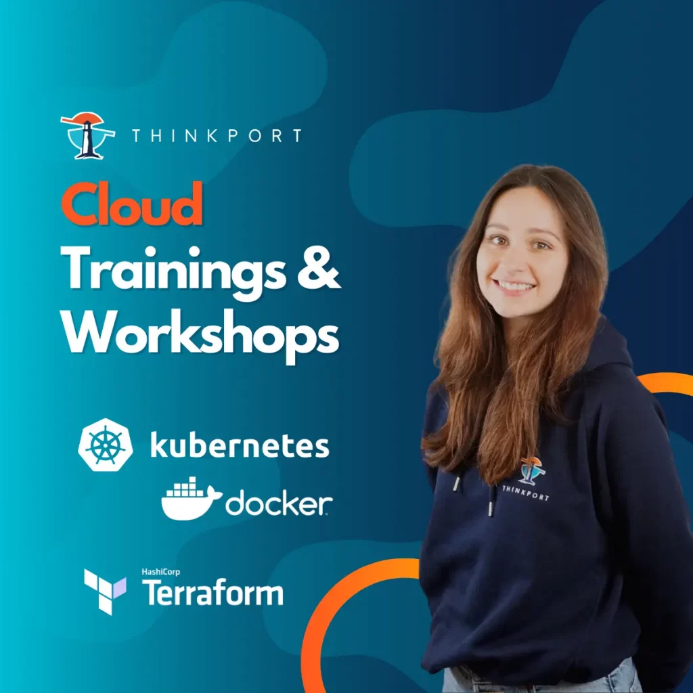

# Cloud Consulting for architectures with Kubernetes and Docker

is an important focus in the field of cloud computing. Companies are increasingly turning to container-based technologies instead of monolithic solutions in order to provide their applications more efficiently and flexibly. Kubernetes and Docker are the leading technologies used by companies and their cloud consultants to manage their applications in the cloud.

**Kubernetes** is an open source container orchestration platform that allows containers to be orchestrated and managed on multiple hosts. It is a powerful technology that helps organisations scale their applications and improves resilience. Kubernetes also offers automatic recovery from failures, rolling updates and load balancing. The latest release of Kubernetes was version 1.23, which was released in December 2021. Key new features in this release include improvements in the area of security, including the ability to disable insecure protocols and the integration of Secrets in application development. In addition, improvements have also been made in scaling and performance.

**Docker** is another open source container technology that allows developers to package applications in standardised containers. Docker provides an easy way to isolate and deploy applications to ensure fast and reliable execution. Docker is also platform independent and supports multiple operating systems and cloud platforms. The latest release of Docker was version 20.10, which was released in December 2020. The most important innovations in this release include improvements in multi- architecture support, Kubernetes integration and performance optimisation.

The interaction of Kubernetes and Docker is crucial for container orchestration in the cloud. Kubernetes uses Docker containers to manage and orchestrate applications on different hosts. Kubernetes also provides an easy way to deploy, manage and scale containers at scale.

An example of using Kubernetes and Docker is to deploy a web-based application. The application can be packaged into a Docker container and deployed using Kubernetes. Kubernetes can automatically launch new instances of the container to meet demand or shut down unused instances to save resources.

Critical aspects of using Kubernetes and Docker are security and complexity. Containers are more secure than virtual machines, but it is important to ensure that all containers are up to date and have no known security vulnerabilities. Using Kubernetes also requires a bit of a learning curve, as there are many features and concepts that need to be understood in order to use it effectively.

## Alternatives to Kubernetes and Docker

Although Kubernetes and Docker are the leading container orchestration and container technologies, the major cloud service providers also offer platform integrated alternatives. Microsoft Azure relies on an integrated container orchestration solution called Azure Kubernetes Service (AKS). AKS allows users to create and manage Kubernetes clusters in Azure deployments. The same applies to AWS with Amazon Elastic Kubernetes Service (EKS) as well as Google Kubernetes Engine (GKE). GKE offers easy deployment and scaling of Kubernetes clusters as well as integration with other Google cloud services. All three services offer similar features to Kubernetes and Docker, including auto-scaling, load balancing and security features. The choice between these services depends on the specific requirements and preferences of the user.

Another alternative is to use Infrastructure-as-Code tools such as Terraform to deploy and manage container orchestration platforms. Terraform allows users to create Infrastructure-as-Code templates to create and manage Kubernetes clusters and Docker containers in different cloud platforms.

## Interaction of Kubernetes with Docker and Terraform

Terraform and Kubernetes with Docker are two different technologies with different purposes that can complement each other in many aspects. Terraform is a tool that allows users to define and deploy infrastructure in different cloud platforms such as AWS, GCP and Azure. It offers many advantages such as.

* **Declarative syntax**: Terraform allows users to describe the desired infrastructure in a simple declarative syntax that is easy to understand and maintain.
* **Automation**: Terraform automates infrastructure deployment and can also integrate continuous integration and deployment (CI/CD) with other tools such as GitLab or Jenkins.
* **Platform independence**: Terraform is platform independent and supports many cloud platforms, allowing users to deploy consistent infrastructure across different cloud platforms.

Kubernetes with Docker, on the other hand, is a technology designed for orchestrating containers in production environments. It offers many advantages, such as:

* **Scalability**: Kubernetes with Docker allows users to scale applications quickly and easily for high availability and better load balancing.
* **Reliability**: Kubernetes with Docker provides automated failure recovery and high availability by distributing containers across different nodes in a cluster.
* **Portability**: Docker containers are portable and can run on different platforms and infrastructures, allowing for greater flexibility and interoperability.

In many cases, Terraform can be used as a complement to Kubernetes and Docker to automate and manage the infrastructure running Kubernetes clusters and Docker containers. The choice between Terraform and Kubernetes with Docker depends on the specific requirements and preferences of the user.

## The role of Cloud Consulting

As seen above, many roads lead to Rome. Cloud Consulting helps companies to design their modern cloud architecture in a way that is efficient for their needs by identifying the best possible solutions and strategies. This mainly involves optimising applications, ensuring scalability and availability, and continuous integration and deployment of applications. Through cloud consulting, companies can make optimal use of their resources and thus save costs. However, a comprehensive knowledge of the technologies as well as experience in the field of cloud computing are of utmost importance in order to achieve the best possible results.

Powered by human and artificial intelligence.

Thinkport will be happy to answer any further questions you may have. You can find a suitable training offer tailored specifically to your goals **[here](https://thinkport.digital/docker-und-kubernetes-lernen/)**.

## Weitere Artikel

## [Weitere Beiträge](https://thinkport.digital/blog)

### [Was ist Cloud Consulting](https://thinkport.digital/was-ist-cloud-consulting/ 'Was ist Cloud Consulting')

[Cloud General](https://thinkport.digital/category/cloud-general/)

### [Was ist Cloud Consulting](https://thinkport.digital/was-ist-cloud-consulting/ 'Was ist Cloud Consulting')

[Cloud General](https://thinkport.digital/category/cloud-general/)

### [Streaming-Services](https://thinkport.digital/streaming-services/ 'Streaming-Services')

[Cloud General](https://thinkport.digital/category/cloud-general/), [Streaming](https://thinkport.digital/category/streaming/)

### [Streaming-Services](https://thinkport.digital/streaming-services/ 'Streaming-Services')

[Cloud General](https://thinkport.digital/category/cloud-general/), [Streaming](https://thinkport.digital/category/streaming/)

### [Kafka Event-Streaming](https://thinkport.digital/kafka-event-streaming/ 'Kafka Event-Streaming')

[Cloud General](https://thinkport.digital/category/cloud-general/), [Streaming](https://thinkport.digital/category/streaming/)

### [Kafka Event-Streaming](https://thinkport.digital/kafka-event-streaming/ 'Kafka Event-Streaming')

[Cloud General](https://thinkport.digital/category/cloud-general/), [Streaming](https://thinkport.digital/category/streaming/)

### [Sustainability of the Cloud](https://thinkport.digital/sustainability-of-the-cloud/ 'Sustainability of the Cloud')

[Cloud General](https://thinkport.digital/category/cloud-general/)

### [Sustainability of the Cloud](https://thinkport.digital/sustainability-of-the-cloud/ 'Sustainability of the Cloud')

[Cloud General](https://thinkport.digital/category/cloud-general/)

### [Kafka Streams](https://thinkport.digital/kafka-streams/ 'Kafka Streams')

[Cloud General](https://thinkport.digital/category/cloud-general/), [Streaming](https://thinkport.digital/category/streaming/)

### [Kafka Streams](https://thinkport.digital/kafka-streams/ 'Kafka Streams')

[Cloud General](https://thinkport.digital/category/cloud-general/), [Streaming](https://thinkport.digital/category/streaming/)

### [Optimizing Kafka](https://thinkport.digital/optimizing-kafka/ 'Optimizing Kafka')

[Cloud General](https://thinkport.digital/category/cloud-general/), [Streaming](https://thinkport.digital/category/streaming/)

### [Optimizing Kafka](https://thinkport.digital/optimizing-kafka/ 'Optimizing Kafka')

[Cloud General](https://thinkport.digital/category/cloud-general/), [Streaming](https://thinkport.digital/category/streaming/)
