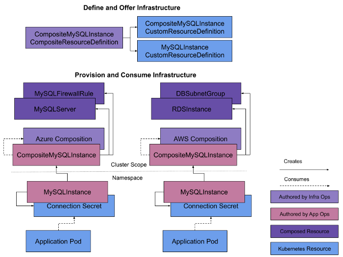
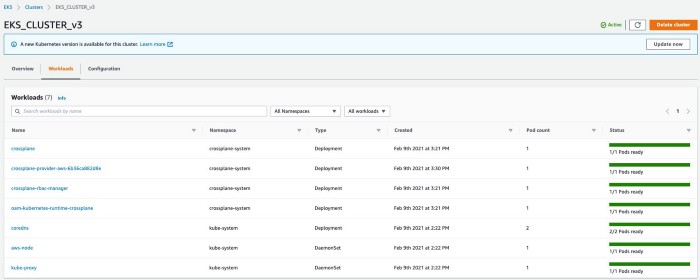
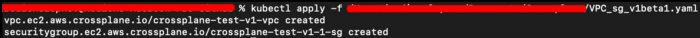
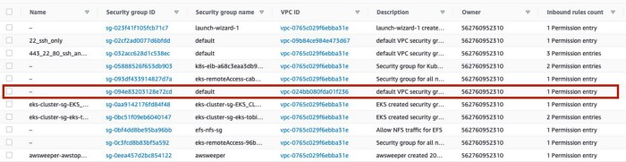

# Crossplane - composing cloud infrastructure in a more effective way

Cloud Infrastructure with Crossplane

[Linkedin](https://www.linkedin.com/company/11759873) [Instagram](https://www.instagram.com/thinkport/) [Youtube](https://www.youtube.com/channel/UCnke3WYRT6bxuMK2t4jw2qQ) [Envelope](mailto:tdrechsel@thinkport.digital)

##### _Contributor: Rodion Slepnev_

[Crossplane](https://crossplane.io/) is an open-source software operating as an add-on on top of Kubernetes letting to provision infrastructure of any complexity and configuration using most prominent cloud providers such as Google Cloud Platform (GCP), Microsoft Azure and Amazon Web Services (AWS) as well as other like Equinix, Alibaba Cloud and Red Hat Cloud Suite and operates across Mac, Linux and Windows operating systems. Being an extension of Kubernetes it runs on Google Kubernetes Engine (GKE), Azure Kubernetes Service (AKS), Alibaba Container Service for Kubernetes (ACK), Amazon Elastic Kubernetes Service (EKS) and others.

It enables to describe infrastructure [declaratively](https://crossplane.io/docs/v1.1/getting-started/provision-infrastructure.html) without writing any code and extensively disclosing the underlying infrastructure of the particular vendor. 

Crossplane extends Kubernetes cluster, providing ready-to-use Custom Resource Definitions ([CRDs](https://kubernetes.io/docs/tasks/extend-kubernetes/custom-resources/custom-resource-definitions/)), which create a new custom resources with a name and schema that are specified by a user. It is also possible to [compose](https://crossplane.io/docs/v1.1/concepts/composition.html) these granular resources into higher level abstractions that can be versioned, managed, deployed and consumed.

Figure 1 represents an example of composed infrastructure implemented via Crossplane making possible to combine resources from different vendors.

<figure>

<figcaption>

Fig.1 - Composing Infrastructure

</figcaption>

</figure>

Furthermore one can build his own internal infrastructure abstractions on top of the CRDs from Crossplane. [New custom APIs](https://github.com/crossplane/crossplane/blob/1aa83092172bdf0d2ed64754d33517c612ff7368/design/one-pager-package-format-v2.md) can include policy guardrails, hiding infrastructure complexity — set of CRDs and controllers are bundled together known as [packages](https://crossplane.io/docs/v1.1/concepts/packages.html) that represent and manage external infrastructure (i.e. a provider), then installing them into a cluster where Crossplane is running.

**Installation process:** 

Following the [guidelines](https://crossplane.io/docs/v1.1/getting-started/install-configure.html) we installed Crossplane on AWS EKS although. Figure 2 shows what applications are being launched on the cluster (s[o-called workloads](https://kubernetes.io/docs/concepts/workloads/)).

<figure>

<figcaption>

Fig.2 - Crossplane on EKS cluster

</figcaption>

</figure>

**Example as proof of concept:** 

Figure 3 shows the custom script composed from two CRDs which creates a VPC with a Security Group in AWS environment (all default examples could be found [here](https://github.com/crossplane/provider-aws/tree/master/examples)).

<figure>

<figcaption>

Fig.3 - Custom Script

</figcaption>

</figure>

The script itself describes infrastructure declaratively which as mentioned above lets encapsulate its specific details by using predefined words without writing any code and/or implementing it via internal sources like, for example, AWS Cloudformation. 

Descriptions of CRDs provided by Crossplane for all versions together with the references to the corresponding branches on GitHub can be found [here](https://doc.crds.dev/github.com/crossplane/crossplane). 

Script is being implemented via kubectl (Fig.4) as it is also mentioned with examples in the [guidelines](https://crossplane.io/docs/v1.1/getting-started/provision-infrastructure.html):

<figure>

<figcaption>

Fig.4 - Running the custom script

</figcaption>

</figure>

As a result one can see successfully provisioned Virtual Private Cloud (VPC) with a dedicated security group (Fig.5 and Fig.6):

<figure>

<figcaption>

Fig.5 - VPC provisioned from the custom script

</figcaption>

</figure>

<figure>

<figcaption>

Fig.6 - Security Group attached to VPC

</figcaption>

</figure>

**Conclusion**: 

Crossplane is currently under active development with a small community but showing reasonable progress looking at fixed issues. Although it has bugs being not fixed yet, features that are not reflected in the documentation especially installation part and the final stage is still far from completion Crossplane shows a quite good potential and in perspective could become more popular tool in its application area like, for example, Pulumi and other tools with similar functionality.

_[**Thinkport**](https://thinkport.digital/cloud-excellence-workshops/) is an actively developing company trying to find new approaches and technologies that concern cloud computing and relevant topics and it was very exciting to find and research Crossplane in one of its projects where it takes an active part. If you have further specific questions on the topic, or a handful of niche areas we are specialized in, visit our newly updated [workshop page](https://thinkport.digital/cloud-excellence-workshops/)._

#### References: 

*1\. Crossplane official website — https://crossplane.io* *2\. Crossplane GitHub repository — https://github.com/crossplane* *3\. Crossplane documentation — https://crossplane.io/docs/v1.1  
**4\. Kubernetes documentation — https://kubernetes.io/docs/home  
**5\. CRD descriptions — https://doc.crds.dev/github.com/crossplane/crossplane*

## [Weitere Beiträge](https://thinkport.digital/blog)

[')](https://thinkport.digital/thinkport-solace-partnership/)

### [Thinkport and Solace announce Partnership](https://thinkport.digital/thinkport-solace-partnership/ 'Thinkport and Solace announce Partnership')

[AWS Cloud](https://thinkport.digital/category/aws-cloud/)

### [Thinkport and Solace announce Partnership](https://thinkport.digital/thinkport-solace-partnership/ 'Thinkport and Solace announce Partnership')

[AWS Cloud](https://thinkport.digital/category/aws-cloud/)

### [Three ways to deploy Airflow on AWS](https://thinkport.digital/how-to-deploy-airflow-on-aws/ 'Three ways to deploy Airflow on AWS')

[AWS Cloud](https://thinkport.digital/category/aws-cloud/)

### [Three ways to deploy Airflow on AWS](https://thinkport.digital/how-to-deploy-airflow-on-aws/ 'Three ways to deploy Airflow on AWS')

[AWS Cloud](https://thinkport.digital/category/aws-cloud/)

### [7 Golden Rules for Creating Great UI](https://thinkport.digital/7-golden-rules-for-creating-great-ui/ '7 Golden Rules for Creating Great UI')

[Frontend](https://thinkport.digital/category/frontend/)

### [7 Golden Rules for Creating Great UI](https://thinkport.digital/7-golden-rules-for-creating-great-ui/ '7 Golden Rules for Creating Great UI')

[Frontend](https://thinkport.digital/category/frontend/)

[')](https://thinkport.digital/9-best-mobile-app-ui-design-trends-in-2018/)

### [9 Best Mobile App UI Design Trends in 2018](https://thinkport.digital/9-best-mobile-app-ui-design-trends-in-2018/ '9 Best Mobile App UI Design Trends in 2018')

[Frontend](https://thinkport.digital/category/frontend/)

### [9 Best Mobile App UI Design Trends in 2018](https://thinkport.digital/9-best-mobile-app-ui-design-trends-in-2018/ '9 Best Mobile App UI Design Trends in 2018')

[Frontend](https://thinkport.digital/category/frontend/)

### [IT-Automatisierung als Antwort gegen die Corona-Krise](https://thinkport.digital/it-automatisierung-als-antwort-gegen-die-corona-krise/ 'IT-Automatisierung als Antwort gegen die Corona-Krise')

[AWS Cloud](https://thinkport.digital/category/aws-cloud/), [Big Data](https://thinkport.digital/category/big-data/)

### [IT-Automatisierung als Antwort gegen die Corona-Krise](https://thinkport.digital/it-automatisierung-als-antwort-gegen-die-corona-krise/ 'IT-Automatisierung als Antwort gegen die Corona-Krise')

[AWS Cloud](https://thinkport.digital/category/aws-cloud/), [Big Data](https://thinkport.digital/category/big-data/)

[')](https://thinkport.digital/16-things-to-avoid-when-writing-for-your-ui/)

### [16 Things to Avoid When Writing For Your UI](https://thinkport.digital/16-things-to-avoid-when-writing-for-your-ui/ '16 Things to Avoid When Writing For Your UI')

[Frontend](https://thinkport.digital/category/frontend/)

### [16 Things to Avoid When Writing For Your UI](https://thinkport.digital/16-things-to-avoid-when-writing-for-your-ui/ '16 Things to Avoid When Writing For Your UI')

[Frontend](https://thinkport.digital/category/frontend/)

## Blog Kurator

### Christina Friede

### Business Development

## Email:

## [cfriede@thinkport.digital](mailto:cfriede@thinkport.digital)

- 
