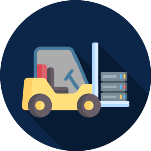
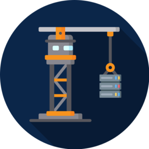

# Cloud Migration- 5 core strategies

## Introduction

[Linkedin](https://www.linkedin.com/company/11759873) [Instagram](https://www.instagram.com/thinkport/) [Youtube](https://www.youtube.com/channel/UCnke3WYRT6bxuMK2t4jw2qQ) [Envelope](mailto:tdrechsel@thinkport.digital)

Enterprises are always trying to meet the latest digital standards. Moving applications to the cloud is a sustainable, long-term goal. Therefore, deciding which strategy is the best for implementation while operating at full capacity, is a crucial determination.

Considering the many different criteria enterprises bring along, there are numerous options of how to migrate to the cloud.

Rehosting, replatforming, refactoring, rebuilding and repurchasing are the most common cloud migration strategies. Enterprises need to take a closer look at, not only individual aspects, but also opportunities and challenges that come along with the strategy. Individual aspects involve the given time frame, the available time and personnel resources in the company and the architecture of the respective application. We contemplated different methods of cloud migration.

## Refactoring

While reconstructing the internal architecture, the focus is set to work on multiple modules at the same time. Instead of converting a few software components. With that deeper involvement, extensive regression tests are required afterwards. This, in turn, means that every change to the architecture is synonymous with a deeper intervention.

Especially historically grown systems with extensive structural problems are applicable by this method. While the focus is not set to change the code´s behavior but making the application more understandable. A big advantage is that the software can be designed as a cloud- native application.

## Replatforming

Replatforming means migrating an application to a more cloud-suited architecture, e.g., from monolith to microservices. A possible method is the Strangler Fig Pattern, where scaling effects and automation potential are results of selectively rebuilt application modules, while the core of the application remains the same.

Otherwise, it´s also possible to moderately migrate the applications more strongly as experience grows. A necessary requirement for this, is that the applications architecture is built in a way that it´s possible to carry the transformation in modules. Since a modular design is rarely the case with older systems, this approach to cloud migration is more suitable for younger applications.

## Repurchasing

Repurchasing means to purchase SaaS products for parts of the software, e.g., invoicing instead of being its own migration strategy. An industry-specific software operates as the base and manages basic functions and enables communication via API´s. While Specialist areas are covered by specially programmed microservices. Advantages include having access to more features, no up-front development time, etc. While disadvantages include possible vendor lock-in, fewer customizability and potential large license fees.

Despite the method a company chooses, the modernization of its IT will always be unfinished and therefor, in progress. Since external factors usually require an adaption of the application. For instance, new regulations, converting market conditions or a change of the company´s strategy. Service providers can assist when IT departments are overwhelmed by handling the migration on their own. Those providers not only advise on the right strategy but also provide assistance to ensure a successful move to the cloud.

 

## Rehosting

With the lift and shift method, an application is migrated to the cloud without changes. But it will most likely incur the largest operational costs since you use IaaS per definition, which is almost always more expensive than using SaaS and PaaS options. However, it has the same functions as before. And your own ops team is more involved, because you are still responsible for operational updates and the like. Advantages include an automatic failover, as well as monitoring and performance control possibilities. The organization is also able to delegate operational responsibilities partially to the cloud provider who would be responsible for maintaining the infrastructure. The lift and shift method is therefore well suited to a migration with a tight timeframe.

## Rebuild

Cloud-native capability can be ensured when rebuilding the digital solution, meaning the company reimplements the software. However, this demands exertion which cannot be justified by the efficiency benefits of cloud native alone. For this strategy to be successful, the changeover requires other benefits including the option to open new business areas. All in all, this method is better suited for smaller projects. With large-scaled business transformations the main issue is that while rebuild is in progress, the original software is evolving as well. This only works when you basically freeze the existing application, move it to maintenance only, and then build a new product (preferably much leaner, focused on the core domain) using cloud-native technologies. Later, decommission the old application.

## Conclusion

The advantages of cloud migration can be used for existing but also new applications since it offers great improvement potential. Although it might just be a trade-off between costs and benefits.

Learn more about the best suited cloud migration strategy in our **[Cloud Architecture Review Workshop](https://thinkport.digital/cloud-architecture-review/)**.

## [Weitere Beiträge](https://thinkport.digital/blog)

[')](https://thinkport.digital/16-things-to-avoid-when-writing-for-your-ui/)

### [16 Things to Avoid When Writing For Your UI](https://thinkport.digital/16-things-to-avoid-when-writing-for-your-ui/ '16 Things to Avoid When Writing For Your UI')

[Frontend](https://thinkport.digital/category/frontend/)

### [16 Things to Avoid When Writing For Your UI](https://thinkport.digital/16-things-to-avoid-when-writing-for-your-ui/ '16 Things to Avoid When Writing For Your UI')

[Frontend](https://thinkport.digital/category/frontend/)

### [AWS Elastic Compute Cloud](https://thinkport.digital/aws-ec2/ 'AWS Elastic Compute Cloud')

[AWS Cloud](https://thinkport.digital/category/aws-cloud/)

### [AWS Elastic Compute Cloud](https://thinkport.digital/aws-ec2/ 'AWS Elastic Compute Cloud')

[AWS Cloud](https://thinkport.digital/category/aws-cloud/)

### [Neue AWS-Funktionen für Speicher- und Dateisysteme](https://thinkport.digital/neue-aws-funktionen-fur-speicher-und-dateisysteme/ 'Neue AWS-Funktionen für Speicher- und Dateisysteme')

[AWS Cloud](https://thinkport.digital/category/aws-cloud/)

### [Neue AWS-Funktionen für Speicher- und Dateisysteme](https://thinkport.digital/neue-aws-funktionen-fur-speicher-und-dateisysteme/ 'Neue AWS-Funktionen für Speicher- und Dateisysteme')

[AWS Cloud](https://thinkport.digital/category/aws-cloud/)

### [10 Big Data Trends to watch in 2018](https://thinkport.digital/10-big-data-trends-to-watch-in-2018/ '10 Big Data Trends to watch in 2018')

[Big Data](https://thinkport.digital/category/big-data/)

### [10 Big Data Trends to watch in 2018](https://thinkport.digital/10-big-data-trends-to-watch-in-2018/ '10 Big Data Trends to watch in 2018')

[Big Data](https://thinkport.digital/category/big-data/)

### [7 Golden Rules for Creating Great UI](https://thinkport.digital/7-golden-rules-for-creating-great-ui/ '7 Golden Rules for Creating Great UI')

[Frontend](https://thinkport.digital/category/frontend/)

### [7 Golden Rules for Creating Great UI](https://thinkport.digital/7-golden-rules-for-creating-great-ui/ '7 Golden Rules for Creating Great UI')

[Frontend](https://thinkport.digital/category/frontend/)

[')](https://thinkport.digital/how-ai-vr-and-big-data-will-transform-the-real-estate-industry-by-2020/)

### [How AI, VR, and Big Data Will Transform the Real Estate Industry by 2020](https://thinkport.digital/how-ai-vr-and-big-data-will-transform-the-real-estate-industry-by-2020/ 'How AI, VR, and Big Data Will Transform the Real Estate Industry by 2020')

[Big Data](https://thinkport.digital/category/big-data/)

### [How AI, VR, and Big Data Will Transform the Real Estate Industry by 2020](https://thinkport.digital/how-ai-vr-and-big-data-will-transform-the-real-estate-industry-by-2020/ 'How AI, VR, and Big Data Will Transform the Real Estate Industry by 2020')

[Big Data](https://thinkport.digital/category/big-data/)

## Blog Kurator

### Christina Friede

### Business Development

## Email:

## [cfriede@thinkport.digital](mailto:cfriede@thinkport.digital)

-  
