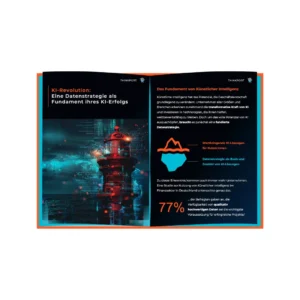

# Eine Datenstrategie als Fundament Ihres KI-Erfolgs

Unternehmen aller Größen und Branchen erkennen zunehmend die transformative Kraft von Künstlicher Intelligenz. Investitionen in KI-Technologien werden immer wichtiger, um wettbewerbsfähig zu bleiben.

Doch vor dem Investment in KI-Lösungen braucht es erst den Blick auf die eigenen Daten.

## [Unser kostenloses Whitepaper über die Datenstrategie als Basis für KI-Lösungen](https://assets.publishing.service.gov.uk/media/652e958b6972600014ccf9f6/Issues_statement__updated.pdf)

Unser kostenloses Whitepaper bietet einen Einblick in die Wichtigkeit von höchster Datenqualität für KI-Lösungen und wie vielschichtig Datenqualität sein kann. Es zeigt auch, wie die Entwicklung einer fundierten Datenstrategie aussehen kann, die qualitativ hochwertige Daten erst ermöglicht.

[Jetzt Whitepaper Herunterladen](#Jetzt%20Whitepaper%20Herunterladen)

## Höchste Datenqualität ermöglicht erfolgreiche AI-Lösungen wie Machine Learning

Um die höchstmögliche Datenqualität zu erreichen, muss sich ein Unternehmen einige Fragen stellen:

Wie wird mit fehlenden Daten umgegangen? Was tun bei unvollständigen Datensätzen? Wie sind diese oder fehlerhafte Daten zu erkennen? Werden große Datenmengen überhaupt benötigt? Kann aus vorhandenen Daten noch weiterer Wert generiert werden?

Diese und viele weitere Fragen müssen beantwortet werden, um eine Datenqualität zu erreichen, die KI-Lösungen auf höchstem Niveau ermöglicht. Aber nicht jede dieser Fragen ist für jedes Unternehmen und jeden Anwendungsfall gleich wichtig. Ob es beispielsweise eine Strategie für den Umgang mit fehlenden Daten braucht, hängt ganz davon ab, ob die KI-Lösung überhaupt vollständige Daten benötigt. Das zeigt, wie wichtig eine individuell abgestimmte Datenstrategie ist.

 

## Entwicklung einer Datenstrategie als nächster Schritt für KI-Lösungen

Es braucht einen Prozess, mit dem nicht nur eine fundierte Datenstrategie definiert werden kann, die den individuellen Bedürfnissen und Zielen eines Unternehmens folgt. Es muss auch sichergestellt werden, dass aus der Strategie unmittelbar umsetzbare Lösungen entstehen, die die Unternehmen näher zu ihren Zielen bringen. Dafür braucht es einen gut organisierten Prozess, der gleichzeitig Raum für Kreativität lässt. Methoden wie Design Thinking, strukturierte User Interviews oder Kreativ-Workshops können hierbei unterstützen.

## Mit dem kostenlosen Whitepaper von Thinkport zur fundierten Datenstrategie für KI-Anwendungen

Mit einer Datenstrategie für KI-Anwendungen können Sie Ihr Unternehmen für die Zukunft wettbewerbsfähig aufstellen und ungeahnte Potenziale ausschöpfen. In unserem Whitepaper finden Sie viele weitere spannende Informationen, die Sie auf dem Weg zur Datenstrategie unterstützen.

 [Jetzt Whitepaper Herunterladen](#Jetzt%20Whitepaper%20Herunterladen)

Selbstverständlich können Sie sich auch direkt an unsere Innovationsberater: Innen wenden und sich noch heute einen Termin zum direkten Austausch ausmachen. Thinkport liefert immer eine individuelle und maßgeschneiderte Lösung, um Ihr Unternehmen voranzubringen.

[Klick hier um Tim direkt zu schreiben!](mailto:innovation@thinkport.digital)

## Autor

Tim Amme

_Product Owner | Innovation Coach_

## Whitepaper anfordern

Download_Form_KI_und_Datenstrategie_Whitepaper Name \* First Last Name \* Last Email \* Company Captcha Absenden Falls Du menschlich bist, lasse dieses Feld leer.

## [Weitere Beiträge](https://thinkport.digital/blog)

### [Nomad vs Kubernetes](https://thinkport.digital/nomad-vs-kubernetes/ 'Nomad vs Kubernetes')

[Cloud General](https://thinkport.digital/category/cloud-general/), [Cloud Kubernetes](https://thinkport.digital/category/cloud-kubernetes/)

### [Nomad vs Kubernetes](https://thinkport.digital/nomad-vs-kubernetes/ 'Nomad vs Kubernetes')

[Cloud General](https://thinkport.digital/category/cloud-general/), [Cloud Kubernetes](https://thinkport.digital/category/cloud-kubernetes/)

### [Terraform Consulting in a Multi Cloud Environment](https://thinkport.digital/terraform-consulting-in-a-multi-cloud-environment/ 'Terraform Consulting in a Multi Cloud Environment')

[Cloud General](https://thinkport.digital/category/cloud-general/), [IaC](https://thinkport.digital/category/iac/)

### [Terraform Consulting in a Multi Cloud Environment](https://thinkport.digital/terraform-consulting-in-a-multi-cloud-environment/ 'Terraform Consulting in a Multi Cloud Environment')

[Cloud General](https://thinkport.digital/category/cloud-general/), [IaC](https://thinkport.digital/category/iac/)

### [Modernisierung ist ein Kontinuum](https://thinkport.digital/modernisierung-ist-ein-kontinuum/ 'Modernisierung ist ein Kontinuum')

[Cloud General](https://thinkport.digital/category/cloud-general/), [Cloud Kubernetes](https://thinkport.digital/category/cloud-kubernetes/)

### [Modernisierung ist ein Kontinuum](https://thinkport.digital/modernisierung-ist-ein-kontinuum/ 'Modernisierung ist ein Kontinuum')

[Cloud General](https://thinkport.digital/category/cloud-general/), [Cloud Kubernetes](https://thinkport.digital/category/cloud-kubernetes/)

### [Core Strategies Cloud Migration](https://thinkport.digital/core-strategies-cloud-migration/ 'Core Strategies Cloud Migration')

[Cloud General](https://thinkport.digital/category/cloud-general/), [Cloud Kubernetes](https://thinkport.digital/category/cloud-kubernetes/)

### [Core Strategies Cloud Migration](https://thinkport.digital/core-strategies-cloud-migration/ 'Core Strategies Cloud Migration')

[Cloud General](https://thinkport.digital/category/cloud-general/), [Cloud Kubernetes](https://thinkport.digital/category/cloud-kubernetes/)

### [Echtzeit-KI: Apache Kafka und OpenAI sind die Zukunft der Datenanalyse](https://thinkport.digital/kafka-und-openai-zukunft-der-datenanalyse/ 'Echtzeit-KI: Apache Kafka und OpenAI sind die Zukunft der Datenanalyse')

[Cloud General](https://thinkport.digital/category/cloud-general/), [Streaming](https://thinkport.digital/category/streaming/)

### [Echtzeit-KI: Apache Kafka und OpenAI sind die Zukunft der Datenanalyse](https://thinkport.digital/kafka-und-openai-zukunft-der-datenanalyse/ 'Echtzeit-KI: Apache Kafka und OpenAI sind die Zukunft der Datenanalyse')

[Cloud General](https://thinkport.digital/category/cloud-general/), [Streaming](https://thinkport.digital/category/streaming/)

### [Sustainability of the Cloud](https://thinkport.digital/sustainability-of-the-cloud/ 'Sustainability of the Cloud')

[Cloud General](https://thinkport.digital/category/cloud-general/)

### [Sustainability of the Cloud](https://thinkport.digital/sustainability-of-the-cloud/ 'Sustainability of the Cloud')

[Cloud General](https://thinkport.digital/category/cloud-general/)
