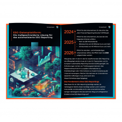

## Die maßgeschneiderte Lösung für das automatisierte ESG-Reporting

„ESG“ steht für "Environmental, Social and Governance", die drei Säulen der Nachhaltigkeit. Und genau danach orientiert sich das ESG-Reporting bzw. die Nachhaltigkeitsberichterstattung.

Durch eine 2023 in Kraft getretenen EU-Regulierung werden nun immer mehr Unternehmen verpflichtet, ein ESG-Reporting zu veröffentlichen. Insbesondere wenn die benötigten KPIs für das Reporting nicht an einem zentralen Ort zu finden sind, bedeutet das einen großen, manuellen Reporting-Aufwand.

Eine ESG-Datenplattform kann hier Abhilfe schaffen: Die ESG-relevanten Daten werden automatisiert auf einer zentralen Plattform zusammengeführt und können so für das Nachhaltigkeitsreporting genutzt werden.

## [Unser kostenloses Whitepaper - der Weg zum automatisierten ESG-Reporting](https://assets.publishing.service.gov.uk/media/652e958b6972600014ccf9f6/Issues_statement__updated.pdf)

Unser kostenloses Whitepaper bietet einen Einblick in den Weg von der ESG-Datenstrategie über die ESG-Datenplattform hin zum automatisierten ESG-Reporting. Ebenfalls beschrieben ist, warum es zunächst ein _ESG Data_ _Maturity_ _Level Assessment_ als Grundlage braucht.

[Jetzt Whitepaper Herunterladen](#JetztWhitepaperHerunterladen)

## Die Nachhaltigkeitsreporting-Pflicht für Unternehmen im Überblick

Anfang 2023 hat die EU das ESG-Reporting für bestimmte Unternehmen zur Pflicht gemacht. Ab 2024 gilt diese Pflicht bereits für alle Unternehmen, die bereits unter das NFRD fallen. 2025 und 2026 wird diese Pflicht auf immer mehr Unternehmen ausgeweitet, spätestens 2028 gilt diese Pflicht auch für alle KMUs.

Für viele Unternehmen, insbesondere für Unternehmen mit einem breiten Wirtschafts- und Wirkungsfeld, bedeutet das große Herausforderungen, da die dafür notwendigen ESG-Kennzahlen oft über die ganze Datenlandschaft verteilt sind.

 

## Auch im Whitepaper: Ein beispielhaftes Architektur-Konzept für eine ESG-Datenplattform

Um die in den EU-Taxonomien und im ESRS definierten ESG-KPIs in ihrer Komplexität abzubilden und auch die individuellen Anforderungen der Unternehmen zu berücksichtigen, braucht es auch eine maßgeschneiderte ESG-Datenplattform. Wie das aussehen kann, ist im Whitepaper zu finden.

## Mit dem kostenlosen Whitepaper den ersten Schritt zum automatisierten ESG-Reporting gehen

Das Ziel ist klar: Alle für das ESG-Reporting notwendigen Daten vollständig, automatisiert und zentral abzulegen, um daraus mit minimalem Aufwand ein fertiges Reporting zu erhalten. Eine ESG-Datenplattform kann das ermöglichen und kann gleichzeitig die Basis für ein datengetriebenes Nachhaltigkeitsmanagement sein.

 [Jetzt Whitepaper Herunterladen](#JetztWhitepaperHerunterladen)

Selbstverständlich können Sie sich auch direkt an unsere Expert:innen wenden und sich noch heute einen Termin zum direkten Austausch ausmachen. Thinkport liefert immer eine individuelle und maßgeschneiderte Lösung, um Sie dorthin zu bringen, wo Sie hinwollen.

[Klick hier um Tim direkt zu schreiben!](mailto:innovation@thinkport.digital)

## Autor

Tim Amme

_ESG | Data Experte_

## Whitepaper anfordern

\[formidable id=10\]

## [Weitere Beiträge](https://thinkport.digital/blog)

### [Event-getriebene Anwendungen effektiv betreiben](https://thinkport.digital/streaming-und-skalierbarkeit/ "Event-getriebene Anwendungen effektiv betreiben")

[Big Data](https://thinkport.digital/category/big-data/), [Cloud General](https://thinkport.digital/category/cloud-general/), [Cloud Strategie](https://thinkport.digital/category/cloud-strategie/)

### [Event-getriebene Anwendungen effektiv betreiben](https://thinkport.digital/streaming-und-skalierbarkeit/ "Event-getriebene Anwendungen effektiv betreiben")

[Big Data](https://thinkport.digital/category/big-data/), [Cloud General](https://thinkport.digital/category/cloud-general/), [Cloud Strategie](https://thinkport.digital/category/cloud-strategie/)

### [Echtzeit-KI: Apache Kafka und OpenAI sind die Zukunft der Datenanalyse](https://thinkport.digital/kafka-und-openai-zukunft-der-datenanalyse/ "Echtzeit-KI: Apache Kafka und OpenAI sind die Zukunft der Datenanalyse")

[Cloud General](https://thinkport.digital/category/cloud-general/), [Streaming](https://thinkport.digital/category/streaming/)

### [Echtzeit-KI: Apache Kafka und OpenAI sind die Zukunft der Datenanalyse](https://thinkport.digital/kafka-und-openai-zukunft-der-datenanalyse/ "Echtzeit-KI: Apache Kafka und OpenAI sind die Zukunft der Datenanalyse")

[Cloud General](https://thinkport.digital/category/cloud-general/), [Streaming](https://thinkport.digital/category/streaming/)

[")](https://thinkport.digital/vom_kafka-cluster_zum_event-mesh/)

### [Vom Kafka Cluster zum Event Mesh](https://thinkport.digital/vom_kafka-cluster_zum_event-mesh/ "Vom Kafka Cluster zum Event Mesh")

[Cloud General](https://thinkport.digital/category/cloud-general/), [Streaming](https://thinkport.digital/category/streaming/)

### [Vom Kafka Cluster zum Event Mesh](https://thinkport.digital/vom_kafka-cluster_zum_event-mesh/ "Vom Kafka Cluster zum Event Mesh")

[Cloud General](https://thinkport.digital/category/cloud-general/), [Streaming](https://thinkport.digital/category/streaming/)

### [Setup Hashicorp Nomad Ansible fail2ban](https://thinkport.digital/setup-hashicorp-nomad-ansible-fail2ban/ "Setup Hashicorp Nomad Ansible fail2ban")

[Cloud General](https://thinkport.digital/category/cloud-general/)

### [Setup Hashicorp Nomad Ansible fail2ban](https://thinkport.digital/setup-hashicorp-nomad-ansible-fail2ban/ "Setup Hashicorp Nomad Ansible fail2ban")

[Cloud General](https://thinkport.digital/category/cloud-general/)

### [Kafka Event-Streaming](https://thinkport.digital/kafka-event-streaming/ "Kafka Event-Streaming")

[Cloud General](https://thinkport.digital/category/cloud-general/), [Streaming](https://thinkport.digital/category/streaming/)

### [Kafka Event-Streaming](https://thinkport.digital/kafka-event-streaming/ "Kafka Event-Streaming")

[Cloud General](https://thinkport.digital/category/cloud-general/), [Streaming](https://thinkport.digital/category/streaming/)

### [Setup Hashcorp Nomad mit Terraform](https://thinkport.digital/setup-hashcorp-nomad-mit-terraform/ "Setup Hashcorp Nomad mit Terraform")

[Cloud General](https://thinkport.digital/category/cloud-general/)

### [Setup Hashcorp Nomad mit Terraform](https://thinkport.digital/setup-hashcorp-nomad-mit-terraform/ "Setup Hashcorp Nomad mit Terraform")

[Cloud General](https://thinkport.digital/category/cloud-general/)
