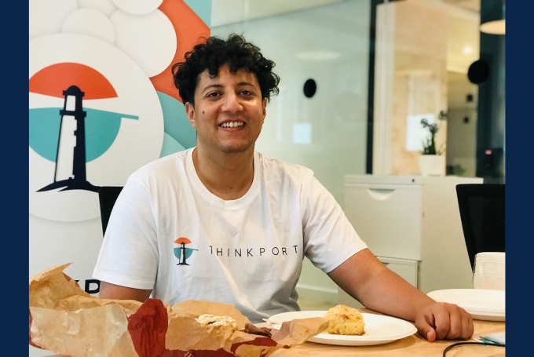

Friday Breakfast Tradition

## NEWS Team events

## Team Events at Thinkport

## When working in such an agile company it is important to meet regularly with the team and keep up to date with the fast-changing and innovative environment.

Therefore, one of the first team events organized at Thinkport was the Friday Breakfast. Every Friday all of us gather and we all eat breakfast together. At the same time an update of the week is given so everyone is up to date.

This event has turned into a tradition and meanwhile is an important component of our culture.

Do you want to be part of our team and future events? Don't hesitate to [contact us](https://thinkport.digital/karriere-in-der-cloud/).

## Weitere Neuigkeiten

## News Writer

Christina Friede

Business Development

Email:

[cfriede@thinkport.digital](mailto:cfriede@thinkport.digital)

- 
