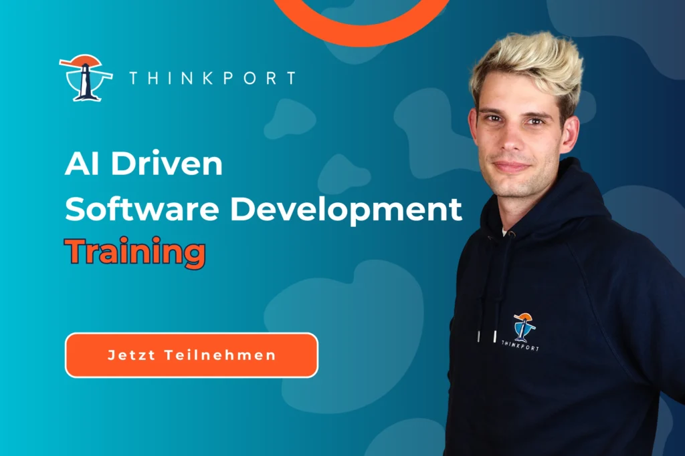
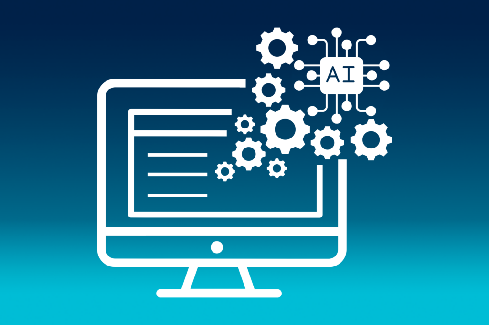

# Grundlagen eines "AI Driven Software Development"-Trainings

Die digitale Revolution hat die Softwareentwicklung in eine Ära des dynamischen Wandels katapultiert. Und künstliche Intelligenz (AI) ist der Motor dieser Transformation. Im Rahmen eines "AI-driven Software Development"-Trainings kommen Entwickler:innen, Ingenieure und Technologieenthusiast:innen zusammen, um in die faszinierende Welt der AI einzutauchen. Dieser Artikel führt durch die strukturierte Agenda des Workshops. Er deckt nicht nur die theoretischen Grundlagen von AI im Software Development ab, sondern verfolgt auch einen praxisorientierten Ansatz. Von der Identifikation potenzieller Anwendungsfälle bis zur Ethik in der AI-Entwicklung bietet die Schulung einen umfassenden Einblick, der die Teilnehmer dazu befähigt, die transformative Kraft von AI in ihren eigenen Projekten zu entfesseln. Das Training markiert somit nicht nur den Beginn eines intensiven Wissensaustauschs. Er ist auch ein Meilenstein auf dem Weg zu einer innovativen, AI-getriebenen Zukunft der Softwareentwicklung.

## Die Zukunft der Softwareentwicklung

Die Zielsetzung ist klar formuliert. Es gilt, das Verständnis für die Integration von künstlicher Intelligenz in den Softwareentwicklungsprozess zu vertiefen. Hierbei spielen auch die Erwartungen der Teilnehmer eine entscheidende Rolle, um eine maßgeschneiderte und zielgerichtete Wissensvermittlung zu gewährleisten. Der Trainings-Leiter, ein Experte auf dem Gebiet der AI im Software Development, gibt einen Überblick über die Struktur des Workshops.

## Grundlagen von AI im Software Development

Im ersten inhaltlichen Teil des Workshops wird den Teilnehmern ein fundierter Überblick über künstliche Intelligenz und Machine Learning geboten. Dabei stehen nicht nur theoretische Konzepte im Fokus, sondern auch die praktische Anwendung von AI im Software Development. Eine interaktive Übung fordert die Teilnehmer dazu heraus, potenzielle Anwendungsfälle für AI in ihren eigenen Projekten zu identifizieren, was einen direkten Transfer des Gelernten ermöglicht.

## AI-Tools und Frameworks für Entwickler

Der Workshop setzt sich fort mit einer vertieften Betrachtung der gängigen AI-Entwicklungstools und Frameworks. Hier steht die praktische Anwendung von AI in verschiedenen Programmiersprachen im Mittelpunkt. Durch eine Hands-on-Übung mit einem einfachen AI-Entwicklungstool erhalten die Teilnehmer einen ersten Einblick in die Umsetzung von AI in der Softwareentwicklung.

## Integration von AI in den Softwareentwicklungsprozess

Der Einfluss von AI auf den gesamten Softwareentwicklungszyklus wird im nächsten Abschnitt beleuchtet. Besonderes Augenmerk liegt auf der Automatisierung von Entwicklungsprozessen mithilfe von AI. Die Teilnehmer werden aktiv in die Erstellung eines AI-orientierten Entwicklungsplans eingebunden, um die praxisnahe Anwendung zu fördern.

Nach einem intensiven Vormittag bietet die Mittagspause Raum für informelle Gespräche, Networking und den Austausch von Eindrücken.

## AI in der Code-Analyse und Qualitätssicherung

Der Nachmittag startet mit einem Blick auf AI-basierte Tools zur Code-Analyse und Verbesserung. Die Teilnehmer erfahren, wie AI in automatisierten Tests und der Qualitätssicherung effektiv eingesetzt werden kann. Eine praxisorientierte Übung ermöglicht den Teilnehmern die direkte Anwendung von AI in der Code-Qualitätsprüfung.

## AI-gesteuerte User Experience (UX)

Die Bedeutung von AI in der Gestaltung der Benutzererfahrung wird im nächsten Abschnitt beleuchtet. Der Fokus liegt auf der Verbesserung der UX durch personalisierte Inhalte und Empfehlungen. Die Teilnehmer werden angeregt, eigene Konzepte für eine AI-gesteuerte UX in ihren Projekten zu entwickeln.

## AI-Ethik und Datenschutz in der Softwareentwicklung

Die ethischen Herausforderungen bei der Verwendung von AI stehen im Zentrum des vorletzten Abschnitts. Die Diskussion um Datenschutzaspekte und Best Practices wird durch eine Übung ergänzt, in der die Teilnehmer ethische Herausforderungen in konkreten AI-Projekten identifizieren und Lösungsansätze erarbeiten.

## Interaktive Diskussion und Q&A

Der Workshop neigt sich dem Ende zu, doch Raum für interaktive Diskussionen und Fragen ist essentiell. Die offene Diskussion über AI im Software Development bietet den Teilnehmern die Möglichkeit, ihre Eindrücke zu teilen, Fragen zu klären und Erfahrungen auszutauschen.

## Abschluss und Ausblick

Der Workshop schließt mit einer Zusammenfassung der wichtigsten Erkenntnisse. Ein Ausblick auf zukünftige Entwicklungen im Bereich AI-driven Software Development rundet den Workshop ab. Die Teilnehmer verlassen den Workshop nicht nur mit einem vertieften Verständnis für AI im Softwareentwicklungsprozess, sondern auch mit konkreten Ansätzen für die Integration von AI in ihre eigenen Projekte. Der Workshop legt somit den Grundstein für eine erfolgreiche und zukunftsweisende Anwendung von künstlicher Intelligenz in der Softwareentwicklung.

## Tobias Drechsel

_CEO & Senior Cloud Consultant_

## [Weitere Beiträge](https://thinkport.digital/blog)

### [Cloud Consulting for Migration to the Cloud](https://thinkport.digital/cloud-consulting-for-migration-to-the-cloud/ "Cloud Consulting for Migration to the Cloud")

[Cloud General](https://thinkport.digital/category/cloud-general/)

### [Cloud Consulting for Migration to the Cloud](https://thinkport.digital/cloud-consulting-for-migration-to-the-cloud/ "Cloud Consulting for Migration to the Cloud")

[Cloud General](https://thinkport.digital/category/cloud-general/)

### [Echtzeit-KI: Apache Kafka und OpenAI sind die Zukunft der Datenanalyse](https://thinkport.digital/kafka-und-openai-zukunft-der-datenanalyse/ "Echtzeit-KI: Apache Kafka und OpenAI sind die Zukunft der Datenanalyse")

[Cloud General](https://thinkport.digital/category/cloud-general/), [Streaming](https://thinkport.digital/category/streaming/)

### [Echtzeit-KI: Apache Kafka und OpenAI sind die Zukunft der Datenanalyse](https://thinkport.digital/kafka-und-openai-zukunft-der-datenanalyse/ "Echtzeit-KI: Apache Kafka und OpenAI sind die Zukunft der Datenanalyse")

[Cloud General](https://thinkport.digital/category/cloud-general/), [Streaming](https://thinkport.digital/category/streaming/)

[")](https://thinkport.digital/cloud-consulting-for-development/)

### [Cloud Consulting for development](https://thinkport.digital/cloud-consulting-for-development/ "Cloud Consulting for development")

[Cloud General](https://thinkport.digital/category/cloud-general/)

### [Cloud Consulting for development](https://thinkport.digital/cloud-consulting-for-development/ "Cloud Consulting for development")

[Cloud General](https://thinkport.digital/category/cloud-general/)

### [Sustainability of the Cloud](https://thinkport.digital/sustainability-of-the-cloud/ "Sustainability of the Cloud")

[Cloud General](https://thinkport.digital/category/cloud-general/)

### [Sustainability of the Cloud](https://thinkport.digital/sustainability-of-the-cloud/ "Sustainability of the Cloud")

[Cloud General](https://thinkport.digital/category/cloud-general/)

### [Grundlagen eines “AI Driven Software Development”-Trainings](https://thinkport.digital/grundlagen-eines-ai-driven-software-development-trainings/ "Grundlagen eines “AI Driven Software Development”-Trainings")

[Cloud General](https://thinkport.digital/category/cloud-general/), [Cloud Kubernetes](https://thinkport.digital/category/cloud-kubernetes/)

### [Grundlagen eines “AI Driven Software Development”-Trainings](https://thinkport.digital/grundlagen-eines-ai-driven-software-development-trainings/ "Grundlagen eines “AI Driven Software Development”-Trainings")

[Cloud General](https://thinkport.digital/category/cloud-general/), [Cloud Kubernetes](https://thinkport.digital/category/cloud-kubernetes/)

### [Azure Databricks](https://thinkport.digital/azure-databricks/ "Azure Databricks")

[Azure Cloud](https://thinkport.digital/category/azure-cloud/), [Cloud General](https://thinkport.digital/category/cloud-general/)

### [Azure Databricks](https://thinkport.digital/azure-databricks/ "Azure Databricks")

[Azure Cloud](https://thinkport.digital/category/azure-cloud/), [Cloud General](https://thinkport.digital/category/cloud-general/)
