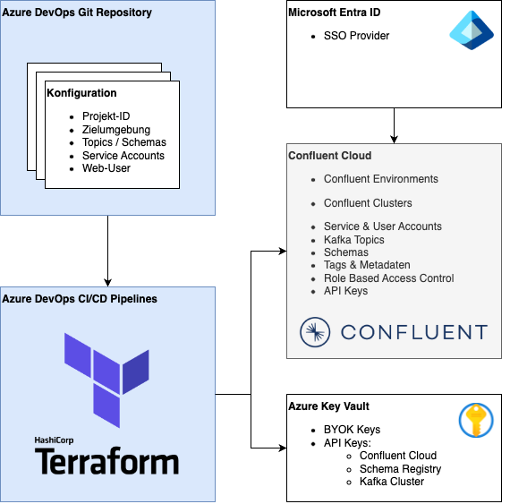
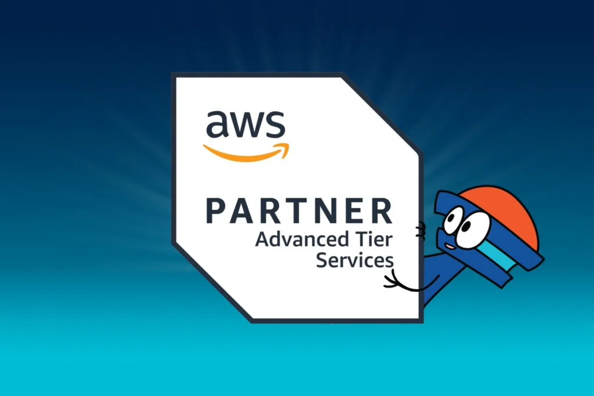
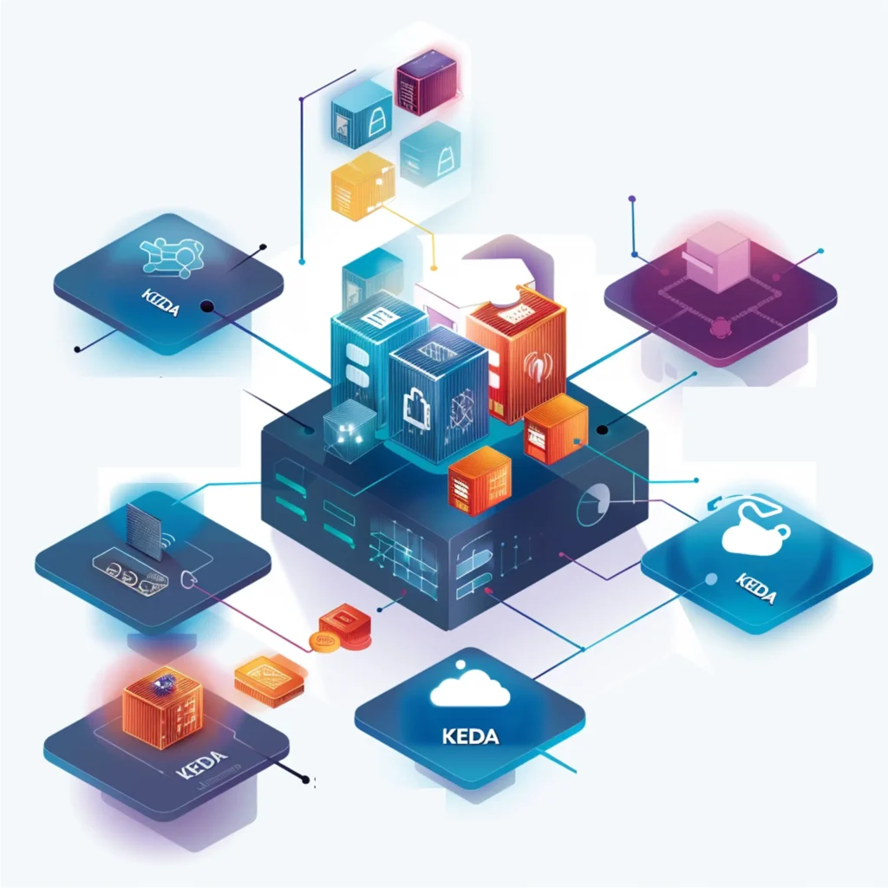

## Eine State-of-the-Art Integrationsplattform mit Terraform und Confluent Cloud

Die Integration von Confluent Cloud, Azure und Terraform ermöglicht den Aufbau einer hochverfügbaren und skalierbaren Integrationsplattform für den Echtzeit-Datenaustausch. Die Kombination von modernsten Lösungen für managed Kafka und Infrastructure as Code bietet eine robuste Echtzeit-Datenintegration und automatisierte Infrastrukturverwaltung, wobei Azure-Services zur Unterstützung der Infrastruktur genutzt werden.

Für eine sichere und schnelle Anbindung einer immer zunehmenden Anzahl von Use Cases ist die Standardisierung und Automatisierung von Deployments unerlässlich. Neben den Einsparungen durch die Reduzierung des erforderlichen DevOps-Personals wird die Kontrolle der Einhaltung firmenweiter Vorgaben erleichtert.

### Herausforderung

Die Notwendigkeit einer hochverfügbaren, skalierbaren Integrationsplattform

Um in der modernen Geschäftswelt wettbewerbsfähig und innovativ zu bleiben, sind Unternehmen auf hochverfügbare und skalierbare Echtzeit-Integrationsplattformen angewiesen, die sowohl geschäftliche als auch operative Anwendungen unterstützen. Diese Plattformen müssen in der Lage sein, eine Vielzahl von Geschäftsprozessen zu integrieren, darunter:

### Geschäftliche Anwendungen

* Kundenverwaltung
* Vertragsmanagement
* Produktinformationen

### Operative Anwendungen

* Standortverwaltung
* Equipment-Management
* Ausbau- und Entwicklungsstatus

Darüber hinaus müssen diese Plattformen eine nahtlose Anbindung von Services und Applikationen für interne Abteilungen sowie externe Partner und Lieferanten ermöglichen. Ein weiterer kritischer Aspekt ist die strenge Standardisierung der Daten mittels Schemas zur Sicherung der Datenqualität und Interoperabilität für eine reibungslose Integration unterschiedlicher Systeme.

## Lösung: Eine Kombination aus Confluent Cloud und Terraform

Um diese Herausforderungen zu meistern, haben wir eine technische Basis geschaffen, die auf den folgenden Komponenten beruht:

### Technische Basis

* **Kafka Cluster und Schema Registry auf Basis von Confluent Cloud**: Diese bietet eine robuste und skalierbare Grundlage für die Echtzeit-Datenintegration. 
* **„Infrastructure-as-Code“** mit **HashiCorp Terraform**: Terraform ermöglicht die automatisierte Bereitstellung und Verwaltung der Infrastruktur. 
* **Microsoft Azure**: Hier werden verschiedene Dienste genutzt, um die Infrastruktur zu unterstützen: 
    - - Confluent Kafka Cluster 
        - Cloud Storage für Terraform State
        - Key Vault für API Keys und BYOK Keys
        - DevOps Repositories für “Infrastructure-as-Code” 
        - Azure DevOps Build und Release Pipelines für CI/CD 
        - Azure Entra ID als Identity Provider 

### Use Cases und Projekte

Einzelne Use Cases werden analysiert und separat als “Projekte” auf die Plattform gebracht. Beispiele hierfür sind das Veröffentlichen und Abonnieren von:

* - Vertragsdatenänderungen 
    - Telemetriedaten 
    - Ausbaustufen 

## Hier können Sie diese Success Story live erleben

06

Nov

### Data in Motion tour - in Frankfurt

Nähere Informationen zu dieser Veranstaltung sowie Anmeldung findet Ihr **[hier](https://events.confluent.io/datainmotiontour2024frankfurt/thinkport)**.

## Resultat: Eine effiziente und standardisierte Bereitstellung

Ein "Projekt" in diesem Kontext bezeichnet eine sehr übersichtliche Konfiguration, die spezifisch auf einen Use-Case zugeschnitten ist. Mit einem Minimum an Konfiguration werden alle erforderlichen Infrastruktur-Ressourcen auf standardisierte Weise erzeugt und konfiguriert: 

### Infrastrukturkonfiguration

* Auswahl einer Zielumgebung und eines Ziel-Clusters
* Kafka Schemas, die bestimmten Topics zugeordnet werden
* Kafka Topics, die ggf. auch von anderen Projekten verwendet werden dürfen
* Service Accounts, die berechtigt werden, auf Projekt-eigene Topics oder Topics anderer Projekte zuzugreifen 
* Einladung und Berechtigung von Benutzern der Confluent Cloud Web Console
* Rotation und sicherer Austausch von Zugangs-Token
* Tags und Business Metadata für Stream Governance 

### Zugriffsbeschränkungen und Authentifizierung

* Zugriffsbeschränkungen auf spezifische Umgebungen, Cluster und Topics
* Confluent Service Accounts für Zugriffe auf Confluent Kafka Ressourcen durch Apps/Services
* Confluent User Invitations sowie Azure Entra ID Single Sign-On für Zugriffe durch natürliche Personen
* Microsoft Azure Entra ID Service Principals für Zugriffe auf rotierende Zugangs-Token/API Keys  

### Kontinuierliche Integration und Bereitstellung (CI/CD)

* Die Infrastruktur wird als „Infrastructure-as-Code“ konfiguriert und kontinuierlich mit Terraform in Azure DevOps Pipelines ausgerollt.
* Der Infrastruktur-Code ist in Azure DevOps Repositories transparent abgelegt und unterliegt einer Versionsverwaltung.
* Entwickler:innen tragen Konfigurations-Code bei, der im Rahmen von Pull Requests Reviews unterzogen wird.
* Während der Pull Request Reviews werden nicht nur die Einhaltung von Konventionen, sondern auch von Zugriffsbeschränkungen geprüft. 
* Nach erfolgreichem Review und Freigabe einer Änderung am Konfigurations-Code wird die Wunschkonfiguration automatisch umgesetzt. 

Durch diesen strukturierten und automatisierten Ansatz wird eine effiziente und standardisierte Anbindung von Use Cases an die Integrationsplattform ermöglicht. Dies stellt sicher, dass der Weg für eine schnelle und zuverlässige Implementierung von Geschäftsanwendungen und Prozessen geebnet ist. 

* Einfache Skalierung auf eine beliebige Anzahl von Use Cases durch die Entwickler:innen mittels Pull Requests
* Transparente, homogene und schnell sowie sicher zu reproduzierende Konfiguration der Infrastruktur durch Infrastructure as Code
* Vermeidung von Fehlern beim Anlegen von Accounts, Ressourcen sowie Berechtigungen
* Minimierung des Aufwands beim Betriebsteam durch weitgehenden Self-Service für die Entwickler:innen 

## Autoren

René Korth

_Cloud Architect_

Patrick Polster

_Cloud Architect_

## [Weitere Beiträge](https://thinkport.digital/blog)

### [Core Strategies Cloud Migration](https://thinkport.digital/core-strategies-cloud-migration/ "Core Strategies Cloud Migration")

[Cloud General](https://thinkport.digital/category/cloud-general/), [Cloud Kubernetes](https://thinkport.digital/category/cloud-kubernetes/)

### [Core Strategies Cloud Migration](https://thinkport.digital/core-strategies-cloud-migration/ "Core Strategies Cloud Migration")

[Cloud General](https://thinkport.digital/category/cloud-general/), [Cloud Kubernetes](https://thinkport.digital/category/cloud-kubernetes/)

### [Thinkport ausgezeichnet als “AWS Advanced Tier Services”](https://thinkport.digital/thinkport-ausgezeichnet-als-aws-advanced-tier-services-ihr-cloud-exzellenzpartner/ "Thinkport ausgezeichnet als “AWS Advanced Tier Services”")

[AWS Cloud](https://thinkport.digital/category/aws-cloud/), [Cloud General](https://thinkport.digital/category/cloud-general/)

### [Thinkport ausgezeichnet als “AWS Advanced Tier Services”](https://thinkport.digital/thinkport-ausgezeichnet-als-aws-advanced-tier-services-ihr-cloud-exzellenzpartner/ "Thinkport ausgezeichnet als “AWS Advanced Tier Services”")

[AWS Cloud](https://thinkport.digital/category/aws-cloud/), [Cloud General](https://thinkport.digital/category/cloud-general/)

### [Hybrid-Cloud-Manifest](https://thinkport.digital/hybrid-cloud-manifest/ "Hybrid-Cloud-Manifest")

[Cloud General](https://thinkport.digital/category/cloud-general/), [Hybrid-Cloud](https://thinkport.digital/category/hybrid-cloud/)

### [Hybrid-Cloud-Manifest](https://thinkport.digital/hybrid-cloud-manifest/ "Hybrid-Cloud-Manifest")

[Cloud General](https://thinkport.digital/category/cloud-general/), [Hybrid-Cloud](https://thinkport.digital/category/hybrid-cloud/)

### [Sustainability of the Cloud](https://thinkport.digital/sustainability-of-the-cloud/ "Sustainability of the Cloud")

[Cloud General](https://thinkport.digital/category/cloud-general/)

### [Sustainability of the Cloud](https://thinkport.digital/sustainability-of-the-cloud/ "Sustainability of the Cloud")

[Cloud General](https://thinkport.digital/category/cloud-general/)

### [Event-getriebene Anwendungen effektiv betreiben](https://thinkport.digital/streaming-und-skalierbarkeit/ "Event-getriebene Anwendungen effektiv betreiben")

[Big Data](https://thinkport.digital/category/big-data/), [Cloud General](https://thinkport.digital/category/cloud-general/), [Cloud Strategie](https://thinkport.digital/category/cloud-strategie/)

### [Event-getriebene Anwendungen effektiv betreiben](https://thinkport.digital/streaming-und-skalierbarkeit/ "Event-getriebene Anwendungen effektiv betreiben")

[Big Data](https://thinkport.digital/category/big-data/), [Cloud General](https://thinkport.digital/category/cloud-general/), [Cloud Strategie](https://thinkport.digital/category/cloud-strategie/)

### [Setup Hashcorp Nomad mit Terraform](https://thinkport.digital/setup-hashcorp-nomad-mit-terraform/ "Setup Hashcorp Nomad mit Terraform")

[Cloud General](https://thinkport.digital/category/cloud-general/)

### [Setup Hashcorp Nomad mit Terraform](https://thinkport.digital/setup-hashcorp-nomad-mit-terraform/ "Setup Hashcorp Nomad mit Terraform")

[Cloud General](https://thinkport.digital/category/cloud-general/)
