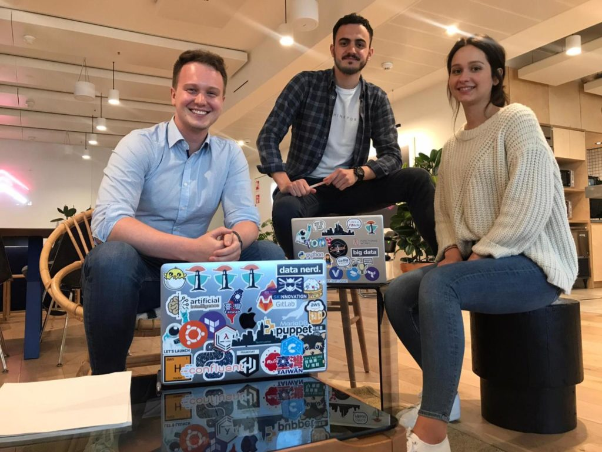

# Thinkport at ICTS Messe & accadis Career Day

NEWS Workshops

## Story Time

Janina, Tobias and Bledion attended the accadis Career Day, a format from our partner university, accadis Hochschule in Bad Homburg. We got to virtually meet and talk to many talented students. Tobias talked about the journey with Thinkport and gave tips about founding a start up.

Simultaneously we attended the ITCS Messe which took place virtually in Darmstadt. Our CEO Tobias talked about the first steps he took in AWS, and about ideas and concepts that shaped our company.

Click the following link if you want to learn more about his talk: [https://www.it-cs.io/itcsonline/dabeiseinundmitmachen/keynotes.htm](https://www.it-cs.io/itcsonline/dabeiseinundmitmachen/keynotes.htm)

And if you want to read more about the job opportunities at Thinkport visit our career page: [https://recruiterflow.com/thinkportgmbh/jobs](https://recruiterflow.com/thinkportgmbh/jobs)

Weitere Neuigkeiten

## News Writer

Christina Friede

Business Development

Email:

[cfriede@thinkport.digital](mailto:cfriede@thinkport.digital)

*  
