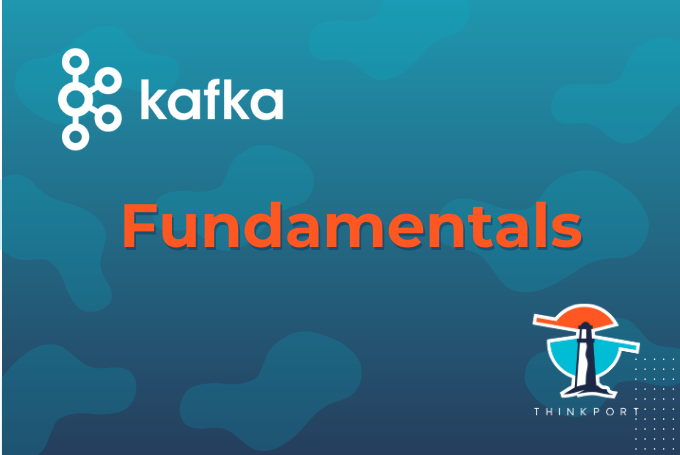

 

# Kafka-Event-Streaming - ein Überblick

In Zeiten der Digitalisierung gehören die effiziente Gestaltung sämtlicher Geschäftsprozesse und die reaktionsschnelle Anpassungsfähigkeit an wechselnde betriebliche Anforderungen zählen zu einem absoluten Muss, um konkurrenzfähig zu bleiben. Im Zuge dieser Entwicklung nehmen die Echtzeit-Daten-Verarbeitung und Event-Streaming-Lösungen wie Kafka – eine performante, hochskalierbare und zuverlässige Technologie zur Datenverarbeitung – eine entscheidende Rolle ein.

## Was ist Event-Streaming?

Event-Streaming gibt Unternehmen die Möglichkeit schneller und effizienter zu operieren und damit die Wettbewerbsfähigkeit für die Zukunft zu sichern. Es handelt sich dabei um eine Softwaretechnologie, die die **Implementierung eventgesteuerter Architekturen** ermöglicht. Diese Umgebungen umfassen mehrere Formen von Entitäten. Solche, die Ereignisse …

* produzieren, 
* verwalten und
* konsumieren.

Das Event-Streaming erfasst Daten in Echtzeit. Diese stammen aus Ereignisquellen wie Sensoren, anderen Softwareanwendungen oder Cloud-Diensten. Anschließend werden die Ereignisströme vorübergehend oder permanent gespeichert und liegen dann für den späteren Abruf oder die Weiterverarbeitung bereit. Je nach Anwendungsbereich können kritische Ereignisse, beispielsweise Bestell- und Zahlungseingänge oder ein per Sensor erfasster Temperaturpunkt, identifiziert und dann entsprechend darauf – entweder in Echtzeit oder im Nachhinein – reagiert werden. Einfach gesagt, **ermöglicht das Event-Streaming einen kontinuierlichen Datenfluss** und sorgt dafür, dass die richtigen Informationen zur richtigen Zeit am richtigen Ort sind.

## Für was kann ich Event-Streaming nutzen?

Immer mehr Unternehmen setzen auf eventgetriebene Geschäftsprozesse, um sich einen Vorteil gegenüber den Mitbewerbern zu verschaffen. Schließlich birgt die Digitalisierung nach wie vor viele neue Chancen und das Event-Streaming gehört dabei zu den zentralen Themen. Unabhängig von der Branche ergeben sich im Tagesgeschäft **zahlreiche Anwendungsfälle**, bei denen die Softwaretechnologie eingesetzt werden kann. Zu den Möglichkeiten zählen:

* Die Verarbeitung von Zahlungen und Finanztransaktionen in Echtzeit
* Die Kontrolle von Prozess- und Lieferketten (Verfolgung und Überwachung von Lieferfahrzeugen oder Sendungen in Echtzeit)
* Die kontinuierliche Erfassung von Sensordaten in Fabriken, Windparks und anderen Anlagen
* Die automatisierte Reaktion auf Kundeninteraktionen und Bestellungen im Einzel- und Online-Handel oder in der Reise- und Hotelbranche
* Die Überwachung von Patienten in Krankenhäusern und Voraussagen zu Zustandsveränderungen
* Die Speicherung, Verwaltung und Bereitstellung von Daten, die von verschiedenen Abteilungen einer Firma genutzt werden
* Die Schaffung einer Grundlage für Datenplattformen, ereignisgesteuerte Architekturen und Microservices

## Event-Streaming – Apache Kafka als treibende Kraft

Beim Event-Streaming handelt es sich um eine softwarebasierte Lösung für die Arbeit mit Ereignisdaten. Für eine effektive Umsetzung bedarf es also einer **leistungsstarken Event-Streaming-Plattform**, die eingehende Nachrichten fortlaufend in hoher Geschwindigkeit, zuverlässig und ohne Verluste verarbeiten kann. Branchenübergreifend hat sich die Open-Source-Software Apache Kafka etabliert, doch warum sollte ein Unternehmen überhaupt noch eine weitere Technologie zwischen den Sendern und Empfängern der Events schalten? Hierfür gibt es gleich mehrere gute Gründe.

Zum einen **steigert das Kafka-Event-Streaming die Zuverlässigkeit** – besonders, wenn der Workload Spitzenwerte erreicht. Bei einer Direktverbindung ist die Gefahr hoch, dass der Empfänger überlastet wird und wichtige Nachrichten verloren gehen. Apache Kafka kann die Daten hingegen zwischenspeichern, was sich auch beim Ausfall oder bei der Wartung von anderen Anwendungen bezahlt macht. Da Kafka eine Cluster-Funktionalität mit mehreren Broker Instanzen bereitstellt, ist das System **ausfallsicher und resilient**.

Zum anderen glänzt das Kafka-Event-Streaming mit hoher Flexibilität. Anwendungen, die Events senden, und solche, die Events konsumieren, werden vollständig voneinander entkoppelt. Dadurch ergibt sich die Möglichkeit, eine **Microservices-Architektur** einzusetzen. Die Vermeidung monolithischer Konzepte hilft Firmen dabei, den Funktionsumfang zu erweitern und auf sich ändernde geschäftliche Bedingungen in kürzester Zeit zu reagieren.

## Kafka-Event-Streaming – Vorteile im Überblick

Aber warum nutzen so viele Unternehmen ausgerechnet Apache Kafka? Schließlich existieren noch eine Vielzahl weiterer Queuing-, Messaging- und Streaming-Engines. Folgende Argumente sprechen für den Einsatz des Kafka-Event-Streamings:

* Einfache Skalierbarkeit
* Hohe Ausfallsicherheit und Belastbarkeit
* Geringe Latenz
* Integrierte Optimierungen wie Kompression und Message-Batching
* Open-Source-Ansatz mit vielen Konnektoren zu anderen Anwendungen

## Wie funktioniert Kafka-Event-Streaming?

Kafka-Event-Streaming basiert auf einem verteilten System, bestehend aus Servern und Clients, die über ein leistungsstarkes TCP-Netzwerkprotokoll kommunizieren.

In der Regel wird Kafka als Cluster mit einem oder mehreren Servern betrieben, die auch als **Cluster** bezeichnet werden. Sie können sich über verschiedene Standorte, Rechenzentren oder Cloud-Regionen erstrecken. Ihre Aufgabe besteht darin, Nachrichten in logischen Segmenten, sogenannten **Topics**, effizient zu Speichern und diese bei Bedarf zum Konsumieren bereitzustellen. Andere Server wiederum führen Kafka Connect aus und ermöglichen damit den kontinuierlichen Import und Export von Daten aus sowie in externe Systeme.

Auf der anderen Seite stehen die **Clients**. Sie bewerkstelligen die Integration von verteilten Anwendungen und Microservices, die Ereignisströme parallel lesen, schreiben und verarbeiten können. Clients sind für Java, Scala, Go, Python, C, C++ und viele andere Programmiersprachen verfügbar.

Wenn Daten in Kafka geschrieben oder gelesen werden, geschieht das in Form von Events. Unterschieden wird zwischen Clients, die Events in Kafka schreiben (**Producers**), und Clients, die Events lesen und verarbeiten (**Consumers**).

Die bereits erwähnten Topics stellen das **grundlegende Organisationselement** für Kafka-Event-Streaming dar. In ihnen werden entsprechende Events organisiert und gespeichert. Jedes Topic kann keine, einen oder mehrere Producers und Consumers haben. Im Gegensatz zu traditionellen Messaging-Services werden Events nach der Nutzung nicht zwingend automatisch gelöscht – der Nutzer legt die Dauer der Aufbewahrung selbst fest.

## Kafka-Event-Streaming – die passende Lösung für jeden Use-Case

Um verschiedene Einsatzgebiete abzudecken, muss das Cluster für eine effiziente Nutzung dem Bedarf entsprechend richtig konfiguriert werden. Dabei können sehr schnell große Datenmengen entstehen, welche trotz der eigentlichen Vorteile des Kafka-Event-Streamings in hohen Kosten resultieren kann. Grund dafür ist unter anderem die fehlende Expertise, was zu ineffizient konfigurierten Clustern und weiteren Defiziten führt, welche unnütze Kosten verursachen.

Fähigkeiten im Umgang mit Apache Kafka sind deshalb sehr gefragt, doch viele Unternehmen suchen vergeblich. Es lohnt sich also, einen erfahrenen Partner an der Seite zu haben. Wollen Sie mehr über die fortgeschrittene **[Kafka-Optimierung](https://thinkport.digital/fortgeschrittene-kafka-optimierung/)**, die **[Kafka-Administration](https://thinkport.digital/kafka-administration-lernen/)** oder die **[Stream-Verarbeitung mit Kafka](https://thinkport.digital/stream-verarbeitung-mit-kafka-lernen/)** erfahren? Bei unseren Hands-on-Trainings lernen Sie, wie Sie den Umgang mit Kafka meistern. Sie profitieren dabei von unserer langjährigen Erfahrung und unserem Expertenwissen im Bereich Cloud-Architekturen direkt aus der Industrie.

## [Weitere Beiträge](https://thinkport.digital/blog)

### [Streaming-Services](https://thinkport.digital/streaming-services/ "Streaming-Services")

[Cloud General](https://thinkport.digital/category/cloud-general/), [Streaming](https://thinkport.digital/category/streaming/)

### [Streaming-Services](https://thinkport.digital/streaming-services/ "Streaming-Services")

[Cloud General](https://thinkport.digital/category/cloud-general/), [Streaming](https://thinkport.digital/category/streaming/)

### [Kafka Event-Streaming](https://thinkport.digital/kafka-event-streaming/ "Kafka Event-Streaming")

[Cloud General](https://thinkport.digital/category/cloud-general/), [Streaming](https://thinkport.digital/category/streaming/)

### [Kafka Event-Streaming](https://thinkport.digital/kafka-event-streaming/ "Kafka Event-Streaming")

[Cloud General](https://thinkport.digital/category/cloud-general/), [Streaming](https://thinkport.digital/category/streaming/)

### [Sustainability of the Cloud](https://thinkport.digital/sustainability-of-the-cloud/ "Sustainability of the Cloud")

[Cloud General](https://thinkport.digital/category/cloud-general/)

### [Sustainability of the Cloud](https://thinkport.digital/sustainability-of-the-cloud/ "Sustainability of the Cloud")

[Cloud General](https://thinkport.digital/category/cloud-general/)

### [Kafka Streams](https://thinkport.digital/kafka-streams/ "Kafka Streams")

[Cloud General](https://thinkport.digital/category/cloud-general/), [Streaming](https://thinkport.digital/category/streaming/)

### [Kafka Streams](https://thinkport.digital/kafka-streams/ "Kafka Streams")

[Cloud General](https://thinkport.digital/category/cloud-general/), [Streaming](https://thinkport.digital/category/streaming/)

### [Kafka-Fundamentals](https://thinkport.digital/kafka-fundamentals/ "Kafka-Fundamentals")

[Streaming](https://thinkport.digital/category/streaming/)

### [Kafka-Fundamentals](https://thinkport.digital/kafka-fundamentals/ "Kafka-Fundamentals")

[Streaming](https://thinkport.digital/category/streaming/)

### [Hybrid-Cloud-Manifest](https://thinkport.digital/hybrid-cloud-manifest/ "Hybrid-Cloud-Manifest")

[Cloud General](https://thinkport.digital/category/cloud-general/), [Hybrid-Cloud](https://thinkport.digital/category/hybrid-cloud/)

### [Hybrid-Cloud-Manifest](https://thinkport.digital/hybrid-cloud-manifest/ "Hybrid-Cloud-Manifest")

[Cloud General](https://thinkport.digital/category/cloud-general/), [Hybrid-Cloud](https://thinkport.digital/category/hybrid-cloud/)
