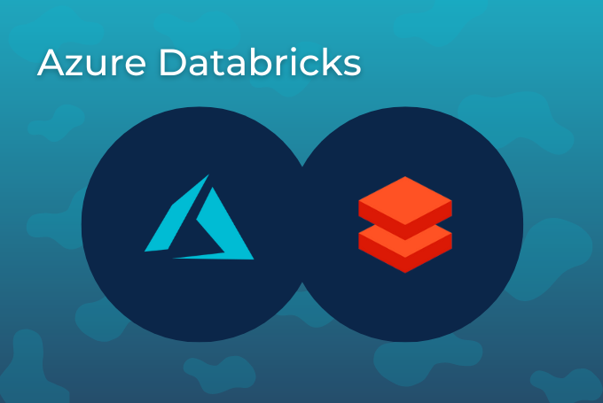
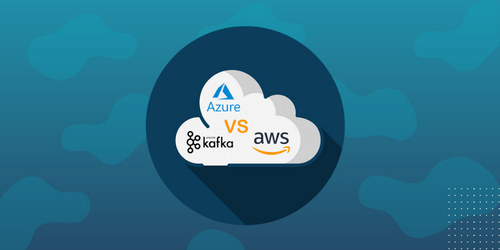

 

# Kafka Fundamentals – Grundlagen der Event-Streaming-Plattform erklärt

Um im starken Wettbewerb bestehen zu können, reichen Analysen über Nacht nicht mehr aus. Systeme, Apps und Unternehmensprozesse profitieren immens von Datenströmen und Datenverarbeitung in Echtzeit – da benötigt es eine Plattform, die bei diesem Tempo mithalten kann. Apache Kafka hat sich in diesem Bereich behauptet. Heutzutage kommt die Software bei 80 % aller Fortune-100-Unternehmen zum Einsatz und verarbeitet je nach Anwendungsfall mehr als eine Million Nachrichten pro Sekunde.

## Was ist Apache Kafka?

Apache Kafka wurde ursprünglich als Nachrichten-Queue (Warteschlange) für LinkedIn genutzt. Seitdem hat sich bei der Open-Source-Software allerdings einiges geändert. Mit der Vision von einer Art zentralen Nervensystem, das Echtzeit-Daten für sämtliche Anwendungen bereitstellt, hat die Apache Software Foundation das Ganze zu einer leistungsfähigen Streaming-Plattform weiterentwickelt.

Mithilfe von Apache Kafka ist es möglich, Datenströme über eine verteilte Plattform zu verarbeiten und zu speichern. Die Daten können anschließend bei Bedarf in Clustern gelesen, importiert oder exportiert werden. Zu den Stärken zählen die einfache Skalierbarkeit und die hohe Fehlertoleranz. So eignet sich die Software für große Datenmengen und Anwendungen im Big-Data-Umfeld. Heute gehört sie zu den ausgereiftesten Diensten für Event-Streaming. Die Einsatzgebiete sind dabei vielseitig – von Realtime-Analysen, über Datenintegration, bis hin zur Betrugserkennung.

## Grundfunktionen von Apache Kafka?

Apache Kafka ist eine Event-Streaming-Plattform. Doch was genau verbirgt sich hinter dem Begriff? Einfach gesagt, verfügt die Anwendung über drei Kernfunktionen, die Sie entsprechend Ihrer Bedürfnisse implementieren können:

* Schreiben und Lesen von Events sowie kontinuierlicher Import und Export von Daten aus und in andere Systeme
* Dauerhaftes und zuverlässiges Speichern von Events
* Asynchrone Verarbeitung von Events in Echtzeit

Als Messaging-Service behebt Apache Kafka Schwachstellen und Limitationen, die bei der Direktverbindung zwischen Datenquelle und Datenempfänger entstehen. Daten können bei Störungen zwischengespeichert und Überlastungen des Empfängers bei hohen Datenmengen verhindert werden.

## Architektur und essenzielle Begriffe

Zu den Kafka Fundamentals gehört auch das Verständnis über den Grundaufbau der Plattform. Das System besteht in Regel aus einem **Cluster** mit einem oder mehreren Knoten. Knoten, die die Speicherebene bilden, werden als **Broker** bezeichnet. Das Cluster zeichnet sich dabei durch seine Skalierbarkeit aus, da Sie bei Bedarf weitere Server hinzufügen können. Mit der richtigen Konfiguration sollte bei einem Ausfall des Servers, die restlichen die Arbeit übernehmen – und das Ganze ohne Datenverlust.

In Apache Kafka werden Nachrichten von Brokern mit einem Zeitstempel gespeichert und in sogenannten **Topics** organisiert. Es gibt zwei Arten von Topics: Retention und Compaction. Retention-Topics haben eine begrenzte Speicherdauer und Größe. Sobald einer dieser Parameter erreicht ist, wird Apache Kafka die Nachricht löschen. Bei Compaction-Topics hingegen gibt es keine Einschränkungen hinsichtlich der Speicherdauer oder Größe.

Die gespeicherten Informationen werden im Cluster repliziert und verteilt. Dort unterscheiden wir zwischen Clients, die Daten in das Cluster schreiben (**Producer**), und Clients, die Daten konsumieren beziehungsweise lesen (**Consumer**). Der Austausch zwischen Producer, Broker und Consumer erfolgt über das TCP-Protokoll.

## Schnittstellen

Als Ergänzung zu den Befehlszeilen-Tools verfügt Apache Kafka über 5 Kern-APIs, die verschiedene Aufgaben übernehmen:

* Mit der **Admin-API** managen und überprüfen Sie Topics, Broker und weitere Objekte in Kafka.
* Die **Producer-API** erlaubt Anwendungen das Schreiben von Daten und Nachrichten in das Kafka-Cluster.
* Über die **Consumer-API** lassen sich Event-Streams des Kafka-Clusters auslesen und verarbeiten.

* Die **Streams-API** dient der Implementierung von Stream-Processing-Applikationen und Microservices. Es handelt sich dabei um eine Java-Bibliothek, die Datenströme zustandsbehaftet und fehlertolerant verarbeiten kann. Der Input wird von einem oder mehreren Topics gelesen und zu einem Output für ein oder mehrere Topics umgewandelt. Zu den bereitgestellten Operatoren gehören das Filtern, Gruppieren und Zuordnen von Daten. Außerdem unterstützt die Streams-API Tabellen, Joins und Zeitfenster.
* Die **Connect-API** basiert auf der Producer- und der Consumer-API. Mit ihr erstellen Sie wiederverwendbare Datenimport- und -exportschnittstellen zur Kommunikation mit Drittsystemen. Hier stehen bereits zahlreiche kommerzielle und freie Konnektoren bereit, die sich für die Verbindung mit Systemen von verschiedenen Herstellern eignen.

## Anwendungsbereiche für Apache Kafka

Kafka kann direkt auf der Rechnerhardware, auf virtuellen Maschinen sowie on-premise und in der Cloud implementiert werden. Dabei liefert es stets die Grundlage für eine schnelle und zuverlässige Datenverarbeitung in Echtzeit. In der Praxis ergeben sich zahlreiche Use Cases, die von der Plattform profitieren.

Messaging

Kafka können Sie als Alternative zu traditionellen Nachrichten-Brokern verwenden – beispielsweise, um die Datenverarbeitung vom Producer zu entkoppeln oder unverarbeitete Informationen zwischenzulagern. Im Gegensatz zu klassischen Diensten überzeugt Kafka mit einem höheren Datendurchsatz, einem Message Ordering und Log Store, sowie einer besseren Fehlertoleranz. Auch bei umfangreichen Anwendungen gewährleistet die Software stets eine geringe Latenz.

Webseiten-Tracking in Echtzeit

Der ursprüngliche Anwendungsfall für Kafka bestand darin, eine Pipeline zur Nachverfolgung von Benutzeraktivitäten als Echtzeit-Feeds neu aufzubauen. Aktivitäten wie Seitenaufrufe, Suchverläufe und andere Daten werden dabei in zentralen Topics veröffentlicht. Nutzer können die Feeds abonnieren und die Informationen zeitkritisch verarbeiten, überwachen und in Systeme zur Offline-Verarbeitung und Berichterstellung übertragen.

Aggregation von Protokoll-Dateien

Die Protokoll-Aggregation umfasst in der Regel physische Protokoll-Dateien, die von einem Server gesammelt und an einem zentralen Ort zur Verarbeitung hinterlegt werden. Kafka dient dabei als Ersatz für klassische Protokoll-Aggregationslösungen. Zu den Vorteilen zählen die geringe Latenz bei der Verarbeitung, die unkomplizierte Unterstützung mehrerer Datenquellen und die verteilte Datennutzung.

Stream-Processing

Viele Anwender von Kafka verarbeiten Daten in mehrstufigen Pipelines. Dort werden Rohdaten aus den Topics gelesen, aggregiert und für die weitere Nutzung umgewandelt. Mit Kafka Streams steht eine leistungsstarke Bibliothek fürs Stream-Processing zur Verfügung, die solche Datenverarbeitungen durchführt und Diagramme von Echtzeit-Datenflüssen erstellen kann.

Event-Sourcing

Das Event-Sourcing beschreibt eine Art der Anwendungsentwicklung, bei der Zustandsänderungen als zeitlich geordnete Folge von Datensätzen protokolliert werden. Da Kafka die Speicherung großer Protokolldaten erlaubt, erfüllt es alle Anforderungen, um als Backend für Anwendungen in diesem Stil zu agieren.

Synchronisierung in verteilten Systemen

Kafka kann als externes Commit-Log für dezentrale Systeme dienen. Es hilft bei der Replikation von Daten zwischen den Knotenpunkten und dient nach einem Ausfall als Synchronisierungsmechanismus.

## Kafka Fundamentals – Trainings für den Einstieg

Wollen Sie mehr über die Event-Streaming-Plattform, ihre Funktionsweise und die verschiedenen Einsatzmöglichkeiten erfahren? Als offizieller Confluent-Partner und Pionier bei der Entwicklung innovativer Cloud-Technologien bringen wir die nötige Expertise aus der Industrie als **[Apache Kafka Consultant](https://thinkport.digital/cloud-consulting-fuer-deutsche-grossunternehmen/apache-kafka/)** mit. Unser **[Kafka-Fundamentals-Training](https://thinkport.digital/kafka-fundamentals-lernen/)** bietet dabei die ideale Möglichkeit, erste Lernerfahrungen mit der Software zu gewinnen. Ob remote oder vor Ort – verschaffen Sie sich einen ersten Überblick und die perfekte Grundlage für unsere fortgeschrittenen Kafka-Workshops.

## Weitere Artikel

## [Weitere Beiträge](https://thinkport.digital/blog)

### [Modernisierung ist ein Kontinuum](https://thinkport.digital/modernisierung-ist-ein-kontinuum/ "Modernisierung ist ein Kontinuum")

[Cloud General](https://thinkport.digital/category/cloud-general/), [Cloud Kubernetes](https://thinkport.digital/category/cloud-kubernetes/)

### [Modernisierung ist ein Kontinuum](https://thinkport.digital/modernisierung-ist-ein-kontinuum/ "Modernisierung ist ein Kontinuum")

[Cloud General](https://thinkport.digital/category/cloud-general/), [Cloud Kubernetes](https://thinkport.digital/category/cloud-kubernetes/)

### [Azure Databricks](https://thinkport.digital/azure-databricks/ "Azure Databricks")

[Azure Cloud](https://thinkport.digital/category/azure-cloud/), [Cloud General](https://thinkport.digital/category/cloud-general/)

### [Azure Databricks](https://thinkport.digital/azure-databricks/ "Azure Databricks")

[Azure Cloud](https://thinkport.digital/category/azure-cloud/), [Cloud General](https://thinkport.digital/category/cloud-general/)

### [Sustainability of the Cloud](https://thinkport.digital/sustainability-of-the-cloud/ "Sustainability of the Cloud")

[Cloud General](https://thinkport.digital/category/cloud-general/)

### [Sustainability of the Cloud](https://thinkport.digital/sustainability-of-the-cloud/ "Sustainability of the Cloud")

[Cloud General](https://thinkport.digital/category/cloud-general/)

### [Was ist Cloud Consulting](https://thinkport.digital/was-ist-cloud-consulting/ "Was ist Cloud Consulting")

[Cloud General](https://thinkport.digital/category/cloud-general/)

### [Was ist Cloud Consulting](https://thinkport.digital/was-ist-cloud-consulting/ "Was ist Cloud Consulting")

[Cloud General](https://thinkport.digital/category/cloud-general/)

### [Apache Airflow](https://thinkport.digital/apache-airflow/ "Apache Airflow")

[Cloud General](https://thinkport.digital/category/cloud-general/), [Hybrid-Cloud](https://thinkport.digital/category/hybrid-cloud/)

### [Apache Airflow](https://thinkport.digital/apache-airflow/ "Apache Airflow")

[Cloud General](https://thinkport.digital/category/cloud-general/), [Hybrid-Cloud](https://thinkport.digital/category/hybrid-cloud/)

### [Kafka Event-Streaming](https://thinkport.digital/kafka-event-streaming/ "Kafka Event-Streaming")

[Cloud General](https://thinkport.digital/category/cloud-general/), [Streaming](https://thinkport.digital/category/streaming/)

### [Kafka Event-Streaming](https://thinkport.digital/kafka-event-streaming/ "Kafka Event-Streaming")

[Cloud General](https://thinkport.digital/category/cloud-general/), [Streaming](https://thinkport.digital/category/streaming/)
