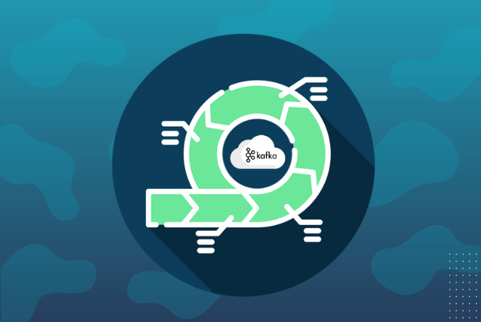
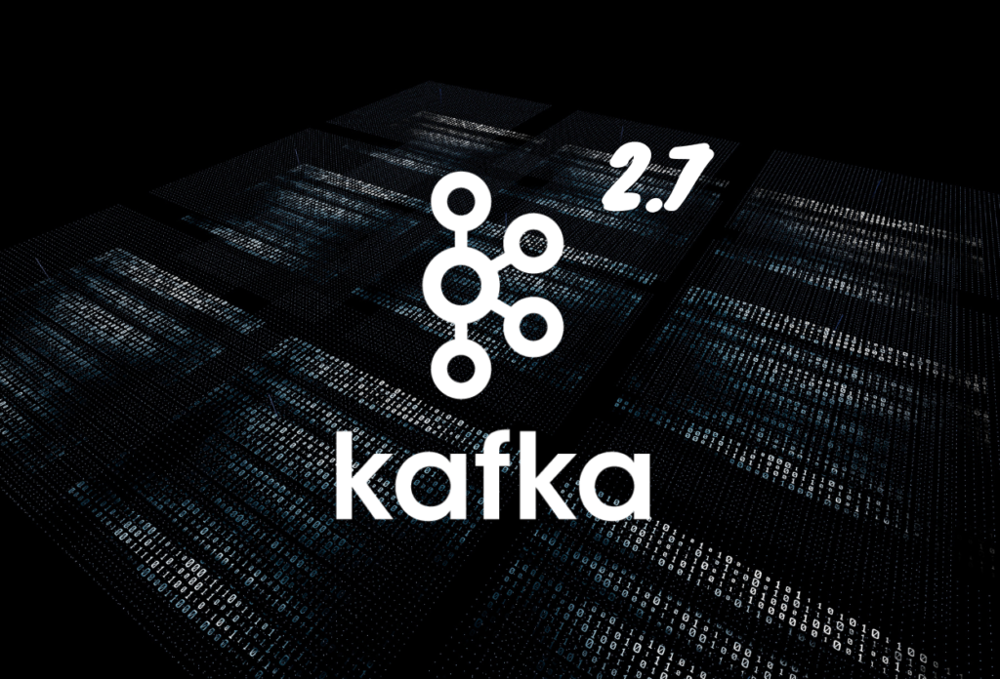

 

# Kafka Streams – Stream-Processing leicht gemacht

Die Betrachtung von Daten als strömender Fluss kann Unternehmen entscheidende Geschwindigkeitsvorteile bringen. Allerdings benötigt es für die Verarbeitung riesiger Datenmengen mit minimaler Verzögerung eine leistungsstarke Event-Streaming-Plattform. Hier kommt **Apache Kafka mit Kafka Streams** ins Spiel, das sich nicht grundlos bei vielen Fortune-100-Unternehmen als Lösung etabliert hat.

## Große Datenmengen, wenig Zeit

In der heutigen Zeit ist Big Data ein Dauerthema – und das in zahlreichen Branchen und Anwendungsgebieten. Oft erfordert das die zeitnahe Verarbeitung von **kontinuierlichen Datenströmen**, die aus mehreren beteiligten Systemen stammen. Die Bedeutung ist gerade deshalb so hoch, weil die Datenmengen umfangreicher werden und die Anforderungen an die Effizienz der Geschäftsprozesse – mit Auswirkungen auf die Wirtschaftlichkeit des Unternehmens und die Zufriedenheit der Kunden – stetig ansteigen.

Um die wachsenden Herausforderungen zu meistern, setzen immer mehr Unternehmen Stream-Processing-Plattformen ein. Im Gegensatz zum klassischen Batch-Processing betrachtet das Stream-Processing die Daten als Strom und **verarbeitet sie fortlaufend**. Kafka ist eine solche Stream-Processing-Plattform, die die Ausrichtung des Gesamtsystems nach Events ermöglicht und entsprechende APIs bereitstellt.

### Kafka als Event-Streaming-Plattform

Bevor wir uns näher mit Kafka Streams befassen, wollen wir zunächst klären, was sich hinter Kafka selbst verbirgt. Kafka wurde ursprünglich als Messaging-System genutzt, hat sich im Laufe der Jahre aber zu einer **verteilten, leistungsstarken und einfach skalierbaren Event-Streaming-Plattform** entwickelt. Heute kann die Software Milliarden von Events pro Tag in einem kontinuierlichen Strom zeitkritisch verwerten und stellt damit eine attraktive Wahl dar, selbst für die anspruchsvollsten Use-Cases bei der Echtzeit-Datenverarbeitung.

Im Gegensatz zu anderen Lösungen kann Kafka Eventströme dauerhaft zwischenspeichern, bis sie tatsächlich gebraucht werden. Das verhindert Abhängigkeiten und somit Totalausfälle bei Störungen oder Wartungsarbeiten, was es zu einer **äußerst zuverlässigen Lösung** macht. Aufgrund der Vorteile hat sich Kafka als erste Wahl für Big-Data-Anwendungen etabliert, bei denen es auf effizientes und schnelles Stream-Processing ankommt.

## Was ist Kafka Streams? Abgrenzung und Limitationen

Kafka Streams ist eine API innerhalb von Kafka und gehört zu den entscheidenden Stream-Processing-Komponenten der Software. Es handelt sich dabei um eine **Java-Bibliothek**, die das Schreiben von geschäftskritischen Echtzeitanwendungen und Microservices simpler gestaltet. Mit den Anwendungen sind vor allem solche gemeint, die eingehende Topics in ausgehende Topics umwandeln. Doch wo genau liegt der Unterschied zu Kafka Consumer und Kafka Producer?

Die Kafka-Streams-DSL (**Domain Specific Language**) baut auf der Processor-API auf. Sie ist für die meisten Benutzer – auch Einsteiger – empfehlenswert, da es oft nur wenige Zeilen Code benötigt, um Datenverarbeitungsvorgänge zu formulieren. Kafka Streams verfügt über eingebaute Abstraktionen für Streams und Tabellen in Form von KStream, KTable und GlobalKTable, mit denen Sie Daten aus Topics problemlos in Ihre Anwendung schreiben.

Der Programmierstil ist funktional und bietet Möglichkeiten für **zustandslose Transformationen** und **zustandsbehaftete Transformationen** wie Aggregationen, Joins und Windowing. Bei Applikationen, die lediglich die Consumer- und Producer-APIs nutzen, werden solche Operationen schnell zu komplex. Das stellt die die Entwickler vor große Herausforderungen, insbesondere wenn Aspekte wie Robustheit, Skalierbarkeit und Ausfallsicherheit berücksichtigt werden müssen. Kafka Streams vereinfacht den Prozess und damit auch die Implementierung von Anwendungen zur Echtzeitverarbeitung von Datenströmen.

Im Gegensatz zum Micro-Batching-Ansatz verfolgt Kafka Streams die **„Event-At-A-Time“-Strategie**. Jedes Event wird direkt bei der Ankunft verarbeitet, was in kurzen Latenzen und Antwortzeiten resultiert. Die Vorteile kommen allerdings auch mit einer Limitation: Kafka Stream unterstützt nur Stream-Processing und kein Batch-Processing.

## Stream-Processing vereinfacht – mit Kafka Streams

Kafka Streams ermöglicht es, Low-Level-Details zu ignorieren und stattdessen den Fokus auf die Verarbeitung der Daten zu legen. **Der Code ist deshalb deutlich prägnanter**. Ob auf dem PC, dem Laptop oder einem Server – Kafka Streams führen Sie von jedem beliebigen Gerät aus. Erfahren Sie im Detail, wie Kafka Streams die Komplexität des Stream-Processing verringert.

### Stream-Processing ohne Framework

Kafka Streams vereinfacht die Entwicklung von Streaming-Diensten erheblich. Es handelt sich lediglich um eine schlanke Bibliothek, die **keine speziellen Cluster** erfordert – alles, was benötigt wird, ist der eigene Anwendungscode. Dieser koordiniert sich mit Kafka, um Ausfällen vorzubeugen, die Verarbeitungslast aufzuteilen und bei mehreren Instanzen dynamisch auszugleichen.

### Streams und Tabellen vereint

Die Beziehung zwischen Datenströmen und Tabellen ist der **Kern des Stream-Processing**. Nehmen wir als Beispiel einen Einzelhandel, bei dem ein Strom von Lieferungen und Verkäufen zu einer Tabelle mit Lagerbeständen führt, die wiederum Prozesse wie Nachbestellungen in Gang setzt. Mit Kafka Streams lassen sich die Verkaufsdaten mit den statischen Stammdaten von Artikeln und Lieferantenadressen verbinden. Anhand der Echtzeittransaktionen kann das System Waren automatisch nachbestellen.

### Einfacher in jeder Hinsicht

Stream-Processing-Anwendungen sind in ihrer Architektur oft hochkomplex. Hier stehen Kafka selbst, die Cluster, externe Datenbanken und weitere Komponenten im Zusammenspiel. So ein System einzubinden, ist äußerst schwer und in einigen Fällen erst gar nicht möglich. Kafka Streams schafft Abhilfe. Es greift auf **wenige Kernkonzepte** zurück, die sich durch die gesamte Plattform ziehen. Das reduziert die Architektur der Anwendung auf das Nötigste und ermöglicht **nachträgliche Anpassungen**, ohne das System von Grund auf neu aufzubauen.

## Kafka Streams – Vorteile im Überblick

Stream-Processing-Plattformen sollten im Idealfall eine Integration für Datenspeicherplattformen bieten. In vielen Fällen werden die Skalierbarkeit und die Fehlertoleranz den Anforderungen aber nicht gerecht. Kafka Streams steht als robuste Alternative zur Verfügung, mit der sich diese Schwächen ausmerzen lassen. Dabei stechen folgende Vorteile hervor:

* Fehlertolerante Clusterarchitektur, die einen zuverlässigen Betrieb selbst bei Ausfällen oder Wartungsarbeiten gewährleistet
* Domänenspezifische Sprache mit Operatoren zum Filtern, Abbilden und Gruppieren sowie Unterstützung für Joins und Windowing
* Hochgradige Skalierbarkeit, dank der anspruchsvolle Anwendungen umgesetzt werden können
* Direkte Verbindung mit Kafka und Nutzung in der Cloud möglich
* Java- und Scala-Skripte ermöglichen den Zugriff über Windows, Linux und Mac
* Vollständige Integration mit Kafka Security für verbesserte Datensicherheit

## Anwendungsfälle für Kafka Streams

Stream-Processing erweist sich überall dort als sinnvoll, wo die Latenz bei der Verarbeitung großer Datenmengen reduziert werden soll. Wenn der Use-Case folgende Attribute aufweist, kann sich Stream-Processing lohnen:

* Dauerhafter Strom von Daten
* Kontinuierlicher Workload statt einer Datenlieferung als Paket
* Sofortige Verarbeitung der Daten notwendig

Kafka Streams bringt die Streaming-Plattform weiter voran, da es die Implementierung von Anwendungen vereinfacht. Besonders in event-getriebenen Umgebungen mit asynchroner Kommunikation liefert Kafka starke Argumente: Es ist datensicher, einfach skalierbar und leistungsstark.

## Kafka Streams – Trainings für den Einstieg

Um das volle Potenzial von Kafka ausnutzen zu können, braucht es allerdings die nötige Expertise. Hier stehen wir Ihnen mit unseren praxisnahen Trainings zur Seite. Egal, ob Sie mehr über **[Stream-Verarbeitung](https://thinkport.digital/stream-verarbeitung-mit-kafka-lernen/)** mit Kafka, **[Kafka-Administration](https://thinkport.digital/kafka-administration-lernen/)** oder **[Kafka-Optimierung](https://thinkport.digital/fortgeschrittene-kafka-optimierung/)** erfahren wollen – wir geben unsere Projekterfahrung und unser Wissen über Cloud-Architekturen direkt aus der Industrie an Sie weiter. Kommen Sie auf uns zu und vereinbaren Sie einen Termin für unsere Remote- oder Vor-Ort-Schulungen.

## Weitere Artikel

## [Weitere Beiträge](https://thinkport.digital/blog)

### [Warum Terraform eines Ihrer DevOps Tools sein sollte](https://thinkport.digital/warum-terraform-einer-ihrer-devops-tools-sein-sollte/ "Warum Terraform eines Ihrer DevOps Tools sein sollte")

[AWS Cloud](https://thinkport.digital/category/aws-cloud/), [IaC](https://thinkport.digital/category/iac/)

### [Warum Terraform eines Ihrer DevOps Tools sein sollte](https://thinkport.digital/warum-terraform-einer-ihrer-devops-tools-sein-sollte/ "Warum Terraform eines Ihrer DevOps Tools sein sollte")

[AWS Cloud](https://thinkport.digital/category/aws-cloud/), [IaC](https://thinkport.digital/category/iac/)

[")](https://thinkport.digital/aws-iam/)

### [AWS Identity and Access Management](https://thinkport.digital/aws-iam/ "AWS Identity and Access Management")

[AWS Cloud](https://thinkport.digital/category/aws-cloud/)

### [AWS Identity and Access Management](https://thinkport.digital/aws-iam/ "AWS Identity and Access Management")

[AWS Cloud](https://thinkport.digital/category/aws-cloud/)

### [Apache Airflow](https://thinkport.digital/apache-airflow/ "Apache Airflow")

[Cloud General](https://thinkport.digital/category/cloud-general/), [Hybrid-Cloud](https://thinkport.digital/category/hybrid-cloud/)

### [Apache Airflow](https://thinkport.digital/apache-airflow/ "Apache Airflow")

[Cloud General](https://thinkport.digital/category/cloud-general/), [Hybrid-Cloud](https://thinkport.digital/category/hybrid-cloud/)

### [Neue AWS-Funktionen für Speicher- und Dateisysteme](https://thinkport.digital/neue-aws-funktionen-fur-speicher-und-dateisysteme/ "Neue AWS-Funktionen für Speicher- und Dateisysteme")

[AWS Cloud](https://thinkport.digital/category/aws-cloud/)

### [Neue AWS-Funktionen für Speicher- und Dateisysteme](https://thinkport.digital/neue-aws-funktionen-fur-speicher-und-dateisysteme/ "Neue AWS-Funktionen für Speicher- und Dateisysteme")

[AWS Cloud](https://thinkport.digital/category/aws-cloud/)

### [Modernisierung ist ein Kontinuum](https://thinkport.digital/modernisierung-ist-ein-kontinuum/ "Modernisierung ist ein Kontinuum")

[Cloud General](https://thinkport.digital/category/cloud-general/), [Cloud Kubernetes](https://thinkport.digital/category/cloud-kubernetes/)

### [Modernisierung ist ein Kontinuum](https://thinkport.digital/modernisierung-ist-ein-kontinuum/ "Modernisierung ist ein Kontinuum")

[Cloud General](https://thinkport.digital/category/cloud-general/), [Cloud Kubernetes](https://thinkport.digital/category/cloud-kubernetes/)

### [Was Sie über Kafka 2.7 wissen sollten](https://thinkport.digital/kafka-2-7-update/ "Was Sie über Kafka 2.7 wissen sollten")

[AWS Cloud](https://thinkport.digital/category/aws-cloud/)

### [Was Sie über Kafka 2.7 wissen sollten](https://thinkport.digital/kafka-2-7-update/ "Was Sie über Kafka 2.7 wissen sollten")

[AWS Cloud](https://thinkport.digital/category/aws-cloud/)
