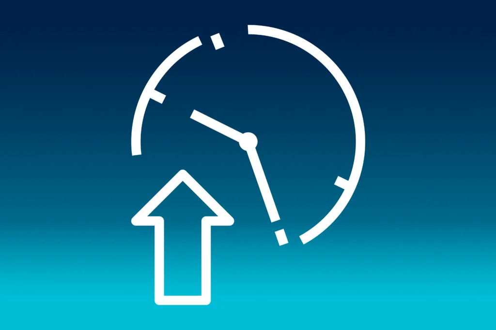
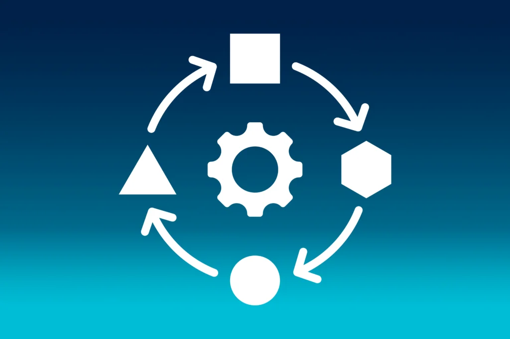
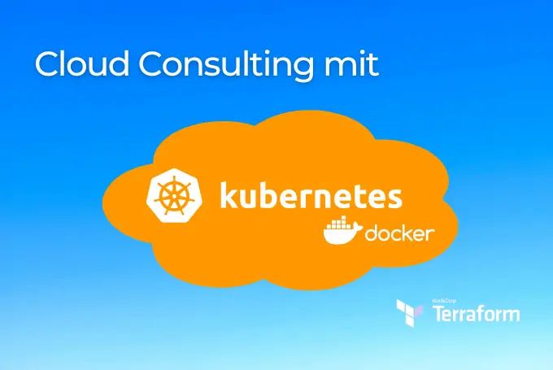
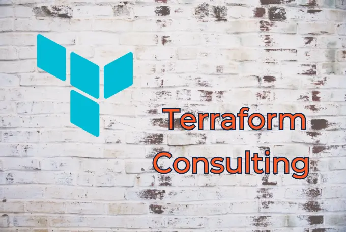

## Kafka und OpenAI sind die Zukunft der Datenanalyse

In diesem Artikel untersuche ich die Bedeutung von Echtzeit-Künstlicher Intelligenz (KI) - ermöglicht durch das Zusammenspiel von Apache Kafka und OpenAI - bei der Neugestaltung der Datenanalyse. Die Integration der Data-Streaming-Fähigkeiten von Apache Kafka in die fortschrittlichen maschinellen Lernmodelle von OpenAI erschließt das Potenzial für Echtzeit-Entscheidungsfindung in verschiedenen Branchen. Wie kann die Zukunft aussehen, in der Echtzeit-Datenanalyse zu den selbstverständlichen Werkzeugen von Unternehmen gehört?

### Wie Echtzeit-Dateneingabe die KI verbessern kann

Echtzeitdaten aus Kafka können KI-Systeme erheblich verbessern, indem sie ihnen die aktuellsten Informationen und den Kontext zur Verfügung stellen, so dass sie genauere, relevantere und zeitgerechtere Ergebnisse liefern können. Lassen wir uns die genannten Vorteile näher betrachten.

**Frische Informationen:** OpenAI ist ein leistungsfähiges Analysewerkzeug. Es ist jedoch allgemein bekannt, dass die Daten, auf denen das Modell größtenteils basiert, aus der Zeit vor Januar 2022 stammen. In bestimmten Szenarien schränkt dies nicht nur das Potenzial des Modells erheblich ein, sondern kann für die Kunden auch inakzeptabel sein. Das Verpassen von Trends in den sozialen Medien oder der neuesten Nachrichten aufgrund veralteter Daten kann dramatische Auswirkungen haben, insbesondere auf die Aktienmärkte. Zum Beispiel kann ein Tweet von Elon Musk Aktienkurse in neue Höhen oder in den Keller treiben, bei ihm weiß man nie!

 

**Kontextuelles Verständnis:** Statische Daten geben uns das Verständnis einer bestimmten Situation zu einem bestimmten Zeitpunkt. Aber sie schränken unseren Handlungsspielraum erheblich ein. Das erste, was einem in den Sinn kommt, sind Chatbots. Denn ohne Kontext können sie die meisten Fragen nicht beantworten und leiten die Anfragen an Menschen weiter. Die ständig verfügbaren Botshelfer sind also in gewisser Weise blockiert. Glücklicherweise dient Kafka auch als Datenspeicher, der auf Anfrage sofort relevante Kundendaten liefern kann. Zusammen mit Open AI können daraus die passenden Antworten generiert werden.

**Dynamische Anpassung:** KI-Modelle können sich an veränderte Umstände anpassen, wenn Daten in Echtzeit eingegeben werden. Zeigt die Dateneingabe eine plötzliche Veränderung oder Anomalie, kann die KI ihr Verhalten oder ihre Vorhersagen entsprechend anpassen. Beispielsweise können im Bereich der vorbeugenden Wartung Echtzeit-Sensordaten Wartungsalarme auslösen, die auf unmittelbaren Veränderungen im Geräteverhalten beruhen.

## Warum Apache Kafka die optimale Datenplattform für KI Anwendungen ist?

1. **Echtzeit-Datenabruf:** Kafka ist als Event-Streaming-Plattform konzipiert, die große Datenmengen verteilt speichert und macht es so einfach, Daten für die Verwendung in KI-Algorithmen in Echtzeit abzurufen. Dies ist entscheidend für KI-Anwendungen, die für präzise Aussagen aktuelle Informationen benötigen.

2. **Skalierbarkeit:** Kafka wurde von Anfang an auf hohe Skalierbarkeit ausgelegt. KI-Anwendungen erzeugen oft große Datenmengen und erfordern eine Plattform, die mit ihrem Wachstum Schritt halten kann.

3. **Integration:** Dank standardisierter Schnittstellen und der Connect API kann Kafka einfach in eine Vielzahl von KI-Frameworks und -Tools integriert werden. Dies ermöglicht die nahtlose Eingabe von Daten aus Kafka in KI-Modelle und die Rückgabe von Ergebnissen.

Insgesamt erfüllt Kafka die Anforderungen an eine Plattform für eine robuste und zuverlässige Datenquelle für moderne KI-Anwendungen.

## Warum OpenAI anstelle herkömmlicher Datenanalysetools verwenden?

1. **Fortgeschrittene maschinelle Lernalgorithmen:** OpenAI ist eines der führenden Unternehmen in der Branche und beherrscht KI-Modelle mit hoch entwickelten Algorithmen. Diese sind darauf ausgelegt, aus großen Datenmengen zu lernen und präzise Vorhersagen, Klassifikationen und Empfehlungen zu treffen.

2. **Flexibilität:** OpenAI ist sehr flexibel und kann mit anderen Werkzeugen und Plattformen integriert werden. Das bedeutet, dass es zur Erweiterung bestehender Datenanalysetools oder als eigenständige Lösung eingesetzt werden kann.

3. **Skalierbarkeit:** OpenAI ist darauf ausgelegt, hoch skalierbar zu sein und somit große Datenmengen zu verarbeiten und komplexe Berechnungen in Echtzeit durchzuführen.

4. **Automatisierung:** OpenAI automatisiert viele der mit der Datenanalyse verbundenen Aufgaben wie Datenvorverarbeitung, Merkmalsauswahl und Modellauswahl. Dies spart Zeit und reduziert den Bedarf an menschlichen Eingriffen.

5. **Innovation:** OpenAI steht an der Spitze der Innovation im Bereich der künstlichen Intelligenz. Sie entwickelt ständig neue Algorithmen und Techniken, um die Genauigkeit und Effizienz ihrer Modelle zu verbessern.

## Wie ist das zu implementieren?

Das folgende Java-Codebeispiel zeigt die mögliche Verwendung von Spring Boot in Verbindung mit Avro Serialization und Confluent Schema Registry. Wenn ein Avro serialisiertes Ereignis ausgelöst wird, wird eine Nachricht an OpenAI gesendet und somit die Daten sofort zur Analyse bereitgestellt.

In diesem Beispiel nehmen wir an, dass ein Avro serialisiertes Kafka Ereignis ein “event” Feld enthält. KafkaAvroDeserializer verbindet sich mit Confluent Schema Refistry, um die Avro Nachrichten mit den Schema Informationen zu deserialisieren.

Außerdem: Vergessen Sie nicht die Avro und Schema Registry Abhängigkeiten in Ihrem Projekt.

## Was bedeutet das für die Industrie?

Der Einsatz von maschinellem Lernen in Verbindung mit Echtzeitdaten hat eine transformierende Wirkung auf Branchen. Es ermöglicht Organisationen, durch die rasche Verarbeitung großer Datenmengen schnelle und fundierte Entscheidungen zu treffen - ein Vorteil in dynamischen Branchen wie dem Finanz-, Gesundheits- und Logistiksektor. Diese Kombination fördert auch hochgradig personalisierte Erfahrungen, indem Inhalte, Dienstleistungen und Produkte an individuelle Präferenzen angepasst werden. Darüber hinaus wird die Automatisierung erleichtert, was zu einer höheren betrieblichen Effizienz, Kosteneinsparungen und der Möglichkeit führt, Humanressourcen für wertvollere Aufgaben einzusetzen. In der Cyber-Sicherheit wird dadurch die Erkennung von Anomalien zur Prävention.

Auch die Industrie profitiert von vorausschauenden Fähigkeiten, insbesondere in den Bereichen Fertigung, Transport und Lieferkette. Maschinelles Lernen kann Geräteausfälle, Wartungsbedarf oder Nachfrageschwankungen auf der Grundlage von Echtzeit-Sensordaten vorhersagen und so dazu beitragen, Ausfallzeiten zu reduzieren, Kosten zu senken und Betriebsabläufe zu optimieren. Im Kundendienst können Chatbots und virtuelle Assistenten sofortige und präzise Antworten auf Anfragen liefern und die Kundenzufriedenheit verbessern.

## Fazit

Weder der Markt für maschinelles Lernen noch der Markt für Datenströme zeigen Anzeichen einer Verlangsamung. Im Gegenteil. Sie werden weiter beschleunigen, innovieren und sich bald eng integrieren.

OpenAI bietet schnell entwickelnde Technologien, die aktuelle Daten erhalten müssen, um den heutigen Erwartungen zu entsprechen. Hierfür eignet sich die schnelle und skalierbare Kafka Technologie mit ihrem hohen Durchsatz sehr gut. Im Zusammenspiel wird KI auf eine neue Stufe gehoben.

## Laszlo Csoti

[_Senior Cloud Architect & Circle Lead Event-Streaming_](https://www.linkedin.com/in/laszlo-csoti-0a386310b/)

## Weitere Beiträge

[ "Blauer Hintergrund auf dem sich der Schriftzug "Cloud Consulting mit" und zentral eine orange Wolke befindet, in der sich wiederum in weiß die Logos von Kubernetes und Docker befinden. Unten rechts auf dem Bild befindet sich noch in weiß das Terraform Logo.")](https://thinkport.digital/cloud-consulting-with-kubernetes-and-docker/)

### [Cloud Consulting with Kubernetes and Docker](https://thinkport.digital/cloud-consulting-with-kubernetes-and-docker/ "Cloud Consulting with Kubernetes and Docker")

[Cloud General](https://thinkport.digital/category/cloud-general/)

### [Cloud Consulting with Kubernetes and Docker](https://thinkport.digital/cloud-consulting-with-kubernetes-and-docker/ "Cloud Consulting with Kubernetes and Docker")

[Cloud General](https://thinkport.digital/category/cloud-general/)

### [Echtzeit-KI: Apache Kafka und OpenAI sind die Zukunft der Datenanalyse](https://thinkport.digital/kafka-und-openai-zukunft-der-datenanalyse/ "Echtzeit-KI: Apache Kafka und OpenAI sind die Zukunft der Datenanalyse")

[Cloud General](https://thinkport.digital/category/cloud-general/), [Disrupt](https://thinkport.digital/category/disrupt/), [Streaming](https://thinkport.digital/category/streaming/)

### [Echtzeit-KI: Apache Kafka und OpenAI sind die Zukunft der Datenanalyse](https://thinkport.digital/kafka-und-openai-zukunft-der-datenanalyse/ "Echtzeit-KI: Apache Kafka und OpenAI sind die Zukunft der Datenanalyse")

[Cloud General](https://thinkport.digital/category/cloud-general/), [Disrupt](https://thinkport.digital/category/disrupt/), [Streaming](https://thinkport.digital/category/streaming/)

### [Apache Airflow](https://thinkport.digital/apache-airflow/ "Apache Airflow")

[Cloud General](https://thinkport.digital/category/cloud-general/), [Hybrid-Cloud](https://thinkport.digital/category/hybrid-cloud/)

### [Apache Airflow](https://thinkport.digital/apache-airflow/ "Apache Airflow")

[Cloud General](https://thinkport.digital/category/cloud-general/), [Hybrid-Cloud](https://thinkport.digital/category/hybrid-cloud/)

[")](https://thinkport.digital/cloud-consulting-for-development/)

### [Cloud Consulting for development](https://thinkport.digital/cloud-consulting-for-development/ "Cloud Consulting for development")

[Cloud General](https://thinkport.digital/category/cloud-general/)

### [Cloud Consulting for development](https://thinkport.digital/cloud-consulting-for-development/ "Cloud Consulting for development")

[Cloud General](https://thinkport.digital/category/cloud-general/)

### [Terraform Consulting in a Multi Cloud Environment](https://thinkport.digital/terraform-consulting-in-a-multi-cloud-environment/ "Terraform Consulting in a Multi Cloud Environment")

[Cloud General](https://thinkport.digital/category/cloud-general/), [IaC](https://thinkport.digital/category/iac/)

### [Terraform Consulting in a Multi Cloud Environment](https://thinkport.digital/terraform-consulting-in-a-multi-cloud-environment/ "Terraform Consulting in a Multi Cloud Environment")

[Cloud General](https://thinkport.digital/category/cloud-general/), [IaC](https://thinkport.digital/category/iac/)

### [Streaming-Services](https://thinkport.digital/streaming-services/ "Streaming-Services")

[Cloud General](https://thinkport.digital/category/cloud-general/), [Streaming](https://thinkport.digital/category/streaming/)

### [Streaming-Services](https://thinkport.digital/streaming-services/ "Streaming-Services")

[Cloud General](https://thinkport.digital/category/cloud-general/), [Streaming](https://thinkport.digital/category/streaming/)
