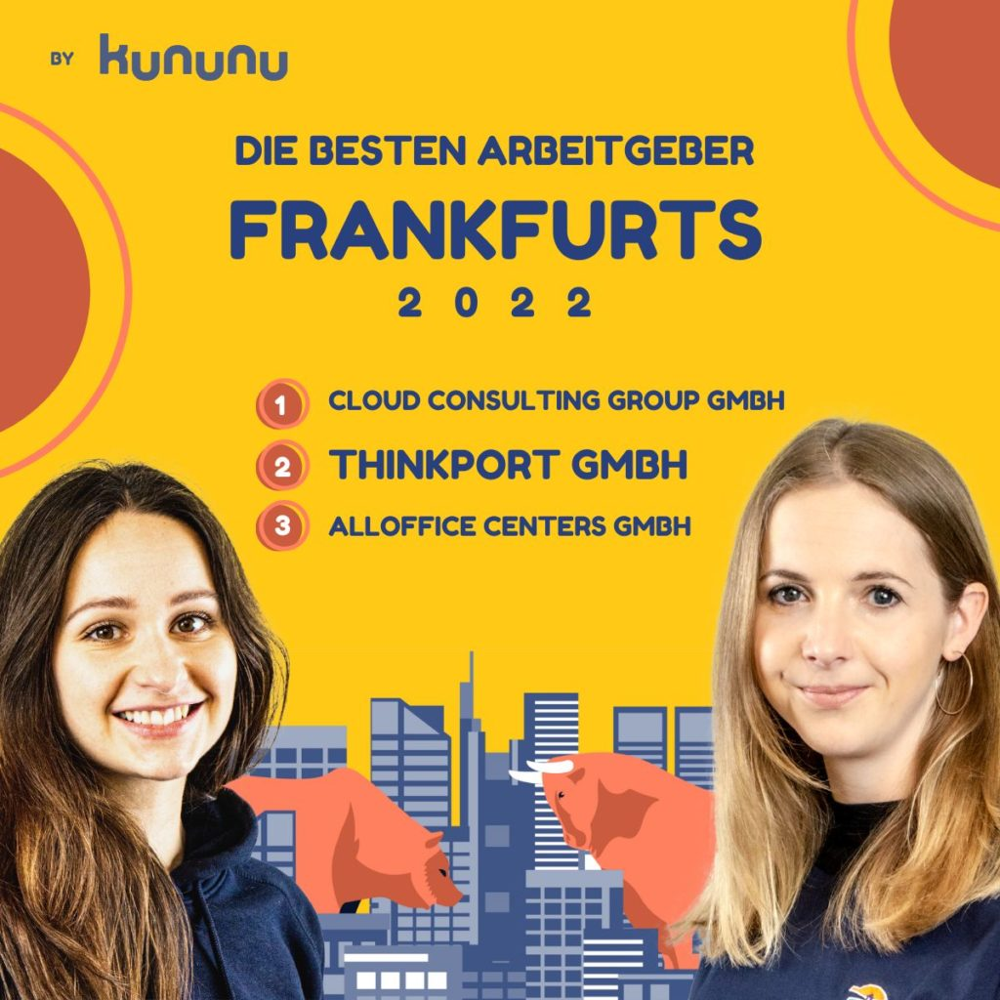

# Kununu 2022 - Beste Arbeitgeber Frankfurts

## Thinkport unter den Top 3 der besten Arbeitgeber in Frankfurt a. M.

Das führende Portal zur Bewertung von Mitarbeiterzufriedenheit kununu hat uns in der Kategorie Mittelstand als zweitbester Arbeitgeber der Finanzmetropole ausgewählt.

## Die Zufriedenheit der Mitarbeiter:innen ist unser höchstes Gut

Wachstumspläne hin oder her - Die Zufriedenheit des Team steht für uns seit Gründung an erster Stelle! Daher freuen wir uns besonders über diese tolle Auszeichnung!

Vielen Dank an unser **HR Team Sabrina Norrenbrock, Janina Heidel, Emilia Gasse** und **Jessica Leese**, welches sich besonders im letzten Jahr um viele neue Benefits und Verbesserungen gekümmert hat!

Der vollständige Artikel inklusive der Auswahlkriterien und ausführlichen Bewertungen befindet sich **[hier](https://lnkd.in/ekqNxC6Y)**.

**[Kununu](https://www.kununu.com/de/info/ueber)** klingt wie eine exotische Frucht, doch dahinter verbirgt sich die mit Abstand größte und bekannteste Arbeitgeber-Bewertungsplattform (nachweislich) im deutschsprachigen Raum. Hier findest Du Insider-Informationen zu über 1.046.000 Arbeitgebern in Deutschland, Österreich und der Schweiz.

## [Weitere Beiträge](https://thinkport.digital/blog)

[')](https://thinkport.digital/how-ai-vr-and-big-data-will-transform-the-real-estate-industry-by-2020/)

### [How AI, VR, and Big Data Will Transform the Real Estate Industry by 2020](https://thinkport.digital/how-ai-vr-and-big-data-will-transform-the-real-estate-industry-by-2020/ 'How AI, VR, and Big Data Will Transform the Real Estate Industry by 2020')

[Big Data](https://thinkport.digital/category/big-data/)

### [How AI, VR, and Big Data Will Transform the Real Estate Industry by 2020](https://thinkport.digital/how-ai-vr-and-big-data-will-transform-the-real-estate-industry-by-2020/ 'How AI, VR, and Big Data Will Transform the Real Estate Industry by 2020')

[Big Data](https://thinkport.digital/category/big-data/)

[')](https://thinkport.digital/9-best-mobile-app-ui-design-trends-in-2018/)

### [9 Best Mobile App UI Design Trends in 2018](https://thinkport.digital/9-best-mobile-app-ui-design-trends-in-2018/ '9 Best Mobile App UI Design Trends in 2018')

[Frontend](https://thinkport.digital/category/frontend/)

### [9 Best Mobile App UI Design Trends in 2018](https://thinkport.digital/9-best-mobile-app-ui-design-trends-in-2018/ '9 Best Mobile App UI Design Trends in 2018')

[Frontend](https://thinkport.digital/category/frontend/)

### [The 6 Most Important Things I have learned in my 6 Months using Server-less](https://thinkport.digital/the-6-most-important-things-i-have-learned-in-my-6-months-using-server-less/ 'The 6 Most Important Things I have learned in my 6 Months using Server-less')

[Big Data](https://thinkport.digital/category/big-data/)

### [The 6 Most Important Things I have learned in my 6 Months using Server-less](https://thinkport.digital/the-6-most-important-things-i-have-learned-in-my-6-months-using-server-less/ 'The 6 Most Important Things I have learned in my 6 Months using Server-less')

[Big Data](https://thinkport.digital/category/big-data/)

### [Testdaten generieren mithilfe von Openmaps](https://thinkport.digital/testdaten-generieren-mithilfe-von-openmaps/ 'Testdaten generieren mithilfe von Openmaps')

[AWS Cloud](https://thinkport.digital/category/aws-cloud/)

### [Testdaten generieren mithilfe von Openmaps](https://thinkport.digital/testdaten-generieren-mithilfe-von-openmaps/ 'Testdaten generieren mithilfe von Openmaps')

[AWS Cloud](https://thinkport.digital/category/aws-cloud/)

### [10 Big Data Trends to watch in 2018](https://thinkport.digital/10-big-data-trends-to-watch-in-2018/ '10 Big Data Trends to watch in 2018')

[Big Data](https://thinkport.digital/category/big-data/)

### [10 Big Data Trends to watch in 2018](https://thinkport.digital/10-big-data-trends-to-watch-in-2018/ '10 Big Data Trends to watch in 2018')

[Big Data](https://thinkport.digital/category/big-data/)

### [7 Golden Rules for Creating Great UI](https://thinkport.digital/7-golden-rules-for-creating-great-ui/ '7 Golden Rules for Creating Great UI')

[Frontend](https://thinkport.digital/category/frontend/)

### [7 Golden Rules for Creating Great UI](https://thinkport.digital/7-golden-rules-for-creating-great-ui/ '7 Golden Rules for Creating Great UI')

[Frontend](https://thinkport.digital/category/frontend/)

## Blog Kurator

Christina Friede

Business Development

Email:

[cfriede@thinkport.digital](mailto:cfriede@thinkport.digital)

-  
