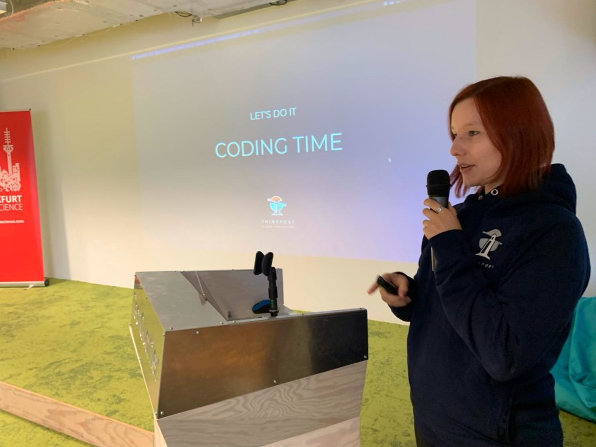

# Masterclass für Data Scientists

NEWS Workshops

 Share on facebook Share on twitter Share on linkedin Share on pinterest Share on email

Masterclass for Data Science Teams

Our CEO Tobias Drechsel and our team members Birthe Höllthaler gave a master class to data science teams in Frankfurt. Within just an hour participants learned how to set up serverless data pipelines which can be used for prototypes and real enterprise projects. Participants were given a real life example so they could process image data in AWS Lambda and S3 projects. 

The event was organized by [Frankfurt Data Science](https://www.linkedin.com/company/ffm-datascience/) and hosted by the innovation hub of Frankfurt, the [TechQuartier](https://techquartier.com/). 

Do you want to be part of our future events or organize one with us? Contact us [here](mailto:bvladi@thinkport.digital). 

Weitere Neuigkeiten

## News Writer

### Christina Friede

### Business Development

## Email:

## [cfriede@thinkport.digital](mailto:cfriede@thinkport.digital)

- 
