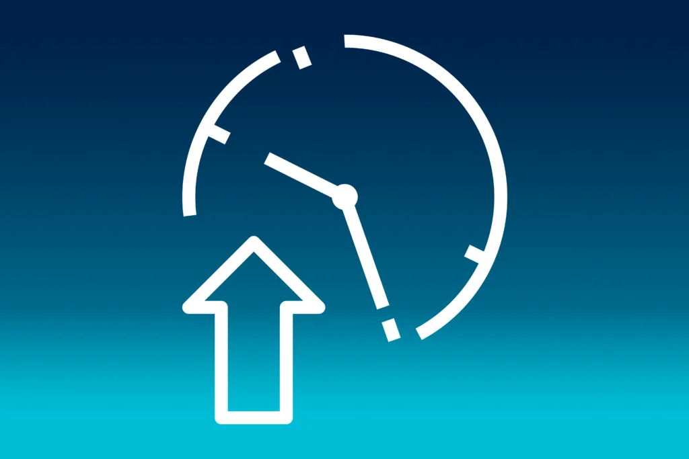
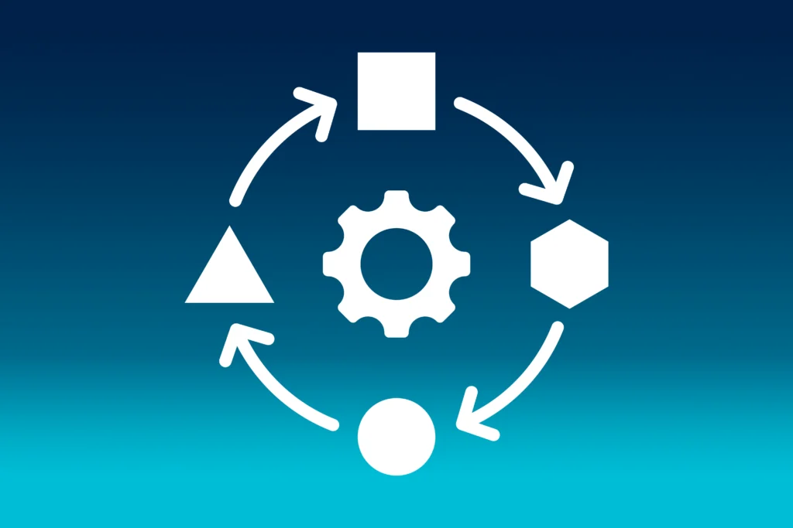
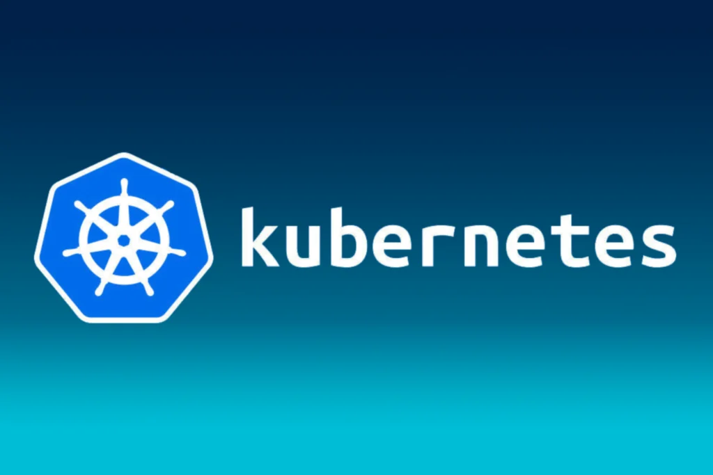

# Nomad vs Kubernetes

Stärken und Anwendungsbereiche

Nomad von HashiCorp ist eine Open-Source-Orchestrierungsplattform, die die Verwaltung von Container-Workloads und nicht-containerisierten Anwendungen in Rechenzentren ermöglicht. Im Vergleich zu Kubernetes weist Nomad einige einzigartige Stärken und Anwendungsbereiche auf. Mit seiner deklarativen Konfiguration und nahtlosen Integration in das HashiCorp-Ökosystem bietet Nomad eine effiziente Lösung für die Bereitstellung und Verwaltung von Anwendungen. Unternehmen können von den Vorteilen der Container-Orchestrierung profitieren, ohne dabei bestehende Infrastrukturen zu gefährden.

## 1\. Was ist Nomad?

Nomad ist eine Open-Source-Plattform von HashiCorp, die zur Verwaltung und Orchestrierung von Container-Workloads und nicht-containerisierten Anwendungen in einer Rechenzentrumsumgebung entwickelt wurde.

### Flexible Unterstützung für Container und

Nicht-Container-Anwendungen

Nomad wurde entwickelt, um die Komplexität der Verwaltung von Anwendungen und Workloads in Rechenzentren zu reduzieren. Die Plattform bietet die einzigartige Fähigkeit, sowohl Container- als auch nicht-containerisierte Anwendungen zu unterstützen.

### Deklarative Konfiguration für Automatisierung und Wiederholbarkeit

Nomad bietet eine deklarative Konfiguration, die es den Benutzern ermöglicht, Anwendungen und Workloads in einfachen Konfigurationsdateien zu beschreiben. Dies erleichtert die Automatisierung und Wiederholbarkeit der Bereitstellungsprozesse erheblich.

 

### Skalierbarkeit für Anwendungen jeder Größe

Eine weitere zentrale Stärke von Nomad ist die Skalierbarkeit. Die Plattform kann problemlos Tausende von Jobs in einem Cluster verwalten und ermöglicht es Unternehmen, ihre Anwendungen dynamisch zu skalieren und Ressourcen effizient zu nutzen.

### Integration in HashiCorp-Ökosystem

Nomad integriert sich nahtlos in andere HashiCorp-Tools wie Consul und Vault, um erweiterte Funktionen für Netzwerk- und Sicherheitsmanagement bereitzustellen. Mit Consul können Benutzer Dienste und Netzwerkkonfigurationen automatisch entdecken und verwalten, während Vault die sichere Verwaltung von Geheimnissen und Zugriffskontrollen ermöglicht.

### Einfache Bedienung und Überwachung

Die Bedienung von Nomad ist einfach und benutzerfreundlich, mit einer Befehlszeilenschnittstelle und einer webbasierten Benutzeroberfläche. Nomad bietet umfangreiche Logging- und Überwachungsfunktionen, um die Leistung von Anwendungen zu überwachen und Probleme schnell zu identifizieren.

### Flexibilität bei Betriebssystemen und Cloud-Plattformen

Nomad bietet Flexibilität bei der Auswahl der Betriebssysteme und Cloud-Plattformen. Die Plattform kann auf verschiedenen Betriebssystemen ausgeführt werden und unterstützt die Bereitstellung in verschiedenen Cloud-Umgebungen sowie in On-Premises-Rechenzentre

### Zwischen-Fazit Nomad

Insgesamt ist Nomad eine umfassende Lösung für die Bereitstellung und Verwaltung von Anwendungen in modernen Rechenzentren. Mit seiner Unterstützung für Container- und nicht-containerisierte Anwendungen, seiner Skalierbarkeit, deklarativen Konfiguration und Integration in andere HashiCorp-Tools ist Nomad eine leistungsstarke Plattform, die es Unternehmen ermöglicht, ihre Anwendungen effizient und zuverlässig bereitzustellen und zu verwalten. Durch die Nutzung von Nomad können Unternehmen die Vorteile der Container-Orchestrierung nutzen und gleichzeitig ihre bestehenden Anwendungen und Infrastrukturen schützen.

## 2\. Was ist Kubernetes?

Kubernetes ist die marktführende Open-Source-Plattform für die Automatisierung, Bereitstellung und Skalierung von Anwendungen in Containerumgebungen. Es ermöglicht die effiziente Verwaltung von Containeranwendungen, wodurch Entwickler und IT-Teams flexibler und skalierbarer arbeiten können. Kubernetes bietet Funktionen wie automatische Lastverteilung, Selbstheilung und Deklarativität für die Orchestrierung von Containerdiensten.

## 3\. Wie schneidet Nomad versus Kubernetes ab?

1.   **Unkompliziert:** Nomad ist bekannt für seine Benutzerfreundlichkeit und einfache Konfiguration. Die Bereitstellung von Anwendungen und Workloads erfordert weniger komplexe Konfigurationsschritte im Vergleich zu Kubernetes.
2.  **Ressourcenschonend:** Nomad ist ressourcenschonender in Bezug auf den Speicherbedarf und den CPU-Verbrauch im Vergleich zu Kubernetes. Dies macht es geeignet für Umgebungen mit begrenzten Ressourcen.
3.  **Skalierbar:** Beide Plattformen sind skalierbar. Aber Nomad zeichnet sich durch seine einfachere Skalierbarkeit aus. Es kann problemlos Tausende von Jobs in einem Cluster verwalten, was es ideal für Unternehmen mit dynamischen Anforderungen macht.
4.  **Nutzt kein Yaml:** Im Gegensatz zu Kubernetes verwendet Nomad keine YAML-Konfigurationsdateien. Stattdessen setzt Nomad auf eine deklarative Konfiguration, die in einfachen Konfigurationsdateien verfasst wird. Dies kann die Hürde für viele Benutzer senken, die sich nicht mit YAML auskennen.
5.  **Niederschwellig zugänglich:** Nomad bietet eine niederschwelligere Einstiegsmöglichkeit für Unternehmen und Entwickler, die Container-Orchestrierung nutzen möchten, ohne tiefgehende Kubernetes-Kenntnisse zu benötigen.
6.  **Preismodell:** Nomad bietet ein Preismodell mit kostenloser Nutzung und optionaler Enterprise-Lösung. So ermöglicht Hashicorp die Auswahl des für ihre Bedürfnisse am besten geeigneten Modells, während Kubernetes in der Regel eine umfangreiche Konfiguration und Management-Ressourcen erfordert.

Insgesamt bietet Nomad erstaunlich vorteilhafte Lösungen für die Container-Orchestrierung. Jedoch mit zum Teil unterschiedlichen Schwerpunkten und Anwendungsbereichen. Die Wahl zwischen den beiden hängt letztendlich von den spezifischen Anforderungen und den vorhandenen Ressourcen ab.

## Keith Schuijlenburg

_Senior Cloud Architect & Circle Lead Azure_

## [Weitere Beiträge](https://thinkport.digital/blog)

### [Azure Databricks](https://thinkport.digital/azure-databricks/ 'Azure Databricks')

[Azure Cloud](https://thinkport.digital/category/azure-cloud/), [Cloud General](https://thinkport.digital/category/cloud-general/)

### [Azure Databricks](https://thinkport.digital/azure-databricks/ 'Azure Databricks')

[Azure Cloud](https://thinkport.digital/category/azure-cloud/), [Cloud General](https://thinkport.digital/category/cloud-general/)

### [Kafka Streams](https://thinkport.digital/kafka-streams/ 'Kafka Streams')

[Cloud General](https://thinkport.digital/category/cloud-general/), [Streaming](https://thinkport.digital/category/streaming/)

### [Kafka Streams](https://thinkport.digital/kafka-streams/ 'Kafka Streams')

[Cloud General](https://thinkport.digital/category/cloud-general/), [Streaming](https://thinkport.digital/category/streaming/)

### [Optimizing Kafka](https://thinkport.digital/optimizing-kafka/ 'Optimizing Kafka')

[Cloud General](https://thinkport.digital/category/cloud-general/), [Streaming](https://thinkport.digital/category/streaming/)

### [Optimizing Kafka](https://thinkport.digital/optimizing-kafka/ 'Optimizing Kafka')

[Cloud General](https://thinkport.digital/category/cloud-general/), [Streaming](https://thinkport.digital/category/streaming/)

### [Cloud Consulting with Kubernetes and Docker](https://thinkport.digital/cloud-consulting-with-kubernetes-and-docker/ 'Cloud Consulting with Kubernetes and Docker')

[Cloud General](https://thinkport.digital/category/cloud-general/)

### [Cloud Consulting with Kubernetes and Docker](https://thinkport.digital/cloud-consulting-with-kubernetes-and-docker/ 'Cloud Consulting with Kubernetes and Docker')

[Cloud General](https://thinkport.digital/category/cloud-general/)

### [Modernisierung ist ein Kontinuum](https://thinkport.digital/modernisierung-ist-ein-kontinuum/ 'Modernisierung ist ein Kontinuum')

[Cloud General](https://thinkport.digital/category/cloud-general/), [Cloud Kubernetes](https://thinkport.digital/category/cloud-kubernetes/)

### [Modernisierung ist ein Kontinuum](https://thinkport.digital/modernisierung-ist-ein-kontinuum/ 'Modernisierung ist ein Kontinuum')

[Cloud General](https://thinkport.digital/category/cloud-general/), [Cloud Kubernetes](https://thinkport.digital/category/cloud-kubernetes/)

### [Terraform Consulting in a Multi Cloud Environment](https://thinkport.digital/terraform-consulting-in-a-multi-cloud-environment/ 'Terraform Consulting in a Multi Cloud Environment')

[Cloud General](https://thinkport.digital/category/cloud-general/), [IaC](https://thinkport.digital/category/iac/)

### [Terraform Consulting in a Multi Cloud Environment](https://thinkport.digital/terraform-consulting-in-a-multi-cloud-environment/ 'Terraform Consulting in a Multi Cloud Environment')

[Cloud General](https://thinkport.digital/category/cloud-general/), [IaC](https://thinkport.digital/category/iac/)
