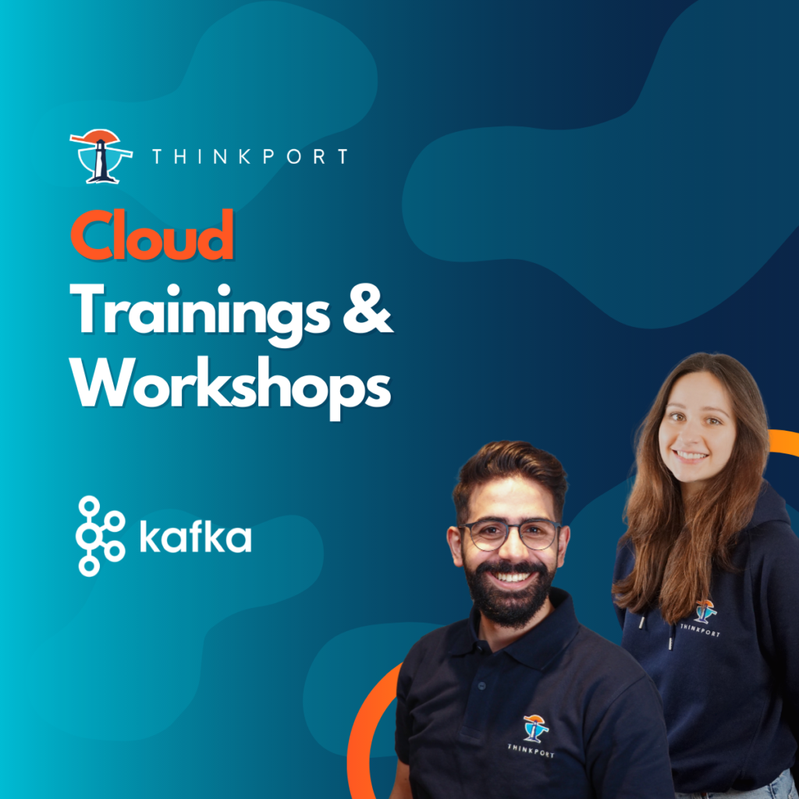

 

# Optimizing Kafka on AWS, Azure and  

a complex cloud environment

As professional cloud consultants, we often recommend Apache Kafka as a scalable, high-throughput messaging system for real-time data streaming applications. When optimizing Apache Kafka in the cloud, there are a few best practices that organizations can follow. These include:

* Properly setting up the Kafka cluster
* Sizing the Kafka cluster based on the data volume and throughput requirements
* Monitoring and tuning the Kafka system to ensure optimal performance
* Implementing backup and recovery measures to prevent data loss
* Choosing the right cloud provider based on pricing and features
* Evaluating the cost implications and potential cost optimization strategies, such as using reserved instances or integrating with cost-effective storage solutions

## Setting up a cluster on AWS

Setting up a Kafka cluster typically involves the following steps:

* Provisioning the necessary resources such as compute and storage
* Installing and configuring the Kafka software on the provisioned resources
* Setting up the necessary networking and security infrastructure
* Loading data into the Kafka cluster

First, it's important to consider the cloud provider. Both AWS and Azure offer managed Kafka services, but they differ in terms of pricing and features. For example, AWS MSK allows for seamless scaling and integrates with other AWS services like S3 and Lambda, while Azure HDInsight offers the option to deploy on Azure Virtual Machines for more control. Additionally, AWS MSK offers integrations with popular streaming platforms like Kinesis and Elasticsearch, while Azure HDInsight integrates with Azure Stream Analytics and Azure Functions.  
  
To give a practical example of setting up a Kafka cluster on AWS, an organization can use the AWS Management Console to create an MSK cluster with just a few clicks. They can then specify the desired number of broker nodes, the instance type and storage capacity for each node, and the desired configuration options such as encryption and backup. The MSK service will automatically set up and manage the Kafka cluster, including software installation, patching, and maintenance.

## Setting up a cluster on Azure

On Azure, an organization can set up an HDInsight Kafka cluster using the Azure portal or Azure Resource Manager templates. They can choose from a variety of options such as the number of broker nodes, the instance type and storage capacity for each node, and the desired configuration options. The HDInsight service will then set up and manage the Kafka cluster, including software installation and patching.

## Sizing the cluster

Next, it's essential to properly size your Kafka cluster to handle the incoming data volume and desired throughput. This will help ensure optimal performance and prevent bottlenecks. A common mistake when setting up a Kafka cluster is undersizing the cluster, which can result in high CPU and memory usage, long garbage collection pauses, and other performance issues. On the other hand, oversizing the cluster can result in unnecessary costs.  
  
To determine the optimal cluster size, an organization can start by estimating the data volume and throughput requirements based on the expected number of producers, consumers, and messages per second. They can then use tools like the AWS MSK Cluster Sizing Calculator or the Azure HDInsight Capacity Planning Tool to estimate the number of broker nodes and the instance type required to meet these requirements. It's also important to monitor the Kafka system in production and adjust the cluster size as needed based on actual usage.

## Terms of pricing

AWS MSK follows a pay-as-you-go model, which charges based on the number of broker nodes and the amount of data processed. For example, a 3-node MSK cluster with m5.large instances and 10GB of storage per node would cost approximately $0.65 per hour in the US East (N. Virginia) region, plus additional charges for data processing and data transfer. Azure HDInsight, on the other hand, offers a choice between pay-as-you-go or reserved instances, with the latter offering discounted rates for long-term commitments. For example, a 3-node HDInsight Kafka cluster with D14v2 instances and 100GB of storage per node would cost approximately $1.04 per hour in the US East (East US 2) region, plus additional charges for data processing and data transfer.

## Optimizing Kafka in a more complex cloud environment

Optimizing Apache Kafka in a multi-cloud or hybrid cloud environment requires careful planning and coordination to ensure consistency and avoid conflicts. In a multi-cloud scenario, an organization may choose to use multiple cloud providers for various reasons, such as to diversify risk, to access a wider range of services and features, or to optimize cost. In this case, it's important to carefully plan and coordinate the deployment of Kafka and other systems across the different providers.  
  
One way to do this is to implement a unified management and monitoring system that spans across the different providers. This can help ensure consistent visibility and control over the Kafka clusters and other systems, regardless of where they are deployed. It can also help facilitate coordination and communication between the providers, which is essential for seamless data transfer and integration.  
  
Another important consideration in a **multi-cloud** scenario is data transfer and communication between the providers. This may involve implementing a consistent security and compliance framework to ensure the confidentiality, integrity, and availability of the data. It may also involve establishing protocols for data transfer and communication, such as using secure and reliable networking technologies and standards.  
  
In a **hybrid cloud** scenario, an organization may use a cloud provider in combination with an on-premises IT infrastructure. This can provide the benefits of the cloud such as scalability and flexibility, while still allowing the organization to retain control over certain sensitive or critical workloads. In this case, it's important to carefully plan and coordinate the integration of Kafka and other systems between the cloud and on-premises environments.  
  
One way to do this is to implement a consistent security and compliance framework that spans across the cloud and on-premises environments. This can help ensure that the Kafka clusters and other systems are secured and compliant, regardless of where they are deployed. It can also help facilitate coordination and communication between the environments, which is essential for seamless data transfer and integration.  
  
Another important consideration in a hybrid cloud scenario is data transfer and communication between the cloud and on-premises environments. This may involve implementing technologies and protocols that enable secure and reliable data transfer and communication, such as using a hybrid networking architecture and standards-based protocols.  
  
Overall, optimizing Apache Kafka in a multi-cloud or hybrid cloud environment requires careful planning and coordination to ensure consistency, security, and compliance. By implementing a unified management and monitoring system and establishing protocols for data transfer and communication, organizations can leverage the power of Kafka to stream and process real-time data at scale across multiple cloud and on-premises environments.  
  
As pointed out, there are potential challenges and risks to consider when using Apache Kafka in the cloud. One challenge is the complexity of setting up and maintaining a Kafka cluster, which requires a certain level of technical expertise. There is also the risk of data loss if the Kafka system experiences failures or outages, so it's important to implement proper backup and recovery measures. Additionally, running Kafka in the cloud can potentially incur higher costs compared to an on-premises setup, especially if the data volume is high.

(created using Thinkport expert knowledge and artificial intelligence)

Do you have further questions about Kafka optimization or need a training seminar for yourself or your colleagues? Thinkport is happy to share its best practise knowledge in a 1-day training **[here](https://thinkport.digital/fortgeschrittene-kafka-optimierung/)** or with Apache Kafka Consulting **[here](https://thinkport.digital/cloud-consulting-fuer-deutsche-grossunternehmen/apache-kafka/)** .

## Weitere Artikel

## [Weitere Beiträge](https://thinkport.digital/blog)

### [Hybrid-Cloud-Manifest](https://thinkport.digital/hybrid-cloud-manifest/ "Hybrid-Cloud-Manifest")

[Cloud General](https://thinkport.digital/category/cloud-general/), [Hybrid-Cloud](https://thinkport.digital/category/hybrid-cloud/)

### [Hybrid-Cloud-Manifest](https://thinkport.digital/hybrid-cloud-manifest/ "Hybrid-Cloud-Manifest")

[Cloud General](https://thinkport.digital/category/cloud-general/), [Hybrid-Cloud](https://thinkport.digital/category/hybrid-cloud/)

### [Sustainability of the Cloud](https://thinkport.digital/sustainability-of-the-cloud/ "Sustainability of the Cloud")

[Cloud General](https://thinkport.digital/category/cloud-general/)

### [Sustainability of the Cloud](https://thinkport.digital/sustainability-of-the-cloud/ "Sustainability of the Cloud")

[Cloud General](https://thinkport.digital/category/cloud-general/)

### [Cloud Consulting for Migration to the Cloud](https://thinkport.digital/cloud-consulting-for-migration-to-the-cloud/ "Cloud Consulting for Migration to the Cloud")

[Cloud General](https://thinkport.digital/category/cloud-general/)

### [Cloud Consulting for Migration to the Cloud](https://thinkport.digital/cloud-consulting-for-migration-to-the-cloud/ "Cloud Consulting for Migration to the Cloud")

[Cloud General](https://thinkport.digital/category/cloud-general/)

### [Kafka Event-Streaming](https://thinkport.digital/kafka-event-streaming/ "Kafka Event-Streaming")

[Cloud General](https://thinkport.digital/category/cloud-general/), [Streaming](https://thinkport.digital/category/streaming/)

### [Kafka Event-Streaming](https://thinkport.digital/kafka-event-streaming/ "Kafka Event-Streaming")

[Cloud General](https://thinkport.digital/category/cloud-general/), [Streaming](https://thinkport.digital/category/streaming/)

### [Azure Databricks](https://thinkport.digital/azure-databricks/ "Azure Databricks")

[Azure Cloud](https://thinkport.digital/category/azure-cloud/), [Cloud General](https://thinkport.digital/category/cloud-general/)

### [Azure Databricks](https://thinkport.digital/azure-databricks/ "Azure Databricks")

[Azure Cloud](https://thinkport.digital/category/azure-cloud/), [Cloud General](https://thinkport.digital/category/cloud-general/)

### [Terraform Consulting in a Multi Cloud Environment](https://thinkport.digital/terraform-consulting-in-a-multi-cloud-environment/ "Terraform Consulting in a Multi Cloud Environment")

[Cloud General](https://thinkport.digital/category/cloud-general/)

### [Terraform Consulting in a Multi Cloud Environment](https://thinkport.digital/terraform-consulting-in-a-multi-cloud-environment/ "Terraform Consulting in a Multi Cloud Environment")

[Cloud General](https://thinkport.digital/category/cloud-general/)
