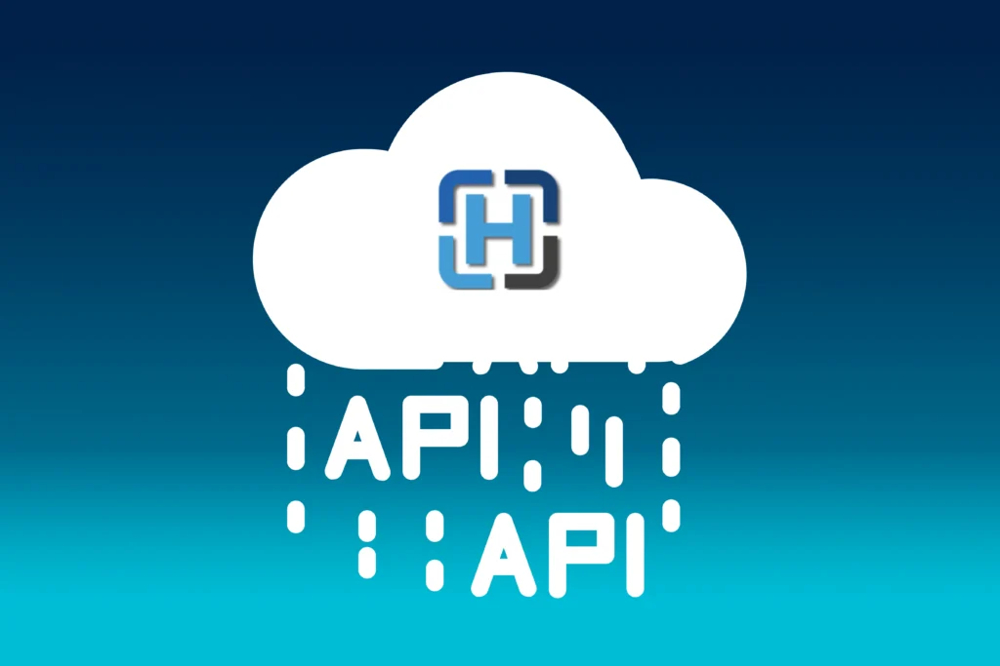
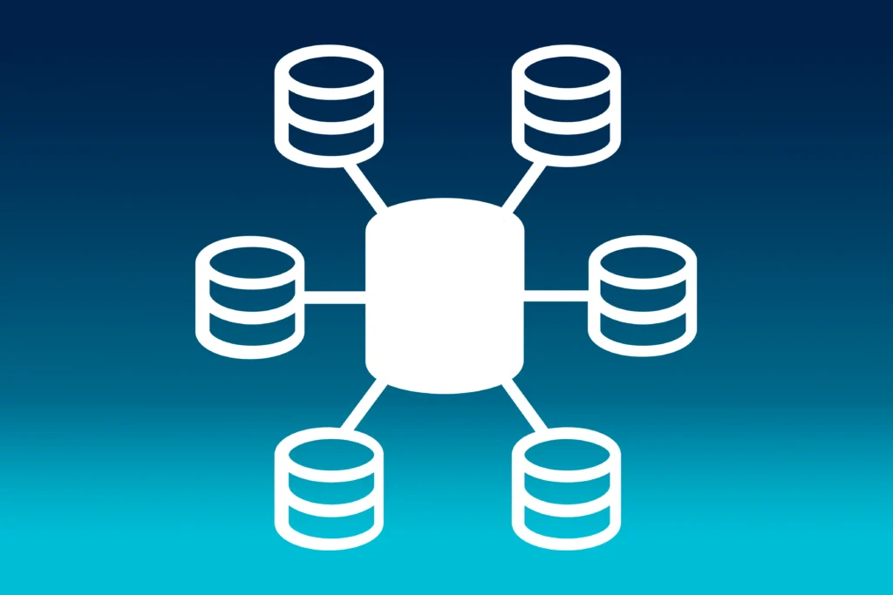
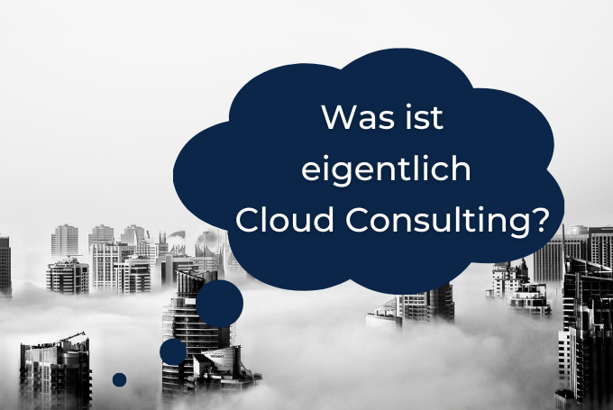

## Orthanc und Kubernetes - Sichere On-Premise- und Multicloud-Lösung

Die Bewahrung sensibler medizinischer Daten vor Ort (on-premise) gewinnt zunehmend an Bedeutung, besonders im Gesundheitswesen und in der Forschung. Orthanc, eine leichte und autonome Softwarelösung, hebt sich in diesem Bereich hervor, indem sie Datenschutz und Effizienz im Umgang mit DICOM-Daten vereint. Ihre Integration in Technologien wie Kubernetes zeigt beispielhaft, wie moderne IT-Strategien eine sichere und skalierbare Datenhaltung ermöglichen können. Korthweb, ein innovatives Projekt, demonstriert das Potential von Orthanc in Kubernetes-Umgebungen und eröffnet neue Wege für On-Premise-Anwendungen und Multi Cloud.

### On-Premise-Lösungen

Der sichere Hafen für Daten​

Die Bewahrung sensibler medizinischer Daten vor Ort (on-premise) bietet eine solide Lösung, um die Datenschutzanforderungen zu erfüllen. Orthanc ermöglicht dies durch seine leichtgewichtige und eigenständige Architektur, die die Einfachheit und Effizienz im DICOM-Datenmanagement betont. Durch die Integration von Technologien wie Kubernetes kann Orthanc effektiv implementiert werden, wobei Projekte wie Korthweb den Weg für eine on-premise-Nutzung ebnen. Diese Strategie ermöglicht es, mit der eskalierenden Flut von Bilddaten umzugehen, und gewährleistet gleichzeitig eine sichere Datenhaltung.

 

## Einfluss der REST API

Orthanc's RESTful API ist ein Schlüsselmerkmal, das es ermöglicht, dass verschiedene Systeme und Anwendungen leicht mit DICOM-Daten interagieren können. Dies erleichtert die Integration und das Training von Machine-Learning-Modellen direkt in einer on-premise-Umgebung, und gewährleistet, dass sensible Daten sicher und geschützt bleiben.

## Multicloud und Flexibilität

Die Verwendung von Orthanc geht über den on-premise-Ansatz hinaus. Unter Beachtung der Datenschutzanforderungen kann Orthanc auch in Cloud-Umgebungen eingesetzt werden.

Die Multi-Cloud-Strategie, ermöglicht durch die Flexibilität von Kubernetes, öffnet Türen für eine erhöhte Anpassungsfähigkeit und Resilienz in der DICOM-Datenverwaltung. Ob in der AWS-Cloud, Azure oder on-premise, Orthanc kann nahtlos integriert werden, um einen koherenten und sicheren Datenfluss zu gewährleisten, der den strengen Anforderungen der medizinischen Datenverarbeitung gerecht wird.

Dies erlaubt die nahtlose Nutzung verschiedener Public Cloud-Anbieter wie Azure oder Google Cloud, um die operativen Möglichkeiten und die Widerstandsfähigkeit des Systems zu erweitern.

## Korthweb: Effizientes Kubernetes-Deployment von Orthanc

Korthweb stellt eine innovative Lösung dar, um Orthanc, eine Open-Source-Anwendung zum Verarbeiten, Speichern, Anzeigen und Verteilen medizinischer Bilder, effektiv auf Kubernetes zu deployen. Als Schwesterprojekt von Orthweb, das sich auf die Bereitstellung von Orthanc auf AWS konzentriert, fokussiert sich Korthweb auf die Implementierung von Orthanc in Kubernetes-Umgebungen. Dies bietet eine flexible und skalierbare Option für das Management von DICOM-Daten und Web-Workloads.

### Drei Ansätze für eine nahtlose Bereitstellung

Korthweb bietet drei unterschiedliche Ansätze zur Bereitstellung von Orthanc auf Kubernetes, was den Nutzern eine Bandbreite an Optionen je nach ihren spezifischen Anforderungen bietet:

1. **Einführung von Ingress-Optionen**: Die Nutzung von Istio oder Traefik für Ingress ermöglicht die TLS-Terminierung an HTTP- und TCP-Ports. Dies stellt sicher, dass der Datenverkehr sicher und verschlüsselt bleibt.
    

2. **Zertifikatsmanagement und Routing**: Durch den Einsatz des Cert Managers können selbstsignierte Zertifikate bereitgestellt werden. Zudem erleichtert das Traffic Routing mit Istio (Gateway, Virtual Service) die Verwaltung des Datenverkehrs.
    

3. **Erweiterte Sicherheit mit Istio**: Die Installation und Konfiguration von Istio, sowohl über Helm-Charts als auch Istioctl, bietet zusätzliche Sicherheit durch Peer-Authentifizierung, mTLS und Autorisierungsrichtlinien.
    

### Monitoring und Datenbank-Management

Für eine verbesserte Überwachung und Beobachtung werden Add-ons wie Prometheus und Grafana für Istio eingesetzt. Diese Tools bieten tiefe Einblicke in die Performance und das Verhalten der Anwendung. Darüber hinaus ermöglicht die Verwendung des Bitnami Helm-Charts die problemlose Bereitstellung von PostgreSQL, einer robusten Datenbanklösung für Orthanc.

### Eigenständige und Continuous Deployment-Optionen

Benutzer haben die Möglichkeit, eigene Helm-Charts zu erstellen, um Orthanc spezifisch nach ihren Bedürfnissen zu deployen. Zusätzlich unterstützt Korthweb GitOps mit FluxCD, was ein kontinuierliches Deployment ermöglicht und die Aktualisierungen und Wartung der Orthanc-Implementierungen vereinfacht.

Insgesamt bietet Korthweb eine umfassende und benutzerfreundliche Plattform für die Bereitstellung von Orthanc auf Kubernetes, die die Sicherheit, Skalierbarkeit und Effizienz der medizinischen Bildverarbeitung und -speicherung erheblich verbessert.

## Orthanc in Kubernetes (Korthweb)

1. **Skalierbarkeit:**
    

    - Automatische Skalierung von Anwendungen basierend auf der Auslastung.
        

2. **Self-Healing:**
    

    - Automatische Wiederherstellung von fehlerhaften Anwendungen oder Nodes.
        

3. **Load-Balancing:**
    

    - Automatisches Load-Balancing und Distribution des Netzwerkverkehrs auf die Anwendungen.
        

4. **Multicloud- und Hybrid-Cloud-Fähigkeit:**
    

    - Ermöglicht die Ausführung von Workloads über verschiedene Clouds oder in Hybrid-Cloud-Umgebungen.
        

5. **Automatisierung:**
    

    - Automatisiert viele manuelle Prozesse wie Deployment, Skalierung und Betrieb von Anwendungen.
        

6. **Flexibilität:**
    

    - Unterstützung einer Vielzahl von Workloads, einschließlich stateless, stateful und datengesteuerten Anwendungen.
        

7. **Community und Support:**
    

    - Eine aktive Community und breite Unterstützung von Cloud-Anbietern und Software-Anbietern.
        

## Fazit

Die Bewahrung und Verwaltung sensibler medizinischer Daten stellt eine stetige Herausforderung dar, insbesondere angesichts des rasanten Wachstums von Bilddaten im Gesundheitswesen. Orthanc, mit seiner leichten und eigenständigen Architektur, hat sich als eine effektive Lösung für On-Premise-Anwendungen etabliert, indem es Datenschutzanforderungen erfüllt und gleichzeitig die Effizienz im DICOM-Datenmanagement verbessert. Die Integration in Kubernetes verstärkt diese Vorteile, indem sie eine flexible, skalierbare und sichere Umgebung für das Datenmanagement schafft.

## Mario Franke

_Cloud Developer_

## [Weitere Beiträge](https://thinkport.digital/blog)

### [Spark, Databricks, Trino](https://thinkport.digital/spark-databricks-trino/ "Spark, Databricks, Trino")

[Big Data](https://thinkport.digital/category/big-data/), [Cloud General](https://thinkport.digital/category/cloud-general/)

### [Spark, Databricks, Trino](https://thinkport.digital/spark-databricks-trino/ "Spark, Databricks, Trino")

[Big Data](https://thinkport.digital/category/big-data/), [Cloud General](https://thinkport.digital/category/cloud-general/)

### [Nomad vs Kubernetes](https://thinkport.digital/nomad-vs-kubernetes/ "Nomad vs Kubernetes")

[Cloud General](https://thinkport.digital/category/cloud-general/), [Cloud Kubernetes](https://thinkport.digital/category/cloud-kubernetes/)

### [Nomad vs Kubernetes](https://thinkport.digital/nomad-vs-kubernetes/ "Nomad vs Kubernetes")

[Cloud General](https://thinkport.digital/category/cloud-general/), [Cloud Kubernetes](https://thinkport.digital/category/cloud-kubernetes/)

[")](https://thinkport.digital/vom_kafka-cluster_zum_event-mesh/)

### [Vom Kafka Cluster zum Event Mesh](https://thinkport.digital/vom_kafka-cluster_zum_event-mesh/ "Vom Kafka Cluster zum Event Mesh")

[Cloud General](https://thinkport.digital/category/cloud-general/), [Streaming](https://thinkport.digital/category/streaming/)

### [Vom Kafka Cluster zum Event Mesh](https://thinkport.digital/vom_kafka-cluster_zum_event-mesh/ "Vom Kafka Cluster zum Event Mesh")

[Cloud General](https://thinkport.digital/category/cloud-general/), [Streaming](https://thinkport.digital/category/streaming/)

### [Kafka Event-Streaming](https://thinkport.digital/kafka-event-streaming/ "Kafka Event-Streaming")

[Cloud General](https://thinkport.digital/category/cloud-general/), [Streaming](https://thinkport.digital/category/streaming/)

### [Kafka Event-Streaming](https://thinkport.digital/kafka-event-streaming/ "Kafka Event-Streaming")

[Cloud General](https://thinkport.digital/category/cloud-general/), [Streaming](https://thinkport.digital/category/streaming/)

### [Cloud Consulting with Kubernetes and Docker](https://thinkport.digital/cloud-consulting-with-kubernetes-and-docker/ "Cloud Consulting with Kubernetes and Docker")

[Cloud General](https://thinkport.digital/category/cloud-general/)

### [Cloud Consulting with Kubernetes and Docker](https://thinkport.digital/cloud-consulting-with-kubernetes-and-docker/ "Cloud Consulting with Kubernetes and Docker")

[Cloud General](https://thinkport.digital/category/cloud-general/)

### [Was ist Cloud Consulting](https://thinkport.digital/was-ist-cloud-consulting/ "Was ist Cloud Consulting")

[Cloud General](https://thinkport.digital/category/cloud-general/)

### [Was ist Cloud Consulting](https://thinkport.digital/was-ist-cloud-consulting/ "Was ist Cloud Consulting")

[Cloud General](https://thinkport.digital/category/cloud-general/)
