## Typrography in UI Design – cloud frontend

### Practical Tips and Tricks on How to Use Typography in UI Design

#### Introduction

Typography is the most challenging part of the UI Design despite having it in various forms from time immemorial. Owing to its long existence, we have theories, rules, and practices which we must keep up with. This article presents some practical typography tips and tricks to use in your projects.

#### Practical examples instead of theories

I will not dwell much on the theoretical part of typography though it is a fascinating subject. Instead, I will go directly into practice.

#### Consider Your Users

You're not only designing for high resolution but for your users who are your main focus.

One of the most important aspects when it comes to users is the font. Therefore, use a flexible font that offers different weights, special symbols, and one that catches the eye. Good typography is appealing to a reader. Always pay close attention to these aspects.

If you know what makes letters readable, you will have a better overall understanding of which fonts to use for your UI. Let's take a closer look at this!

#### Legibility

Legibility is one of the most crucial parts factors. It refers to the ease with which one can differentiate one letter from another in a particular typeface. It's micro-typography that focus on the typeface, letters, and details. You should note that not all typefaces have been designed with legibility as the core design function. Lack of a distinction between uppercase I and lowercase I is the most common problem. Therefore, avoid doing fonts to prevent illegal issues, especially on small displays.

#### Counters

Counters are the white spaces between letters. For instance in letters "d" "o" "u". Professionals in typography believe that the counters enhance the letter recognition, the better the user.

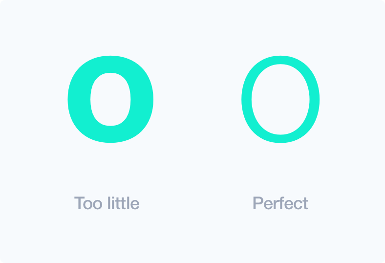

##### X-height

95% of the letters that people read are in lowercase. Larger letter proportions between uppercase and lowercase create a more legible typeface.

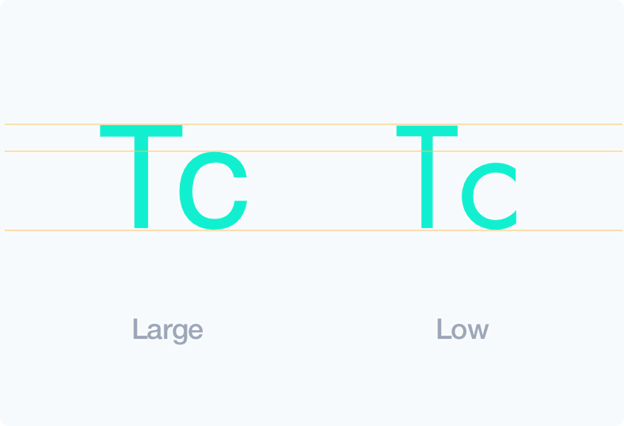

##### Spacing of Letters

There is no definite way to calculate letter spacing, but in most cases, bigger text size requires lesser letter spacing. Always adjust the spacing manually when the typeface appears too open. In UI designs, this applies mostly in writing headers.

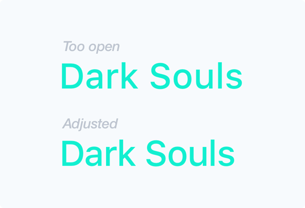

**Weight**

Lighter typefaces are normally more readable than heavier weights. It's related to counters and allows for non-modified character shapes.

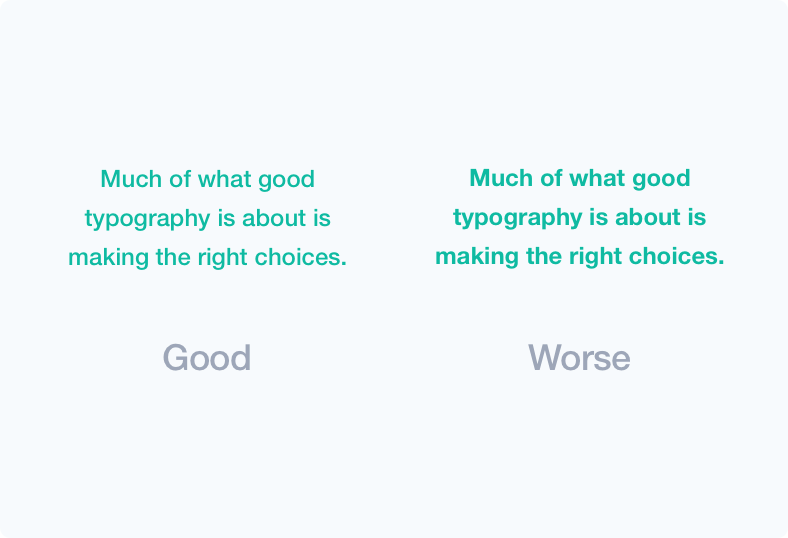

**Wide proportion**

Proportion refers to the width of a character in relation to its height. A wide letter is easier to recognize compared to a condensed one, and this improves legibility.

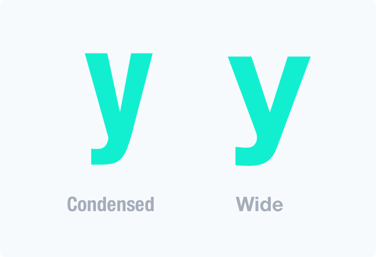

**Readability**

Readability is about the overall reading experience and plays a great role in encouraging people to read. You could have very good content on your UI, but the way it's presented could affect how people read it. Is it easy to scan text layout, differentiate headings, subheadings, paragraphs, and blocks? Macro-typography is about making the text appealing to encourage reading. It achieves this through contrast, size, color and other minute details that improve the reading experience.

**Colors**

Though it depends on the project, I would suggest you pick your main color instead of using pure gray colors, and work as shown below.

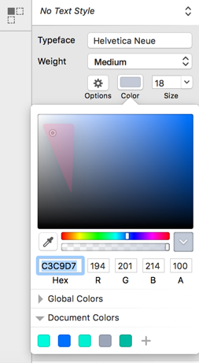

**Width of Text Block**

If the text is too wide, your users will experience difficulties finding the next line. Again, if the text is too thin, the eyes of the reader will have to skip lines thereby breaking the reading rhythm.

As long as it not so frequent, our subconscious mind is energized when jumping to the next line.

Keep your readers energized and engaged by using between 50 to 75 characters in a text line.

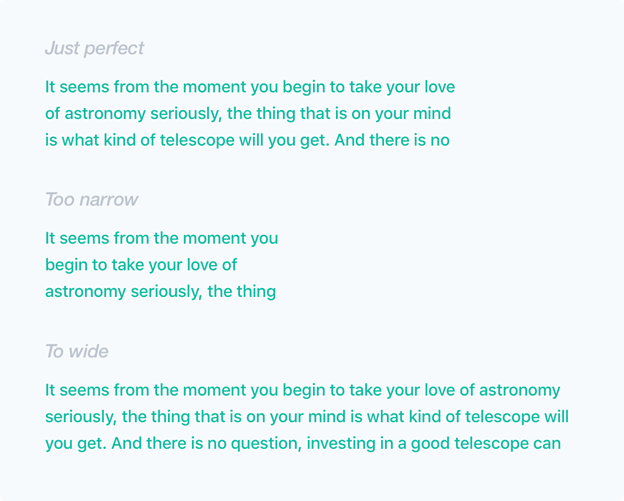

**Serif vs. Sans Serif**

From history, serifs are more legible than san serifs. They were used in print for a long time, and they improved the reading experience a great deal. Serif allows the eye to flow more easily over the text. However, this is different when it comes to the web and mobile. There many sans-serifs that are readable and the modern state of visual design prefer simpler letterforms. As a matter of fact, there are usually more sans-serifs on the web and mostly on mobile.

Use of serif depends on your project and manner in which users read your content. Serif can be used if its long content, but if it is not, then they may be left out.

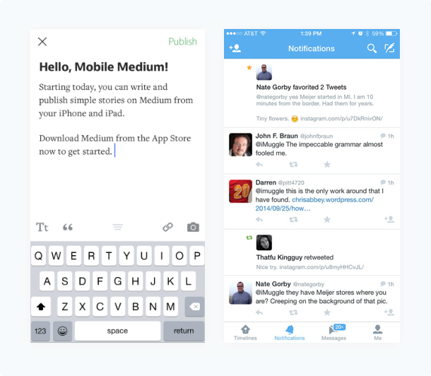

No serif on twitter app but it's appropriate for medium

**Height of Line**

I highly suggest you use golden ratio when it comes to line height.

Generally, to get the perfect line height, multiply your letter-size by 1.618. You can use [http://jsbin.com/todidu/1/edit?output](http://jsbin.com/todidu/1/edit?output)

You can also manually adjust the height if you're more experienced. However, there are some exceptions to this rule.

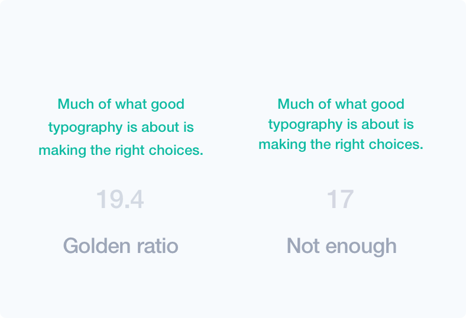

The picture shows a small difference but it can have a huge impact on readability.

**White space**

The major role of white space in typography is to minimize the amount of text visitors see at a go.

The white space makes your design more scannable and reduces congestion with content. It directs the user’s eyes and creates a sense of order, elegance, and complexity.

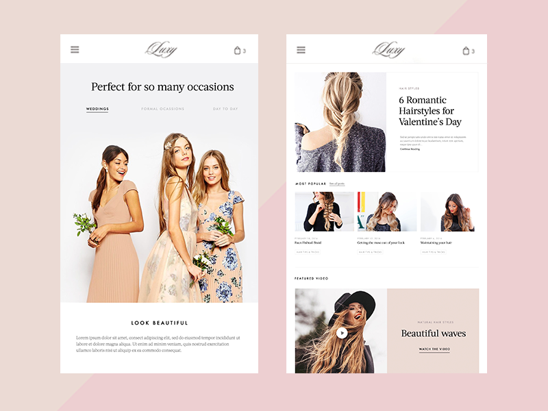

**Separators**

The separator is a good way to divide your work into sections, and the most popular separator is simple line. Though it's a subtle tool, it really enhances readability. An alternative way is to use the right now cards. They really do well, especially with unrelated content and certainly improve layout scannability

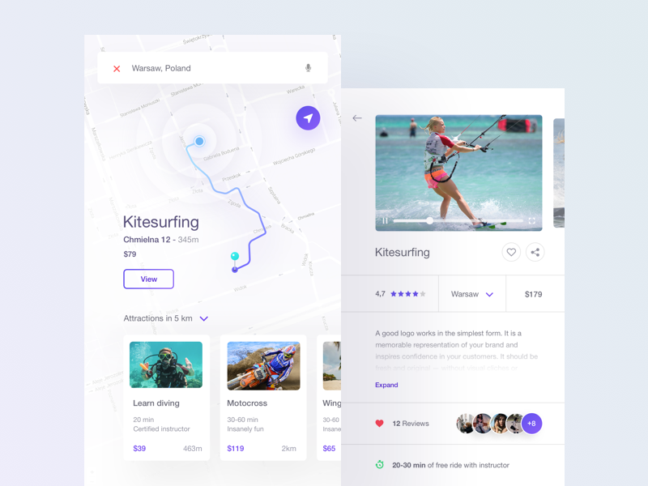

**Repetition and rhythm**

For me, I must confess that this part of a UI design really takes time. However, if done well, any repeated element promotes unity in design. The repetition may be done on positioning, padding, text size, margins, colors, background, use of rules, and boxes. Therefore, repetition produces rhythm.

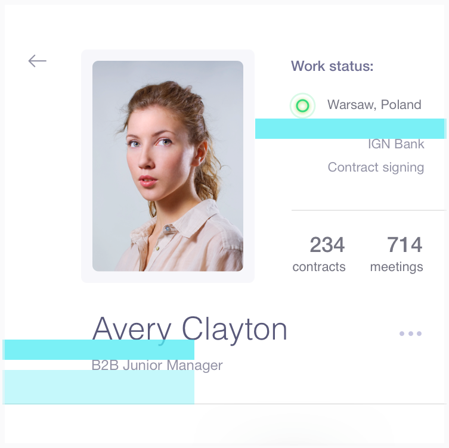

**Hierarchy**

Hierarchy dictates the order of going through content. It also gives a guideline on how to differentiate header from sub-header and body text. This is often achieved through the use of text sizes, paddings, margins, and contrast, among others. In order to improve readability, this is a technique that should be practiced in UI typography.

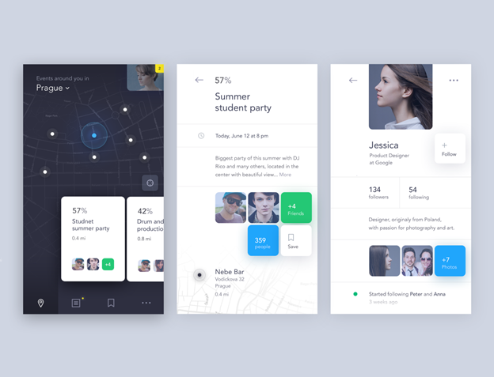

## [Weitere Beiträge](https://thinkport.digital/blog)

[')](https://thinkport.digital/how-ai-vr-and-big-data-will-transform-the-real-estate-industry-by-2020/)

### [How AI, VR, and Big Data Will Transform the Real Estate Industry by 2020](https://thinkport.digital/how-ai-vr-and-big-data-will-transform-the-real-estate-industry-by-2020/ 'How AI, VR, and Big Data Will Transform the Real Estate Industry by 2020')

[Big Data](https://thinkport.digital/category/big-data/)

### [How AI, VR, and Big Data Will Transform the Real Estate Industry by 2020](https://thinkport.digital/how-ai-vr-and-big-data-will-transform-the-real-estate-industry-by-2020/ 'How AI, VR, and Big Data Will Transform the Real Estate Industry by 2020')

[Big Data](https://thinkport.digital/category/big-data/)

### [The 6 Most Important Things I have learned in my 6 Months using Server-less](https://thinkport.digital/the-6-most-important-things-i-have-learned-in-my-6-months-using-server-less/ 'The 6 Most Important Things I have learned in my 6 Months using Server-less')

[Big Data](https://thinkport.digital/category/big-data/)

### [The 6 Most Important Things I have learned in my 6 Months using Server-less](https://thinkport.digital/the-6-most-important-things-i-have-learned-in-my-6-months-using-server-less/ 'The 6 Most Important Things I have learned in my 6 Months using Server-less')

[Big Data](https://thinkport.digital/category/big-data/)

### [Testdaten generieren mithilfe von Openmaps](https://thinkport.digital/testdaten-generieren-mithilfe-von-openmaps/ 'Testdaten generieren mithilfe von Openmaps')

[AWS Cloud](https://thinkport.digital/category/aws-cloud/)

### [Testdaten generieren mithilfe von Openmaps](https://thinkport.digital/testdaten-generieren-mithilfe-von-openmaps/ 'Testdaten generieren mithilfe von Openmaps')

[AWS Cloud](https://thinkport.digital/category/aws-cloud/)

[')](https://thinkport.digital/practical-tips-and-tricks-on-how-to-use-typography-in-ui-design/)

### [Practical Tips and Tricks on How to Use Typography in UI Design](https://thinkport.digital/practical-tips-and-tricks-on-how-to-use-typography-in-ui-design/ 'Practical Tips and Tricks on How to Use Typography in UI Design')

[Big Data](https://thinkport.digital/category/big-data/)

### [Practical Tips and Tricks on How to Use Typography in UI Design](https://thinkport.digital/practical-tips-and-tricks-on-how-to-use-typography-in-ui-design/ 'Practical Tips and Tricks on How to Use Typography in UI Design')

[Big Data](https://thinkport.digital/category/big-data/)

[')](https://thinkport.digital/aws-s3-2/)

### [AWS S3](https://thinkport.digital/aws-s3-2/ 'AWS S3')

[AWS Cloud](https://thinkport.digital/category/aws-cloud/)

### [AWS S3](https://thinkport.digital/aws-s3-2/ 'AWS S3')

[AWS Cloud](https://thinkport.digital/category/aws-cloud/)

### [Three ways to deploy Airflow on AWS](https://thinkport.digital/how-to-deploy-airflow-on-aws/ 'Three ways to deploy Airflow on AWS')

[AWS Cloud](https://thinkport.digital/category/aws-cloud/)

### [Three ways to deploy Airflow on AWS](https://thinkport.digital/how-to-deploy-airflow-on-aws/ 'Three ways to deploy Airflow on AWS')

[AWS Cloud](https://thinkport.digital/category/aws-cloud/)

## Blog Kurator

### Christina Friede

### Business Development

## Email:

## [cfriede@thinkport.digital](mailto:cfriede@thinkport.digital)

-  
