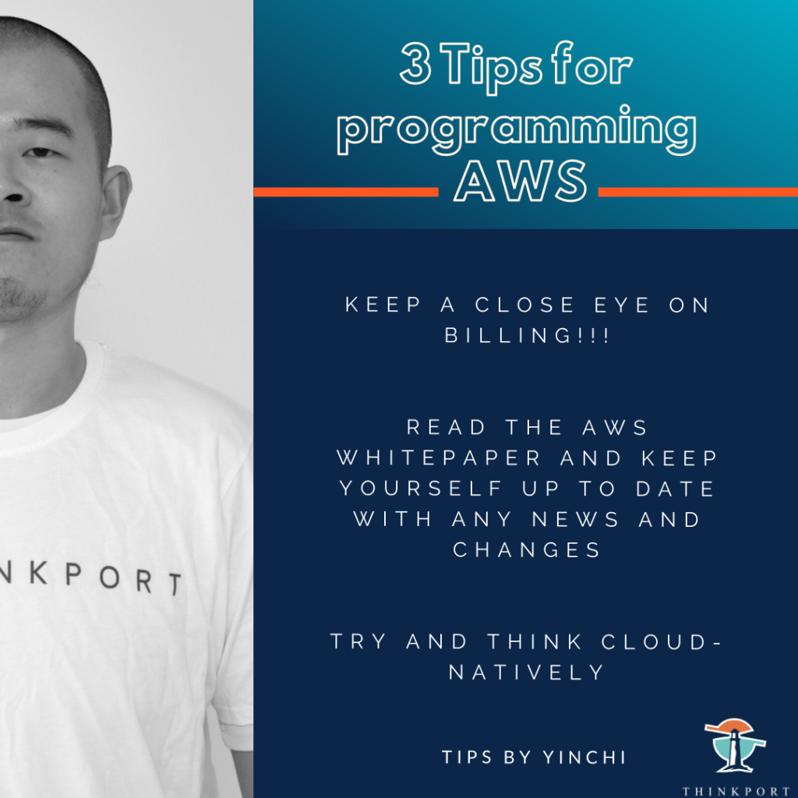

3 Tips for AWS Programming

## NEWS AWS Cloud

 Share on facebook Share on google Share on twitter Share on linkedin Share on pinterest Share on email

### Yinchi's programming tips

This is the first episode of short programming tips from our cloud consultant, Yinchi. Yinchi works with diverse teams and has already implemented several projects on AWS. 

When asked about programming tips he recommends: 

 1. Keep a close eye on billing! 

 2. Read the AWS Whitepaper and keep yourself up to date with any news and changes. 

 3. Try and think cloud-natively. 

[Follow us](https://www.linkedin.com/company/thinkport) to experience more about cloud and programming! 

Weitere Neuigkeiten

## News Writer

### Christina Friede

### Business Development

## Email:

## cfriede@thinkport.digital

- 
