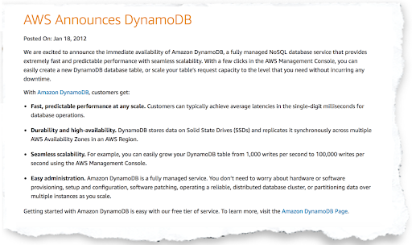
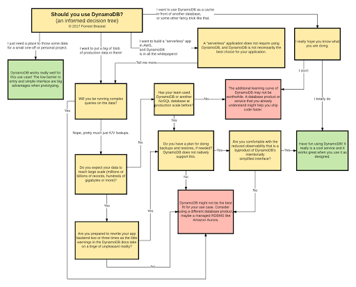

 

## DynamoDB

## aws CLOUD lambda

# Reasons Why DynamoDB is Not for Everyone

[Linkedin](https://www.linkedin.com/company/11759873) [Instagram](https://www.instagram.com/thinkport/) [Youtube](https://www.youtube.com/channel/UCnke3WYRT6bxuMK2t4jw2qQ) [Envelope](mailto:tdrechsel@thinkport.digital)

Amazon Dynamo was created in 2004 to scale the growth of Amazon’s Oracle database infrastructure. The aim behind its creation was to meet the business’s requirements (scalability, performance, and reliability).

In 2012, the availability of DynamoDB as a fully managed NoSQL data service was announced by AWS. AWS promised that it would have seamless scalability.

**Why choose DynamoDB?**

I interviewed a number of developers and engineers about their experience using DynamoDB. Even though this database service has many success stories, it has left behind many failed implementations. To fully understand why DynamoDB succeeds in some areas and fails in others, you first have to learn about the tension between two of its greatest promises- scalability, and simplicity.

**DynamoDB is simple to use until it refuses to scale**

Throwing data in DynamoDB is the easiest thing you can ever do. It is less complex as you don’t have to be worried about logging in and setting up a cluster- all thanks to AWS. To start operating this service, you just turn a knob, look for an SDK and sling JSON.

However, as much as DynamoDB is simple to interact with, designing its architecture is a difficult task. It works well during retrieval of individual records that may be based on key lookups. Where complex scans and queries are involved, there is a need to carry out indexing carefully. This is a must even if the amount of data isn’t huge and you are familiar with the design principles in NoSQL.

Most developers know a lot about classic relational database design but not much about NoSQL. A combination of inexperienced developers, the absence of a clear plan on modeling a dataset in DynamoDB and a managed database service is a recipe for failure.

**First Law of DynamoDB**

The first law of using DynamoDB is to assume that its implementation will be harder compared to employing a relational database you are well-versed with. At a small scale, a relational database will accomplish each of your need. Setting it up will initially take a long time compared to DynamoDB. However, the well-established SQL conventions will save you a lot of time in the long run. This is far from the assumption that DynamoDB technology is awful. It is because it is new to you.

**DynamoDB can be scaled - until it's not simple**

For this article, I interviewed a few DynamoDB happy customers. DynamoDB promises great performance at an infinite scale which is only limited by the size of the AWS cloud. The customers are right in the center of doing key-value lookups on well-distributed records, avoiding complicated queries and limiting hotkeys.

DynamoDB is well-known for dealing with hotkeys and this is explained in detail in the [DynamoDB developer’s guide documentation](http://docs.aws.amazon.com/amazondynamodb/latest/developerguide/GuidelinesForTables.html). Although it can scale indefinitely, data is not stored on a single server. As it grows larger, it is divided into chunks, each on a different partition.

Despite DynamoDB being able to scale indefinitely, your data is not stored on one, ever-expanding server. What happens is that the capacity of a single DynamoDB shard is divided into parts as your data increases. Therefore, each part lives on a different shard.

If you have a hot key in your dataset, you must ensure that the allocated capacity on your table is set high enough to handle all the queries.

With DynamoDB, you can only provision its capacity at the entire table level. You cannot provision its capacity per partition. By use of a [fairly wonky formula](http://docs.aws.amazon.com/amazondynamodb/latest/developerguide/GuidelinesForTables.html#GuidelinesForTables. Partitions) the capacity is divided up among partitions. Consequently, your capacity for reading and writing on any record becomes smaller. If your application has too many RCUs on one key, you can do three things; over-provision all other partitions which are rather expensive, generate errors or decrease access to the key.

One thing to note however is that DynamoDB is not suited to datasets that are a mixture of hot and cold records. But at a large scale, each dataset has a similar mixture. You can split the data into tables, but you will end up losing the scalability advantage of DynamoDB.

A recently published article on  “[The Million Dollar Engineering Problem](https://segment.com/blog/the-million-dollar-eng-problem/)” showed how Segment decreased their AWS bill. It did it by fixing the DynamoDB over-provisioning. Alongside the article was a heat map graphics that showed the partitions that were troublesome.

The graphics originate from AW’s internal tools. Their strategy for blocking the troublesome keys was to wrap DynamoDB calls in a try. ‘Segment then had to battle the hotkeys problem, and this is where the simplicity and scalability factors came in.

Designed as a black box, DynamoDB has very few user-accessible controls. When starting, it is this aspect that makes it easy to use. But at the production scale, you need more insight into your data misbehavior.

**Second Law of Dynamo**

The second law of DynamoDB states that DynamoDB’s usability, at a massive scale, is limited by its own simplicity. The problem here is with what AWS has chosen to expose, not Dynamo’s architecture. Its failure to backup 100TB DynamoDB data was the leading reason why Timehop moved off the service altogether.

**What if you can’t use DynamoDB?**

First, Let us look at the advantages and disadvantages of using DynamoDB

**Pros**

* Handles huge amounts of workloads.
* Enables you to redesign many applications.
* Enables you to store state in a K/V table.
* Enables use of event-driven architecture to suit your desires.

**Cons**

* Only suitable for small scale.
* You can’t redesign all the applications.

Just because you can use DynamoDB does not mean you should use it. Using Dynamo without fully understanding will make you end up spinning your wheels through several code rewrites before you land on a solution that works .

**Third Law of DynamoDB**

The third law of DynamoDB states that business value trumps architectural design each time.

This is the reason why the various developers I interviewed abandoned NoSQL to provide solutions for both small and middle-sized businesses. It is also the same reason why Timehop moved from DynamoDB to Aurora. This also explains why DynamoDB has lots of case studies from happy customers globally.

**The Introduction of WhynamoDB**

Amazon will at some point announce the release of WhynamoDB. The decision tree below will guide you on this new service.

 

## [Weitere Beiträge](https://thinkport.digital/blog)

[")](https://thinkport.digital/aws-s3-2/)

### [AWS S3](https://thinkport.digital/aws-s3-2/ "AWS S3")

[AWS Cloud](https://thinkport.digital/category/aws-cloud/)

### [AWS S3](https://thinkport.digital/aws-s3-2/ "AWS S3")

[AWS Cloud](https://thinkport.digital/category/aws-cloud/)

### [Kublr bringt Rolling-Updates für Kubernetes](https://thinkport.digital/kublr-rolling-updates-fuer-kubernetes/ "Kublr bringt Rolling-Updates für Kubernetes")

[AWS Cloud](https://thinkport.digital/category/aws-cloud/), [Cloud Kubernetes](https://thinkport.digital/category/cloud-kubernetes/)

### [Kublr bringt Rolling-Updates für Kubernetes](https://thinkport.digital/kublr-rolling-updates-fuer-kubernetes/ "Kublr bringt Rolling-Updates für Kubernetes")

[AWS Cloud](https://thinkport.digital/category/aws-cloud/), [Cloud Kubernetes](https://thinkport.digital/category/cloud-kubernetes/)

[")](https://thinkport.digital/aws-elastic-beanstalk-2/)

### [AWS Elastic Beanstalk](https://thinkport.digital/aws-elastic-beanstalk-2/ "AWS Elastic Beanstalk")

[AWS Cloud](https://thinkport.digital/category/aws-cloud/)

### [AWS Elastic Beanstalk](https://thinkport.digital/aws-elastic-beanstalk-2/ "AWS Elastic Beanstalk")

[AWS Cloud](https://thinkport.digital/category/aws-cloud/)

### [Neue AWS-Funktionen für Speicher- und Dateisysteme](https://thinkport.digital/neue-aws-funktionen-fur-speicher-und-dateisysteme/ "Neue AWS-Funktionen für Speicher- und Dateisysteme")

[AWS Cloud](https://thinkport.digital/category/aws-cloud/)

### [Neue AWS-Funktionen für Speicher- und Dateisysteme](https://thinkport.digital/neue-aws-funktionen-fur-speicher-und-dateisysteme/ "Neue AWS-Funktionen für Speicher- und Dateisysteme")

[AWS Cloud](https://thinkport.digital/category/aws-cloud/)

### [Three ways to deploy Airflow on AWS](https://thinkport.digital/how-to-deploy-airflow-on-aws/ "Three ways to deploy Airflow on AWS")

[AWS Cloud](https://thinkport.digital/category/aws-cloud/)

### [Three ways to deploy Airflow on AWS](https://thinkport.digital/how-to-deploy-airflow-on-aws/ "Three ways to deploy Airflow on AWS")

[AWS Cloud](https://thinkport.digital/category/aws-cloud/)

### [Warum Terraform eines Ihrer DevOps Tools sein sollte](https://thinkport.digital/warum-terraform-einer-ihrer-devops-tools-sein-sollte/ "Warum Terraform eines Ihrer DevOps Tools sein sollte")

[AWS Cloud](https://thinkport.digital/category/aws-cloud/)

### [Warum Terraform eines Ihrer DevOps Tools sein sollte](https://thinkport.digital/warum-terraform-einer-ihrer-devops-tools-sein-sollte/ "Warum Terraform eines Ihrer DevOps Tools sein sollte")

[AWS Cloud](https://thinkport.digital/category/aws-cloud/)

## Blog Kurator

### Christina Friede

### Business Development

## Email:

## [cfriede@thinkport.digital](mailto:cfriede@thinkport.digital)

*  
