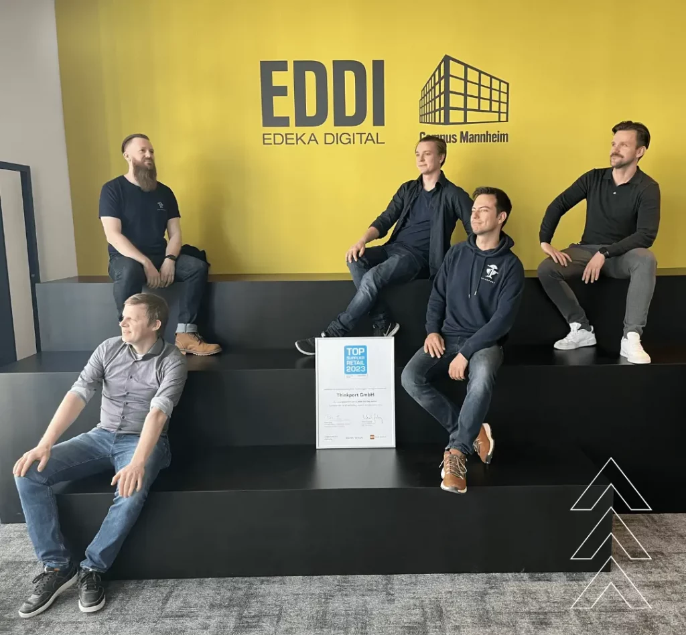
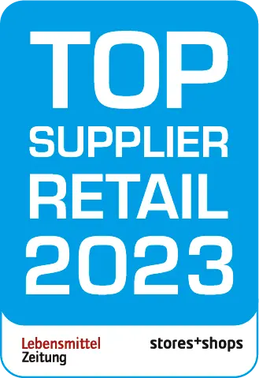
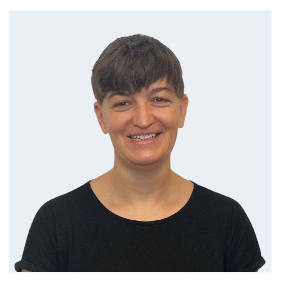

# Thinkport ist ausgezeichneter Technologiepartner von EDEKA DIGITAL

Das herausragende Ergebnis der Zusammenarbeit von EDEKA DIGITAL, Solace und Thinkport wurde von der renommierten Lebensmittel Zeitung und dem bekannten EHI Retail Institute mit dem Gewinn der **[Reta Awards](https://www.reta-europe.com/best-connected-retail-solution-2023-edeka-digital/)** ausgezeichnet.

Der Laudator würdigte EDEKA DIGITAL für die **Best Connected Retail Solution**: „EDEKA DIGITAL has implemented an outstanding technology-based solution on a high degree of innovation and strong impact on strategic and financial benefits.”

Als ein führender Dienstleister von Cloud und Streaming Consulting unterstützte Thinkport **[EDEKA DIGITAL](https://digital.edeka/projekte/)** bei der Implementierung eines Warenwirtschaftssystems. Dieses gibt Informationen über mehrere hundert- tausend Produkte an 6.000 Filialen weiter. Durch die Partnerschaft mit Solace ermöglichte Thinkport seinem Kunden Edeka eine einfache Implementierung einer sogenannten ereignisgesteuerten Architektur mittels Zugang zur Event-Streaming- und Management-Technologie.

Zentrale Herausforderung war es, Artikelstammdaten an vielen Stellen zugänglich zu machen. Zum Beispiel in neuen mobilen App-Lösungen, im stationären Handel, in Onlineshop-Lösungen, im eigenen Rechenzentrum und in Public-Cloud-Lösungen. Dies stellte die IT im EDEKA-Verbund vor Herausforderungen, da die notwendigen Daten in den führenden Quellsystemen verteilt und teilweise auch schwer zugänglich sind.

Die Integration von EDEKA-Daten wurde erstmals aus der Sicht eines Datenkonsumenten wie einer mobilen App gedacht. Dies führte zu einem Integrationsansatz mit dem Technologiepartner **[Solace](https://solace.com/)**.

REDDI, eine neue Integrationsplattform, fungiert als Brückenbauer, verbindet die klassische IT mit neuen digitalen Produkten und sorgt dafür, dass diese spezifischen Anforderungen externer Datenkonsumenten durch die Kombination innovativer Technologien erfüllt - und neue Anwendungsfälle sehr schnell umgesetzt - werden können.

Ein Kernstück der neuen Integrationsplattform ist das neue Datenmodell der EDEKA-Stammdaten. Die einzelnen Quellsysteme senden in Echtzeit Updates an die Retail Digital Data Integration Plattform. REDDI verbindet die klassische IT mit neuen digitalen Produkten. So wird aus diesen einzelnen Events ein konsistentes und vollständiges Datenobjekt erstellt.

REDDI wird somit die Standard-API für viele EDEKA-Stammdaten bei der Einführung neuer digitaler Produkte. Durch den Standardisierungsansatz lassen sich die EDEKA-Stammdaten schnell nutzen und reduzieren so die Time-to-Market und die Kosten für neue IT-Projekte erheblich.

So brachte die Partnerschaft beiden Unternehmen große Vorteile: EDEKA erhielt ein top-modernes Warenwirtschaftssystem mit herausragender User Experience der Millionen Laden-Kunden vor Ort. Und Thinkport eine namhafte Auszeichnung für sein State of the Art Streaming und Cloud Consulting.

## Weitere Informationen

Weitere Details dazu unter den folgenden Links unserer Kunden- und Partner-Seiten:  
\- Die ganze **[Erfolgsgeschichte](https://thinkport.digital/reta-award-winning-cooperation/)**  
\- Der **[Workshop](https://thinkport.digital/cloud-architecture-review/)** für Ihren Erfolg  
\- Unser Kunde **[EDEKA DIGITAL](https://digital.edeka/projekte/)**  
\- Unser Partner **[Solac](https://solace.com/)e**

## Blog Kurator

Christina Friede

Business Development

Email:

[cfriede@thinkport.digital](mailto:cfriede@thinkport.digital)

* 

## [Weitere Beiträge](https://thinkport.digital/blog)

### [Kafka Event-Streaming](https://thinkport.digital/kafka-event-streaming/ 'Kafka Event-Streaming')

[Cloud General](https://thinkport.digital/category/cloud-general/), [Streaming](https://thinkport.digital/category/streaming/)

### [Kafka Event-Streaming](https://thinkport.digital/kafka-event-streaming/ 'Kafka Event-Streaming')

[Cloud General](https://thinkport.digital/category/cloud-general/), [Streaming](https://thinkport.digital/category/streaming/)

### [Was ist Cloud Consulting](https://thinkport.digital/was-ist-cloud-consulting/ 'Was ist Cloud Consulting')

[Cloud General](https://thinkport.digital/category/cloud-general/)

### [Was ist Cloud Consulting](https://thinkport.digital/was-ist-cloud-consulting/ 'Was ist Cloud Consulting')

[Cloud General](https://thinkport.digital/category/cloud-general/)

### [Azure Databricks](https://thinkport.digital/azure-databricks/ 'Azure Databricks')

[Azure Cloud](https://thinkport.digital/category/azure-cloud/), [Cloud General](https://thinkport.digital/category/cloud-general/)

### [Azure Databricks](https://thinkport.digital/azure-databricks/ 'Azure Databricks')

[Azure Cloud](https://thinkport.digital/category/azure-cloud/), [Cloud General](https://thinkport.digital/category/cloud-general/)

### [Core Strategies Cloud Migration](https://thinkport.digital/core-strategies-cloud-migration/ 'Core Strategies Cloud Migration')

[Cloud General](https://thinkport.digital/category/cloud-general/), [Cloud Kubernetes](https://thinkport.digital/category/cloud-kubernetes/)

### [Core Strategies Cloud Migration](https://thinkport.digital/core-strategies-cloud-migration/ 'Core Strategies Cloud Migration')

[Cloud General](https://thinkport.digital/category/cloud-general/), [Cloud Kubernetes](https://thinkport.digital/category/cloud-kubernetes/)

### [Modernisierung ist ein Kontinuum](https://thinkport.digital/modernisierung-ist-ein-kontinuum/ 'Modernisierung ist ein Kontinuum')

[Cloud General](https://thinkport.digital/category/cloud-general/), [Cloud Kubernetes](https://thinkport.digital/category/cloud-kubernetes/)

### [Modernisierung ist ein Kontinuum](https://thinkport.digital/modernisierung-ist-ein-kontinuum/ 'Modernisierung ist ein Kontinuum')

[Cloud General](https://thinkport.digital/category/cloud-general/), [Cloud Kubernetes](https://thinkport.digital/category/cloud-kubernetes/)

### [Kafka Streams](https://thinkport.digital/kafka-streams/ 'Kafka Streams')

[Cloud General](https://thinkport.digital/category/cloud-general/), [Streaming](https://thinkport.digital/category/streaming/)

### [Kafka Streams](https://thinkport.digital/kafka-streams/ 'Kafka Streams')

[Cloud General](https://thinkport.digital/category/cloud-general/), [Streaming](https://thinkport.digital/category/streaming/)
