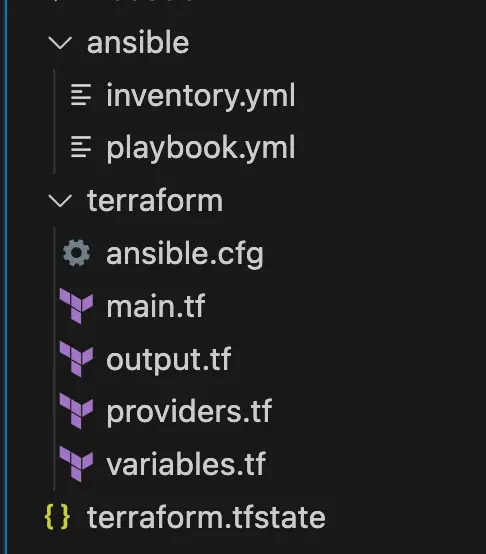

# Setup von Hashicorp Nomad -

Schritt 1: Terraform

Der Artikel fokussiert auf das Setup von Nomad, beginnend mit einem überblickgebenden Einführungstext, gefolgt von einer konkreten Folge von Schritten, die in einzelnen Blockartikeln inklusive exakter Anweisungen beschrieben werden.  Die Artikel bauen aufeinander auf,   können allerdings je nach Bedarf auch übersprungen werden.

[Setup von Hashicorp Nomad](https://thinkport.digital/setup-von-hashicorp-nomad/)

Schritt 1:  
Terraform

[Schritt 2:  
Ansible](https://thinkport.digital/setup-hashicorp-nomad-mit-ansible/)

[Schritt 2.1:  
Ansible - ufw](https://thinkport.digital/setup-hashicorp-nomad-ansible-ufw/)

[Schritt 2.2:  
Ansible - fail2ban](https://thinkport.digital/setup-hashicorp-nomad-ansible-fail2ban/)

[Schritt 3:  
Ansible - nomad](https://thinkport.digital/setup-hashicorp-nomad-ansible-nomad/)

[Schritt 4:  
Ansible - consul](https://thinkport.digital/setup-hashicorp-nomad-ansible-consul/)

## Ansible in Terraform einbinden und Playbook schreiben

Zuerst erstellen wir eine neuen Ordner für Ansible damit wir den Überblick später nicht verlieren, danach sollte unsere Ordnerstruktur wie auf dem Screenshot aussehen.

Die `ansible.cfg` platzieren wir im Terraform Ordner, denn von dort aus wird später unser Ansible-Playbook gestartet.

In der `ansible.cfg` fügen wir folgenden Code ein:

`[defaults] host_key_checking = False`

Da unsere VMs beim Herunter- und Hochfahren an verschiedenen Tagen immer neue öffentliche IPs bekommen, wird immer nachgefragt ob diese neuen Maschinen vertrauenswürdig sind. Um dies nicht jedes mal mit `yes` bestätigen zu müssen setzen wir den Wert für Host-Key-Checking auf `false` .

Wir wollen nun erstmal das Inventar bekommen, damit wir auch Zeile für unsere Ansible Konfiguration haben. Da wir in diesem Fall Ansible im Zusammenspiel mit Terraform benutzen, können wir den Ansible Provider für Terraform verwenden. Damit erstellt Terraform beim ausführen von `terraform apply` ein Inventar in der `terraform.tfstate` Datei. Ansible liest dieses Inventar dann beim Start des Playbooks aus der `terraform.tfstate` Datei aus.

    				 `terraform {     required_providers {         azurerm = {             source = "hashicorp/azurerm"             version = "3.68.0"         }         ansible = {             source = "ansible/ansible"             version = "1.1.0"         }     }     required_version = ">= 1.5.5" }`

Wir erweitern nun unseren `required_providers` um den Ansible Provider einzubinden, so können wir mit Terraform Sprache ein Ansible Inventar erzeugen. Dazu schreiben wir wieder den von uns festgelegten Namen des Providers am Anfang des Blocks auf (hier “ansible”) und im Block darunter dann die Quelle (hier “[ansible/ansible](https://registry.terraform.io/providers/ansible/ansible/latest 'https://registry.terraform.io/providers/ansible/ansible/latest')”, dieser Wert stammt von der Terraform Registry und besteht aus user/providername). Darunter definieren wir die aktuelle Version.

Nach dem Hinzufügen eines neuen Providers immer `terraform init` ausführen, damit wir das neu hinzugefügte Modul herunterladen und gleich damit arbeiten können!

Nun können wir in unserer `main.tf` Datei einen neuen “resource” Block hinzufügen der den Typ `ansible_host` trägt, mit diesem können wir dann das Inventar für die Verwendung mit Ansible erzeugen.

    				 `# Einbinden der Ansible Hosts in den Terraform State, um später von Ansible als Inventar ausgelesen zu werden resource "ansible_host" "this" {     count = var.vm_amount     name = azurerm_public_ip.this[count.index].ip_address     groups = ["azure_nomad_vms"]     variables = {         ansible_user = var.vm_admin_username         ansible_ssh_private_key_file = "./.ssh/nomad_key"         ansible_python_interpreter = "/usr/bin/python3"     }     depends_on = [azurerm_linux_virtual_machine.this] }`

Hier sehen wir nun den neuen resource Block. Da wir mehrere VMs erwarten, verwenden wir erneut count und setzen hier unsere vorher festgelegte Variable ein, damit es bei Veränderungen dynamisch bleibt. Danach geben wir jedem Ansible Host in dem Inventar einen Namen. Da wir vorhin bereits öffentliche IPs erstellt haben, können wir diese jetzt als Namen verwenden. Danach setzen für noch die Gruppe die später im Playbook dann unter `hosts` spezifiziert wird (im Beispiel war es `nodes` ). Anschließend geben wir dem Host noch einen SSH Benutzer, Schlüssel und den Pfad zu Python mit.

Ansible braucht nun eine Inventar-Datei um andere Maschinen zu konfigurieren, daher müssen wir diese erstellen und Ansible sagen woher die Hosts gezogen werden sollen. Das funktioniert hierbei über ein Plugin namens `cloud.terraform.terraform_provider` . Dieses binden wir wie folgt in die `inventory.yml` Datei ein:

    				 `--- plugin: cloud.terraform.terraform_provider project_path: ../terraform`

Zuerst setzen wir also das Plugin. Dieses schaut dann im `project_path` nach einem `terraform.tfstate` File und liest daraus ein Inventar für Ansible aus.

Wenn wir uns das Inventar nun über `ansible-inventory -i ../ansible/inventory.yml --graph --vars` ausgeben lassen, sollte es so aussehen:  
(Falls nicht hast du ggf. noch kein `terraform apply` ausgeführt um über den `ansible_host` Block die Daten für Ansible in die `terraform.tfstate` Datei zu schreiben)

    				 `—$ ansible-inventory -i ../ansible/inventory.yml --graph --vars @all: |--@ungrouped: |--@azure_nomad_vms: | |--20.107.87.35 | | |--{ansible_python_interpreter = /usr/bin/python3} | | |--{ansible_ssh_private_key_file = ./.ssh/nomad_key} | | |--{ansible_user = thinkport} | |--20.107.87.95 | | |--{ansible_python_interpreter = /usr/bin/python3} | | |--{ansible_ssh_private_key_file = ./.ssh/nomad_key} | | |--{ansible_user = thinkport} | |--20.107.87.122 | | |--{ansible_python_interpreter = /usr/bin/python3} | | |--{ansible_ssh_private_key_file = ./.ssh/nomad_key} | | |--{ansible_user = thinkport}`

Nun haben wir also Terraform so konfiguriert, dass die durch Terraform erstellen Maschinen bzw. die zugehörigen IPs durch den Ansible Provider in Terraform als Ansible Inventar ausgelesen werden können. Jetzt fehlt uns nur noch das Playbook!  
Dazu erstellen wir im `ansible` Ordner deine Datei namens `playbook.yml` zum Anfang nehmen wir uns ein Beispiel vom Intro, dies sieht dann wie folgt aus:

    				 `--- - hosts: azure_nomad_vms     become: yes     tasks:     - name: Ping all hosts         ping:`

Wir benutzen für den `hosts` Wert die vorher festgelegte Gruppe namens `azure_nomad_vms` . Wollen wieder root werden, also setzen wir `become: yes` und nachfolgend probieren wir nun alle Maschinen einmal zu pingen!

Um unsere Ansible Integration in Terraform abzuschließen wollen wir nun beim jedem `terraform apply` das Playbook ausführen. Dazu `local-exec` Funktion von Terraform, mit dieser können wir auf der ausführenden Maschine weitere Befehle starten. In unserem Fall wollen wir das Ansible Playbook mit dem zugehörigen erzeugten Inventar für Ansible ausführen.

Dazu fügen wir eine `null_resource` ein, diese benennen wir in diesem Fall ansible_playbook:

    				 `# Ausführen des Ansible Playbooks um die virtuellen Maschinen zu konfigurieren resource "null_resource" "ansible_playbook" {     triggers = {         always_run = "${timestamp()}"     }     provisioner "local-exec" {         command = "ansible-playbook -i ${var.ansible_dir}inventory.yml ${var.ansible_dir}playbook.yml'     }     depends_on = [null_resource.ansible_inventory] }`

Der `triggers` Block sorgt hierbei für eine Ausführung bei jedem Terraform-Apply, denn Terraform kann bei einer `null_resource` nicht wie bei anderen Ressourcen den Stand in der `terraform.tfstate` Datei mit dem in der Cloud vergleichen. Da wir hier nur einen Command ausführen und Terraform nicht genau über den Ausgang dieses Commands Bescheid weiß, müssen wir also jedes mal die Ausführung erneut starten, das machen wir über die integrierte Timestamp Variable.  
Anschließend führt der `local-exec` `provisioner` den Command `ansible-playbook -i /pfad/zum/inventar playbook.yml` aus.  
Da wir erstellen am besten eine Variable die vom Terraform Ordner zum Ansible Ordner zeigt. Dazu erstellen wir in der `variables.tf` eine neue Variable namens `var.ansible_dir` und fügen diese dann auch in der Datei `terraform.tfvars` hinzu.

    				 `variable "ansible_dir" {     type        = string     description = "Pfad zum Verzeichnis der Ansible Skripte"     default     = "./ansible/" }`

In der `variables.tf` Datei sollte es so aussehen. Es empfiehlt sich immer einen Default sowie eine Beschreibung zu setzen, so verstehen anderen auch den Sinn hinter der Variable.

 

    				 `ansible_dir = "./ansible/"`

In der `terraform.tfvars` Datei

Nun können wir den `terraform apply` Command ausführen, um unsere Infrastruktur zu provisionieren und am Ende durch den `local-exec provisioner` das Playbook auszuführen.

Das Resultat sollte wie folgt aussehend:

    				 `null_resource.ansible_playbook: Creating... null_resource.ansible_playbook: Provisioning with 'local-exec'... null_resource.ansible_playbook (local-exec): Executing: ["/bin/sh" "-c" "ansible-playbook -i ../ansible/inventory.yml ../ansible/playbook.yml"] null_resource.ansible_playbook (local-exec): PLAY [azure_nomad_vms] *********************************************************** null_resource.ansible_playbook (local-exec): TASK [Gathering Facts] *********************************************************** null_resource.ansible_playbook (local-exec): ok: [20.23.228.219] null_resource.ansible_playbook (local-exec): ok: [20.123.183.146] null_resource.ansible_playbook (local-exec): ok: [20.123.183.147] null_resource.ansible_playbook (local-exec): TASK [Ping all hosts] *********************************************************** null_resource.ansible_playbook (local-exec): ok: [20.123.183.147] null_resource.ansible_playbook (local-exec): ok: [20.23.228.219] null_resource.ansible_playbook (local-exec): ok: [20.123.183.146] null_resource.ansible_playbook (local-exec): PLAY RECAP *********************************************************** null_resource.ansible_playbook (local-exec): 20.123.183.146      : ok=2  changed=0    unreachable=0  failed=0     skipped=0   rescued=0   ignored=0 null_resource.ansible_playbook (local-exec): 20.123.183.147      : ok=2  changed=0    unreachable=0  failed=0     skipped=0   rescued=0   ignored=0 null_resource.ansible_playbook (local-exec): 20.23.228.219       : ok=2  changed=0    unreachable=0  failed=0     skipped=0   rescued=0   ignored=0 null_resource.ansible_playbook: Creation complete after 4s [id=7731788357005926003]`

## Autoren:

## Keith Schuijlenburg

_Cloud Architect_

## Jonas Budde

_Cloud Engineer_

## Aleksandra Bury

_Cloud Engineer_

## [Weitere Beiträge](https://thinkport.digital/blog)

### [Echtzeit-KI: Apache Kafka und OpenAI sind die Zukunft der Datenanalyse](https://thinkport.digital/kafka-und-openai-zukunft-der-datenanalyse/ 'Echtzeit-KI: Apache Kafka und OpenAI sind die Zukunft der Datenanalyse')

[Cloud General](https://thinkport.digital/category/cloud-general/), [Streaming](https://thinkport.digital/category/streaming/)

### [Echtzeit-KI: Apache Kafka und OpenAI sind die Zukunft der Datenanalyse](https://thinkport.digital/kafka-und-openai-zukunft-der-datenanalyse/ 'Echtzeit-KI: Apache Kafka und OpenAI sind die Zukunft der Datenanalyse')

[Cloud General](https://thinkport.digital/category/cloud-general/), [Streaming](https://thinkport.digital/category/streaming/)

### [Optimizing Kafka](https://thinkport.digital/optimizing-kafka/ 'Optimizing Kafka')

[Cloud General](https://thinkport.digital/category/cloud-general/), [Streaming](https://thinkport.digital/category/streaming/)

### [Optimizing Kafka](https://thinkport.digital/optimizing-kafka/ 'Optimizing Kafka')

[Cloud General](https://thinkport.digital/category/cloud-general/), [Streaming](https://thinkport.digital/category/streaming/)

### [Setup Hashcorp Nomad mit Terraform](https://thinkport.digital/setup-hashcorp-nomad-mit-terraform/ 'Setup Hashcorp Nomad mit Terraform')

[Cloud General](https://thinkport.digital/category/cloud-general/)

### [Setup Hashcorp Nomad mit Terraform](https://thinkport.digital/setup-hashcorp-nomad-mit-terraform/ 'Setup Hashcorp Nomad mit Terraform')

[Cloud General](https://thinkport.digital/category/cloud-general/)

### [Core Strategies Cloud Migration](https://thinkport.digital/core-strategies-cloud-migration/ 'Core Strategies Cloud Migration')

[Cloud General](https://thinkport.digital/category/cloud-general/), [Cloud Kubernetes](https://thinkport.digital/category/cloud-kubernetes/)

### [Core Strategies Cloud Migration](https://thinkport.digital/core-strategies-cloud-migration/ 'Core Strategies Cloud Migration')

[Cloud General](https://thinkport.digital/category/cloud-general/), [Cloud Kubernetes](https://thinkport.digital/category/cloud-kubernetes/)

### [Thinkport ausgezeichnet als “AWS Advanced Tier Services”](https://thinkport.digital/thinkport-ausgezeichnet-als-aws-advanced-tier-services-ihr-cloud-exzellenzpartner/ 'Thinkport ausgezeichnet als “AWS Advanced Tier Services”')

[AWS Cloud](https://thinkport.digital/category/aws-cloud/), [Cloud General](https://thinkport.digital/category/cloud-general/)

### [Thinkport ausgezeichnet als “AWS Advanced Tier Services”](https://thinkport.digital/thinkport-ausgezeichnet-als-aws-advanced-tier-services-ihr-cloud-exzellenzpartner/ 'Thinkport ausgezeichnet als “AWS Advanced Tier Services”')

[AWS Cloud](https://thinkport.digital/category/aws-cloud/), [Cloud General](https://thinkport.digital/category/cloud-general/)

### [Setup Hashicorp Nomad Ansible ufw](https://thinkport.digital/setup-hashicorp-nomad-ansible-ufw/ 'Setup Hashicorp Nomad Ansible ufw')

[Cloud General](https://thinkport.digital/category/cloud-general/), [Streaming](https://thinkport.digital/category/streaming/)

### [Setup Hashicorp Nomad Ansible ufw](https://thinkport.digital/setup-hashicorp-nomad-ansible-ufw/ 'Setup Hashicorp Nomad Ansible ufw')

[Cloud General](https://thinkport.digital/category/cloud-general/), [Streaming](https://thinkport.digital/category/streaming/)
