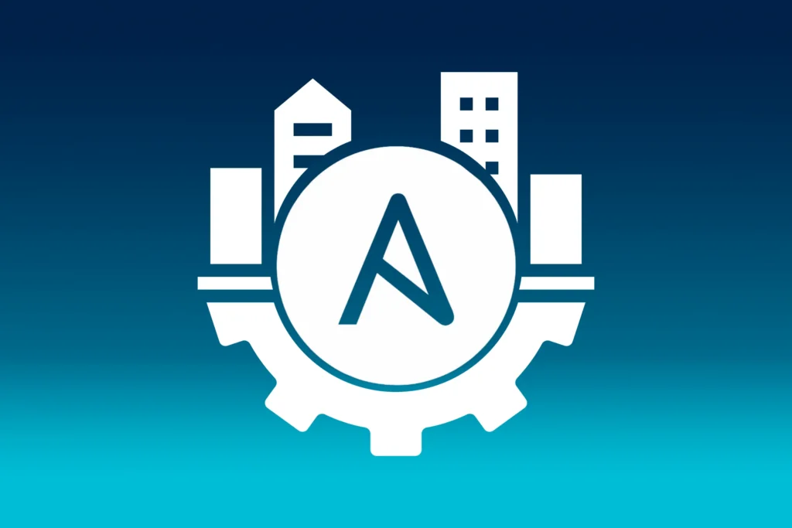
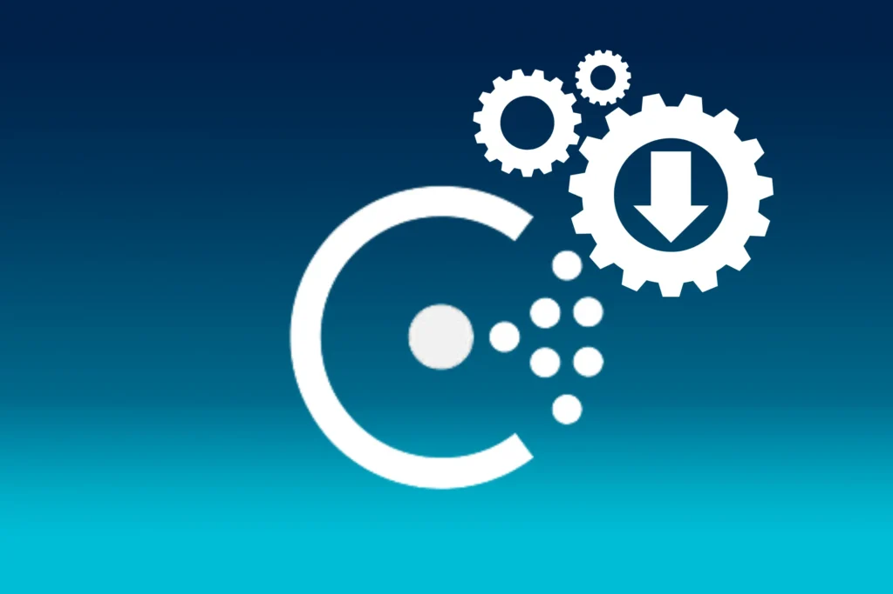
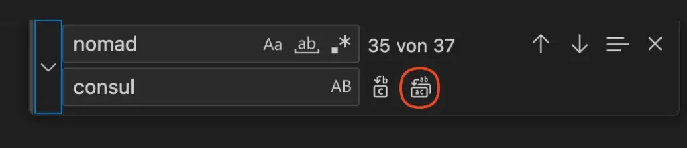
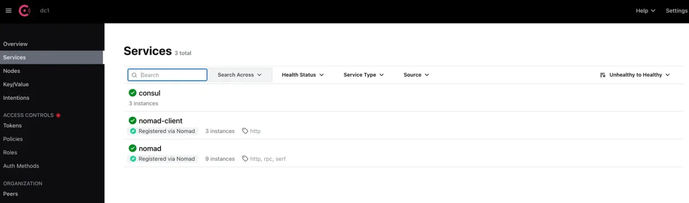
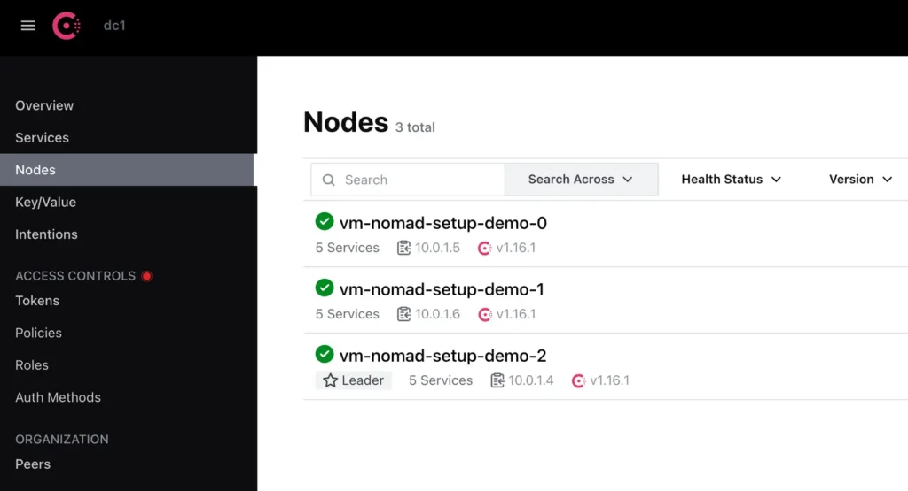

# Setup von Hashcorp Nomad -

Schritt 4: Ansible - consul

Der Artikel fokussiert auf das Setup von Nomad, beginnend mit einem überblickgebenden Einführungstext, gefolgt von einer konkreten Folge von Schritten, die in einzelnen Blockartikeln inklusive exakter Anweisungen beschrieben werden.  Die Artikel bauen aufeinander auf,   können allerdings je nach Bedarf auch übersprungen werden.

[Setup von Hashicorp Nomad](https://thinkport.digital/setup-von-hashicorp-nomad/)

[Schritt 1:  
Terraform](https://thinkport.digital/setup-hashcorp-nomad-mit-terraform)

[Schritt 2:  
Ansible](https://thinkport.digital/setup-hashicorp-nomad-mit-ansible/)

[Schritt 2.1:  
Ansible - ufw](https://thinkport.digital/setup-hashicorp-nomad-ansible-ufw/)

[Schritt 2.2:  
Ansible - fail2ban](https://thinkport.digital/setup-hashicorp-nomad-ansible-fail2ban/)

[Schritt 3:  
Ansible - nomad](https://thinkport.digital/setup-hashicorp-nomad-ansible-nomad/)

Schritt 4:  
Ansible - consul

Um Consul zu installieren müssen wir nicht viel anders machen als bei Nomad, daher können wir den nomad Rollen-Ordner einmal kopieren und in consul umbenennen, danach bearbeiten wir zuerst die `tasks/main.yml` Datei. In VS Code drücken wir Command+F um anschließend alle in der Datei vorhandenen nomad Wörter gegen consul auszutauschen.

Um mit Command+F zu ersetzen statt zu suchen müssen wir den Pfeil links ausklappen. Anschließend gehen wir auf das markierte Symbol um alle Wörter auszutauschen!

Nun müssen wir nur noch bei unserer Version-Check-Task den ersten Buchstaben wieder groß schreiben, da dieser Vergleich auch Groß- und Kleinschreibung beachtet.

Der Output des Commands `consul version` sieht so aus, daher benötigen wir ein großes “Consul”.

    				 `thinkport@vm-nomad-setup-demo-0:~$ consul version Consul v1.16.1`

Also ändern wir hier `consul v` zu `Consul v` (in Zeile 5 der Abbildung)

    				 `- name: Check consul version     command: consul version     register: consul_version_output     changed_when: false     failed_when: "'consul v' not in consul_version_output.stdout"`

Da wir auch hier default Werte brauchen legen wir diese nun an bzw. modifizieren die von der Nomad-Rolle kopierten Werte mit der gleichen Methode:

    				 `--- prerequisites:     - unzip consul_version: "1.16.1" # Dirs and Links hashicorp_releases_url: https://releases.hashicorp.com consul_install_dir: /usr/local/bin consul_data_dir: /opt/consul consul_config_dir: /etc/consul.d #User&Groups consul_user: consul consul_group: consul`

Ansible Vars File - Ansible Variables File (vars.json)

Nun haben wir auch schon alle Tasks entsprechend angepasst. Jetzt müssen wir noch das Service- sowie Config-Template richtig konfigurieren. Das passende Service-Template finden wir wieder auf der Website von HashiCorp, du kannst es von [hier](https://developer.hashicorp.com/consul/tutorials/production-deploy/deployment-guide#configure-the-consul-process 'https://developer.hashicorp.com/consul/tutorials/production-deploy/deployment-guide#configure-the-consul-process') kopieren. Anschließend müssen wir das Template wieder anpassen:

    				 `[Unit] Description="HashiCorp Consul - A service mesh solution" Documentation=https://www.consul.io/ Requires=network-online.target After=network-online.target ConditionFileNotEmpty={{consul_config_dir}}/config.hcl [Service] EnvironmentFile=-{{consul_config_dir}}/consul.env User= {{consul_user}} Group= {{consul_group}} ExecStart={{consul_install_dir}}/consul agent -config-dir={{consul_config_dir}}/ ExecReload=/bin/kill --signal HUP $MAINPID`

Als nächstes passen wir noch die Konfigurationsdatei an.

Für Consul benötigen wir andere Blöcke als für Nomad, zuerst geben wir aber erstmal das `data_dir` an!

    				 `data_dir = "{{ consul_data_dir }}"`

Nun setzen wir noch die IP-Adresse auf der consul später Web-Anfragen annimmt. Dazu nehmen wir jede - also 0.0.0.0 als IP.

    				 `client_addr = "0.0.0.0"`

Nun müssen wir wieder zu erwartenden Server in der `bootstrap_expect` Variable angeben, dazu benutzen wir wieder die Ansible Variable `{{ consul_bootstrap_expect }}` . Danach setzen wir den Server auf true und schalten ihn damit an. Das User Interface setzen wir auch auf angeschaltet.

    				 `bootstrap_expect = {{ consul_bootstrap_expect }} server = true ui_config {     enabled = true }`

Anschließend fügen wir wieder `retry_join` hinzu um aus der Ansible Gruppe alle privaten IPs auszulesen und diese in einer Liste darzustellen - dadurch verbinden wir alle VMs in ein Consul Cluster.

    				 `retry_join = ["{{ groups['azure_nomad_vms'] | map('extract', hostvars, ['ansible_default_ipv4', "address']) | join('","') }}"]`

Nun binden wir wie gewohnt die geschriebene Rolle in unsere `playbook.yml` Datei ein:

    				 `--- - hosts: azure_nomad_vms     become: yes     roles:         - ufw         - fail2ban         - nomad         - consul     vars:         failed2ban_services:             - name: sshd                 port: 22                 maxretry: 5                 bantime: 60         ufw_apps_allow:             - OpenSSH         ufw_ports_allow:         # nomad             - 4646             - 4647             - 4648         # consul             - 8300             - 8301             - 8302             - 8400             - 8500             - 8600         nomad_group_name: azure_nomad_vms         nomad_bootstrap_expect: "{{ groups[nomad_group_name] | length }}"         nomad_version: 1.6.1         consul_bootstrap_expect: "{{ groups[nomad_group_name] | length }}"         consul_version: 1.16.1`

Wir fügen unter `roles` den Namen der erstellen Rolle hinzu. Danach geben wir die von Consul verwendeten Ports frei. Anschließend geben wir erneut die Anzahl der zu erwartenden VMs in der `consul_bootstrap_expect` Variable an. Um den Download mit der aktuellsten Version zu starten vergeben wir hier wieder die `consul_version` Variable, die dann später den Download-Link für das Consul Paket bildet.

Da wir auch hier wieder auf ein UI zugreifen wollen, müssen wir zuerst eine neue NSG-Rolle erstellen. Dazu gehen wir wieder in unsere `main.tf` Datei und fügen folgenden Code ein:

    				 `security_rule {     name                        = "Consul_UI"     priority                    = 1003     direction                   = "Inbound"     access                      = "Allow"     protocol                    = "Tcp"     source_port_range           = "*"     destination_port_range      = "8500"     source_address_prefix       = "*"     destination_address_prefix  = "*" }`

Damit geben wir eingehende Verbindungen auf dem Port 8500 frei um das User Interface von Consul zu erreichen.

Nun können wir wieder `terraform apply` ausführen und sollten dann auf die UI von Consul zugreifen können. Diese rufen wir unter der Port 8500 auf!

Das Interface von Consul sollte dann so aussehen, du siehst auch direkt die erkannten Services: `nomad, nomad-client`

Auf der “Clients” Seite sollten wir folgendes sehen:

Unter dem Reiter Nodes kannst du dann auch erkennen, dass Consul einen Leader und 2 andere Cluster-Teilnehmer hat!

Nun haben wir auch Consul installiert und zum Laufen gebracht. Jetzt können wir uns Vault annehmen!

## Autoren:

## Keith Schuijlenburg

_Cloud Architect_

## Jonas Budde

_Cloud Engineer_

## Aleksandra Bury

_Cloud Engineer_

## [Weitere Beiträge](https://thinkport.digital/blog)

### [Nomad vs Kubernetes](https://thinkport.digital/nomad-vs-kubernetes/ 'Nomad vs Kubernetes')

[Cloud General](https://thinkport.digital/category/cloud-general/), [Cloud Kubernetes](https://thinkport.digital/category/cloud-kubernetes/)

### [Nomad vs Kubernetes](https://thinkport.digital/nomad-vs-kubernetes/ 'Nomad vs Kubernetes')

[Cloud General](https://thinkport.digital/category/cloud-general/), [Cloud Kubernetes](https://thinkport.digital/category/cloud-kubernetes/)

### [Cloud Consulting with Kubernetes and Docker](https://thinkport.digital/cloud-consulting-with-kubernetes-and-docker/ 'Cloud Consulting with Kubernetes and Docker')

[Cloud General](https://thinkport.digital/category/cloud-general/)

### [Cloud Consulting with Kubernetes and Docker](https://thinkport.digital/cloud-consulting-with-kubernetes-and-docker/ 'Cloud Consulting with Kubernetes and Docker')

[Cloud General](https://thinkport.digital/category/cloud-general/)

### [Grundlagen eines “AI Driven Software Development”-Trainings](https://thinkport.digital/grundlagen-eines-ai-driven-software-development-trainings/ 'Grundlagen eines “AI Driven Software Development”-Trainings')

[Cloud General](https://thinkport.digital/category/cloud-general/), [Cloud Kubernetes](https://thinkport.digital/category/cloud-kubernetes/)

### [Grundlagen eines “AI Driven Software Development”-Trainings](https://thinkport.digital/grundlagen-eines-ai-driven-software-development-trainings/ 'Grundlagen eines “AI Driven Software Development”-Trainings')

[Cloud General](https://thinkport.digital/category/cloud-general/), [Cloud Kubernetes](https://thinkport.digital/category/cloud-kubernetes/)

### [Setup von Hashicorp Nomad mit Ansible](https://thinkport.digital/setup-hashicorp-nomad-mit-ansible/ 'Setup von Hashicorp Nomad mit Ansible')

[Cloud General](https://thinkport.digital/category/cloud-general/), [Streaming](https://thinkport.digital/category/streaming/)

### [Setup von Hashicorp Nomad mit Ansible](https://thinkport.digital/setup-hashicorp-nomad-mit-ansible/ 'Setup von Hashicorp Nomad mit Ansible')

[Cloud General](https://thinkport.digital/category/cloud-general/), [Streaming](https://thinkport.digital/category/streaming/)

### [Was ist Cloud Consulting](https://thinkport.digital/was-ist-cloud-consulting/ 'Was ist Cloud Consulting')

[Cloud General](https://thinkport.digital/category/cloud-general/)

### [Was ist Cloud Consulting](https://thinkport.digital/was-ist-cloud-consulting/ 'Was ist Cloud Consulting')

[Cloud General](https://thinkport.digital/category/cloud-general/)

### [Strategische Entscheidungen für Unternehmen](https://thinkport.digital/strategische-entscheidungen-fuer-unternehmen/ 'Strategische Entscheidungen für Unternehmen')

[Cloud General](https://thinkport.digital/category/cloud-general/), [Streaming](https://thinkport.digital/category/streaming/)

### [Strategische Entscheidungen für Unternehmen](https://thinkport.digital/strategische-entscheidungen-fuer-unternehmen/ 'Strategische Entscheidungen für Unternehmen')

[Cloud General](https://thinkport.digital/category/cloud-general/), [Streaming](https://thinkport.digital/category/streaming/)
