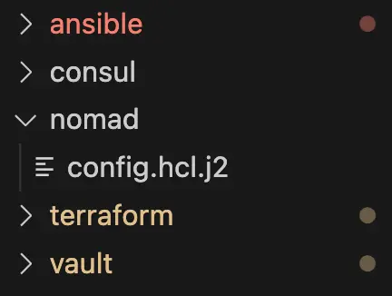
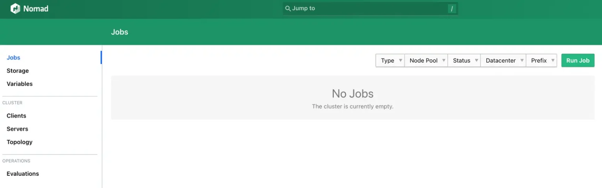
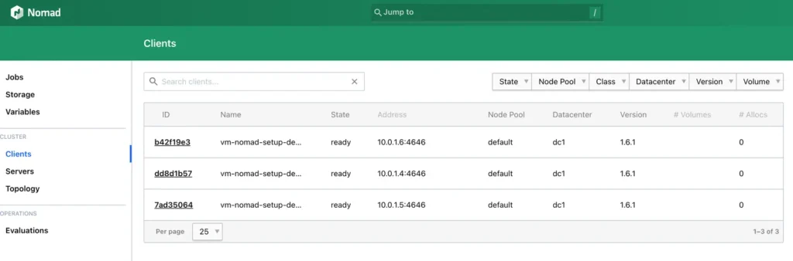
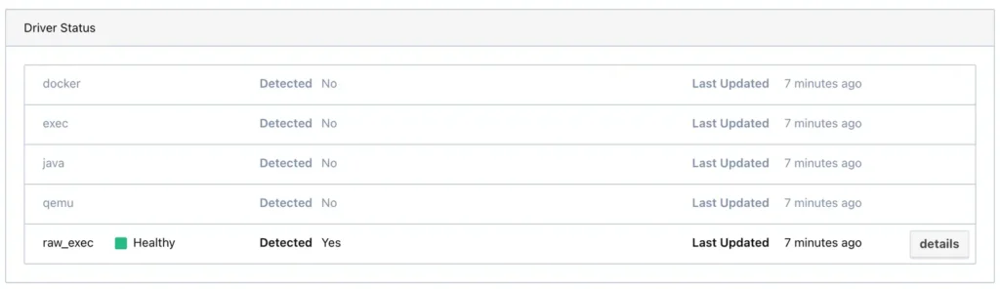
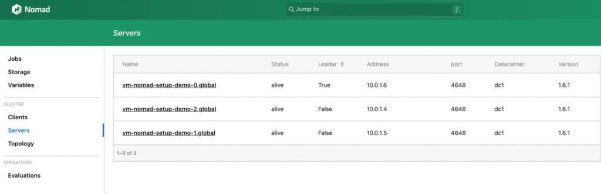

# Setup von Hashicorp -

Schritt 3: Ansible - nomad

Der Artikel fokussiert auf das Setup von Nomad, beginnend mit einem überblickgebenden Einführungstext, gefolgt von einer konkreten Folge von Schritten, die in einzelnen Blockartikeln inklusive exakter Anweisungen beschrieben werden.  Die Artikel bauen aufeinander auf,   können allerdings je nach Bedarf auch übersprungen werden.

[Setup von Hashicorp Nomad](https://thinkport.digital/setup-von-hashicorp-nomad/)

[Schritt 1:  
Terrafom](https://thinkport.digital/setup-hashcorp-nomad-mit-terraform) [Schritt 2:  
Ansible](https://thinkport.digital/setup-hashicorp-nomad-mit-ansible/) 

[Schritt 2.1:  
Ansible - ufw](https://thinkport.digital/setup-hashicorp-nomad-ansible-ufw/)

[Schritt 2.2:  
Ansible - fail2ban](https://thinkport.digital/setup-hashicorp-nomad-ansible-fail2ban/)

Schritt 3:  
Ansible - nomad 

[Schritt 4:  
Ansible - consul](https://thinkport.digital/setup-hashicorp-nomad-ansible-consul/)

Da wir unsere VMs nun durch ufw und fail2ban gesichert haben, können wir nun mit der Installation von Nomad beginnen. Damit wir alles geordnet und übersichtlich haben, erstellen wir auch dafür eine neue Rolle. Dazu führen wieder wieder `ansible-galaxy init nomad` im Ordner `roles` aus. Dadurch entsteht erneut ein Template einer Ansible Rolle, diese befüllen wir nun mit dem nötigen Code.

Wir wollen also Nomad installieren und anschließend als systemd Service bereitstellen. Zuerst müssen wir Nomad herunterladen und im Ordner `/usr/local/bin` speichern. Dazu fügen wir folgenden Befehl ein:  
Bevor wir die `.zip` Datei von der HashiCorp Website herunterladen, müssen wir erstmal unzip installieren um die Datei später zu entpacken.

    				 `--- prerequisites:     - unzip`

Dazu legen wir in der `defaults/main.yml` Datei eine Liste namens `prerequisites` an und führen dort das Software-Paket `unzip` auf.

Danach erstellen wir auch schon unsere erste Task für diese Rolle in der `tasks/main.yml` Datei. Dazu benutzen wir die `package` Task. Wir loopen also durch alle `"{{ item }}"` der Liste `"{{ prerequisites }}"` und setzen den State auf `present` um das Paket immer auf der Maschine zu haben.

    				 `--- - name: Ensure prerequisites     package:         name: "{{ item }}"         state: present     loop: "{{ prerequisites }}"`

Danach laden wir auch schon die Datei für nomad herunter. Dazu benutzen wir die `unarchive` Task, da die Datei als zip von HashiCorp bereitgestellt wird.

    				 `- name: Install Nomad from releases      unarchive:         src: https://releases.hashicorp.com/nomad/{{ nomad_version }}/nomad_{{ nomad_version }}_linux_amd64.zip         dest: "{{ nomad_install_dir }}"         remote_src: yes         creates: "{{ nomad_install_dir }}/nomad"         owner: root         group: root         mode: 0755`

Hier setzen wir aus dem normalen Download-Link unsere speziellen Download-Link zusammen, denn wir wollen am Ende bestimmen welche Version von Nomad installiert wird. Dazu verwenden wir wieder einen Variable namens `nomad_version` , diese legen wir dann auch in der `defaults/main.yml` Datei an und vergeben einen Wert (Stand Aug. 23 - Nomad 1.6.1).  
Bei `src` geben wir also die Internetadresse des ZIP-Pakets an welches entpacket werden soll. Im Feld `dest` geben wir dann direkt das Installationsverzeichnis an, in das Nomad installiert werden soll. Anschließend setzen wir den `remote_src` Parameter auf `yes` , legen den Install Ordner an, falls er noch nicht da ist und setzen die entsprechenden Berechtigungen für den root User und die root Gruppe.

Nun legen wir direkt auch noch 5 weitere Default-Werte an. Für ein Konfigurations-Ordner, den Installations-Ordner, einen Daten-Ordner, den Nomad-Benutzer und die Nomad-Gruppe. Die `defaults/main.yml` Datei sollte dann so aussehen:

    				 `--- prerequisites: - unzip nomad_version: "1.6.1" # Nomad vars hashicorp_releases_url: https://releases.hashicorp.com nomad_install_dir: /usr/local/bin nomad_data_dir: /opt/nomad nomad_config_dir: /etc/nomad.d #User&Groups nomad_user: nomad nomad_group: nomad`

Ansible Vars File - Ansible variables File (vars.json)

Als nächstes überprüfen wir ob nomad richtig installiert wurde, dazu benutzen wir einfach den Command `nomad version` , sofern dieser nicht die erwartete Rückmeldung gibt, gibt Ansible einen Fehler aus. Wir verwenden dazu die Ansible Task `command` , eigentlich gibt es für die gängigen Aufgaben immer eigene Ansible Tasks (siehe ufw, unarchive package). In diesem speziellen Fall haben wir keine nomad Task, sondern können nur auf die Command Task zurückgreifen.

    				 `- name: Check nomad version      command: nomad version      register: nomad_version_output      changed_when: false      failed_when: "'Nomad v' not in nomad_version_output.stdout"`

Für führen also den Command `nomad version` aus, speichern den Output des Commands über `register:` in eine Variable namens `nomad_version_output` und setzen dann den Wert `failed_when:` um zu schauen ob “Nomad v” in dem Output des Commands auftaucht, wenn nicht schlägt Ansible fehl!

Den `changed_when` Wert setzen wir hier auf false, damit wir keine “changed” Benachrichtigung von Ansible bekommen. Wir wollen hier nur wissen, ob es geklappt hat oder nicht.

Tasks in Ansible liefern immer eine der folgenden Resultate zurück:  
_ok = Es wurde nichts gemacht, die Maschine ist bereits so konfiguriert wie es der Code besagt_  
_changed = Die Maschine wurde entsprechend des Codes verändert_  
_unreachable = Die Maschine ist nicht erreichbar_  
_failed = Die Aufgabe konnte aufgrund eines Fehlers nicht ausgeführt werden_  
_skipped = Die Aufgabe wurde übersprungen (wenn_ `when` _true wiedergibt)_  
_ignored = Alle Fehler werden übersprungen, falls sie auftreten_

Nun sind wir uns also sicher, dass nomad installiert wurde und ausführbar ist. Als nächstes erstellen wir eine Nomad-Gruppe sowie einen Nomad-User, damit wir das ggf. noch abändern können benutzen wir auch hier wieder Variablen. Dazu legen wir zuerst wieder in der `defaults/main.yml` eine Variable namens `nomad_group` und `nomad_user` an und vergeben jeweils den Wert nomad. Später können wir diesen Wert immer noch überschreiben, denn diese Werte sind nur Standard-Werte, sofern man im Playbook eine `nomad_user` Variable setzt, zählt diese immer mehr als die aus der `defaults/main.yml` !

Mit diesen 2 Tasks legen wir also erstmal eine Gruppe mit der Variable `nomad_group` an und danach einen User mit der Variable `nomad_user` der sich direkt in der Gruppe befindet und einen Home-Ordner an dem Ort hat, wo später die Konfigurationsdateien für Nomad liegen werden.

    				 `- name: Create a nomad group     group:         name: "{{ nomad_group }}"         system: yes - name: Create a nomad user     user:         name: "{{ nomad_user }}"         group: "{{ nomad_group }}"         comment: "Nomad user"         shell: /bin/false         system: yes         create_home: yes         home: "{{ nomad_config_dir }}"`

Nun haben wir also eine Gruppe, einen User und ein Home-Verzeichnis erstellt. Um in diesem Verzeichnis als besitzender User Dinge lesen, schreiben und ausführen zu können vergeben wir nun noch die passenden Berechtigungen.

    				 `- name: Set the permissions on the nomad home directory      file:         path: "{{ nomad_config_dir }}"         state: directory         owner: "{{ nomad_user }}"         group: "{{ nomad_group }}"         mode: 0700`

[Hier](https://chmodcommand.com/chmod-0700/ 'https://chmodcommand.com/chmod-0700/') kannst du schauen welcher Code welchen Berechtigungen entspricht Als nächstes müssen wir noch das Verzeichnis anlegen in dem Nomad später dann die systemrelevanten Daten ablegt. Dazu benutzen wir erneut die `file` Task, mit dieser können wir über Ansible Dateien oder Ordner erstellen oder auch die Abwesenheit der Ordner sicherstellen. Dabei gibt es wieder verschiedene States, diese kannst du [hier](https://docs.ansible.com/ansible/latest/collections/ansible/builtin/file_module.html 'https://docs.ansible.com/ansible/latest/collections/ansible/builtin/file_module.html') nachschauen.

Hier setzen wir nun also die Variable `nomoad_data_dir` ein um den Ordnerpfad und Namen zu vergeben, setzen als state Directory um einen Ordner zu erzeugen, setzen als Owner und Group jeweils wieder unsere Nomad User und Gruppe. Was der Code bedeutet kannst du ja durch den Link oben mal versuchen herauszufinden!

    				 `- name: Create a data directory      file:         path: "{{ nomad_data_dir }}"         state: directory         owner: "{{ nomad_user }}"         group: "{{ nomad_group }}"         mode: 0755`

Jetzt sind wir auch schon fast fertig, nun müssen wir noch Nomad konfigurieren und den Service erstellen sowie aktivieren.

Zuerst erstellen wir also die Config-Datei über ein Template und speichern diese dann in unserem gerade erstellen Config-Ordner.

Wir benutzen diesmal eine template Task, wir verweisen auf ein Jinja2 Template in einem gesonderten Ordner für die Konfiguration und platzieren dann das durch Ansible befüllte Template in dem vorhin erstellen Config-Ordner. Mit Jinja2 können wir in diesem Fall Variablen von Ansible in eine Datei schreiben die dann von Nomad als Konfiguration verwendet wird. Die Konfigurationsdatei von Nomad wird auch wie Terraform in der HCL (HashiCorp Configuration Language) geschrieben.

    				 `- name: Template Nomad config directory      template:         src: ../nomad/config.hcl.j2         dest: "{{ nomad_config_dir }}/config.hcl"         mode: "0644"         owner: "{{ nomad_user }}"         group: "{{ nomad_group }}"`

Da wir ggf. später noch andere Dateien für nomad brauchen legen wir am besten direkt einen Ordner in unserer Struktur an, wir brauchen am Ende 5 Ordner wie auf dem folgenden Bild zu sehen:

In dem Nomad Ordner legen wir auch direkt die Template-Datei für Nomad an. Wir benennen sie hier `config.hcl.j2` (j2 steht hierbei für jinja2). In der Datei legen wir nun die nötigen Konfigurationen für Nomad an damit es später auch im Cluster funktioniert und als Server und Client ausgeführt wird.

Wir geben Nomad zuerst das `data_dir` über eine Variable mit. Dazu erstellen wir folgenden Eintrag:

Die Variable aus Ansible referenzieren wir hier genauso wie auch in Ansible selber mit `"{{ variablenname }}"` . Nun konfigurieren wir zuerst die Server-Funktion von Nomad, dadurch bilden wir ein Cluster aus unseren VMs.

    				 `data_dir = "{{ nomad_data_dir }}"`

    				 `server {     enabled             = true     bootstrap_expect    = {{ nomad_bootstrap_expect }}     start_join = ["{{ groups['azure_nomad_vms'] | map('extract', hostvars, ['ansible_default_ipv4', 'address']) | join('","') }}"] }`

Wir setzen also den Server Block auf `enabled = true` , danach geben wir die Anzahl der zu erwartenden Server im Cluster an, diese Anzahl vergeben wir auch wieder mit einer Variable die wir später im `playbook.yml` festlegen. Danach müssen wir eine Liste aller privaten IP-Adressen erstellen die im Cluster sein sollen. Die Funktion liest aus den Facts von Ansible (siehe Funktion `gather_facts: true` ) nun jede private IP-Adresse und verbindet diese zu einer Liste die so aussieht:

`start_join = ["10.0.1.4","10.0.1.5","10.0.1.6"]`

Dadurch sucht dann jeder Server nach den anderen und bildet ein Cluster.

    				 `client {     enabled     = true }`

Als nächstes konfigurieren wir die Client-Seite von Nomad, dazu setzen wir nur den Client-Block auf `enabled: true`

Anschließend gehen wir noch die nötigen Plugins an, in diesem Fall konfigurieren wir das folgende Plugin:

    				 `plugin "raw_exec" {     config {         enabled = true     } }`

Wir setzen hierbei nun das Plugin “raw_exec” auf enabled, dadurch können wir auf den Clients jeweils Commands ausführen.

Nun haben wir die Konfigurationsdatei fertig und können uns dem letztem Schritt - der Konfiguration und Aktivierung des Services widmen.

Dazu erstellen wir diesmal im templates Ordner der nomad Rolle eine Datei namens nomad.service.j2. Den Inhalt der Rolle können wir uns [hier](https://developer.hashicorp.com/nomad/tutorials/enterprise/production-deployment-guide-vm-with-consul#configure-systemd 'https://developer.hashicorp.com/nomad/tutorials/enterprise/production-deployment-guide-vm-with-consul#configure-systemd') von der HashiCorp Website ziehen, gleich modifizieren wir ihn noch entsprechend. Wir passen nun den User und die Group wieder so an, dass sie als Variable mitgegeben werden. Anschließend geben wir beim Start-Command auch den Pfad zu unserem Install-Dir an.

Die Datei sollte dann in der Mitte so aussehen, den Rest müssen wir nicht verändern:

    				 `[Service] User= {{nomad_user}} Group= {{nomad_group}} ExecReload=/bin/kill -HUP $MAINPID ExecStart={{nomad_install_dir}}/nomad agent -config={{nomad_config_dir}}/ KillMode=process`

Nun müssen wir nur noch den Service mit Ansible auf die Maschinen bringen und aktivieren.

Dazu benutzen wir erneut die template Task und kopieren die gerade erstellte Datei in den systemd Ordner. Anschließend benutzen wir die Ansible Task “systemd” um den Service zu benennen ( `name` ), ihn zu starten ( `state: restarted` ), ihn immer beim Starten der VM automatisch zu starten und den Daemon auch neu zu laden.

    				 `- name: Set up Nomad Systemd service     template:         src: nomad.service.j2         dest: /etc/systemd/system/nomad.service - name: Ensure nomad service     systemd:         name: nomad         state: restarted         enabled: true         daemon_reload: true`

Nun müssen wir die Rolle nur noch im Playbook erwähnen. Dazu fügen wir sie nach der ufw und fail2ban Rolle in die Liste der vom Playbook zu verwendenden Rollen ein.

    				 `--- - hosts: azure_nomad_vms     become: yes     roles:         - ufw         - fail2ban         - nomad     vars:         failed2ban_services:             - name: sshd                 port: 22                 maxretry: 5                 bantime: 60         ufw_apps_allow:             - OpenSSH         ufw_ports_allow:         # nomad             - 4646             - 4647             - 4648         nomad_group_name: azure_nomad_vms         nomad_bootstrap_expect: "{{ groups[nomad_group_name] | length }}"         nomad_version: 1.6.1`

Da wir auch noch einige Variablen brauchen, setzen wir diese auch wieder in dem `vars` Block.  
Zuerst geben wir die für Nomad wichtigen Variablen frei indem wir die Liste `ufw_ports_allow` mit den Werte 4646, 4647 und 4648 befüllen. Den `nomad_group_name` brauchen wir um die privaten IP Adressen im Jinja2 Template der Nomad Config richtig zu generieren. Die zu erwartende Anzahl an VMs können wir uns dann anhand dieser Gruppe berechnen, indem wir die Länge ermitteln. Zuletzt setzen wir noch die gewünschte Version, da wir diese brauchen um das richtige Paket von der HashiCorp-Website herunterzuladen.

Da wir mit Terraform eine NSG eingeführt haben, die Netzwerkverbindungen aus dem Internet auf die VMs verbietet, müssen wir nun noch den Port 4646 (User Interface von Nomad) freigeben. Dazu gehen wir in unsere `main.tf` Datei und fügen in der Ressource `azurerm_network_security_group` noch eine neue Regel für nomad ein.

    				 `security_rule {     name                        = "Nomad_UI"     priority                    = 1002     direction                   = "Inbound"     access                      = "Allow"     protocol                    = "Tcp"     source_port_range           = "*"     destination_port_range      = "4646"     source_address_prefix       = "*"     destination_address_prefix  = "*" }`

Nun können wir auch schon terraform apply ausführen und sollten so Nomad auf den VMs installiert haben. Nun können wir die über die öffentliche IP Adresse jeder VM mit dem Port 4646 auf Nomad zugreifen.

Das Interface sollte nun beim zugreifen so aussehen:

Auf der “Clients” Seite sollten wir folgendes sehen:

Wenn du auf einen der Clients klickst, solltest du auch unter Driver Status das Plugin `raw_exec` als Healthy sehen, dieses Plugin haben wir vorhin in der `config.hcl.j2` Datei enabled.

Auf der “Server” Seite sollten wir nun auch die gewünschte Anzahl an VMs sehen:

Im nächsten Schritt fügen wir auch schon Consul hinzu!

## Autoren:

## Keith Schuijlenburg

_Cloud Architect_

## Jonas Budde

_Cloud Engineer_

## Aleksandra Bury

_Cloud Engineer_

## [Weitere Beiträge](https://thinkport.digital/blog)

### [Grundlagen eines “AI Driven Software Development”-Trainings](https://thinkport.digital/grundlagen-eines-ai-driven-software-development-trainings/ 'Grundlagen eines “AI Driven Software Development”-Trainings')

[Cloud General](https://thinkport.digital/category/cloud-general/), [Cloud Kubernetes](https://thinkport.digital/category/cloud-kubernetes/)

### [Grundlagen eines “AI Driven Software Development”-Trainings](https://thinkport.digital/grundlagen-eines-ai-driven-software-development-trainings/ 'Grundlagen eines “AI Driven Software Development”-Trainings')

[Cloud General](https://thinkport.digital/category/cloud-general/), [Cloud Kubernetes](https://thinkport.digital/category/cloud-kubernetes/)

### [Setup von Hashicorp Nomad mit Ansible](https://thinkport.digital/setup-hashicorp-nomad-mit-ansible/ 'Setup von Hashicorp Nomad mit Ansible')

[Cloud General](https://thinkport.digital/category/cloud-general/), [Streaming](https://thinkport.digital/category/streaming/)

### [Setup von Hashicorp Nomad mit Ansible](https://thinkport.digital/setup-hashicorp-nomad-mit-ansible/ 'Setup von Hashicorp Nomad mit Ansible')

[Cloud General](https://thinkport.digital/category/cloud-general/), [Streaming](https://thinkport.digital/category/streaming/)

### [Synapse, Databricks, Glue, Athena – Welche Lösung für Big Data?](https://thinkport.digital/synapse-databricks-athena-welche-loesung-fuer-big-data/ 'Synapse, Databricks, Glue, Athena – Welche Lösung für Big Data?')

[Big Data](https://thinkport.digital/category/big-data/), [Cloud General](https://thinkport.digital/category/cloud-general/)

### [Synapse, Databricks, Glue, Athena – Welche Lösung für Big Data?](https://thinkport.digital/synapse-databricks-athena-welche-loesung-fuer-big-data/ 'Synapse, Databricks, Glue, Athena – Welche Lösung für Big Data?')

[Big Data](https://thinkport.digital/category/big-data/), [Cloud General](https://thinkport.digital/category/cloud-general/)

### [Core Strategies Cloud Migration](https://thinkport.digital/core-strategies-cloud-migration/ 'Core Strategies Cloud Migration')

[Cloud General](https://thinkport.digital/category/cloud-general/), [Cloud Kubernetes](https://thinkport.digital/category/cloud-kubernetes/)

### [Core Strategies Cloud Migration](https://thinkport.digital/core-strategies-cloud-migration/ 'Core Strategies Cloud Migration')

[Cloud General](https://thinkport.digital/category/cloud-general/), [Cloud Kubernetes](https://thinkport.digital/category/cloud-kubernetes/)

### [Was ist Databricks Training?](https://thinkport.digital/was-ist-databricks-training/ 'Was ist Databricks Training?')

[Big Data](https://thinkport.digital/category/big-data/), [Cloud General](https://thinkport.digital/category/cloud-general/)

### [Was ist Databricks Training?](https://thinkport.digital/was-ist-databricks-training/ 'Was ist Databricks Training?')

[Big Data](https://thinkport.digital/category/big-data/), [Cloud General](https://thinkport.digital/category/cloud-general/)

### [Setup Hashcorp Nomad mit Terraform](https://thinkport.digital/setup-hashcorp-nomad-mit-terraform/ 'Setup Hashcorp Nomad mit Terraform')

[Cloud General](https://thinkport.digital/category/cloud-general/)

### [Setup Hashcorp Nomad mit Terraform](https://thinkport.digital/setup-hashcorp-nomad-mit-terraform/ 'Setup Hashcorp Nomad mit Terraform')

[Cloud General](https://thinkport.digital/category/cloud-general/)
