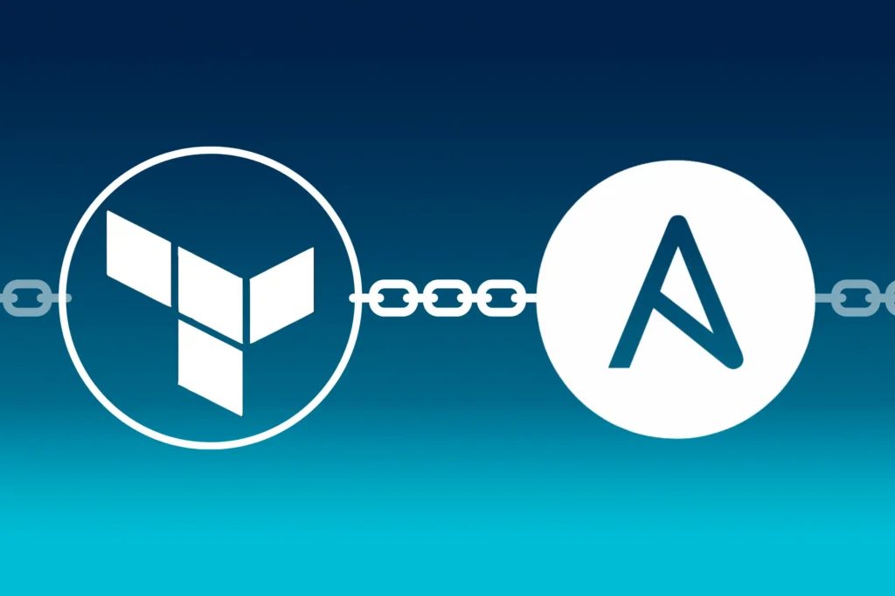
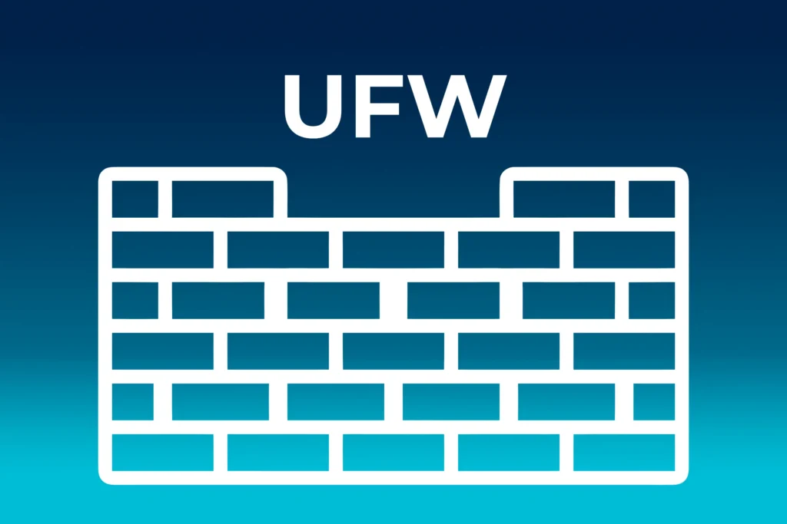
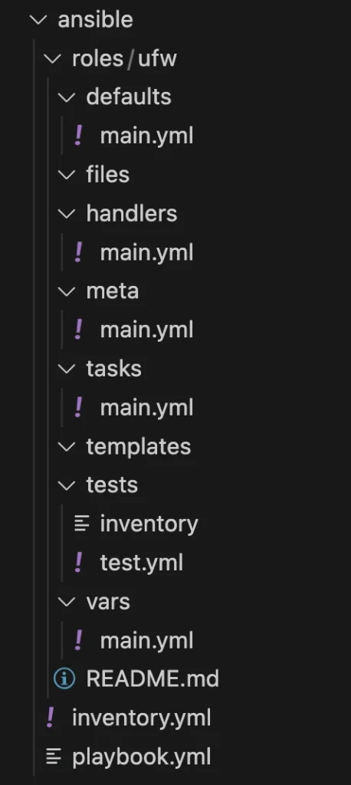
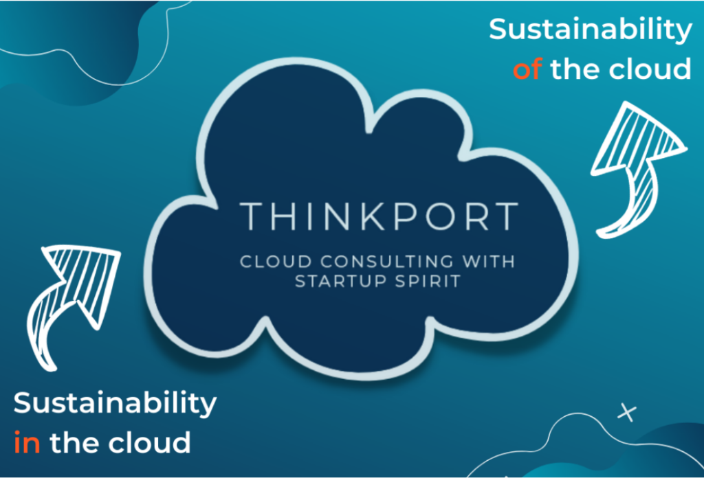

# Setup von Hashicorp - 

Schritt 2.1: Ansible - ufw

Der Artikel fokussiert auf das Setup von Nomad, beginnend mit einem überblickgebenden Einführungstext, gefolgt von einer konkreten Folge von Schritten, die in einzelnen Blockartikeln inklusive exakter Anweisungen beschrieben werden.  Die Artikel bauen aufeinander auf,   können allerdings je nach Bedarf auch übersprungen werden.

[Setup von Hashicorp Nomad](https://thinkport.digital/setup-von-hashicorp-nomad/)

 

[Schritt 1:  
Terrafom](https://thinkport.digital/setup-hashcorp-nomad-mit-terraform) [Schritt 2:  
Ansible](https://thinkport.digital/setup-hashicorp-nomad-mit-ansible/) 

Schritt 2.1:  
Ansible - ufw

[Schritt 2.2:  
Ansible - fail2ban](https://thinkport.digital/setup-hashicorp-nomad-ansible-fail2ban/)

[Schritt 3:  
Ansible - nomad](https://thinkport.digital/setup-hashicorp-nomad-ansible-nomad/)

[Schritt 4:  
Ansible - consul](https://thinkport.digital/setup-hashicorp-nomad-ansible-consul/)

Um unsere Maschinen zu schützen wollen wir ufw und fail2ban installieren.

## Erstellen der ufw Rolle

Zuerst nehmen wir uns ufw (also der “**u**ncomplicated **f**ire**w**all”) an, dazu schreiben wir nun selber eine Rolle die wir dann später nur noch in der `playbook.yml` Datei aufrufen um ufw zu installieren und zu konfigurieren.  
Dazu erstellen wir zuerst eine Ordnerstruktur. Beim Schreiben von Rollen für Ansible gibt es dafür eine Konvention:

				
					 `roles/     common/               # this hierarchy represents a "role"         tasks/            #             main.yml      #  <-- tasks file can include smaller files if warranted         handlers/         #             main.yml      #  <-- handlers file         templates/        #  <-- files for use with the template resource             ntp.conf.j2   #  <------- templates end in .j2         files/            #             bar.txt       #  <-- files for use with the copy resource             foo.sh        #  <-- script files for use with the script resource         vars/             #             main.yml      #  <-- variables associated with this role         defaults/         #             main.yml      #  <-- default lower priority variables for this role         meta/             #             main.yml      #  <-- role dependencies         library/          # roles can also include custom modules         module_utils/     # roles can also include custom module_utils         lookup_plugins/   # or other types of plugins, like lookup in this case     webtier/              # same kind of structure as "common" was above, done for the webtier role     monitoring/           # ""     fooapp/               # ""`

				
			

Wir legen also in dem `ansible` Ordner einen Unterordner namens `roles` an. Um es uns einfach zu machen führen wir dann im Ordner `roles` folgenden Befehl aus: `ansible-galaxy int ufw` . Dadurch sollte folgende Ordnerstruktur in dem `roles` Ordner erstellt werden:

Beim Ausführen der Rolle aus der `playbook.yml` Datei werden dann von Ansible alle tasks aus der `tasks/main.yml` Datei abgearbeitet.  
In der `defaults/main.yml` Datei legen wir Standard-Werte für unsere Rolle fest. Beim späteren Ausführen der Rolle können diese noch überschrieben werden.  
In der `handlers/main.yml` Datei können wir später Services auf der virtuellen Maschine definieren. Diese können wir dann beim Konfigurieren über einen Call ansprechen, damit der Service neugestartet wird und die Änderungen dadurch zum Tragen kommen.

In der `meta/main.yml` Datei können wir noch Details zu dieser UFW Rolle angeben.  
Den Rest der Struktur brauchen wir für diese Rolle nicht.

  

Nun können wir anfangen mit der Installation von ufw dazu können wir das in Ansible eingebaut `apt` Modul benutzen. Wir öffnen also die `tasks/main.yml` und fügen folgenden Task-Block ein:

				
					 `- name: install ufw firewall      apt: name=ufw update_cache=yes state=latest`

				
			

Zuerst benennen wir die Task mit `install ufw firewall` und anschließend benutzen wir die `apt` Task um den Namen `ufw` anzugeben, den Cache updaten (ist wie `apt get-update` ) und zuletzt den state auf `latest` legen, dadurch sagen wir Ansible, dass von ufw immer die aktuellste Version installiert sein soll!

Andere States sind z. B.:

**absent** = Software soll nicht auf der Maschine installiert sein

**present** = Software soll auf der Maschine installiert sein, Ansible schaut aber nicht nach der Version

Nun haben wird also die `ufw` installiert, danach wollen wir zuerst alle einkommenden Verbindungen verbieten und alle ausgehenden erlauben. Dazu fügen wir die folgenden beiden Blöcke ein:

				
					

 `- name: ufw deny incoming     ufw:    		direction: incoming    		proto: any    		policy: deny 	notify: 	- reload ufw`

				
			

				
					

 `- name: ufw allow outgoing     ufw:    		direction: outgoing    		proto: any    		policy: allow 	notify: 	- reload ufw`

				
			

Wie du siehst sprechen wir hier nicht mehr die `apt` Task an, sondern die `ufw` Task - dies ist eine in Ansible eingebaute Task mit der wir die ufw sehr einfach konfigurieren können. Am Ende dieser Task verwenden wir noch einen Handler um den ufw Dienst neuzustarten. Dazu geben wir den Namen des Handlers ein (hier `reload ufw` ). Da wir den Handler noch nicht angelegt haben machen wir das nun.

Wir fügen also in der `handlers/main.yml` Datei folgenden Code ein:

				
					 `- name: reload ufw      ufw:         state: reloaded`

				
			

Der Name kommt dir bestimmt bekannt vor, dieser Name ist wichtig um in der `tasks/main.yml` einen Neustart der ufw auszulösen. Wir setzen also wir die ufw Task ein und setzen diesmal den Status auf reloaded.

Zurück in der `tasks/main.yml` Datei haben wir also nun ufw installiert, alle eingehenden Verbindungen verboten, alle ausgehenden erlaubt und nach jeder Änderung den ufw Service erneut gestartet.

Jetzt erlauben wir über eine Variable im Playbook alle Apps und Ports für ufw. Dazu fügen wir folgenden Code ein:

				
					 `- name: ufw allow apps from vars      ufw:             rule: allow             name: "{{ item }}"      with_items: "{{ ufw_apps_allow }}"      when: ufw_apps_allow is defined      notify:      - reload ufw`

				
			

				
					 `- name: ufw allow ports from vars      ufw:             rule: allow             port: "{{ item }}"             proto: tcp      with_items: "{{ ufw_ports_allow }}"      when: ufw_ports_allow is defined      notify:      - reload ufw`

				
			

Hier benutzen wir also wieder die `ufw` Task um Änderungen an der Firewall vorzunehmen. Wir erlauben jeweils alle Apps/Ports die wir hier deklarieren. Um nicht für jeden Port eine einzelne Task schreiben zu müssen, benutzen wir `with_items` und übergeben damit eine Variable, in diesem Fall eine Liste von Ports bzw. Apps. Diese List referenzieren wir dann mit `“{{ item }}"` im `name` Feld. Diese Task führen wir dann aber nur aus sofern `ufw_apps/ports_allow` definiert ist. Danach führen wieder wieder einen Reload des ufw Services durch.

Zum Schluss stellen wir noch sicher, dass ufw beim Start der virtuellen Maschine automatisch startet.

				
					 `- name: enable ufw service      ufw:         state: enabled`

				
			

Hier stellen wir also den Status des ufw Services auf “enabled” also wird ufw nun bei jedem VM Start automatisch gestartet.

Nun sind wir mit den Tasks durch, wir legen nun noch in `defaults/main.yml` einen Wert für ufw\_apps\_allow für OpenSSH an, damit wir uns immer über SSH verbinden können. Sonst vergessen wir ggf. die Variable und dann sperren wir uns selber aus.

Dazu erstellen wir folgenden Eintrag in der `defaults/main.yml`

Nun haben wir die Rolle in einem betriebsbereitem Zustand, daher binden wir sie nun in unsere `playbook.yml` Datei ein. Dazu modifizieren wir die Datei wie folgt:

 

				
					 `ufw_apps_allow: "OpenSSH"`

				
			

				
					 `--- - hosts: azure_nomad_vms     become: yes     roles:         - ufw     vars:         ufw_apps_allow:             - OpenSSH #       ufw_ports_allow:`

				
			

Wir fügen also die Rolle `ufw` unter `roles` hinzu. Danach legen wir auch noch eine List für `ufw_apps_allow` an, darin schreiben wir bislang nur den Wert für `OpenSSH` . Später verwenden wir für Nomad, Consul und Vault noch spezielle Ports, daher können wir die Variable `ufw_ports_allow` bereits kommentiert anlegen.

Sobald du nun also `terraform apply` ausführst, wird die Infrastruktur bereitgestellt, das Inventar durch `ansible_host` in den Terraform State ( `terraform.tfstate` ) geschrieben, danach durch die `null_resource` mit einem `local_exec` das Playbook ausgeführt, beim Ausführen geben wir dann die `inventory.yml` Datei an die auf das `plugin: cloud.terraform.terraform_provider` Plugin verweist. Dieses Plugin sucht dann im Terraform State nach dem Inventar und führt nun auch unsere `ufw` Rolle aus!

## Autoren:

## Keith Schuijlenburg

_Cloud Architect_

## Jonas Budde

_Cloud Engineer_

## Aleksandra Bury

_Cloud Engineer_

## [Weitere Beiträge](https://thinkport.digital/blog)

### [Strategische Entscheidungen für Unternehmen](https://thinkport.digital/strategische-entscheidungen-fuer-unternehmen/ "Strategische Entscheidungen für Unternehmen")

[Cloud General](https://thinkport.digital/category/cloud-general/), [Streaming](https://thinkport.digital/category/streaming/)

### [Strategische Entscheidungen für Unternehmen](https://thinkport.digital/strategische-entscheidungen-fuer-unternehmen/ "Strategische Entscheidungen für Unternehmen")

[Cloud General](https://thinkport.digital/category/cloud-general/), [Streaming](https://thinkport.digital/category/streaming/)

### [Grundlagen eines “AI Driven Software Development”-Trainings](https://thinkport.digital/grundlagen-eines-ai-driven-software-development-trainings/ "Grundlagen eines “AI Driven Software Development”-Trainings")

[Cloud General](https://thinkport.digital/category/cloud-general/), [Cloud Kubernetes](https://thinkport.digital/category/cloud-kubernetes/)

### [Grundlagen eines “AI Driven Software Development”-Trainings](https://thinkport.digital/grundlagen-eines-ai-driven-software-development-trainings/ "Grundlagen eines “AI Driven Software Development”-Trainings")

[Cloud General](https://thinkport.digital/category/cloud-general/), [Cloud Kubernetes](https://thinkport.digital/category/cloud-kubernetes/)

### [Sustainability of the Cloud](https://thinkport.digital/sustainability-of-the-cloud/ "Sustainability of the Cloud")

[Cloud General](https://thinkport.digital/category/cloud-general/)

### [Sustainability of the Cloud](https://thinkport.digital/sustainability-of-the-cloud/ "Sustainability of the Cloud")

[Cloud General](https://thinkport.digital/category/cloud-general/)

### [Echtzeit-KI: Apache Kafka und OpenAI sind die Zukunft der Datenanalyse](https://thinkport.digital/kafka-und-openai-zukunft-der-datenanalyse/ "Echtzeit-KI: Apache Kafka und OpenAI sind die Zukunft der Datenanalyse")

[Cloud General](https://thinkport.digital/category/cloud-general/), [Streaming](https://thinkport.digital/category/streaming/)

### [Echtzeit-KI: Apache Kafka und OpenAI sind die Zukunft der Datenanalyse](https://thinkport.digital/kafka-und-openai-zukunft-der-datenanalyse/ "Echtzeit-KI: Apache Kafka und OpenAI sind die Zukunft der Datenanalyse")

[Cloud General](https://thinkport.digital/category/cloud-general/), [Streaming](https://thinkport.digital/category/streaming/)

### [Setup Hashicorp Nomad Ansible ufw](https://thinkport.digital/setup-hashicorp-nomad-ansible-ufw/ "Setup Hashicorp Nomad Ansible ufw")

[Cloud General](https://thinkport.digital/category/cloud-general/), [Streaming](https://thinkport.digital/category/streaming/)

### [Setup Hashicorp Nomad Ansible ufw](https://thinkport.digital/setup-hashicorp-nomad-ansible-ufw/ "Setup Hashicorp Nomad Ansible ufw")

[Cloud General](https://thinkport.digital/category/cloud-general/), [Streaming](https://thinkport.digital/category/streaming/)

### [Hybrid-Cloud-Manifest](https://thinkport.digital/hybrid-cloud-manifest/ "Hybrid-Cloud-Manifest")

[Cloud General](https://thinkport.digital/category/cloud-general/), [Hybrid-Cloud](https://thinkport.digital/category/hybrid-cloud/)

### [Hybrid-Cloud-Manifest](https://thinkport.digital/hybrid-cloud-manifest/ "Hybrid-Cloud-Manifest")

[Cloud General](https://thinkport.digital/category/cloud-general/), [Hybrid-Cloud](https://thinkport.digital/category/hybrid-cloud/)
