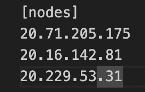
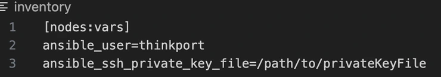
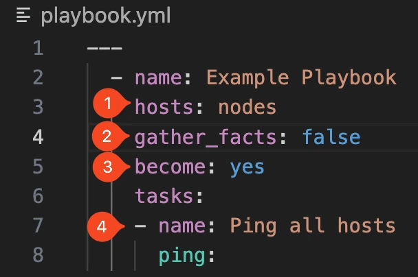
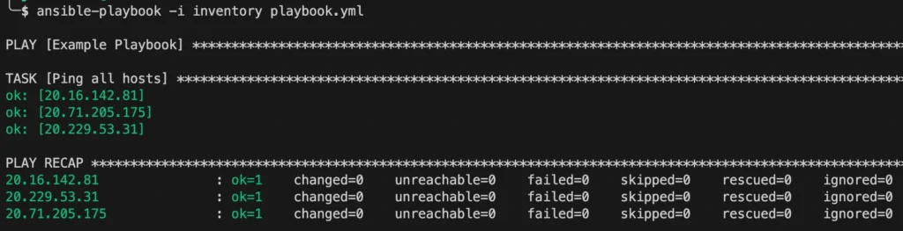

# Setup von Hashicorp Nomad - 

Schritt 2: Ansible

Der Artikel fokussiert auf das Setup von Nomad, beginnend mit einem überblickgebenden Einführungstext, gefolgt von einer konkreten Folge von Schritten, die in einzelnen Blockartikeln inklusive exakter Anweisungen beschrieben werden.  Die Artikel bauen aufeinander auf,   können allerdings je nach Bedarf auch übersprungen werden.

[Setup von Hashicorp Nomad](https://thinkport.digital/setup-von-hashicorp-nomad/)

 [Schritt 1:  
Terrafom](https://thinkport.digital/setup-hashcorp-nomad-mit-terraform) 

Schritt 2:  
Ansible

[Schritt 2.1:  
Ansible - ufw](https://thinkport.digital/setup-hashicorp-nomad-ansible-ufw/)

[Schritt 2.2:  
Ansible - fail2ban](https://thinkport.digital/setup-hashicorp-nomad-ansible-fail2ban/)

[Schritt 3:  
Ansible - nomad](https://thinkport.digital/setup-hashicorp-nomad-ansible-nomad/)

[Schritt 4:  
Ansible - consul](https://thinkport.digital/setup-hashicorp-nomad-ansible-consul/)

Ansible ist wie Terraform auch ein IaC Tool. Aufgrund der Funktionalität von Ansible wird es meistens zur Konfiguration von Infrastruktur benutzt. Ansible baut dabei eine SSH Verbindung zu den jeweiligen virtuellen Maschinen auf und führt dann in einem Playbook festgelegte Commands aus um z. B. eine Datei zu kopieren, ein Software-Paket zu installieren oder einen neuen User anzulegen. Ein Playbook stellt hierbei den Ablauf der Aufgaben dar, die Ansible ausführen soll und gibt auch an welche Maschinen konfiguriert werden sollen.

Ansible muss dabei nicht auf den Ziel-Maschinen installiert sein, denn die Ausführung von Ansible passiert auf der Entwickler-Maschine!

Damit wir Maschinen konfigurieren können braucht Ansible mindestens 2 Dateien, ein Playbook in dem alle Aufgaben niedergeschrieben sind und ein Inventar in der alle virtuellen Maschinen benannt werden.

## Ansible Inventory

Um mit Ansible Maschinen zu konfigurieren müssen wir erstmal alle IP-Adressen der VMs in eine Inventory Datei schreiben. Dabei legen gruppieren wir auch direkt alle VMs in eine `nodes` Gruppe

Wir erstellen eine `inventory.yml` Datei, schreiben in eckige Klammern den gewählten Gruppennamen und schreiben dann darunter die öffentlichen IP-Adressen der virtuellen Maschinen.

Da wir per SSH auf die VMs zugreifen, müssen wir nun einen SSH Benutzer sowie den privaten Schlüssel als Variable für die VMs angeben.

## Ansible Playbook

In diesem Abschnitt schauen wir uns den typischen Aufbau eines Ansible Playbooks an. Playbooks werden immer im YAML Format beschrieben. Hier ist ein Beispiel eines Playbooks:

1: `hosts` beschriebt alle zu konfigurierenden VMs, in diesem Beispiel wollen wir nur die Gruppe `nodes` konfigurieren. Es gibt auch die Möglichkeit "all" zu verwenden, um alle im Inventory-File beschriebenen Maschinen anzusprechen.

2: Ansible sammelt standardmäßig über alle Hosts die über `hosts` angesprochen werden erstmal Fakten zum Betriebssystem, der Betriebssystemfamilie, Hardware, Python-Version, Namen des Computers oder den Package-Manager. Wir brauchen diese Fakten für das Playbook nicht, daher stellen wir `false` ein.

3: Über `become: yes` sagen wir Ansible, dass wir alle Befehle als Root-User ausführen möchten

4: Im `tasks` Abschnitt werden dann alle auszuführenden Aufgaben aufgelistet. In diesem Beispiel pingen wir alle Hosts und benennen diese Task mit `Ping all hosts` - so können wir nachher im Output des Playbooks die verschiedenen Tasks auseinanderhalten

So sieht dann der Output des ausgeführten Playbooks aus:

Wir könnten dieses Playbook nun 100 mal ausführen, es würde immer das gleiche machen (sofern keine VM abgestellt wird). Wenn wir bald eigene Playbooks schrieben, wollen wir immer den Ansatz der Idempotenz verfolgen:

> Eigenschaft einer Methode, dass sie nach mehrmaliger Verwendung die gleichen Ergebnisse liefert wie bei der ersten Anwendung.

Denn meistens werden Ansible-Playbooks dann alle X Stunden oder Tage ausgeführt, um sogenannten “Konfigurations-Drift” zu verhindern. “Konfigurations-Drift” entsteht, wenn Admins Commands einfach so ausführen und dafür nicht den IaC Ansatz verwenden, dadurch können Fehler in der Infrastruktur entstehen.

## Autoren:

## Keith Schuijlenburg

_Cloud Architect_

## Jonas Budde

_Cloud Engineer_

## Aleksandra Bury

_Cloud Engineer_

## [Weitere Beiträge](https://thinkport.digital/blog)

### [Cloud Consulting for Migration to the Cloud](https://thinkport.digital/cloud-consulting-for-migration-to-the-cloud/ "Cloud Consulting for Migration to the Cloud")

[Cloud General](https://thinkport.digital/category/cloud-general/)

### [Cloud Consulting for Migration to the Cloud](https://thinkport.digital/cloud-consulting-for-migration-to-the-cloud/ "Cloud Consulting for Migration to the Cloud")

[Cloud General](https://thinkport.digital/category/cloud-general/)

### [Synapse, Databricks, Glue, Athena – Welche Lösung für Big Data?](https://thinkport.digital/synapse-databricks-athena-welche-loesung-fuer-big-data/ "Synapse, Databricks, Glue, Athena – Welche Lösung für Big Data?")

[Big Data](https://thinkport.digital/category/big-data/), [Cloud General](https://thinkport.digital/category/cloud-general/)

### [Synapse, Databricks, Glue, Athena – Welche Lösung für Big Data?](https://thinkport.digital/synapse-databricks-athena-welche-loesung-fuer-big-data/ "Synapse, Databricks, Glue, Athena – Welche Lösung für Big Data?")

[Big Data](https://thinkport.digital/category/big-data/), [Cloud General](https://thinkport.digital/category/cloud-general/)

### [Streaming-Services](https://thinkport.digital/streaming-services/ "Streaming-Services")

[Cloud General](https://thinkport.digital/category/cloud-general/), [Streaming](https://thinkport.digital/category/streaming/)

### [Streaming-Services](https://thinkport.digital/streaming-services/ "Streaming-Services")

[Cloud General](https://thinkport.digital/category/cloud-general/), [Streaming](https://thinkport.digital/category/streaming/)

### [Setup Hashcorp Nomad mit Terraform](https://thinkport.digital/setup-hashcorp-nomad-mit-terraform/ "Setup Hashcorp Nomad mit Terraform")

[Cloud General](https://thinkport.digital/category/cloud-general/)

### [Setup Hashcorp Nomad mit Terraform](https://thinkport.digital/setup-hashcorp-nomad-mit-terraform/ "Setup Hashcorp Nomad mit Terraform")

[Cloud General](https://thinkport.digital/category/cloud-general/)

[")](https://thinkport.digital/vom_kafka-cluster_zum_event-mesh/)

### [Vom Kafka Cluster zum Event Mesh](https://thinkport.digital/vom_kafka-cluster_zum_event-mesh/ "Vom Kafka Cluster zum Event Mesh")

[Cloud General](https://thinkport.digital/category/cloud-general/), [Streaming](https://thinkport.digital/category/streaming/)

### [Vom Kafka Cluster zum Event Mesh](https://thinkport.digital/vom_kafka-cluster_zum_event-mesh/ "Vom Kafka Cluster zum Event Mesh")

[Cloud General](https://thinkport.digital/category/cloud-general/), [Streaming](https://thinkport.digital/category/streaming/)

### [Core Strategies Cloud Migration](https://thinkport.digital/core-strategies-cloud-migration/ "Core Strategies Cloud Migration")

[Cloud General](https://thinkport.digital/category/cloud-general/), [Cloud Kubernetes](https://thinkport.digital/category/cloud-kubernetes/)

### [Core Strategies Cloud Migration](https://thinkport.digital/core-strategies-cloud-migration/ "Core Strategies Cloud Migration")

[Cloud General](https://thinkport.digital/category/cloud-general/), [Cloud Kubernetes](https://thinkport.digital/category/cloud-kubernetes/)
