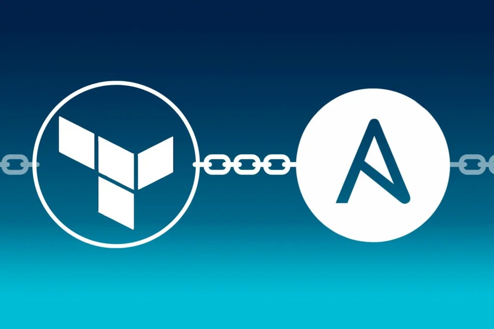
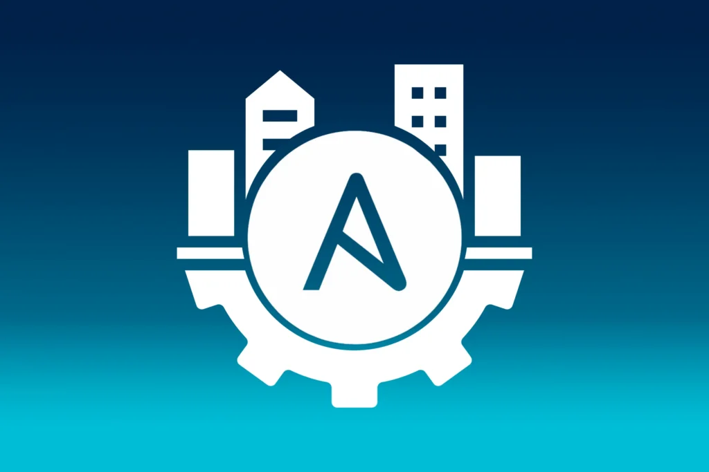
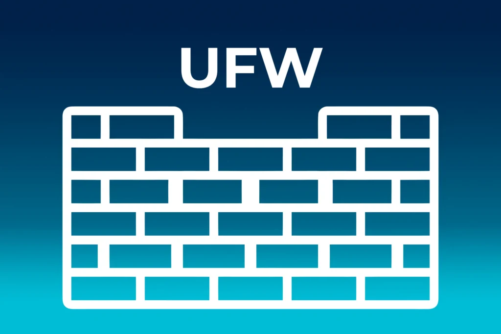

# Setup von Hashicorp Nomad

Der Artikel fokussiert auf das Setup von Nomad, beginnend mit einem überblickgebenden Einführungstext, gefolgt von einer konkreten Folge von Schritten, die in einzelnen Blockartikeln inklusive exakter Anweisungen beschrieben werden.  Die Artikel bauen aufeinander auf,   können allerdings je nach Bedarf auch übersprungen werden.

Setup von Hashicorp

[Schritt 1:  
Terraform](https://thinkport.digital/setup-hashcorp-nomad-mit-terraform)

[Schritt 2:  
Ansible](https://thinkport.digital/setup-hashicorp-nomad-mit-ansible/)

[Schritt 2.1:  
Ansible - ufw](https://thinkport.digital/setup-hashicorp-nomad-ansible-ufw/)

[Schritt 2.2:  
Ansible - fail2ban](https://thinkport.digital/setup-hashicorp-nomad-ansible-fail2ban/)

[Schritt 3:  
Ansible - nomad](https://thinkport.digital/setup-hashicorp-nomad-ansible-nomad)

[Schritt 4:  
Ansible - consul](https://thinkport.digital/setup-hashicorp-nomad-ansible-consul)

## Setup von Nomad

Das nachfolgende Setup von Nomad bietet eine effiziente und skalierbare Methode zur Bereitstellung und Verwaltung von Nomad und Consul in einer Infrastruktur:

* - [Terraform](https://thinkport.digital/setup-hashcorp-nomad-mit-terraform/): Ermöglicht die Infrastrukturautomatisierung und bietet eine einheitliche Methode zum Erstellen, Ändern und Versionieren der Infrastruktur.

    - [Ansible](https://thinkport.digital/setup-hashicorp-nomad-mit-ansible/): Ermöglicht die Konfiguration und Bereitstellung von Softwareanwendungen auf den erstellten Maschinen. Durch die Verwendung von Ansible-Rollen können Aufgaben modularisiert und wiederverwendet werden.

    - [UFW](https://thinkport.digital/setup-hashicorp-nomad-ansible-ufw/) und [Fail2Ban](https://thinkport.digital/setup-hashicorp-nomad-ansible-fail2ban/): Verbessern die Sicherheit der Umgebung durch Firewall-Regeln und Schutz vor wiederholten fehlgeschlagenen Anmeldeversuchen.

    - [Nomad](https://thinkport.digital/setup-hashicorp-nomad-ansible-nomad/) und [Consul](https://thinkport.digital/setup-hashicorp-nomad-ansible-consul/): Die eigentlichen Tools für das Container-Orchestrierungs- und Service-Discovery-Setup.

Folgen Sie diesen **Schritten zur Erstellung des Setup für Nomad** mit Ansible und Terraform:

**Schritt 1: Terraform für Infrastruktur-Setup:**

* Verwenden Sie Terraform, um die erforderliche Infrastruktur (z. B., virtuelle Maschinen, Netzwerkkonfiguration) zu erstellen.
* Definieren Sie die Ressourcen in Terraform-Konfigurationsdateien, einschließlich der Anzahl der Maschinen, Netzwerkeinstellungen usw.

**Schritt 2: Ansible für Konfiguration und Bereitstellung:**

* Verbinden Sie Ansible mit Terraform, indem Sie Terraform-Outputs in Ansible-Variablen umwandeln.

* Nutzen Sie Ansible-Rollen, um die Konfigurationen der verschiedenen Komponenten vorzunehmen. Zum Beispiel:

  + Schritt 2.1: Uncomplicated Firewall (UFW): Konfigurieren Sie die Firewall-Regeln für die Sicherheit.

  + Schritt 2.2: Fail2Ban mit Ansible Galaxy: Nutzen Sie Ansible Galaxy, um Rollen für Fail2Ban zu integrieren und konfigurieren Sie es für die Sicherheit.

**Schritt 3 und 4: Installation von Nomad und Consul:**

* Verwenden Sie Ansible, um Nomad und Consul auf den vorher erstellten Maschinen zu installieren.
* Legen Sie die Konfigurationsdateien für Nomad und Consul fest, um die gewünschten Parameter zu definieren.

* Starten Sie die Nomad- und Consul-Dienste auf den Maschinen.

## Hier ist eine grobe Beispielstruktur für die Dateien und Ordner:

    				 `plaintext - ansible/   - roles/     - ufw/     - fail2ban/     - nomad/     - consul/   - playbooks/     - setup.yml - terraform/   - main.tf   - variables.tf`

Die Struktur könnte je nach Ihren Anforderungen variieren. 

## Autoren:

## Keith Schuijlenburg

_Cloud Architect_

## Jonas Budde

_Cloud Engineer_

## Aleksandra Bury

_Cloud Engineer_

## [Weitere Beiträge](https://thinkport.digital/blog)

### [Sustainability of the Cloud](https://thinkport.digital/sustainability-of-the-cloud/ 'Sustainability of the Cloud')

[Cloud General](https://thinkport.digital/category/cloud-general/)

### [Sustainability of the Cloud](https://thinkport.digital/sustainability-of-the-cloud/ 'Sustainability of the Cloud')

[Cloud General](https://thinkport.digital/category/cloud-general/)

### [Setup Hashicorp Nomad Ansible Consul](https://thinkport.digital/setup-hashicorp-nomad-ansible-consul/ 'Setup Hashicorp Nomad Ansible Consul')

[Cloud General](https://thinkport.digital/category/cloud-general/), [Cloud Kubernetes](https://thinkport.digital/category/cloud-kubernetes/)

### [Setup Hashicorp Nomad Ansible Consul](https://thinkport.digital/setup-hashicorp-nomad-ansible-consul/ 'Setup Hashicorp Nomad Ansible Consul')

[Cloud General](https://thinkport.digital/category/cloud-general/), [Cloud Kubernetes](https://thinkport.digital/category/cloud-kubernetes/)

### [Was ist Databricks Training?](https://thinkport.digital/was-ist-databricks-training/ 'Was ist Databricks Training?')

[Big Data](https://thinkport.digital/category/big-data/), [Cloud General](https://thinkport.digital/category/cloud-general/)

### [Was ist Databricks Training?](https://thinkport.digital/was-ist-databricks-training/ 'Was ist Databricks Training?')

[Big Data](https://thinkport.digital/category/big-data/), [Cloud General](https://thinkport.digital/category/cloud-general/)

[')](https://thinkport.digital/cloud-consulting-for-development/)

### [Cloud Consulting for development](https://thinkport.digital/cloud-consulting-for-development/ 'Cloud Consulting for development')

[Cloud General](https://thinkport.digital/category/cloud-general/)

### [Cloud Consulting for development](https://thinkport.digital/cloud-consulting-for-development/ 'Cloud Consulting for development')

[Cloud General](https://thinkport.digital/category/cloud-general/)

### [Orthanc und DICOM: Innovative Lösungen für die effiziente Verwaltung und Analyse medizinischer Bilder](https://thinkport.digital/orthanc-und-dicom-fuer-medizinische-bilder/ 'Orthanc und DICOM: Innovative Lösungen für die effiziente Verwaltung und Analyse medizinischer Bilder')

[Cloud General](https://thinkport.digital/category/cloud-general/), [Disrupt](https://thinkport.digital/category/disrupt/), [Streaming](https://thinkport.digital/category/streaming/)

### [Orthanc und DICOM: Innovative Lösungen für die effiziente Verwaltung und Analyse medizinischer Bilder](https://thinkport.digital/orthanc-und-dicom-fuer-medizinische-bilder/ 'Orthanc und DICOM: Innovative Lösungen für die effiziente Verwaltung und Analyse medizinischer Bilder')

[Cloud General](https://thinkport.digital/category/cloud-general/), [Disrupt](https://thinkport.digital/category/disrupt/), [Streaming](https://thinkport.digital/category/streaming/)

### [Setup von Hashicorp Nomad mit Ansible](https://thinkport.digital/setup-hashicorp-nomad-mit-ansible/ 'Setup von Hashicorp Nomad mit Ansible')

[Cloud General](https://thinkport.digital/category/cloud-general/), [Streaming](https://thinkport.digital/category/streaming/)

### [Setup von Hashicorp Nomad mit Ansible](https://thinkport.digital/setup-hashicorp-nomad-mit-ansible/ 'Setup von Hashicorp Nomad mit Ansible')

[Cloud General](https://thinkport.digital/category/cloud-general/), [Streaming](https://thinkport.digital/category/streaming/)
