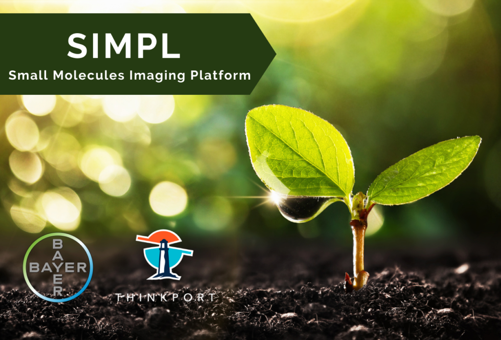

# SIMPL gewinnt den Digital Leader Award 2021

NEWS

Share on facebook Share on twitter Share on linkedin Share on pinterest Share on email

## „Health for all, hunger for none“

Das von Thinkport mitentwickelte Bayer Projekt, SIMPL (Small Molecules Imaging Platform) wurde von der Jury aus Digitalisierungsexperten aus Wirtschaft, Wissenschaft und Medien mit dem Digital Leader Award 2021 ausgezeichnet.

Das Projekt unterstützt Bayers bei der Forschung neuer Handlungsfelder für einen zukunftsfähigen Pflanzenschutz, um umweltfreundlichere und effektivere Pflanzenschutzmittel zu entwickeln.

Die entwickelte SIMPL-Plattform nutzt maschinelle Lernmodelle, Bilder und verschiedene Lichtspektren, um die Wirkung und Entwicklung von Pflanzen zu analysieren. So werden bisherige manuell gesteuerte und zeitaufwändige Prozesse durch eine cloudbasierte Lösung wie die SIMPL-Plattform ersetzt, die täglich tausende von Bildern verschiedener Pflanzen analysiert, um Wirkmechanismen zu identifizieren.

So werden mehr Wirkstoffe getestet, zeitaufwendige Suchen durch das robuste Tool automatisiert und Entscheidungen effizienter getroffen.

## Weitere Neuigkeiten

## News Writer

Christina Friede

Business Development

Email:

[cfriede@thinkport.digital](mailto:cfriede@thinkport.digital)

- 
