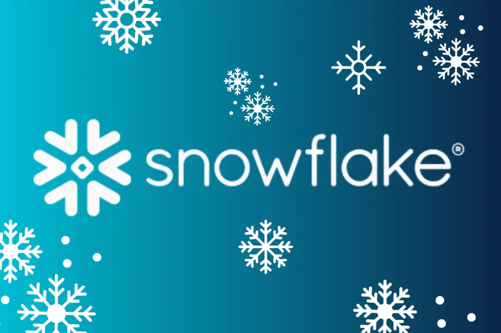
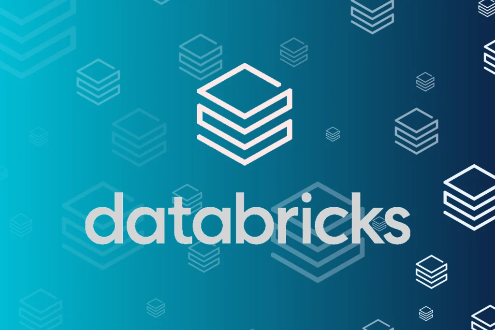
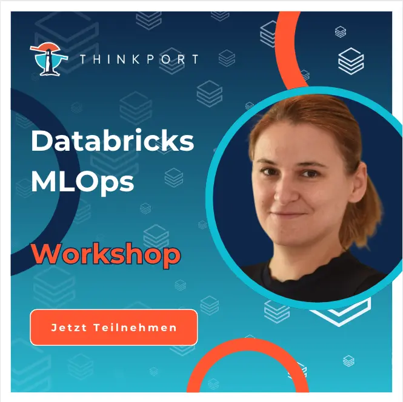
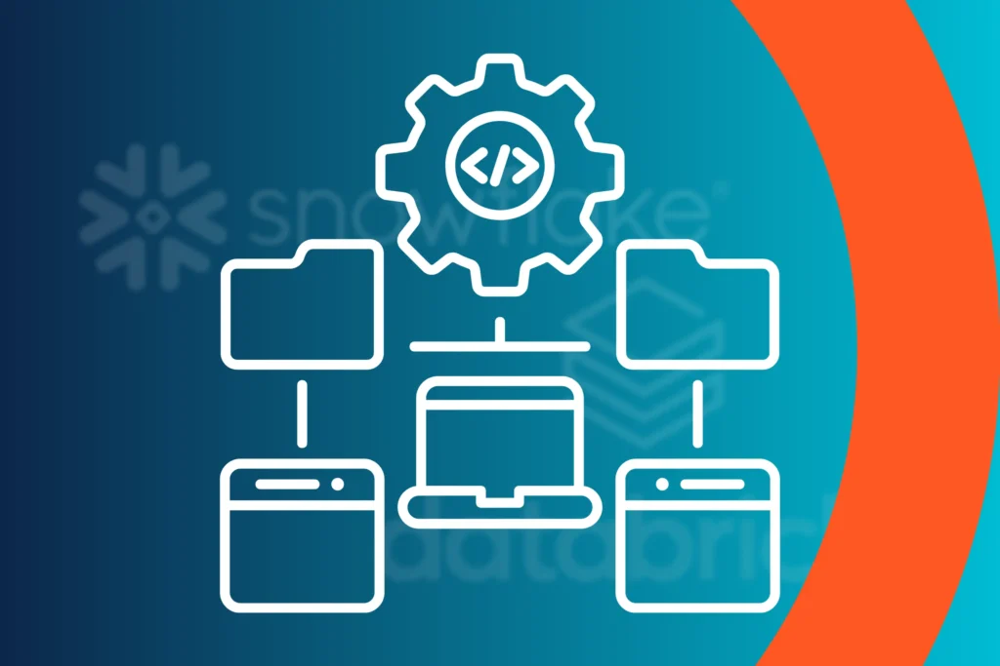

# Snowflake vs. Databricks

Snowflake und Databricks sind zwei der größten cloudbasierten SaaS-Datenplattformen.

Wie unterscheiden sich die Plattformen und wann sollte man Snowflake oder Databricks wählen?

## [Wie unterscheiden sich die Architekturen von Databricks und Snowflake?](https://assets.publishing.service.gov.uk/media/652e958b6972600014ccf9f6/Issues_statement__updated.pdf)

Snowflakes Architektur basiert auf drei Ebenen. Die **Service**\-Ebene ist zuständig für die Infrastruktur, Metadaten und Sicherheit (z. B. Authentifizierung). Die **Compute**\-Ebene besteht aus virtuellen Warehouses, in denen die Queries ausgeführt werden. In der **Storage**\- bzw. **Data**\-Ebene werden die Daten als verschlüsselte Mikropartitionen gespeichert. Integriert in Snowflake ist Snowpark, welches Libraries und Runtimes anbietet, um in verschiedenen Programmiersprachen direkt entwickeln zu können. Diese virtuellen Warehouses sind automatisch skalierbar und können aus mehreren Clustern bestehen. Es gibt Standard-Warehouses und Snowpark-optimierte Warehouses für Aufgaben, die viel Arbeitsspeicher brauchen, z. B. für ML.

Databricks teilt sich in eine **Control Plane** und eine **Compute Plane** auf. In der **Control Plane** werden Backend Services verwaltet, wie z. B. die Webapplikationund der Unity Catalog, in dem die Daten verwaltet werden. In der **Compute Plane** werden die Daten verarbeitet. Dazu gibt es allgemeine Cluster (Standard und ML) und Jobcluster für automatische spezialisierteVerarbeitungen oder auch SQL Warehouses, um einzelne Queries auszuführen und Dashboards zu erstellen. Im Gegenzug zu Snowflake, welches Closed Source ist, basiert Databricks auf Open Source Technologien wie z. B. Spark, MLflow und Delta Lake.

Snowflake und Databricks arbeiten mit Schemas, Tabellen und Views. In Snowflakes befinden sich diese in Datenbanken, die einem Account angehören. In Databricks gehören diese stattdessen einem Catalog an, der wiederum zu einem Metastore gehört. Ein Databricks Catalog ist somit ähnlich zu einer Snowflake Datenbank und ein Databricks Metastore ist ähnlich zu einem Snowflake Account.

## Welche Editionen werden angeboten und was sind die Kosten?

### Snowflake

Bei Snowflake gibt es vier verschiedene Editionen: Standard, Enterprise, Business Critical und Virtual Private Snowflake. Im Vergleich zur Standard-Editionen bieten die anderen mehr Performance und Security Features, wie z. B. die Verschlüsselung der Meta- und Netzwerkdaten oder Column- und Row Level Security.

Die Kosten von Snowflake werden in Credits berechnet, ein Maß um verwendete Ressourcen abzubilden. Für die Rechenleistung, das Speichern von Daten und je nach dem auch der Transfer von Daten in andere Regionen oder andere Cloud Provider fallen abhängig von der Edition unterschiedliche Preise an.

 

### Databricks

Wie auch bei Snowflake gibt es verschiedene Edition bei Databricks mit unterschiedlichen Features. Diese sind folgende: Standard, Premium und Enterprise. Je nach ausgewähltem Cloud Provider (AWS, Azure, Google Cloud) stehen nur bestimmte Editionen zur Auswahl. Ähnlich zu Snowflake gilt hier auch, je „höher“ die Editionen, desto mehr Performance und Security-Features werden angeboten.

Für die verwendeten Ressourcen werden die Kosten bei Snowflake in Credits und in Databricks in DBU abgebildet. Je nach ausgewähltem Cloud Provider, der Region und der Edition fallen unterschiedliche Preise an.

Letztendlich ist es schwer zu sagen, ob Snowflake oder Databricks günstiger ist. Die Kosten hängen stark davon ab, wie beide Plattformen benutzt werden und wie stark auf Kosten optimiert wird.

## Welche Features bieten Snowflake und Databricks jeweils an?

|                                     | Snowflake                                                                                            | Databricks                                                  |
| ----------------------------------- | ---------------------------------------------------------------------------------------------------- | ----------------------------------------------------------- |
| Time Travel                         | ✅                                                                                                   | ✅                                                          |
| Git-Integration                     | ⚠️ bisher nur Lesezugriff (Stand 04/2024)                                                            | ✅                                                          |
| Unterstützte Datenformate           | CSV, JSON, Avro, ORC, Parquet, XML, unstrukturierte Daten                                            | CSV, JSON, Avro, ORC, Parquet, XML, Binary                  |
| Data Governance                     | ✅ (u.a. Snowflake Horizon)                                                                          | ✅                                                          |
| Notebooks                           | Indirekt über einen Connector                                                                        | ✅                                                          |
| Unterstützte Sprachen               | Direkt: SQL, Python Zusätzlich über Driver: Go, PHP, Node.js, C, … Snowpark API: Java, Python, Scala | Direkt: SQL, Python, Scala, R Zusätzlich über SDK: Java, Go |
| Unterstützte Entwicklungsumgebungen | UI: Worksheets Snowpark: alle IDEs                                                                   | UI: Notebooks Databricks Connect: alle IDEs                 |
| AI & ML                             |

* AI unterstützte Entwicklung (Snowflake Copilot)

* Vortrainierte Modelle

* ML Warehouses (Snowpark)

* Interaktion mit Modellen als Apps (Streamlit)

* Entwicklung von eigenen Modellen mit verschiedenen ML Libraries oder Snowpark ML

|

* AI unterstützte Entwicklung

* Feature Store

* AutoML

* Vektordatenbank

* ML Cluster

* Entwicklung von eigenen Modellen mit verschiedenen ML Libraries

|
| Pipelines | Hauptsächlich SQL Tasks in einem Task Graph |

Tasks in einem Job

* Die Tasks können Notebooks, SQL, Python Skripte, JARs, usw.

|

## Für welche Use Cases können Databricks und Snowflake verwendet werden?

Sowohl Databricks als auch mittlerweile Snowflake verstehen sich als universelle Plattformen für Data Engineering, Data Science und Data Analysis.

### Data Engineering & Data Analytics

Das Einladen und Verarbeiten von Daten ist in Snowflake und Databricks einfach. Dazu kann bei beiden Plattformen über die UI in Worksheets (Snowflake) oder Notebooks (Databricks) mit SQL oder Python programmiert werden oder auch außerhalb der Plattformen durch Connectors. Im Gegensatz zu den Snowflake Worksheets können die Databricks Notebooks direkt mit Git versioniert werden. Eine integrierte Versionierung der Worksheets fehlt. Ressourcen können bei beiden automatisch skaliert werden.

Was das Ausführen von Queries angeht, bieten Snowflake und Databricks Caching an, um Queries schneller auszuführen. Da Snowflake aber seine Wurzeln als DWH hat, bietet Snowflake noch zusätzliche Optimierungen an, wie z. B. Search Optimization. Dadurch ist die Performance bei Queries bei Snowflake besser, ohne viel einstellen zu müssen.

Beide Plattformen bieten Dashboards an zur Visualisierung von Daten, entweder basierend auf SQL Queries oder in Snowflake auch mit Python Code. Es können Alerts gesetzt werden, um die Datenqualität zu überwachen.

Data Engineering ist bei beiden Plattformen stark ausgeprägt und ist letztendlich eine Frage der Präferenz. Wer jedoch viele und komplexe Queries ausführt und nicht viel Zeit in Optimieren stecken möchte, sollte Snowflake wählen. Wer sich mit Spark gut auskennt, ist mit Databricks gut bedient und könnte bessere Ergebnisse erzielen.

### Data Science

Snowflake bietet seit 2023 eine eigene ML-Sektion an, die derzeit noch stark in Entwicklung ist. Mit den LLM-Modellen, die von Snowflake zur Verfügung gestellt werden, ist einfacher Einstieg möglich, um Erkenntnisse aus seinen Daten zu ziehen, ohne selbst ein Modell trainieren zu müssen. Dazu gibt es verschiedene Funktionen, wie z. B. Texte zusammenzufassen, das Sentiment von Texten zu erkennen oder Informationen zu extrahieren. Unter Snowflake Cortex können automatisch Modelle trainiert werden durch Angabe von Daten, dem Problemtyp und dem Ziel. Eigene Modelle können in der Model Registry gesehen werden. Charmant ist die Integration mit Streamlit, um auch visuell mit seinen Modellen interagieren zu können.

Im Gegensatz zu Snowflake ist in Databricks die ML-Sektion viel ausgeprägter. Neben selbst entwickelten Modellen müssen bei AutoML wie bei Snowflake Cortex nur Daten, der Problemtyp (Klassifizierung, Regression, ..) und das Ziel angegeben werden, um alles andere kümmert sich AutoML selbst. Mit dem Feature Store können Features zur Verfügung gestellt werden. Damit können andere oder auch Modelle auf diese Features zugreifen. Modelle können letztendlich als REST-API zur Verfügung gestellt werden.

Wer stark auf ML setzt, sollte Databricks wählen. Mit dem Feature Store, der Vektordatenbank und der Bereitstellung der Modelle als Endpoints wird die Entwicklung und auch die Bereitstellung besser unterstützt. Snowflake ist hingegen für diejenigen interessant, die die LLM-Funktionen ausnutzen wollen.

### Orchestrierung

In Snowflake müssen Tasks geschrieben werden, die SQL oder Stored Procedures aufrufen. In den Stored Procedures kann auch Python Code integriert werden. Die erstellten Tasks und den Task Graph sind in der Datenbank gespeichert und können dort betrachtet werden. Die Ausführungen sind im Monitoring Bereich zu sehen.

In Databricks gibt es einen Workflows-Tab, in dem visuell ein Job mit verschiedenen Tasks erstellt werden kann. Die Tasks können unterschiedliche Quellen haben wie z. B. Notebooks, SQLs oder JARs, sie sind somit flexibler als Snowflake Tasks. Dort können auch die Ausführungen betrachtet werden.

In Sachen nativer Orchestrierung hat Databricks die Nase vorn.

## Fazit

Wem vor allem Data Science, Orchestrierung und Versionierung wichtig ist, ist heutzutage mit Databricks bestens bedient. Mit der starken Entwicklung von Snowflake nähern sich die beiden Plattformen jedoch in diesen Aspekten langsam an.

Wem die Analyse und die einfache Verarbeitung von Daten wichtig ist, sollte Snowflake wählen. Durch seinen Ursprung ist Snowflake besonders gut beim Ausführen von Queries und bietet einen einfachen Einstieg in die Welt der Daten.

Autor

Mai Ly Tran

_Senior Cloud Engineer_

## [Weitere Beiträge](https://thinkport.digital/blog)

### [Setup Hashicorp Nomad Ansible fail2ban](https://thinkport.digital/setup-hashicorp-nomad-ansible-fail2ban/ 'Setup Hashicorp Nomad Ansible fail2ban')

[Cloud General](https://thinkport.digital/category/cloud-general/)

### [Setup Hashicorp Nomad Ansible fail2ban](https://thinkport.digital/setup-hashicorp-nomad-ansible-fail2ban/ 'Setup Hashicorp Nomad Ansible fail2ban')

[Cloud General](https://thinkport.digital/category/cloud-general/)

### [Streaming-Services](https://thinkport.digital/streaming-services/ 'Streaming-Services')

[Cloud General](https://thinkport.digital/category/cloud-general/), [Streaming](https://thinkport.digital/category/streaming/)

### [Streaming-Services](https://thinkport.digital/streaming-services/ 'Streaming-Services')

[Cloud General](https://thinkport.digital/category/cloud-general/), [Streaming](https://thinkport.digital/category/streaming/)

### [Core Strategies Cloud Migration](https://thinkport.digital/core-strategies-cloud-migration/ 'Core Strategies Cloud Migration')

[Cloud General](https://thinkport.digital/category/cloud-general/), [Cloud Kubernetes](https://thinkport.digital/category/cloud-kubernetes/)

### [Core Strategies Cloud Migration](https://thinkport.digital/core-strategies-cloud-migration/ 'Core Strategies Cloud Migration')

[Cloud General](https://thinkport.digital/category/cloud-general/), [Cloud Kubernetes](https://thinkport.digital/category/cloud-kubernetes/)

### [Sustainability of the Cloud](https://thinkport.digital/sustainability-of-the-cloud/ 'Sustainability of the Cloud')

[Cloud General](https://thinkport.digital/category/cloud-general/)

### [Sustainability of the Cloud](https://thinkport.digital/sustainability-of-the-cloud/ 'Sustainability of the Cloud')

[Cloud General](https://thinkport.digital/category/cloud-general/)

### [Was ist Databricks Training?](https://thinkport.digital/was-ist-databricks-training/ 'Was ist Databricks Training?')

[Big Data](https://thinkport.digital/category/big-data/), [Cloud General](https://thinkport.digital/category/cloud-general/)

### [Was ist Databricks Training?](https://thinkport.digital/was-ist-databricks-training/ 'Was ist Databricks Training?')

[Big Data](https://thinkport.digital/category/big-data/), [Cloud General](https://thinkport.digital/category/cloud-general/)

### [Nomad vs Kubernetes](https://thinkport.digital/nomad-vs-kubernetes/ 'Nomad vs Kubernetes')

[Cloud General](https://thinkport.digital/category/cloud-general/), [Cloud Kubernetes](https://thinkport.digital/category/cloud-kubernetes/)

### [Nomad vs Kubernetes](https://thinkport.digital/nomad-vs-kubernetes/ 'Nomad vs Kubernetes')

[Cloud General](https://thinkport.digital/category/cloud-general/), [Cloud Kubernetes](https://thinkport.digital/category/cloud-kubernetes/)
