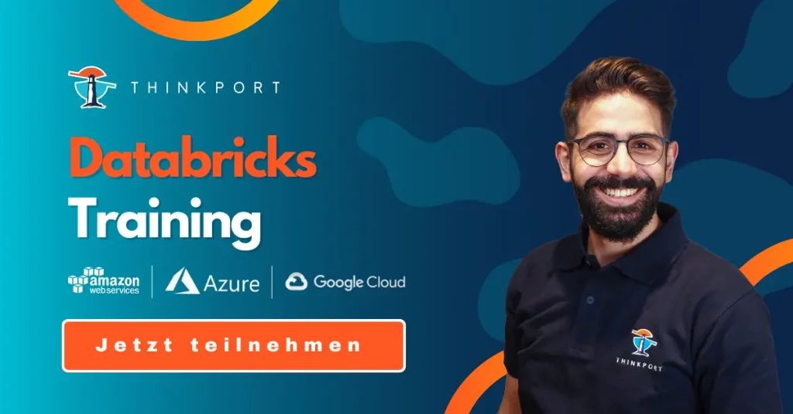

# Spark, Databricks, Trino –

was für Big Data verwendet werden kann und wann

Da die Welt immer datengesteuerter wird, steigt die Nachfrage nach Tools, die **große Datenmengen** verarbeiten können. **Spark, Databricks** und **Trino** sind drei beliebte **Big-Data-Tools**, die in der Branche weit verbreitet sind. In diesem Artikel werden wir die Verwendung von Spark, Databricks und Trino erörtern und ihre spezifischen Anwendungsfälle, Stärken und Schwächen vergleichen.

## Spark

**[Apache Spark](https://thinkport.digital/spark-fuer-big-data-lernen/)** ist ein **Open-Source-Framework** für **verteilte Datenverarbeitung**, das entwickelt wurde, um **große Datenmengen** schnell und effizient zu verarbeiten. Es kann für die **Datenverarbeitung**, das **maschinelle Lernen** und die **Graphenverarbeitung** verwendet werden. Spark unterstützt verschiedene **Programmiersprachen** wie **Java**, **Scala**, **Python** und **R**.

Um [**Spark**](https://thinkport.digital/spark-fuer-big-data-lernen/) zu verwenden, müssen Sie zunächst einen **Spark-Cluster** einrichten. Ein **Spark-Cluster** ist eine Gruppe von Computern, die zusammenarbeiten, um Daten zu verarbeiten. Der Cluster besteht aus einem **Master-Knoten** und **Worker-Knoten**. Der **Masterknoten** verwaltet die Verteilung der Aufgaben an die **Arbeitsknoten**, und die **Arbeitsknoten** führen die eigentlichen Berechnungen durch.

Eine der Stärken von **Spark** ist seine Fähigkeit, **große Datenmengen** zu verarbeiten. Es kann Daten **parallel** auf mehreren Knoten verarbeiten, was eine **Skalierung** für die Verarbeitung von **Petabytes an Daten** ermöglicht. **Spark** verfügt außerdem über eine Vielzahl von **APIs** und **Bibliotheken**, mit denen sich gängige Datenverarbeitungsaufgaben wie **Filtern**, **Sortieren** und **Aggregieren** leicht durchführen lassen.

Spark hat jedoch auch einige **Schwächen**. Das Einrichten und Verwalten eines **Spark-Clusters** kann komplex und Ressourcen intensiv sein. Außerdem kann die Leistung von Spark durch Netzwerklatenz und andere Faktoren beeinträchtigt werden, was die **Datenverarbeitung** verlangsamen kann.

## Databricks

[**Databricks**](https://thinkport.digital/databricks-training/) ist eine **Cloud-basierte Plattform**, die auf **Apache Spark** aufbaut. Sie bietet eine einheitliche **Analyseplattform**, die **Data Engineering**, **Data Science** und **Business Analytics** kombiniert. **Databricks** unterstützt verschiedene **Programmiersprachen** wie **Python**, **Scala** und **R**.

Um [**Databricks**](https://thinkport.digital/databricks-training/) verwenden zu können, müssen Sie einen **Databricks-Arbeitsbereich** erstellen. Dabei handelt es sich um eine **Cloud-basierte Umgebung** für die Entwicklung und Ausführung von **Datenverarbeitungspipelines**. Der Arbeitsbereich besteht aus **Clustern**, **Notebooks** und **Aufträgen**. **Cluster** sind Gruppen von Computern, die zusammenarbeiten, um Daten zu verarbeiten, **Notebooks** sind interaktive Dokumente, die Code und Visualisierungen enthalten, und **Aufträge** sind automatisierte Aufgaben, die nach einem Zeitplan ausgeführt werden.

Eine der Stärken von **Databricks** ist seine **Benutzerfreundlichkeit**. Es bietet eine **benutzerfreundliche Oberfläche** für die Entwicklung und Ausführung von **Datenverarbeitungspipelines** und übernimmt die komplexe Aufgabe der Verwaltung von **Spark-Clustern** im Hintergrund. **Databricks** verfügt auch über eine Vielzahl von Funktionen für **Data Science** und **maschinelles Lernen**, einschließlich Unterstützung für **Deep-Learning-Frameworks** wie **TensorFlow** und **PyTorch**.

Databricks hat jedoch auch einige **Schwächen**. Es kann im Vergleich zu anderen Cloud-basierten Plattformen **teuer** sein, und es ist möglicherweise nicht für Organisationen geeignet, die strenge Sicherheits- und Compliance-Anforderungen haben. Darüber hinaus ist Databricks eine **proprietäre Plattform**, was bedeutet, dass Benutzer an die Verwendung von Databricks gebunden sein können und möglicherweise keinen Zugriff auf die zugrunde liegenden **Spark-APIs** und -Bibliotheken haben.

## Trino

**Trino**, früher bekannt als **PrestoSQL**, ist eine **verteilte Open-Source-SQL-Abfrage-Engine**, die entwickelt wurde, um **große Datenmengen** schnell und effizient abzufragen. Sie kann mit verschiedenen **Datenquellen** wie **Hadoop**, **Amazon S3** und **MySQL** verwendet werden. **Trino** unterstützt **Standard-SQL** und bietet einen **JDBC-Treiber**, der eine einfache Integration mit anderen Tools und Anwendungen ermöglicht.

Um **Trino** zu verwenden, müssen Sie einen **Trino-Cluster** einrichten. Ein **Trino-Cluster** besteht aus einem **Koordinator-Knoten** und **Arbeitsknoten**. Der **Koordinationsknoten** ist für die Verteilung der Aufgaben an die **Arbeitsknoten** zuständig, und die **Arbeitsknoten** führen die eigentlichen Berechnungen durch.

Eine der Stärken von **Trino** ist seine Fähigkeit, **große Datenmengen** schnell und effizient abzufragen. Es verwendet eine **verteilte Architektur**, die eine **Skalierung auf Petabytes von Daten** ermöglicht. Außerdem verfügt **Trino** über eine Reihe von Funktionen, die es für bestimmte Anwendungsfälle geeignet machen. So eignet sich **Trino** besonders gut für **Ad-hoc-Abfragen** und **interaktive Datenanalysen**, da es den Benutzern ermöglicht, Daten in Echtzeit abzufragen, ohne auf die Stapelverarbeitung warten zu müssen. Außerdem verfügt es über eine Reihe fortgeschrittener Funktionen wie die Unterstützung von **Joins** und **Window-Funktionen**.

## Vergleichende Evaluierung

Bei der Evaluierung von **Spark**, **Databricks** und **Trino** für die **Big Data-Verarbeitung** gibt es mehrere kritische Aspekte zu berücksichtigen, um die am besten geeignete Lösung für Ihren speziellen Anwendungsfall zu finden. Zu diesen Aspekten gehören:

- **Skalierbarkeit:** Berücksichtigen Sie die Größe Ihrer Daten und das erwartete Wachstum des Datenvolumens. Spark und Trino sind beide für eine horizontale Skalierung ausgelegt, um große Datenmengen zu verarbeiten, während Databricks eine Cloud-basierte Umgebung bietet, die je nach Bedarf einfach nach oben oder unten skaliert werden kann.
- **Benutzerfreundlichkeit:** Berücksichtigen Sie das Qualifikationsniveau Ihres Teams und die Einfachheit der Einführung. Databricks bietet eine benutzerfreundliche Oberfläche und erfordert nur eine minimale Konfiguration, während Spark und Trino mehr technisches Fachwissen und Einrichtung erfordern.
- **Leistung:** Berücksichtigen Sie die Geschwindigkeit und Effizienz der Datenverarbeitung. Trino ist für seine schnelle und effiziente verteilte SQL-Abfrage-Engine bekannt, während Spark über eine Vielzahl von APIs und Bibliotheken verfügt, die die Leistung für bestimmte Datenverarbeitungsaufgaben verbessern können.

- **Datenquellen:** Berücksichtigen Sie die in Ihrem Unternehmen verwendeten Datenquellen und -formate. Trino ist für die Arbeit mit einer Vielzahl von Datenquellen ausgelegt, darunter Hadoop, S3 und MySQL, während Spark über einen spezifischen Satz von APIs und Bibliotheken für bestimmte Datenquellen verfügt.
- **Erweiterte Funktionen:** Berücksichtigen Sie die erweiterten Funktionen, die Sie für Ihre Datenverarbeitungsaufgaben benötigen. Databricks bietet eine Vielzahl von Funktionen für Data Science und maschinelles Lernen, während Spark und Trino erweiterte Funktionen wie die Unterstützung von Window-Funktionen und Joins bieten.
- **Kosten:** Beachten Sie die Kosten der einzelnen Lösungen. Databricks ist eine Cloud-basierte Plattform, die ein Abonnement erfordert, während Spark und Trino Open-Source sind und vor Ort oder in der Cloud ausgeführt werden können.

Durch die Bewertung dieser **kritischen Aspekte** können Sie feststellen, welches Tool für die **spezifischen Bedürfnisse** und **Anforderungen** **Ihrer Organisation** am besten geeignet ist. Es ist wichtig, sich vor Augen zu halten, dass es keine Einheitslösung gibt und dass es notwendig sein kann, eine Kombination von Tools einzusetzen, um die gewünschten Ergebnisse zu erzielen.

## Zusammenfassung

[**Spark**](https://thinkport.digital/spark-fuer-big-data-lernen/), [**Databricks**](https://thinkport.digital/databricks-training/) und **Trino** sind drei beliebte **Big-Data-Tools**, die ihre eigenen spezifischen Anwendungsfälle, Stärken und Schwächen haben. **Spark** eignet sich besonders gut für die Verarbeitung großer Datenmengen, kann aber komplex in der Einrichtung und Verwaltung sein. **Databricks** ist eine **Cloud-basierte Plattform**, die einfach zu bedienen ist, aber teuer sein kann und sich möglicherweise nicht für Unternehmen mit strengen Sicherheits- und Compliance-Anforderungen eignet. **Trino** ist eine verteilte **SQL-Abfrage-Engine**, die sich besonders gut für **Ad-hoc-Abfragen** und **interaktive Datenanalysen** eignet, aber möglicherweise nicht für alle Arten von Abfragen geeignet ist.

Letztlich hängt die Wahl des richtigen Tools von den spezifischen Anforderungen des Unternehmens und der Art der durchzuführenden Datenverarbeitungsaufgaben ab. Wenn Unternehmen die spezifischen Anwendungsfälle, Stärken und Schwächen der einzelnen Tools kennen, können sie eine fundierte Entscheidung darüber treffen, welches Tool sie für ihre Big Data-Anforderungen einsetzen wollen.

(erstellt mit Thinkport-Expertenwissen und künstlicher Intelligenz)

Als exzellenter Cloud Consulting Partner für **[AWS](https://thinkport.digital/cloud-consulting-fuer-deutsche-grossunternehmen/aws/)** und **[Azure](https://thinkport.digital/cloud-consulting-fuer-deutsche-grossunternehmen/azure/)**, bieten wir Ihrem Unternehmen ein qualifiziertes, zertifiziertes und engagiertes Team. Unsere umfangreiche Praxiserfahrung deckt das komplette Spektrum aller Dienstleistungen rund um die Cloud ab. Ob Private, Public, Hybrid oder Multi-Cloud - wir sind Ihr Partner auf Augenhöhe. Und finden gemeinsam mit Ihnen die besten Cloud-Lösungen.  
Wir freuen uns darauf, von Ihnen zu hören.

Entdecken Sie weiterhin die Welt von Big Data mit unserem Artikel **[Entscheidung für Big Data: Databricks, Synapse, Glue, Athena?](https://thinkport.digital/synapse-databricks-athena-welche-loesung-fuer-big-data/).**

## [Weitere Beiträge](https://thinkport.digital/blog)

### [Core Strategies Cloud Migration](https://thinkport.digital/core-strategies-cloud-migration/ 'Core Strategies Cloud Migration')

[Cloud General](https://thinkport.digital/category/cloud-general/), [Cloud Kubernetes](https://thinkport.digital/category/cloud-kubernetes/)

### [Core Strategies Cloud Migration](https://thinkport.digital/core-strategies-cloud-migration/ 'Core Strategies Cloud Migration')

[Cloud General](https://thinkport.digital/category/cloud-general/), [Cloud Kubernetes](https://thinkport.digital/category/cloud-kubernetes/)

### [Echtzeit-KI: Apache Kafka und OpenAI sind die Zukunft der Datenanalyse](https://thinkport.digital/kafka-und-openai-zukunft-der-datenanalyse/ 'Echtzeit-KI: Apache Kafka und OpenAI sind die Zukunft der Datenanalyse')

[Cloud General](https://thinkport.digital/category/cloud-general/), [Streaming](https://thinkport.digital/category/streaming/)

### [Echtzeit-KI: Apache Kafka und OpenAI sind die Zukunft der Datenanalyse](https://thinkport.digital/kafka-und-openai-zukunft-der-datenanalyse/ 'Echtzeit-KI: Apache Kafka und OpenAI sind die Zukunft der Datenanalyse')

[Cloud General](https://thinkport.digital/category/cloud-general/), [Streaming](https://thinkport.digital/category/streaming/)

[')](https://thinkport.digital/cloud-consulting-for-development/)

### [Cloud Consulting for development](https://thinkport.digital/cloud-consulting-for-development/ 'Cloud Consulting for development')

[Cloud General](https://thinkport.digital/category/cloud-general/)

### [Cloud Consulting for development](https://thinkport.digital/cloud-consulting-for-development/ 'Cloud Consulting for development')

[Cloud General](https://thinkport.digital/category/cloud-general/)

### [Was ist Databricks Training?](https://thinkport.digital/was-ist-databricks-training/ 'Was ist Databricks Training?')

[Big Data](https://thinkport.digital/category/big-data/), [Cloud General](https://thinkport.digital/category/cloud-general/)

### [Was ist Databricks Training?](https://thinkport.digital/was-ist-databricks-training/ 'Was ist Databricks Training?')

[Big Data](https://thinkport.digital/category/big-data/), [Cloud General](https://thinkport.digital/category/cloud-general/)

### [Grundlagen eines «AI Driven Software Development»-Trainings](https://thinkport.digital/grundlagen-eines-ai-driven-software-development-trainings/ 'Grundlagen eines «AI Driven Software Development»-Trainings')

[Cloud General](https://thinkport.digital/category/cloud-general/), [Cloud Kubernetes](https://thinkport.digital/category/cloud-kubernetes/)

### [Grundlagen eines «AI Driven Software Development»-Trainings](https://thinkport.digital/grundlagen-eines-ai-driven-software-development-trainings/ 'Grundlagen eines «AI Driven Software Development»-Trainings')

[Cloud General](https://thinkport.digital/category/cloud-general/), [Cloud Kubernetes](https://thinkport.digital/category/cloud-kubernetes/)

### [Terraform Consulting in a Multi Cloud Environment](https://thinkport.digital/terraform-consulting-in-a-multi-cloud-environment/ 'Terraform Consulting in a Multi Cloud Environment')

[Cloud General](https://thinkport.digital/category/cloud-general/), [IaC](https://thinkport.digital/category/iac/)

### [Terraform Consulting in a Multi Cloud Environment](https://thinkport.digital/terraform-consulting-in-a-multi-cloud-environment/ 'Terraform Consulting in a Multi Cloud Environment')

[Cloud General](https://thinkport.digital/category/cloud-general/), [IaC](https://thinkport.digital/category/iac/)
