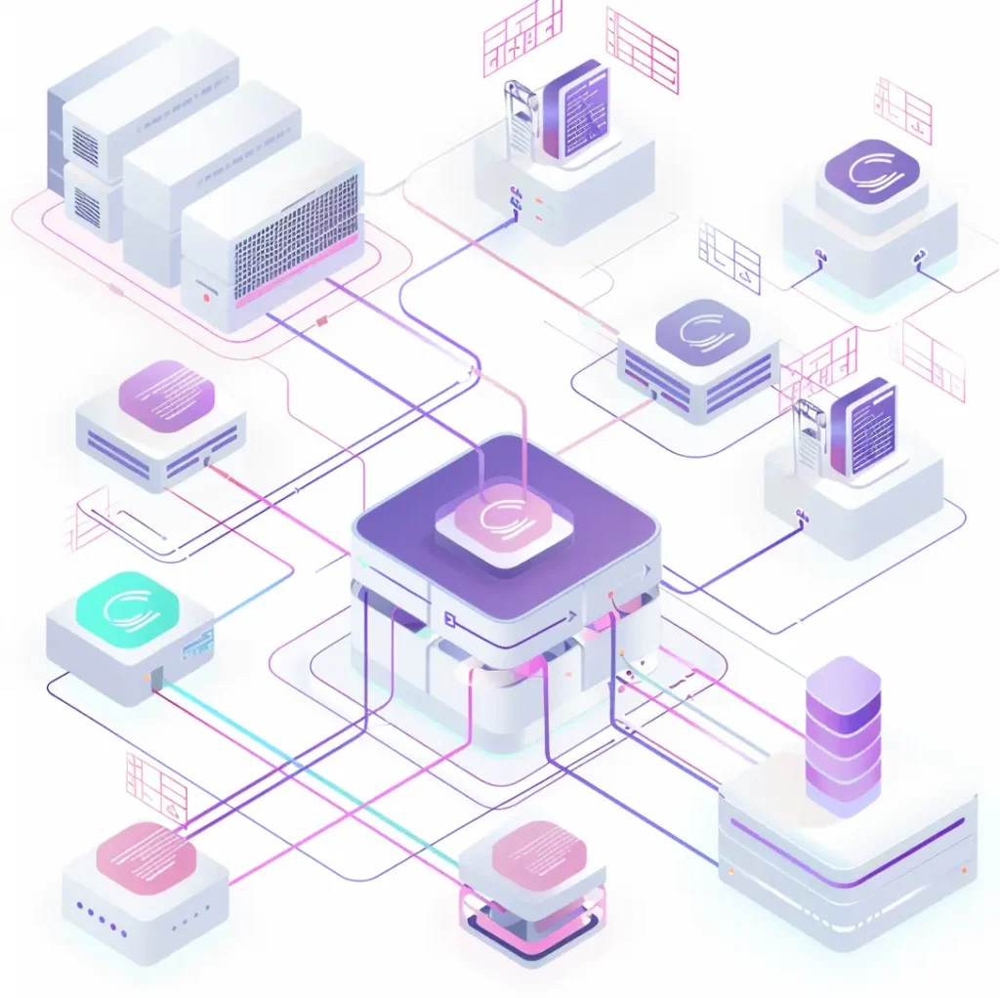

# Synchrone Stammdaten für Tochterunternehmen als strategischer Wettbewerbsvorteil

Immer mehr Unternehmen antworten auf das komplexe und globalisierte Umfeld mit einer ebenfalls komplexen Unternehmensstruktur aus mehreren Tochterunternehmen.

In diesen Unternehmensgruppen nehmen Daten heute einen kritischen Teil ein und für deren Erfolg ist eine hohe Datenqualität insbesondere der unternehmensübergreifenden Stammdaten als Grundvoraussetzung anzusehen.

## [Unser kostenloses Whitepaper zur Relevanz synchroner Stammdaten und technischen Lösungsmöglichkeiten](https://assets.publishing.service.gov.uk/media/652e958b6972600014ccf9f6/Issues_statement__updated.pdf)

Unser kostenloses Whitepaper bietet einen Einblick in die Wichtigkeit von synchronen Stammdaten für alle Tochterunternehmen hinweg und welche vielfältigen Vorteile dadurch gewonnen werden. Es zeigt auch, wie eine Lösungsoption mit Kafka und Confluent umgesetzt werden kann.

[Jetzt Whitepaper Herunterladen](#Jetzt%20Whitepaper%20Herunterladen)

## Die Vorteile synchroner Stammdaten für Tochterunternehmen

Die positiven Auswirkungen synchroner Stammdaten sind vielfältig, der strategische Wettbewerbsvorteil ergibt sich schlussendlich aus der Summe der Vorteile.

Zunächst führen synchrone Stammdaten zu einer Reduktion der Komplexität und des Fehlerpotenzials. Dadurch und durch den Abbau möglicher Redundanzen werden aber auch Kosten und weitere Ressourcen geschont.

Gleichzeitig wird die Datenqualität, die Transparenz und schlussendlich auch die Effizienz durch synchrone Stammdaten für alle Tochterunternehmen gesteigert. Richtig ausgenutzt, kann am Ende auch die Kund:innenzufriedenheit gesteigert werden.

 

## Eine Lösungsoption mit Kafka und Confluent

Eine Möglichkeit für das Erreichen synchroner Stammdaten ist eine zentrale Plattform, auf der zu jeder Zeit die genauen, vollständigen und aktuellen Stammdaten zu finden sind – eine zentrale Integrationsplattform zwischen allen Einzelsystemen.

Die technologische Umsetzung mit Kafka und Confluent ermöglicht nicht nur die Skalierbarkeit, sondern sichert auch die notwendige Zuverlässigkeit, Effizient und Nutzer:innenfreundlichkeit zu.

## Mit dem kostenlosen Whitepaper die Vorteile der Lösungsoption entdecken

Mit synchronen Stammdaten für Ihre Unternehmensgruppe können Sie sich strategische Wettbewerbsvorteile sichern. In unserem Whitepaper finden Sie viele weitere spannende Informationen, die Sie auf dem Weg zur dahin unterstützen.

[Jetzt Whitepaper Herunterladen](#Jetzt%20Whitepaper%20Herunterladen)

Selbstverständlich können Sie sich auch direkt an unsere Expert:innen wenden und sich noch heute einen Termin zum direkten Austausch ausmachen. Thinkport liefert immer eine individuelle und maßgeschneiderte Lösung, um Sie dorthin zu bringen, wo Sie hinwollen.

[Jetzt Kontakt aufnehmen](mailto:phoellthaler@thinkport.digital)

## Autor

Laszlo Csoti

_Senior Cloud Architect & Circle Lead Event-Streaming_

## Whitepaper anfordern

Stammdaten-Artikel\_Paper\_Download      Name \*  First Last Name \*  Last Email \*  Company  Captcha Absenden  Si eres humano, deja este campo en blanco. 

## [Weitere Beiträge](https://thinkport.digital/blog)

### [Setup Hashicorp Nomad Ansible Consul](https://thinkport.digital/setup-hashicorp-nomad-ansible-consul/ "Setup Hashicorp Nomad Ansible Consul")

[Cloud General](https://thinkport.digital/category/cloud-general/), [Cloud Kubernetes](https://thinkport.digital/category/cloud-kubernetes/)

### [Setup Hashicorp Nomad Ansible Consul](https://thinkport.digital/setup-hashicorp-nomad-ansible-consul/ "Setup Hashicorp Nomad Ansible Consul")

[Cloud General](https://thinkport.digital/category/cloud-general/), [Cloud Kubernetes](https://thinkport.digital/category/cloud-kubernetes/)

### [Orthanc und Kubernetes: Sichere On-Premise und Multicloud-Lösung](https://thinkport.digital/orthanc-und-kubernetes/ "Orthanc und Kubernetes: Sichere On-Premise und Multicloud-Lösung")

[Cloud General](https://thinkport.digital/category/cloud-general/), [Streaming](https://thinkport.digital/category/streaming/)

### [Orthanc und Kubernetes: Sichere On-Premise und Multicloud-Lösung](https://thinkport.digital/orthanc-und-kubernetes/ "Orthanc und Kubernetes: Sichere On-Premise und Multicloud-Lösung")

[Cloud General](https://thinkport.digital/category/cloud-general/), [Streaming](https://thinkport.digital/category/streaming/)

### [Thinkport ausgezeichnet als «AWS Advanced Tier Services»](https://thinkport.digital/thinkport-ausgezeichnet-als-aws-advanced-tier-services-ihr-cloud-exzellenzpartner/ "Thinkport ausgezeichnet als «AWS Advanced Tier Services»")

[AWS Cloud](https://thinkport.digital/category/aws-cloud/), [Cloud General](https://thinkport.digital/category/cloud-general/)

### [Thinkport ausgezeichnet als «AWS Advanced Tier Services»](https://thinkport.digital/thinkport-ausgezeichnet-als-aws-advanced-tier-services-ihr-cloud-exzellenzpartner/ "Thinkport ausgezeichnet als «AWS Advanced Tier Services»")

[AWS Cloud](https://thinkport.digital/category/aws-cloud/), [Cloud General](https://thinkport.digital/category/cloud-general/)

### [Orthanc und DICOM: Innovative Lösungen für die effiziente Verwaltung und Analyse medizinischer Bilder](https://thinkport.digital/orthanc-und-dicom-fuer-medizinische-bilder/ "Orthanc und DICOM: Innovative Lösungen für die effiziente Verwaltung und Analyse medizinischer Bilder")

[Cloud General](https://thinkport.digital/category/cloud-general/), [Disrupt](https://thinkport.digital/category/disrupt/), [Streaming](https://thinkport.digital/category/streaming/)

### [Orthanc und DICOM: Innovative Lösungen für die effiziente Verwaltung und Analyse medizinischer Bilder](https://thinkport.digital/orthanc-und-dicom-fuer-medizinische-bilder/ "Orthanc und DICOM: Innovative Lösungen für die effiziente Verwaltung und Analyse medizinischer Bilder")

[Cloud General](https://thinkport.digital/category/cloud-general/), [Disrupt](https://thinkport.digital/category/disrupt/), [Streaming](https://thinkport.digital/category/streaming/)

### [Synapse, Databricks, Glue, Athena – Welche Lösung für Big Data?](https://thinkport.digital/synapse-databricks-athena-welche-loesung-fuer-big-data/ "Synapse, Databricks, Glue, Athena – Welche Lösung für Big Data?")

[Big Data](https://thinkport.digital/category/big-data/), [Cloud General](https://thinkport.digital/category/cloud-general/)

### [Synapse, Databricks, Glue, Athena – Welche Lösung für Big Data?](https://thinkport.digital/synapse-databricks-athena-welche-loesung-fuer-big-data/ "Synapse, Databricks, Glue, Athena – Welche Lösung für Big Data?")

[Big Data](https://thinkport.digital/category/big-data/), [Cloud General](https://thinkport.digital/category/cloud-general/)

### [Echtzeit-KI: Apache Kafka und OpenAI sind die Zukunft der Datenanalyse](https://thinkport.digital/kafka-und-openai-zukunft-der-datenanalyse/ "Echtzeit-KI: Apache Kafka und OpenAI sind die Zukunft der Datenanalyse")

[Cloud General](https://thinkport.digital/category/cloud-general/), [Streaming](https://thinkport.digital/category/streaming/)

### [Echtzeit-KI: Apache Kafka und OpenAI sind die Zukunft der Datenanalyse](https://thinkport.digital/kafka-und-openai-zukunft-der-datenanalyse/ "Echtzeit-KI: Apache Kafka und OpenAI sind die Zukunft der Datenanalyse")

[Cloud General](https://thinkport.digital/category/cloud-general/), [Streaming](https://thinkport.digital/category/streaming/)
