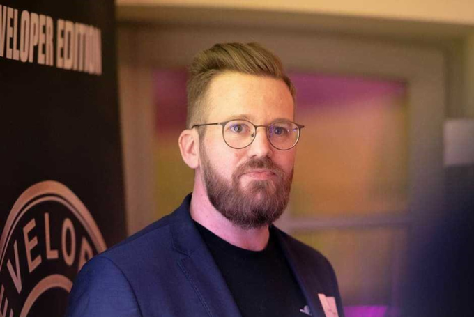

# Our CTO, Dominik Fries

NEWS story of the month

## Story Time

Meet Dominik, CTO and Partner of [Thinkport GmbH](http://www.thinkport.digital).

He is been with Thinkport since its beginnings and has helped to build it the way we know today.

His team colleagues do not describe him as a typical CTO. Besides from being visionary and creative, they portray him as a down-to-earth guy who is relaxing to work with, applaudable both at human and technical level and a person which always puts emphasis on problem-solving and team dynamics. Dominik himself describes his journey with Thinkport as inspiring, thrilling and also challenging at times. The biggest learning is sticking to your plan, daring to take on great challenges, helping others succeed, as well as taking ownership of problems.

What many of you do not know about him? He is a devoted mountain biker, has practised different martial arts, loves metal music and likes to spend most of his free time in the forest or up in the mountains.

We are glad to have such a person in our company [Dominik Fries](_wp_link_placeholder)! We thank you for the great journey so far and look forward to further achieving success and growing, together!

Weitere Neuigkeiten

## News Writer

Christina Friede

Business Development

Email:

[cfriede@thinkport.digital](mailto:cfriede@thinkport.digital)

- 
