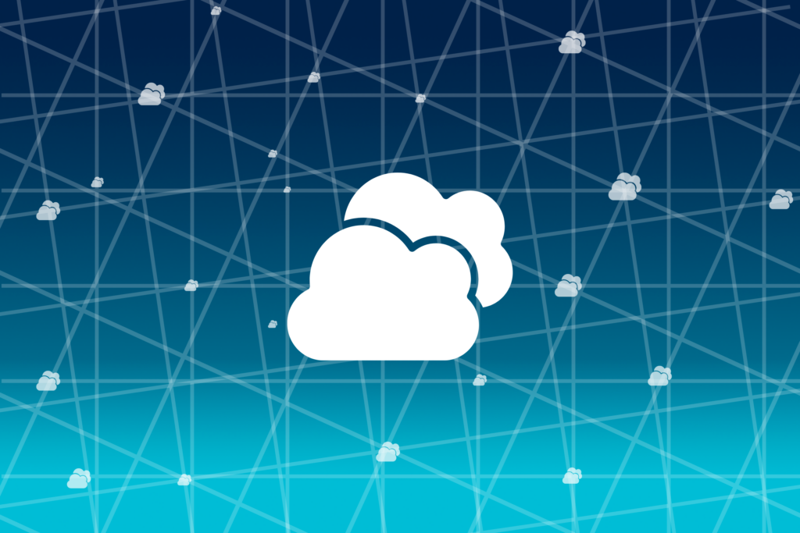
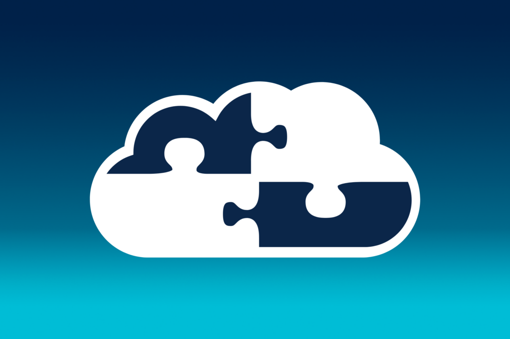
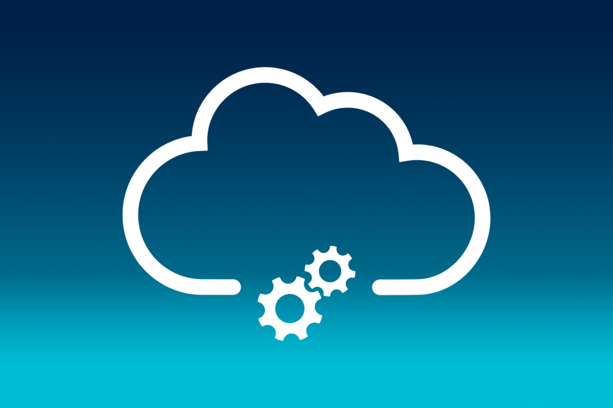

## Single oder Multi Cloud?

Die Cloud-Technologie fungiert als zentraler Motor für die digitale Transformation. Sowohl aus volkswirtschaftlicher als auch aus betriebeeswirtschaftlicher Perspektive ist ein transparenter und wettbewerbsfähiger Cloud-Computing-Markt von enormer Bedeutung. Unternehmen, die besonderen Wert auf Unabhängigkeit legen, erwägen eine Diversifizierung ihrer Cloud-Nutzung als geeignete Strategie. Dabei nutzen sie Ressourcen und Dienstleistungen von mehreren Anbietern. Die Vorteile einer solchen Diversifizierung sind breit gefächert und spielen eine entscheidende Rolle für die Wettbewerbsfähigkeit sowie Zukunftsfähigkeit deutscher Unternehmen im Bereich Cloud-Computing.

Aktuell führt die Competition and Markets Authority (CMA) im Vereinigten Königreich eine Untersuchung über Cloud-Dienstleistungsanbieter durch, ähnlich dem Vorgehen des deutschen Bundeskartellamts. Diese Untersuchung unterstreicht die Bedeutung von Datensouveränität und regulatorischer Compliance. Sie wirft wichtige Fragen auf, die auch für deutsche Unternehmen und Regulierungsbehörden von großem Interesse sind. Die Ergebnisse dieser Untersuchung können somit erhebliche Auswirkungen auf den deutschen Markt haben.

## [Die CMA-Untersuchung und ihre Bedeutung für Deutschland](https://assets.publishing.service.gov.uk/media/652e958b6972600014ccf9f6/Issues_statement__updated.pdf)

Die CMA richtet ihr Augenmerk auf verschiedene kritische Aspekte, die auch für den deutschen Markt von Bedeutung sind:

- **Technische Barrieren und Kundenbindung:** Es wird untersucht, ob technische Hürden den Wechsel zwischen Cloud-Anbietern erschweren und zur Kundenbindung an einen einzelnen Anbieter beitragen.

- **Egress-Gebühren:** Die Untersuchung beleuchtet, ob Egress-Gebühren (Gebühren für ausgehenden Traffic) ein Hindernis für den Anbieterwechsel darstellen und den Wettbewerb einschränken.

- **Rabattstrukturen und Markteintrittsbarrieren:** Es wird analysiert, ob Rabattstrukturen langfristig den Wettbewerb schädigen und Markteintrittsbarrieren errichten.

- **Software-Lizenzierungspraktiken:** Überprüft wird, ob Lizenzierungspraktiken Kunden davon abhalten, konkurrierende Cloud-Anbieter zu nutzen.

Diese Untersuchung könnte in Deutschland zu ähnlichen Initiativen führen und eine stärkere Regulierung sowie mehr Transparenz im Cloud-Markt bewirken.

## Aktueller Stand der Cloud-Strategien in Unternehmen

Derzeit setzen die meisten Unternehmen weiterhin auf Single-Cloud-Strategien, die die IT-Landschaft prägen. Bei Single-Cloud-Strategien verlassen sich Unternehmen ausschließlich auf einen einzigen Cloud-Anbieter, um ihre IT- und Datenspeicheranforderungen zu erfüllen. Dies geschieht nicht unbedingt aus bewusster Präferenz für einen einzelnen Anbieter, sondern vielmehr aufgrund der Tatsache, dass Cloud-Diversifizierung und die Erkundung von Alternativen oft nicht ausreichend berücksichtigt wurden. In Frage steht jedoch, ob diese Vorgehensweise wirklich die optimale Lösung darstellt oder ob wir möglicherweise die Potenziale der Cloud-Diversifizierung übersehen.

Warum wählen so viele Unternehmen derzeit diesen Ansatz? Welche Vor- und Nachteile bietet die Konzentration auf einen einzigen Anbieter? Wir wollen uns die Pro- und Contra-Argumente genauer betrachten:

### Vorteile von Single-Cloud-Strategien:

- **Vereinfachte Verwaltung:** Die Nutzung eines einzigen Cloud-Anbieters vereinfacht die Verwaltung und Wartung erheblich. Da weniger Tools, Schulungen und Ressourcen benötigt werden, reduziert sich die Komplexität deutlich.

- **Bessere Integration:** In einer Single-Cloud-Umgebung sind Integrationen und Schnittstellen oft nahtloser, da sie speziell für die Plattform entwickelt wurden. Dies kann die Effizienz und Leistung von Anwendungen verbessern.

- **Konsistente Abrechnung:** Die Abrechnung und Kostenverfolgung sind einfacher, da alle Dienste von einem Anbieter stammen. Dies ermöglicht eine bessere Budgetierung und Kostenkontrolle.

- **Gebündelte Unterstützung:** Bei Single-Cloud-Strategien gibt es einen zentralen Ansprechpartner für technischen Support und Service-Level-Vereinbarungen, was die Problemlösung und den Support erleichtern kann.

- **Einfache Personalsuche:** Die Rekrutierung von IT-Personal mit spezifischer Expertise ist heute bereits eine Herausforderung. Eine Single-Cloud-Strategie kann das Team-Staffing erleichtern, da man sich auf eine Plattform und damit verbundene Fähigkeiten konzentrieren können.

 

### Nachteile von Single-Cloud-Strategien:

- **Vendor Lock-In:** Ein entscheidender Nachteil ist die Gefahr des Vendor Lock-In. Wenn sich das Unternehmen stark in die Dienste eines Anbieters investiert, kann ein Wechsel zu einem anderen Anbieter schwierig und kostspielig sein, was die Flexibilität und Verhandlungsmacht einschränkt.

- **Eingeschränkte Auswahl:** Single-Cloud-Strategien beschränken auf die Dienste und Features des ausgewählten Anbieters, was bedeuten kann, dass möglicherweise nicht die besten Lösungen für die spezifischen Anforderungen genutzt werden können.

- **Preisänderungen:** Cloud-Anbieter können die Preise erhöhen, und Unternehmen haben möglicherweise begrenzte Möglichkeiten, dies zu beeinflussen. Dies kann langfristig zu höheren Betriebskosten führen.

- **Ausfallsicherheit:** In einer Single-Cloud-Umgebung besteht das Risiko, dass ein Ausfall beim Anbieter die gesamte IT-Infrastruktur beeinträchtigt, was je nach Anwendungsfall äußerst schwerwiegend sein kann. Dies erfordert zusätzliche Maßnahmen zur Gewährleistung der Ausfallsicherheit.

- **Abhängigkeit von Anbieter-Strategien:** Eine Abhängigkeit von den strategischen Entscheidungen des Cloud-Anbieters kann sich als äußerst problematisch erweisen. Änderungen in der Dienstleistungsstruktur oder der Geschäftsstrategie des Anbieters haben das Potenzial, erhebliche Auswirkungen auf Pläne und Investitionen zu haben, was in vielen Fällen äußerst nachteilig sein kann.

## Die strategische Bedeutung der Cloud-Diversifizierung für deutsche Unternehmen

Nachdem wir nun die Vor- und Nachteile von Single-Cloud-Strategien ausführlich betrachtet haben, wird deutlich, dass dieser Ansatz sowohl klare Stärken als auch potenzielle Risiken birgt. Angesichts der aktuellen Dominanz von Single-Cloud-Strategien in vielen Unternehmen stellt sich jedoch die Frage: Wie können deutsche Unternehmen von den Vorteilen der Cloud-Diversifizierung profitieren und gleichzeitig die Herausforderungen bewältigen? Dies wird besonders relevant, wenn wir die jüngsten Entwicklungen in der Wettbewerbs- und Marktaufsicht, wie die CMA-Untersuchung im Vereinigten Königreich, berücksichtigen, die die Bedeutung von Cloud-Diversifizierung und Datensouveränität unterstreichen.

Um die strategische Bedeutung der Cloud-Diversifizierung für deutsche Unternehmen zu verdeutlichen, werfen wir einen Blick auf die verschiedenen Ansätze, die Unternehmen nutzen können, um Flexibilität zu maximieren, Risiken zu minimieren und gleichzeitig die Vorteile der Cloud-Nutzung zu nutzen. Dies umfasst die Erkundung von Multi-Cloud-, Hybrid-Cloud- und Edge-Computing-Strategien, die jeweils ihre eigenen Vorteile und Herausforderungen mit sich bringen. Lasst uns diese Ansätze genauer untersuchen und verstehen, wie deutsche Unternehmen in der sich ständig wandelnden Cloud-Landschaft erfolgreich positioniert werden können.

### Multi-Cloud-Strategien

Multi-Cloud-Strategien beziehen sich auf die Implementierung von Cloud-Lösungen, bei denen Unternehmen mehrere Cloud-Anbieter gleichzeitig nutzen.

**Vorteile:**

- **Erweiterte Flexibilität und Risikominimierung:** Die Nutzung mehrerer Cloud-Anbieter ermöglicht es Unternehmen, Dienste optimal auszuwählen und Ausfallrisiken zu streuen.

- **Verbesserte Verhandlungsmacht:** Durch die Auswahlmöglichkeit zwischen verschiedenen Anbietern können Unternehmen bessere Preise und Servicebedingungen aushandeln.

**Herausforderungen:**

- **Komplexität in der Verwaltung:** Die Steuerung mehrerer Cloud-Umgebungen erhöht den Verwaltungsaufwand und die Komplexität.

- **Spezifisches Fachwissen erforderlich:** Unterschiedliche Plattformen erfordern spezifische Kenntnisse und Fähigkeiten, was die Personalanforderungen erhöht.

### Hybrid-Cloud-Strategien

Hybrid-Cloud-Strategien kombinieren die Vorteile öffentlicher Clouds, wie Skalierbarkeit und Ressourcenelastizität, mit den Sicherheits- und Kontrollfunktionen privater Clouds.

**Vorteile:**

- **Optimale Balance zwischen Flexibilität und Kontrolle:** Hybrid-Cloud-Modelle kombinieren die Skalierbarkeit öffentlicher Clouds mit der Sicherheit und Kontrolle privater Clouds.

- **Compliance und Datensouveränität:** Unternehmen können sensible Daten lokal vorhalten, während sie die Vorteile der Cloud-Nutzung beibehalten.

**Herausforderungen:**

- **Integration und Kompatibilität:** Die nahtlose Integration zwischen privaten und öffentlichen Cloud-Umgebungen kann technisch herausfordernd sein.

- **Komplexe Sicherheitsanforderungen:** Die Aufrechterhaltung eines hohen Sicherheitsniveaus über beide Umgebungen hinweg erfordert umfassende Maßnahmen.

### Edge-Computing-Strategien

Edge-Computing-Strategien zielen darauf ab, Daten am Rand des Netzwerks zu verarbeiten, näher am Ursprungsort der Daten.

**Vorteile:**

- **Niedrige Latenzzeiten:** Durch die Verarbeitung von Daten am Rand des Netzwerks, näher am Ursprungsort, können Anwendungen schneller reagieren.

- **Bandbreiteneffizienz:** Die lokale Datenverarbeitung reduziert die zu übertragende Datenmenge und kann Netzwerkengpässe verringern.

**Herausforderungen:**

- **Sicherheitsrisiken:** Edge-Geräte können neue Angriffsvektoren darstellen, die gesondert geschützt werden müssen.

- **Wartung und Management:** Die physische Verteilung von Edge-Geräten kann Wartungs- und Managementherausforderungen mit sich bringen.

## Jenseits des Bewusstseins: Die unerkannte Cloud-Diversifizierung im Unternehmensalltag

In deutschen Unternehmen wird eine Multi-Cloud-Strategie oft durch die Integration von bestehenden Active Directory (AD) Infrastrukturen mit Cloud-Diensten wie Microsoft Entra ID realisiert. Diese Integration ermöglicht eine nahtlose und sichere Authentifizierung über verschiedene Cloud-Plattformen hinweg, indem sie eine einheitliche Benutzerverwaltung und Zugriffskontrolle bietet. Unternehmen profitieren von erhöhter Flexibilität und Effizienz in ihrer IT-Landschaft, da sie zentrale Authentifizierungsdienste nutzen können, um Zugang zu Ressourcen in der Cloud zu gewähren. Diese Praxis unterstreicht, wie subtil und effektiv Multi-Cloud-Strategien implementiert werden können, selbst ohne eine explizite strategische Entscheidung dafür.

Diese Vorgehensweise erstreckt sich über verschiedene Cloud-Dienste und -Plattformen hinweg und ermöglicht eine nahtlose Integration verschiedener Technologien. Durch die Verwendung von Microsoft Entra ID als Authentifizierungsdienst können Unternehmen beispielsweise ihren Mitarbeitern den Zugriff auf Ressourcen in der AWS-Cloud ermöglichen, ohne separate Authentifizierungssysteme einrichten zu müssen. Dies vereinfacht nicht nur das Berechtigungsmanagement und verbessert die Sicherheit durch zentrale Kontrollen, sondern fördert auch die Flexibilität und Effizienz der IT-Systeme. Dieses Beispiel zeigt, wie Unternehmen auf subtile Weise von Multi-Cloud-Strategien profitieren können, ohne sich zwangsläufig auf diese spezifische Strategie festzulegen.

**Vorteile dieses Ansatzes:**

- **Erleichterte Verwaltung:** Ein einziges Authentifizierungssystem zu nutzen, reduziert den administrativen Aufwand und vereinfacht das Benutzer- und Berechtigungsmanagement über verschiedene Cloud-Plattformen hinweg.

- **Verbesserte Sicherheit:** Zentrale Sicherheitsrichtlinien und Authentifizierungsprotokolle erhöhen die Sicherheit, indem sie konsistente Zugriffskontrollen und Überwachung ermöglichen.

- **Erhöhte Flexibilität:** Unternehmen können die besten Cloud-Dienste und -Angebote auswählen, ohne durch Authentifizierungs- und Berechtigungsprobleme eingeschränkt zu sein.

**Herausforderungen:**

- **Abhängigkeit von einem Anbieter:** Die zentrale Rolle von Microsoft AD kann zu einer Abhängigkeit von Microsoft-Technologien führen, die sorgfältig bewertet werden sollte.

- **Komplexität bei der Integration:** Die Einrichtung der Integration zwischen Microsoft AD und anderen Cloud-Diensten kann technische Herausforderungen mit sich bringen, die spezifisches Know-how erfordern.

## Die Cloud im Wandel der Zeit: Neue Technologien, Sicherheit und Nachhaltigkeit

Die Zukunft der Cloud-Technologie verspricht kontinuierliche Innovation und eine immer breitere Palette von Anwendungen. In diesem Abschnitt werfen wir einen Blick auf einige zentrale Aspekte, die die Entwicklung von Cloud-Strategien für deutsche Unternehmen in den kommenden Jahren prägen werden.

**Adaption an neue Technologien:** Mit dem Fortschritt in der Cloud-Technologie, wie der zunehmenden Verbreitung von Künstlicher Intelligenz (KI) und maschinellem Lernen (ML) in Cloud-Plattformen, müssen Unternehmen ihre Cloud-Strategien kontinuierlich anpassen. Die Integration dieser Technologien bietet Chancen für verbesserte Datenanalyse, Automatisierung und Effizienzsteigerungen.

**Sicherheit und Datenschutz:** Die wachsende Bedeutung von Datenschutz und Sicherheit, besonders in Anbetracht neuer und sich weiterentwickelnder Vorschriften wie der DSGVO, wird Unternehmen dazu bringen, ihre Cloud-Strategien zu überdenken. Dies könnte eine stärkere Betonung auf Hybrid- und Private-Cloud-Lösungen zur Folge haben, um datenschutzkonforme Lösungen zu implementieren.

**Edge Computing:** Die Expansion von Edge Computing wird weiterhin an Bedeutung gewinnen, besonders für IoT-Anwendungen und in Sektoren, in denen Echtzeitdatenverarbeitung kritisch ist. Unternehmen werden zunehmend Edge-Computing in ihre Cloud-Strategien integrieren, um Latenzzeiten zu reduzieren und die Netzwerkeffizienz zu verbessern.

**Nachhaltigkeit:** Angesichts des wachsenden Bewusstseins für Umweltfragen werden Nachhaltigkeit und Energieeffizienz zu wichtigen Überlegungen bei der Auswahl von Cloud-Anbietern. Unternehmen könnten zunehmend solche Anbieter bevorzugen, die umweltfreundliche Praktiken und grüne Technologien einsetzen.

## Wann und welche Cloud-Strategie verfolgen?

Wir wollen konkrete Szenarien betrachten, in denen die Wahl zwischen einer Multi-Cloud- und einer Single-Cloud-Strategie für Unternehmen Sinn ergibt. Diese Beispiele verdeutlichen, wie verschiedene Geschäftskontexte und -ziele die Entscheidung für eine bestimmte Cloud-Strategie beeinflussen können.

**Beispiel für Multi-Cloud:**

Qwist hat eine führende europäische Fintech-Ökosystemarchitektur aufgebaut, die auf Multi-Cloud und Kubernetes basiert, um Skalierbarkeit und Compliance in der schnell wachsenden Open-Banking-Branche zu gewährleisten. Die Migration zu CockroachDB ermöglichte eine nahtlose Datenverwaltung über verschiedene Cloud-Umgebungen hinweg, wodurch Cloud-Portabilität erreicht und eine hohe Fehlertoleranz für ihre global diversifizierte Kundenbasis sichergestellt wurde. finleap kann nun Anwendungen mit minimalen Unterbrechungen zwischen verschiedenen Clouds (öffentliche und private Clouds, AWS, GCP, Azure, OpenStack, VMware, Equinix) verschieben, was die Architektur besonders widerstandsfähig gegen Ausfälle macht.

**Beispiel für Single-Cloud:**

Ein kleines Start-up-Unternehmen mit begrenzten Ressourcen und einem klaren Fokus auf Kostenoptimierung könnte sich für eine Single-Cloud-Strategie entscheiden. Indem es sich auf einen einzigen Cloud-Anbieter konzentriert, kann das Unternehmen von den einfacheren Verwaltungsmöglichkeiten, der besseren Integration und den möglichen Kosteneinsparungen profitieren. In dieser Situation ergibt die Single-Cloud-Strategie Sinn, da sie die Komplexität reduziert und die betriebliche Effizienz steigert.

## Fazit zu Single-Cloud oder Multi-Cloud

Die Cloud spielt eine zentrale Rolle in der digitalen Transformation von Unternehmen. Die Entscheidung für die richtige Cloud-Strategie, sei es Single-Cloud oder Multi-Cloud, ist von entscheidender Bedeutung, um die Wettbewerbsfähigkeit und Zukunftsfähigkeit deutscher Unternehmen sicherzustellen. In diesem Artikel haben wir die Vor- und Nachteile von Single-Cloud-Strategien beleuchtet, die auf einen einzigen Cloud-Anbieter setzen, sowie die Chancen und Herausforderungen von Multi-Cloud-Strategien, die auf die Nutzung mehrerer Anbieter abzielen.

Aktuell sind Single-Cloud-Strategien nach wie vor weit verbreitet, jedoch oft nicht aufgrund bewusster Entscheidungen, sondern aufgrund mangelnder Erkundung von Alternativen. Die CMA-Untersuchung im Vereinigten Königreich unterstreicht die Bedeutung von Datensouveränität und Wettbewerbsfähigkeit, die auch für deutsche Unternehmen von großem Interesse ist. Die Ergebnisse dieser Untersuchung könnten den deutschen Markt maßgeblich beeinflussen.

Die Entscheidung zwischen Single-Cloud und Multi-Cloud erfordert eine sorgfältige Abwägung der individuellen Bedürfnisse und Ziele eines Unternehmens. Multi-Cloud-Strategien bieten Flexibilität und Risikostreuung, während Single-Cloud-Strategien die Verwaltung und Integration vereinfachen können.

Die Zukunft der Cloud-Strategien in Deutschland wird auch von Trends wie Edge Computing, Datenschutz und Nachhaltigkeit geprägt sein. Unternehmen müssen sich kontinuierlich an neue Technologien und Anforderungen anpassen, um wettbewerbsfähig zu bleiben.

In diesem sich rasch verändernden Umfeld ist eine sorgfältige Planung und Umsetzung entscheidend. Deutsche Unternehmen sollten proaktiv handeln, um die Cloud-Infrastruktur zu diversifizieren und so maximale Flexibilität zu erreichen.

| Strategie | Vorteile | Nachteile | Schlussfolgerungen |
| --------- | -------- | --------- | ------------------ |

|
Zentralisiert

|

Einfache Verwaltung, bessere Integration, konsistente Rechnungsstellung, gebündelter Support, einfache Personalsuche

| Anbieterbindung, begrenzte Auswahl, Preisänderungen, Ausfall des Anbieters, Abhängigkeit von den Strategien des Anbieters | Kann für kleine Unternehmen oder Unternehmen mit einfacher Struktur geeignet sein. |
| Dezentralisiert | Größere Flexibilität und Risikoreduzierung, bessere Verhandlungsposition, Gleichgewicht zwischen Flexibilität und Kontrolle, Einhaltung von Vorschriften und Datenhoheit, geringere Latenzzeiten, Effizienz der Bandbreite | Komplexität in der Verwaltung, spezifische Wissensanforderungen, komplexe Integration und Kompatibilität, komplexe Sicherheitsanforderungen, Sicherheitsrisiken, Wartung und Verwaltung | Kann für große Unternehmen oder Unternehmen mit komplexer Struktur geeignet sein. |
| Hybrid | Kombiniert die Vorteile der zentralisierten und dezentralisierten Strategie | Kann komplexer zu implementieren und zu verwalten sein | Kann die beste Option für Unternehmen sein, die ein Gleichgewicht zwischen Flexibilität und Kontrolle benötigen. |

Autor

Samir Hamiani

_Senior Cloud Engineer_

## [Weitere Beiträge](https://thinkport.digital/blog)

### [Cloud Consulting with Kubernetes and Docker](https://thinkport.digital/cloud-consulting-with-kubernetes-and-docker/ 'Cloud Consulting with Kubernetes and Docker')

[Cloud General](https://thinkport.digital/category/cloud-general/)

### [Cloud Consulting with Kubernetes and Docker](https://thinkport.digital/cloud-consulting-with-kubernetes-and-docker/ 'Cloud Consulting with Kubernetes and Docker')

[Cloud General](https://thinkport.digital/category/cloud-general/)

### [Streaming-Services](https://thinkport.digital/streaming-services/ 'Streaming-Services')

[Cloud General](https://thinkport.digital/category/cloud-general/), [Streaming](https://thinkport.digital/category/streaming/)

### [Streaming-Services](https://thinkport.digital/streaming-services/ 'Streaming-Services')

[Cloud General](https://thinkport.digital/category/cloud-general/), [Streaming](https://thinkport.digital/category/streaming/)

### [Modernisierung ist ein Kontinuum](https://thinkport.digital/modernisierung-ist-ein-kontinuum/ 'Modernisierung ist ein Kontinuum')

[Cloud General](https://thinkport.digital/category/cloud-general/), [Cloud Kubernetes](https://thinkport.digital/category/cloud-kubernetes/)

### [Modernisierung ist ein Kontinuum](https://thinkport.digital/modernisierung-ist-ein-kontinuum/ 'Modernisierung ist ein Kontinuum')

[Cloud General](https://thinkport.digital/category/cloud-general/), [Cloud Kubernetes](https://thinkport.digital/category/cloud-kubernetes/)

### [Orthanc und Kubernetes: Sichere On-Premise und Multicloud-Lösung](https://thinkport.digital/orthanc-und-kubernetes/ 'Orthanc und Kubernetes: Sichere On-Premise und Multicloud-Lösung')

[Cloud General](https://thinkport.digital/category/cloud-general/), [Streaming](https://thinkport.digital/category/streaming/)

### [Orthanc und Kubernetes: Sichere On-Premise und Multicloud-Lösung](https://thinkport.digital/orthanc-und-kubernetes/ 'Orthanc und Kubernetes: Sichere On-Premise und Multicloud-Lösung')

[Cloud General](https://thinkport.digital/category/cloud-general/), [Streaming](https://thinkport.digital/category/streaming/)

### [Cloud Consulting for Migration to the Cloud](https://thinkport.digital/cloud-consulting-for-migration-to-the-cloud/ 'Cloud Consulting for Migration to the Cloud')

[Cloud General](https://thinkport.digital/category/cloud-general/)

### [Cloud Consulting for Migration to the Cloud](https://thinkport.digital/cloud-consulting-for-migration-to-the-cloud/ 'Cloud Consulting for Migration to the Cloud')

[Cloud General](https://thinkport.digital/category/cloud-general/)

### [Sustainability of the Cloud](https://thinkport.digital/sustainability-of-the-cloud/ 'Sustainability of the Cloud')

[Cloud General](https://thinkport.digital/category/cloud-general/)

### [Sustainability of the Cloud](https://thinkport.digital/sustainability-of-the-cloud/ 'Sustainability of the Cloud')

[Cloud General](https://thinkport.digital/category/cloud-general/)
