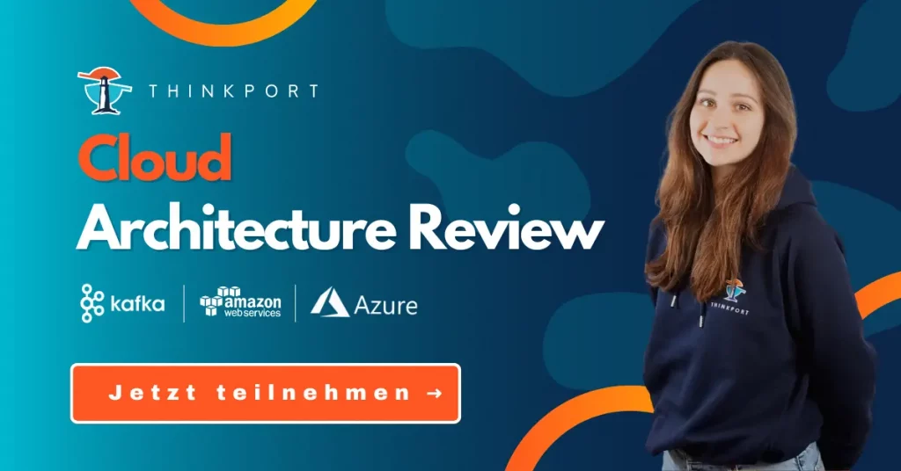

# Streaming-Services – Lösungen von AWS, Azure und Apache Kafka im Vergleich

In der digitalen Geschäftswelt basiert das Fundament vieler Unternehmen auf Daten. Vielen Daten, die sich in ständigem Wandel befinden. Sie bieten großes Potenzial, doch benötigen gleichzeitig eine leistungsfähige Plattform, die die Erfassung, Speicherung und Verarbeitung in hoher Geschwindigkeit bewerkstelligen kann. Hier kommen Streaming-Services wie Apache Kafka, AWS Kinesis, Azure Event Hubs und Solace PubSub+ ins Spiel. In diesem Beitrag erfahren Sie, welche Vorteile **Streaming-Services** mit sich bringen und inwiefern sich die unterschiedlichen Lösungen voneinander unterscheiden.

## Streaming-Services vs. Message-Brokers – wo liegen die Unterschiede?

Streaming-Services sind auf dem Vormarsch. Das **verstärkte Aufkommen digitaler Geschäftsmodelle** in den letzten Jahren sorgt dafür, dass immer mehr Unternehmen die Technologie für ihre Datenverarbeitung einsetzen. Dementsprechend ist Expertise im Umgang mit den Plattformen gefragter denn je. Gleichzeitig nimmt das Interesse an traditionellen Message-Brokern wie Active MQ und Rabbit MQ ab. Doch woran liegt das? Um das zu verstehen, klären wir zunächst, was sich überhaupt hinter den Begriffen Message-Broker und Streaming-Service verbirgt. Beide kommen dort zum Einsatz, wo **klassisches Batch-Processing zu langsam** ist. Doch obwohl die Technologien auf den ersten Blick ähnlich wirken, unterscheiden sie sich erheblich in Bezug auf Verhalten und Performance.

### Message-Brokers

Hinter dem Message-Broker steckt eine Architektur zur **Validierung, Umwandlung und Weiterleitung von Daten**. Ihre Hauptfunktion besteht darin, eingehende Nachrichten von Anwendungen entgegenzunehmen und an einen oder mehrere Empfänger weiterzuleiten. Dafür muss der Message-Broker auch das Nachrichtenformat an die Empfängersysteme anpassen. Er übernimmt also die **Rolle des Vermittlers** und kann eintreffende Nachrichten zentral speichern und verteilen. Im Gegensatz zur einfachen Punkt-zu-Punkt-Verbindung überzeugt das System mit einer asynchronen Datenverarbeitung, was in höherer Effizienz, besserer Skalierbarkeit und höherer Ausfallsicherheit resultiert.

### Streaming-Services

In jüngster Zeit sind es vor allem Streaming-Services wie Apache Kafka mit Confluent, AWS Kinesis, Azure Event Hubs oder Solace PubSub+ die an Beliebtheit gewinnen. Sie basieren auf der **verteilten Commit-Log-Architektur**. Sie ähnelt zwar dem traditionellen Message-Broker, doch die Stärken variieren. Anstelle von Flexibilität setzen viele Streaming-Services ihren Fokus auf **maximale Skalierbarkeit und einen hohen Datendurchsatz**.

Der Unterschied in der Architektur besteht vor allem in der stärkeren Entkopplung der einzelnen Prozesse. Nachrichten werden an das Commit-Log übertragen und dort entweder permanent oder für eine festgelegte Zeit gespeichert. Sie liegen auch nach dem Senden weiterhin vor. So können sich Empfänger im Commit-Log vor- und zurückbewegen und Nachrichten erneut bearbeiten. Die Modifikation aufgezeichneter Einträge ist nicht möglich. Neue Eingänge stehen immer am Ende und werden sequenziell gelesen. Daraus ergibt sich eine höhere Datensicherheit und Nachvollziehbarkeit bei auftretenden Fehlern.

## Streaming-Services im Überblick

Datenstreaming ist gefragter denn je. Demnach etablierten sich gleich mehrere Streaming-Services von verschiedenen Anbietern. Alle Plattformen haben sich in den vergangenen Jahren stetig weiterentwickelt und bieten unterschiedliche Lösungsansätze für die Echtzeit-Datennutzung.

### 1\. Apache Kafka

Bei Apache Kafka handelt es sich um eine leistungsfähige, hochskalierbare und fehlertolerante Open-Source-Software. Mit ihr können **Pipelines für Echtzeit-Daten-Streaming** geschaffen werden. Confluent ist ein Unternehmen, das sich auf die Verwaltung und Unterstützung von Apache Kafka spezialisiert hat. Apache Kafka entkoppelt die Anwendungen, die Streaming-Daten produzieren (Producer) von solchen, die Streaming-Daten konsumieren (Consumer). Events speichert das System auf separaten Servern in sogenannten Topics. Durch den Aufbau glänzt es vor allem mit hoher Zuverlässigkeit – auch bei Knotenausfällen oder Wartungsarbeiten – und leichter Erweiterbarkeit. Unternehmen nutzen die Plattform gern als Datenquelle für Anwendungen, die Streaming-Daten analysieren und basierend darauf reagieren.

### 2\. AWS Kinesis

Kinesis ist ein **serverloser Streaming-Datenservice** für die Sammlung, Verarbeitung und Analyse großer Datenmengen in Echtzeit. Zu den einschlägigen Argumenten zählt die hohe Leistung. Die Plattform kann Hunderte von Terabyte an Daten pro Stunde verarbeiten. Die Daten können auch aus kontinuierlichen Strömen stammen, beispielsweise von Betriebsprotokollen, Finanztransaktionen oder Social-Media-Feeds. Zusätzlich ist Kinesis in der Lage, **Echtzeit-Entscheidungen** anhand von Streaming-Daten zu treffen, ohne warten zu müssen, bis alle Daten gesammelt sind. Da nötige Funktionen beliebig ausgewählt werden können, eignet sich Kinesis für zahlreiche Einsatzgebiete.

### 3\. Azure Event Hubs

Azure Event Hubs ist eine **Big-Data-Streaming-Plattform und ein Eventdienst**, der Millionen von Ereignissen pro Sekunde empfangen und verarbeiten kann. In der Praxis dient Event Hubs vor allem der Anwendungsprotokollierung, der Erkennung von Anomalien, dem Live-Dashboarding, der Transaktionsverarbeitung und der Archivierung von Daten. Es handelt sich dabei um ein Plattform-as-a-Service-Modell (PaaS), das nur einen **geringen Konfigurations- und Verwaltungsaufwand** mit sich bringt. Datenströme können in Echtzeit von mehreren Anwendungen gleichzeitig verarbeitet und die Geschwindigkeit gesteuert werden.

### 4\. Solace PubSub+

Bei Solace PubSub+ handelt es sich um eine Event-Streaming-Plattform, die **alle Tools für die Entwicklung, Einführung und Verwaltung eines eventgesteuerten Systems** bietet. Die PubSub+-Plattform baut auf 3 Pfeilern auf: das Event-Streaming für die Bereitstellung und Verbindung von Event-Brokern, das Event-Management für die Verwaltung der einzelnen Komponenten und die Event-Insights zur Überwachung des Zustands und der Performance des Systems. Zu den Funktionen zählt nicht nur das schnelle und sichere **Streaming über Hybrid-, Multi-Cloud- und IoT-Umgebungen, **sondern auch die unkomplizierte Entwicklung von eventgesteuerten Anwendungen und Microservices. Im Gegensatz zu vielen anderen Streaming-Services baut die Architektur auf weniger Komponenten auf, was es den Einsatz einfacher und zuverlässiger gestaltet.

## Welcher Streaming-Service ist der beste?

Die Frage nach dem besten Streaming-Service können wir nicht pauschal beantworten. Zwar hat Kafka derzeit einen sehr hohen Marktanteil, doch das bedeutet nicht, dass Kinesis, Event Hubs oder PubSub+ nicht ebenfalls eine gute Wahl darstellen. All diese Plattformen sind hervorragend in dem, was sie tun. Letztendlich sollten Sie Ihre Entscheidung deshalb vom Anwendungsfall abhängig machen.

### Apache Kafka

Obwohl Kafka die flexibelste und leistungsfähigste Lösung ist, geht sie auch mit dem größten Verwaltungsaufwand einher. Die effiziente Nutzung erfordert also ein gewisses Maß an Know-how, was sich bei guter Umsetzung allerdings auszahlt. Die Nutzung von Confluent vereinfacht hier den Aufwand.

### AWS Kinesis

Wer nicht über die nötigen Ressourcen für den Betrieb eines aufwendigen Streaming-Services verfügt, erhält mit Kinesis eine schlankere Alternative mit einigen Limitationen. Die Einführung gestaltet sich deutlich einfacher. Zudem erlaubt die Plattform eine unkomplizierte Integration weiterer Amazon Web Services.

### Azure Event Hubs

Da es sich bei Event Hubs um eine vollständig verwaltete Plattform-as-a-Service handelt, reduziert sich der Verwaltungsaufwand auf ein Minimum. Allerdings steht auch Event Hubs Kafka in Sachen Performance und Funktionsumfang nach. Das gestaffelte Preismodell bietet mehrere Optionen, die eine kosteneffektive Umsetzung je nach Anspruch erlauben.

### Solace PubSub+

Die PubSub+-Plattform bringt einige Vorteile mit sich, sticht aber in erster Linie mit einer vergleichsweise unkomplizierten Nutzung und hoher Skalierbarkeit hervor. Der Event-Broker unterstützt eine Vielzahl von APIs und Protokollen. Das macht ihn zu einer soliden Wahl für eine Vielzahl von Anwendungsfällen und vereinfacht die Integration.

## Streaming-Services – Trainings für den Einstieg

Wollen Sie tiefer in die Materie einsteigen? Unser Training zum Thema **[Event-Streaming-Services](https://thinkport.digital/event-streaming-services-auf-aws-and-azure/)** verschafft Ihnen einen detaillierten Überblick über verschiedene Cloud-Streaming-Dienste, ihre Stärken und Limitationen sowie ihre möglichen Anwendungsfälle. Kommen Sie jetzt auf uns zu und vereinbaren Sie einen Termin für Ihr Training – remote oder vor Ort.

## Weitere Artikel

## [Weitere Beiträge](https://thinkport.digital/blog)

### [Neue AWS-Funktionen für Speicher- und Dateisysteme](https://thinkport.digital/neue-aws-funktionen-fur-speicher-und-dateisysteme/ 'Neue AWS-Funktionen für Speicher- und Dateisysteme')

[AWS Cloud](https://thinkport.digital/category/aws-cloud/)

### [Neue AWS-Funktionen für Speicher- und Dateisysteme](https://thinkport.digital/neue-aws-funktionen-fur-speicher-und-dateisysteme/ 'Neue AWS-Funktionen für Speicher- und Dateisysteme')

[AWS Cloud](https://thinkport.digital/category/aws-cloud/)

### [Was Sie über Kafka 2.7 wissen sollten](https://thinkport.digital/kafka-2-7-update/ 'Was Sie über Kafka 2.7 wissen sollten')

[AWS Cloud](https://thinkport.digital/category/aws-cloud/)

### [Was Sie über Kafka 2.7 wissen sollten](https://thinkport.digital/kafka-2-7-update/ 'Was Sie über Kafka 2.7 wissen sollten')

[AWS Cloud](https://thinkport.digital/category/aws-cloud/)

### [IT-Automatisierung als Antwort gegen die Corona-Krise](https://thinkport.digital/it-automatisierung-als-antwort-gegen-die-corona-krise/ 'IT-Automatisierung als Antwort gegen die Corona-Krise')

[AWS Cloud](https://thinkport.digital/category/aws-cloud/), [Big Data](https://thinkport.digital/category/big-data/)

### [IT-Automatisierung als Antwort gegen die Corona-Krise](https://thinkport.digital/it-automatisierung-als-antwort-gegen-die-corona-krise/ 'IT-Automatisierung als Antwort gegen die Corona-Krise')

[AWS Cloud](https://thinkport.digital/category/aws-cloud/), [Big Data](https://thinkport.digital/category/big-data/)

### [streaming-services](https://thinkport.digital/streaming-services/ 'streaming-services')

[Cloud General](https://thinkport.digital/category/cloud-general/), [Streaming](https://thinkport.digital/category/streaming/)

### [streaming-services](https://thinkport.digital/streaming-services/ 'streaming-services')

[Cloud General](https://thinkport.digital/category/cloud-general/), [Streaming](https://thinkport.digital/category/streaming/)

### [apache airflow](https://thinkport.digital/apache-airflow/ 'apache airflow')

[Cloud General](https://thinkport.digital/category/cloud-general/), [Hybrid-Cloud](https://thinkport.digital/category/hybrid-cloud/)

### [apache airflow](https://thinkport.digital/apache-airflow/ 'apache airflow')

[Cloud General](https://thinkport.digital/category/cloud-general/), [Hybrid-Cloud](https://thinkport.digital/category/hybrid-cloud/)

### [Home Office wegen Covid-19? So kann AWS helfen](https://thinkport.digital/home-office-covid-19-aws-losungen/ 'Home Office wegen Covid-19? So kann AWS helfen')

[AWS Cloud](https://thinkport.digital/category/aws-cloud/)

### [Home Office wegen Covid-19? So kann AWS helfen](https://thinkport.digital/home-office-covid-19-aws-losungen/ 'Home Office wegen Covid-19? So kann AWS helfen')

[AWS Cloud](https://thinkport.digital/category/aws-cloud/)
