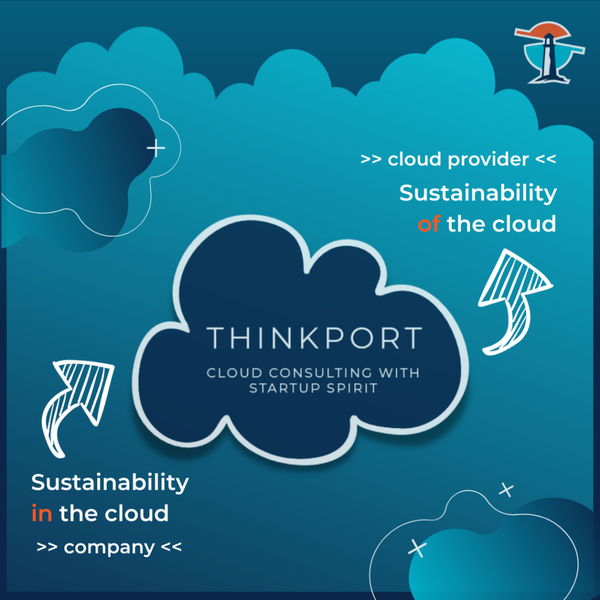

 

# Substainability of the Cloud - curse or blessing?

## Cloud and substainability - curse or blessing?

[Linkedin](https://www.linkedin.com/company/11759873) [Instagram](https://www.instagram.com/thinkport/) [Youtube](https://www.youtube.com/channel/UCnke3WYRT6bxuMK2t4jw2qQ) [Envelope](mailto:tdrechsel@thinkport.digital) [Phone](tel:+4915163417156)

CONTRIBUTOR: VANESSA HOLTEWERT

Information technology is an energy-intensive business. And increasingly so. Latest research for 2020 suggests an annually growth of power demand of 7 % (Germany, Source: Borderstep Institute) and 9% (globally). For both, cost and responsibility aspects, companies are to take actions to improve their IT to be more sustainable. According to investigations, great potential exists to decrease cost and support climate protection.

### Basic infrastructure decision

Principally speaking, every company decides the type of its IT. It is either that the company manages all from servers, storage, network to data and applications on their own on-premise datacenter. In this case companies are fully responsible to control efficiency and emission of their chosen IT architecture.  
  
Or the company decides to entrust parts of their IT to a cloud solution, whether it is IaaS, PaaS or SaaS, meaning that the cloud provider takes over responsibilities for the company.  
  
In a world of shared responsibilities, **[Thinkport](thinkport.digital)** sums up what cloud-provider, consultants and companies do and could do in terms of sustainability.

### The contribution of the cloud provider

#### Climate friendly cloud with renewable energies

AWS, Azure and Google, top three cloud providers, are onset to a climate friendly cloud. Of all CO2 emissions caused by technology, data centers are responsible for 17%. Cloud Providers counteract this with transferring to renewable energies instead of burning fossil fuels to produce energy, which, otherwise, would contribute to climate change. Wind energy and solar panels are relevant options for cloud providers, as data centers require a lot of electricity for lighting and cooling.  
  
Google is also experimenting how ocean water can be used in terms of cooling. Otherwise, on-premise does not only require power for cooling systems. But rather hardware, that needs to be maintained. Therefore, on-premise is usually more expensive. The company itself is responsible for updates and backups, staff as well as operating the systems. Also, the hardware needs to be switched out regularly, especially if it is not working efficient anymore. The result: a lot of e-waste, where only about 17% is being recycled.

#### Ecologic footprint and carbon neutrality

In a highly competitive market, cloud providers struggle to offer their customers superior performance as well as cost and emission reductions. Basically, should be, reducing carbon emissions by transferring to renewable energies. And therefore, providers have different options: wind, solar and geothermal power. Microsoft seems a step ahead and claims carbon neutrality since 2012, committed to being carbon negative with their full supply chain by 2030. Consequently, Microsoft is monitoring all its emissions. Also AWS targets to improve the ecologic footprint by powering all operations with renewable energies by 2025. All in all, the transition to the cloud reduces carbon emissions associated with on-premises data center operations by 72%-98%.

### Conclusion

AWS and Azure help companies to meet their sustainability goals with their built-in environmental benefits inherent in cloud products regarding energy and carbon. If you would like to know more about how to make your company fit for the future, we at **[Thinkport](https://thinkport.digital)** will be happy to advise you.  
  
For further information, try these references here:  
[1\. AWS official website - aws blog](https://aws.amazon.com/de/blogs/aws/sustainability-pillar-well-architected-framework/)  
[2\. AWS Black & White paper](https://d39w7f4ix9f5s9.cloudfront.net/d1/80/283b833847df8ee4fe9661e0dd8f/11061-aws-451research-advisory-bw-cloudefficiency-eu-2021-r2-final-2.pdf)

Find out what enterprises and their consultants do to reduce carbon emissions aka sustainability in the cloud:  
  
[Medium - Roman Krivtsov blog article - Sustainability in the Cloud - 5 Best Practises to do it right](https://medium.com/thinkport/sustainability-in-the-cloud-5-best-practises-to-do-it-right-e44de33a0670)

Share on facebook Share on linkedin Share on twitter Share on xing

## [Weitere Beiträge](https://thinkport.digital/blog)

### [The 6 Most Important Things I have learned in my 6 Months using Server-less](https://thinkport.digital/the-6-most-important-things-i-have-learned-in-my-6-months-using-server-less/ "The 6 Most Important Things I have learned in my 6 Months using Server-less")

[Big Data](https://thinkport.digital/category/big-data/)

### [The 6 Most Important Things I have learned in my 6 Months using Server-less](https://thinkport.digital/the-6-most-important-things-i-have-learned-in-my-6-months-using-server-less/ "The 6 Most Important Things I have learned in my 6 Months using Server-less")

[Big Data](https://thinkport.digital/category/big-data/)

[")](https://thinkport.digital/practical-tips-and-tricks-on-how-to-use-typography-in-ui-design/)

### [Practical Tips and Tricks on How to Use Typography in UI Design](https://thinkport.digital/practical-tips-and-tricks-on-how-to-use-typography-in-ui-design/ "Practical Tips and Tricks on How to Use Typography in UI Design")

[Big Data](https://thinkport.digital/category/big-data/)

### [Practical Tips and Tricks on How to Use Typography in UI Design](https://thinkport.digital/practical-tips-and-tricks-on-how-to-use-typography-in-ui-design/ "Practical Tips and Tricks on How to Use Typography in UI Design")

[Big Data](https://thinkport.digital/category/big-data/)

[")](https://thinkport.digital/16-things-to-avoid-when-writing-for-your-ui/)

### [16 Things to Avoid When Writing For Your UI](https://thinkport.digital/16-things-to-avoid-when-writing-for-your-ui/ "16 Things to Avoid When Writing For Your UI")

[Frontend](https://thinkport.digital/category/frontend/)

### [16 Things to Avoid When Writing For Your UI](https://thinkport.digital/16-things-to-avoid-when-writing-for-your-ui/ "16 Things to Avoid When Writing For Your UI")

[Frontend](https://thinkport.digital/category/frontend/)

### [Was Sie über Kafka 2.7 wissen sollten](https://thinkport.digital/kafka-2-7-update/ "Was Sie über Kafka 2.7 wissen sollten")

[AWS Cloud](https://thinkport.digital/category/aws-cloud/)

### [Was Sie über Kafka 2.7 wissen sollten](https://thinkport.digital/kafka-2-7-update/ "Was Sie über Kafka 2.7 wissen sollten")

[AWS Cloud](https://thinkport.digital/category/aws-cloud/)

### [7 Golden Rules for Creating Great UI](https://thinkport.digital/7-golden-rules-for-creating-great-ui/ "7 Golden Rules for Creating Great UI")

[Frontend](https://thinkport.digital/category/frontend/)

### [7 Golden Rules for Creating Great UI](https://thinkport.digital/7-golden-rules-for-creating-great-ui/ "7 Golden Rules for Creating Great UI")

[Frontend](https://thinkport.digital/category/frontend/)

### [Kublr bringt Rolling-Updates für Kubernetes](https://thinkport.digital/kublr-rolling-updates-fuer-kubernetes/ "Kublr bringt Rolling-Updates für Kubernetes")

[AWS Cloud](https://thinkport.digital/category/aws-cloud/), [Cloud Kubernetes](https://thinkport.digital/category/cloud-kubernetes/)

### [Kublr bringt Rolling-Updates für Kubernetes](https://thinkport.digital/kublr-rolling-updates-fuer-kubernetes/ "Kublr bringt Rolling-Updates für Kubernetes")

[AWS Cloud](https://thinkport.digital/category/aws-cloud/), [Cloud Kubernetes](https://thinkport.digital/category/cloud-kubernetes/)

## Blog Kurator

Christina Friede

Business Development

Email:

[cfriede@thinkport.digital](mailto:cfriede@thinkport.digital)

* 
