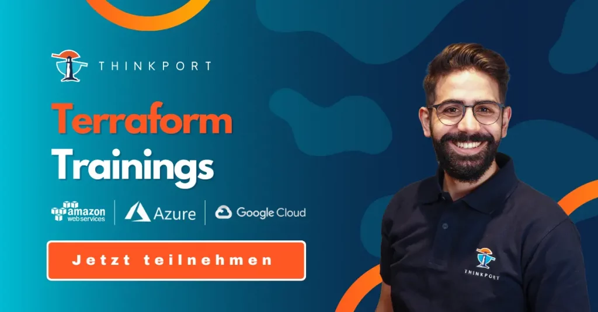
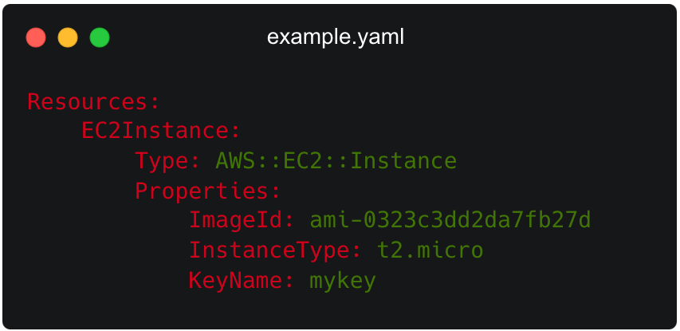
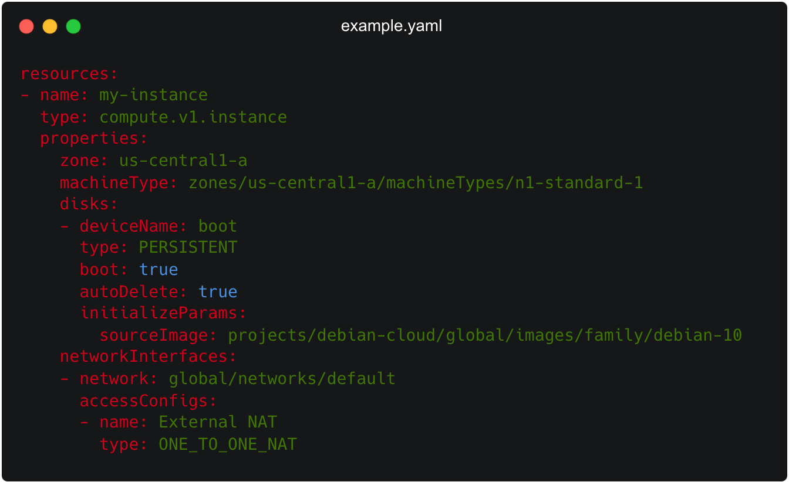
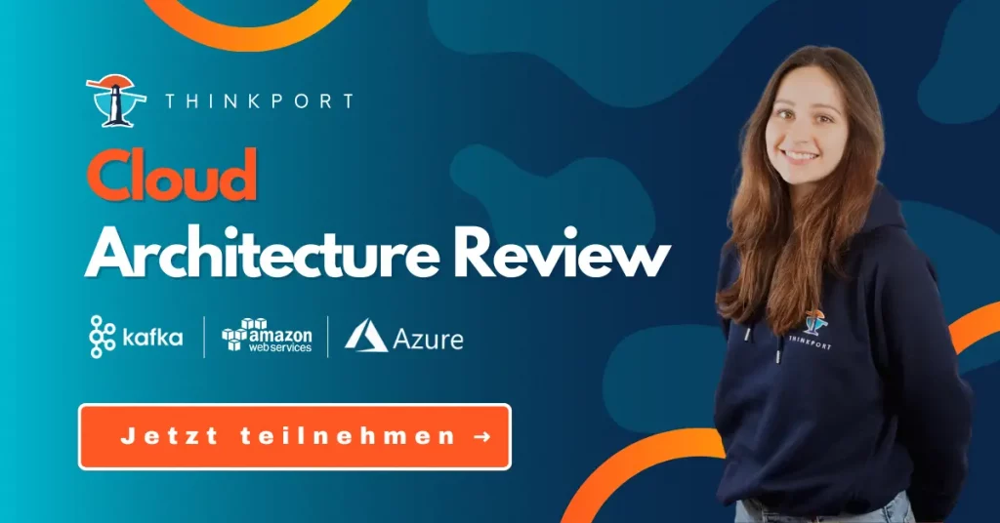

# Terraform Consulting in a Multi Cloud Environment

As more and more organizations adopt hybrid- and multi-cloud environments, managing infrastructure across borders can become a complex and challenging task. That's where Terraform consulting comes in. Its services can provide expert guidance and support for managing infrastructure as code (IaC) in a multi-cloud environment using Terraform.

## How Terraform consulting can help managing a multi-cloud environment

The five big steps are:

* **1\. Strategy and Planning:** Terraform consultants can help you plan and design your infrastructure using Terraform in a multi-cloud environment. They can provide recommendations on the best practices for implementing IaC and help you define a strategy that meets your business requirements.
* **2\. Implementation and Deployment:** Terraform consulting can help you implement and deploy your infrastructure using Terraform. They can create and manage the Terraform code, test it, and deploy it across your multi-cloud environment.
* **3\. Optimization and Automation:** Consultants can help you optimize your infrastructure and automate the deployment process. They can identify areas for improvement, such as resource usage and cost optimization, and help you automate the deployment of new resources.

* **4\. Monitoring and Maintenance:** Consulting can help you monitor your infrastructure and provide ongoing maintenance and support. They can identify and resolve issues and ensure that your infrastructure is running smoothly.
* **5\. Training and Education:** Terraform consultants can provide training and education for your team on Terraform best practices and how to manage infrastructure in a multi-cloud environment using Terraform.

## How Terraform manages a Multi Cloud Environment

Terraform enables the central addressing and abstraction of cloud resources from different providers. If resources from AWS, Azure, or the Google Cloud Platform are used, Terraform can simplify the connection.

Terraform is an open-source tool in the Infrastructure-as-Code (IaC) field, written in Go by HashiCorp. The tool can declaratively represent a data center infrastructure in a JSON-like programming language called HashiCorp Configuration Language (HCL). This enables the desired system architecture to be stored independently in short text files and distributed across different platforms. In DevOps environments, the use of Terraform is ideal since extensive automation can be implemented. The tool can be installed on Windows, Linux, macOS, FreeBSD, OpenBSD, and Solaris.

## Terraform is supported by virtually all cloud platforms

In fact, Terraform is supported by every major cloud provider. This in turn allows the creation or modification of entire cloud infrastructures with just a few lines of code. The tool is useful for test or development environments, as well as in production, but developers must use it with caution when deleting or changing resources, as a few lines of code can result in a comprehensive change that may lead to data loss. Terraform can abstract the APIs of connected clouds and centrally control resources from different cloud environments.

Of course, Terraform can also be used when only one cloud provider is in use. However, the tool is especially useful when multiple services from different providers need to be consolidated under one roof in multi-cloud environments. This is the clear focus of Terraform: configuring numerous resources from different cloud platforms under one roof.

## Alternatives to Terraform

While Terraform is a popular Infrastructure-as-Code provisioning tool, there are alternatives available in the market – cloud platform integrated as well as third party technologies for configuration management and server templating. Each of these tools has its strengths and weaknesses, and it might require a consulting to select the right one depending on your specific requirements and use case.

* **1\. AWS CloudFormation** provides a way to model and provision resources in AWS. It uses JSON or YAML templates to define the infrastructure and automatically deploys and updates the resources. Here is an example CloudFormation template for creating an EC2 instance:

* **2\. Azure Resource Manager (ARM)** is a service that allows users to provision resources in Azure using templates. Templates can be written in JSON or YAML and define the resources and dependencies between them.

* **3\. Google Cloud Deployment Manager** is a tool for creating and managing cloud resources in Google Cloud Platform. It uses YAML or Python templates to define the infrastructure and can be integrated with other Google Cloud services like Cloud Storage and Cloud SQL. Here is an example Deployment Manager configuration file for creating a Compute Engine instance:

This YAML code defines a resource named "my-instance" of type "compute.v1.instance" that creates a Compute Engine instance in the "us- central1-a" zone. The instance uses the machine type "n1-standard-1" and has a bootable persistent disk with a Debian 10 image as the source. It also defines a network interface that provides a default network connection with a single NAT IP address

* **4\. Ansible** is a configuration management tool that uses a declarative language to define infrastructure as code. It is designed to be simple, easy to use, and can be used to manage a variety of environments, including on-premises servers and cloud environments.
* **5\. Puppet** is another popular configuration management tool that uses a declarative language to define infrastructure as code. It is designed to be scalable and can be used to manage large-scale environments.
* **6\. Packer** is a server templating tool that creates identical machine images for multiple platforms from a single source configuration. It can be used to automate the creation of machine images for various cloud platforms, including AWS, Azure, and Google Cloud Platform.

* **7\. Docker** is a containerization tool that allows you to package applications into containers. It is designed to be lightweight and can be used to deploy applications quickly and efficiently in various environments.
* **8\. Vagrant** is a server templating tool that allows to create and manage virtual environments. It can be used to automate the creation and management of virtual machines for development and testing purposes.

## Summary

In conclusion, Terraform consulting can provide expert guidance and support for managing infrastructure as code in a multi-cloud environment. Whether you need help with planning and strategy, implementation and deployment, optimization and automation, monitoring and maintenance, or training and education, Terraform consulting services can help managing multi-cloud environment more efficiently and effectively

As an excellent Cloud Consulting Partner for **[AWS](https://thinkport.digital/cloud-consulting-fuer-deutsche-grossunternehmen/aws/)** and **[Azure](https://thinkport.digital/cloud-consulting-fuer-deutsche-grossunternehmen/azure/)**, we offer your company a qualified, certified and dedicated team. Our extensive practical experience covers the complete spectrum of all services related to the cloud. Whether private, public, hybrid or multi-cloud - we are your partner at eye level. And work with you to find the best cloud solutions. We look forward to hearing from you.

## Weitere Artikel

## [Weitere Beiträge](https://thinkport.digital/blog)

### [Azure Databricks](https://thinkport.digital/azure-databricks/ 'Azure Databricks')

[Azure Cloud](https://thinkport.digital/category/azure-cloud/), [Cloud General](https://thinkport.digital/category/cloud-general/)

### [Azure Databricks](https://thinkport.digital/azure-databricks/ 'Azure Databricks')

[Azure Cloud](https://thinkport.digital/category/azure-cloud/), [Cloud General](https://thinkport.digital/category/cloud-general/)

### [Cloud Consulting with Kubernetes and Docker](https://thinkport.digital/cloud-consulting-with-kubernetes-and-docker/ 'Cloud Consulting with Kubernetes and Docker')

[Cloud General](https://thinkport.digital/category/cloud-general/)

### [Cloud Consulting with Kubernetes and Docker](https://thinkport.digital/cloud-consulting-with-kubernetes-and-docker/ 'Cloud Consulting with Kubernetes and Docker')

[Cloud General](https://thinkport.digital/category/cloud-general/)

### [Cloud Consulting for Migration to the Cloud](https://thinkport.digital/cloud-consulting-for-migration-to-the-cloud/ 'Cloud Consulting for Migration to the Cloud')

[Cloud General](https://thinkport.digital/category/cloud-general/)

### [Cloud Consulting for Migration to the Cloud](https://thinkport.digital/cloud-consulting-for-migration-to-the-cloud/ 'Cloud Consulting for Migration to the Cloud')

[Cloud General](https://thinkport.digital/category/cloud-general/)

### [Sustainability of the Cloud](https://thinkport.digital/sustainability-of-the-cloud/ 'Sustainability of the Cloud')

[Cloud General](https://thinkport.digital/category/cloud-general/)

### [Sustainability of the Cloud](https://thinkport.digital/sustainability-of-the-cloud/ 'Sustainability of the Cloud')

[Cloud General](https://thinkport.digital/category/cloud-general/)

### [Modernisierung ist ein Kontinuum](https://thinkport.digital/modernisierung-ist-ein-kontinuum/ 'Modernisierung ist ein Kontinuum')

[Cloud General](https://thinkport.digital/category/cloud-general/), [Cloud Kubernetes](https://thinkport.digital/category/cloud-kubernetes/)

### [Modernisierung ist ein Kontinuum](https://thinkport.digital/modernisierung-ist-ein-kontinuum/ 'Modernisierung ist ein Kontinuum')

[Cloud General](https://thinkport.digital/category/cloud-general/), [Cloud Kubernetes](https://thinkport.digital/category/cloud-kubernetes/)

### [Hybrid-Cloud-Manifest](https://thinkport.digital/hybrid-cloud-manifest/ 'Hybrid-Cloud-Manifest')

[Cloud General](https://thinkport.digital/category/cloud-general/), [Hybrid-Cloud](https://thinkport.digital/category/hybrid-cloud/)

### [Hybrid-Cloud-Manifest](https://thinkport.digital/hybrid-cloud-manifest/ 'Hybrid-Cloud-Manifest')

[Cloud General](https://thinkport.digital/category/cloud-general/), [Hybrid-Cloud](https://thinkport.digital/category/hybrid-cloud/)
