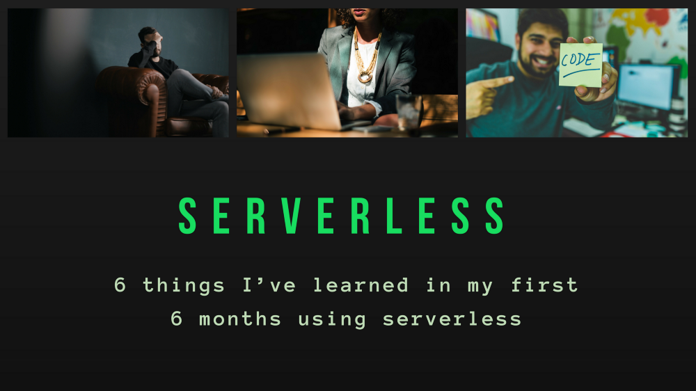

 

# Testdaten generieren mithilfe von Openmaps

Mit OpenMap einfach Daten generieren

[Linkedin](https://www.linkedin.com/company/11759873) [Instagram](https://www.instagram.com/thinkport/) [Youtube](https://www.youtube.com/channel/UCnke3WYRT6bxuMK2t4jw2qQ) [Envelope](mailto:tdrechsel@thinkport.digital)

##### _Contributor: Nicolas Voigt_

Für eine Streaming-Anwendung mit Apache Kafka werden geografische Testdaten benötigt. Vorliegendes Schaubild bildet ein Tech Stack Overview ab. Hierbei wird der Ablauf samt beteiligter Software veranschaulicht. 

<figure>

<figcaption>

Abb.1 - Tech Stack Overview

</figcaption>

</figure>

Für die Erzeugung eines simplen Datasets, 
beispielsweise in Form von GPS-Koordinaten von Autos, wird ein Fleet von Pods  
unter Betrachtung von Kubernetes benutzt. Ein einzelner Pod wird hierbei ein einzelnes Dataset von Koordinaten bzw. ein  
Auto generieren (s.h. Abbildung 1).

_Wichtige Voraussetzungen und involvierte Module/Software_

1.      Spring Boot ist ideal für die Entwicklung und Bereitstellung individueller Microservices, unabhängig von der gewählten Programmierungssprache. Es wird eine hoch skalierbare und robuste Kommunikation zwischen den Services ermöglicht.

2.      Osmapi wird von StreetComplete benutzt und bildet einen Client der OSM API 0.6. Es ist ein offizielles Modul von Openstreetmap und als Testprojekt im Vergleich zu Google Maps relativ kostengünstig. Vorteilig ist zudem, dass Openstreetmap,  einige kostenlose Varianten anbietet und leicht anbindbar ist. Die OSM-API ist hierbei lediglich für die Bearbeitung der Karte verantwortlich und nicht für das Abrufen größerer Datenmengen geeignet. Die Aufarbeitung größeren Datenbeständen erfolgt wiederum von Overpass-API.  
  

3.      Spring für Apache Kafka wendet zentrale Spring-Konzepte auf Basis von Kafka-basierten Messaging-Lösungen an. Vorteilig hierbei ist, dass es mit Azure Eventhub angebunden ist, jedoch auch nur in Verbindung mit diesem zu nutzen ist. Als High-Level-Abstraktion bietet spring-kafka eine Vorlage für die Sendung von Nachrichten an. Zudem unterstützt es bei Message-driven POJOs mit KafkaListener-Annotationen.

4.      Innerhalb der Streaming Anwendung werden folgende drei Azure Services verwendet:

Zum einen _AKS Azure Kubernetes_, welche eine Open-Source-API bereitstellt und Container bzw. gruppierte Pods (s.h. Abbildung 1) genauer steuert. Ein weiterer Streaming Service ist _Azure Application Gateway_, welche hilfreich ist, um URL-basiertes Routing durchzuführen. Für den Schutz der einzelnen Pods sollte eine direkte Verbindung mit dem Internet vermieden werden. Azure Gateway ist zudem wichtig, 
um eine Abtrennung zwischen Pods und Internet zu schaffen und den Einlass von fehlerhaften Inhalten gegebenenfalls zu verhindern und zu monitoren. Die dritte Serviceanwendung _Interconnect VPN_ stellt die Funktionalität, Sicherheit und Verwaltungsrichtlinien eines privaten Netzwerks sicher. Grund für die Nutzung von VPN Interconnect ist zusätzlich der Fakt, dass Eventhub im eigenen privaten Subnet läuft.

<figure>

<figcaption>

Abb.2 - Vorgang Datengeneration mit Openstreetmap

</figcaption>

</figure>

_Wie das Ganze deployed_ _wird_   

Die Bereitstellung der Daten erfolgt mit der Open-Source-Infrastruktur as code (IaC) Plattform _Terraform_, welche von HashiCorp entwickelt wurde. Die Infrastruktur wird in diesem Zusammenhang als YAML Dateien beschrieben. Vorteil dieser Software-Anwendung ist zudem, dass  
diese äußerst git friendly ist, sprich eine parallele Entwicklung der Infrastruktur ermöglicht und eine einfache Historie samt Änderungen aufzeigt. Zusätzlich ist es rollback friendly und im Falle eines Bugs kann die vorherige fehlerfreie Infrastruktur schnell und leicht wieder eingesetzt werden. Letztlich wird eine einfache Einstellung bezüglich der Skalierung und Parallelisierung gegeben.

<figure>

<figcaption>

Abb.3 - Source Snippets Auszug

</figcaption>

</figure>

**Conclusion**:

Zusammenfassend bilden Gateway und VPN Interconnect eine Verbindungsstelle, damit die Pods die generierten GPS-Koordinaten  
verifizieren können. Insgesamt ist die Infrastruktur korrekt einzuordnen,  abänderbar und leicht verständlich.

**Thinkport** ist ein dynamisches und stetig wachsendes Cloud-Beratungsunternehmen,  mit dem Ziel innovative Technologien und Lösungen im Bereich Cloud Computing zu entwickeln. Als zertifizierter Microsoft Gold Platform Partner arbeiten wir eng mit Microsoft, im Azure-Cloud-Umfeld, zusammen und verfügen auch über zertifizierte Expertise mit Amazon Web Services.

Unsere Stärken und unser Know-how liegen in den Bereichen Multi-Cloud, Data Lakes, Big Data, AI und Event-Driven Architectures (Hadoop, Kafka, Solace) sowie Terraform. Um einen weiteren Einblick über unsere Dienstleistungen zu bekommen, besuchen Sie gerne unsere Website und die neu aktualisierte [Workshop Seite](https://thinkport.digital/cloud-excellence-workshops/). 

#### Referenzen:   

1\. https://github.com/westnordost/osmapi  
2. https://docs.microsoft.com/de-de/azure/developer/java/spring-framework/configure-spring-cloud-stream-binder-java-app-kafka-azure-event-hub  
3\. https://spring.io/projects/spring-kafka  
4. https://www.confluent.io/resources/event-driven-microservices-with-spring-boot-and-confluent-cloud/?utm\_medium=sem&utm\_source=google&utm\_campaign=ch.sem\_br.nonbrand\_tp.prs\_tgt.kafka\_mt.xct\_rgn.emea\_lng.eng\_dv.all\_con.kafka-spring&utm\_term=apache%20kafka%20spring&creative=&device=c&placement=&gclid=CjwKCAjwwqaGBhBKEiwAMk-FtFxg3qKuRsotG1cOIuXpYhkVcQB0SjdVFplQO-29JygGZA7-huflWBoCxIgQAvD\_BwE

## [Weitere Beiträge](https://thinkport.digital/blog)

[")](https://thinkport.digital/aws-elastic-beanstalk-2/)

### [AWS Elastic Beanstalk](https://thinkport.digital/aws-elastic-beanstalk-2/ "AWS Elastic Beanstalk")

[AWS Cloud](https://thinkport.digital/category/aws-cloud/)

### [AWS Elastic Beanstalk](https://thinkport.digital/aws-elastic-beanstalk-2/ "AWS Elastic Beanstalk")

[AWS Cloud](https://thinkport.digital/category/aws-cloud/)

### [Kublr bringt Rolling-Updates für Kubernetes](https://thinkport.digital/kublr-rolling-updates-fuer-kubernetes/ "Kublr bringt Rolling-Updates für Kubernetes")

[AWS Cloud](https://thinkport.digital/category/aws-cloud/), [Cloud Kubernetes](https://thinkport.digital/category/cloud-kubernetes/)

### [Kublr bringt Rolling-Updates für Kubernetes](https://thinkport.digital/kublr-rolling-updates-fuer-kubernetes/ "Kublr bringt Rolling-Updates für Kubernetes")

[AWS Cloud](https://thinkport.digital/category/aws-cloud/), [Cloud Kubernetes](https://thinkport.digital/category/cloud-kubernetes/)

### [The 6 Most Important Things I have learned in my 6 Months using Server-less](https://thinkport.digital/the-6-most-important-things-i-have-learned-in-my-6-months-using-server-less/ "The 6 Most Important Things I have learned in my 6 Months using Server-less")

[Big Data](https://thinkport.digital/category/big-data/)

### [The 6 Most Important Things I have learned in my 6 Months using Server-less](https://thinkport.digital/the-6-most-important-things-i-have-learned-in-my-6-months-using-server-less/ "The 6 Most Important Things I have learned in my 6 Months using Server-less")

[Big Data](https://thinkport.digital/category/big-data/)

[")](https://thinkport.digital/9-best-mobile-app-ui-design-trends-in-2018/)

### [9 Best Mobile App UI Design Trends in 2018](https://thinkport.digital/9-best-mobile-app-ui-design-trends-in-2018/ "9 Best Mobile App UI Design Trends in 2018")

[Frontend](https://thinkport.digital/category/frontend/)

### [9 Best Mobile App UI Design Trends in 2018](https://thinkport.digital/9-best-mobile-app-ui-design-trends-in-2018/ "9 Best Mobile App UI Design Trends in 2018")

[Frontend](https://thinkport.digital/category/frontend/)

### [Was Sie über Kafka 2.7 wissen sollten](https://thinkport.digital/kafka-2-7-update/ "Was Sie über Kafka 2.7 wissen sollten")

[AWS Cloud](https://thinkport.digital/category/aws-cloud/)

### [Was Sie über Kafka 2.7 wissen sollten](https://thinkport.digital/kafka-2-7-update/ "Was Sie über Kafka 2.7 wissen sollten")

[AWS Cloud](https://thinkport.digital/category/aws-cloud/)

### [Reasons Why DynamoDB is Not for Everyone](https://thinkport.digital/reasons-why-dynamodb-is-not-for-everyone/ "Reasons Why DynamoDB is Not for Everyone")

[Big Data](https://thinkport.digital/category/big-data/)

### [Reasons Why DynamoDB is Not for Everyone](https://thinkport.digital/reasons-why-dynamodb-is-not-for-everyone/ "Reasons Why DynamoDB is Not for Everyone")

[Big Data](https://thinkport.digital/category/big-data/)

## Blog Kurator

### Christina Friede

### Business Development

## Email:

## [cfriede@thinkport.digital](mailto:cfriede@thinkport.digital)

* 
