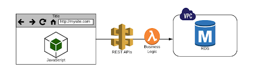
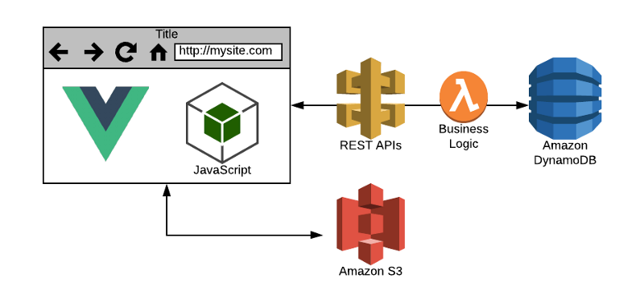
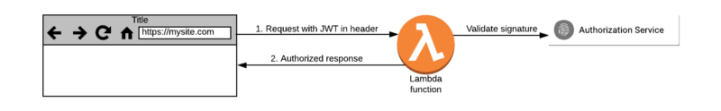
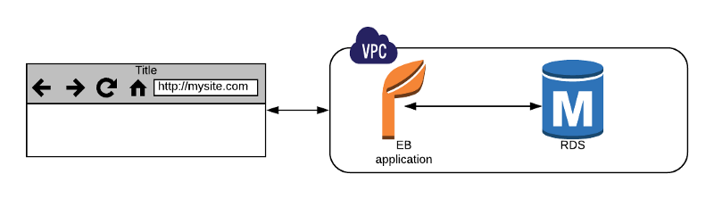
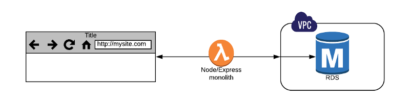
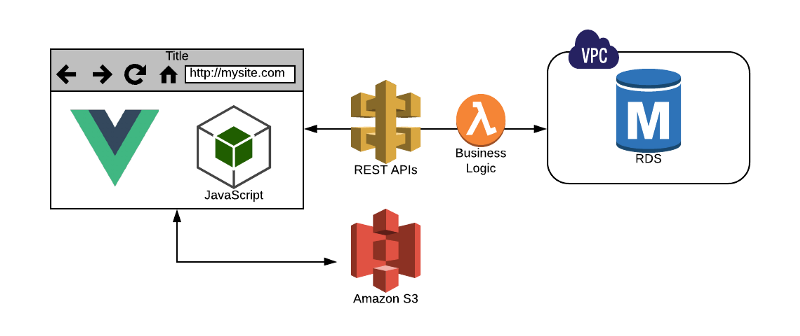

## Serverless Tips

## CLOUD AWS Lambda

# The 6 Most Important Things I have learned during 6 Months using Serverless

[Linkedin](https://www.linkedin.com/company/11759873) [Instagram](https://www.instagram.com/thinkport/) [Youtube](https://www.youtube.com/channel/UCnke3WYRT6bxuMK2t4jw2qQ) [Envelope](mailto:tdrechsel@thinkport.digital)

Finding the right tools is of utmost importance in the world of serverless. October served as an eye opener to me and my company. After the [Serverlessconf](http://serverlessconf.io/) tour, I decided there and then that my company would operate on Serverless.

The first two months were a nightmare as we struggled to familiarize with the trend. Six months down the line, we are now deploying a major project servelessly, the fourth one in the company.

This article explains how we did it and provides the six most important lessons we learned in the process.

1. **The middle layer has to go**

We have been developing web apps forever. This is one of the reasons why it took us a considerably long time to realize a very obvious advantage of Serverless.

Some of our first web apps still had a Node Express layer. This layer remembered session state either by accident or by the tragedy of design where we misused DynamoDB to make it remember sessions.

During the first phase of the transition, the middle layer served as a web server on Lambda. We later came to discover that this was wrong and terrible. The result was HTML pages full of JavaScript calling REST APIs. This approach that we employed was unmaintainable, but in the end, we managed to get rid of the middle layer. This is what should happen in Serverless.

2. **Love DynamoDB**

Getting your grip around DynamoDB is arguably the hardest aspect of using Serverless. You encounter a few difficulties in the first interactions. Most of the time you want to go back to the more familiar RDS. Structured Querry Language (SQL) has been of great support for as far as I can remember. I have also put a lot of business logic into databases. RDMS systems, on the other hand, fail to scale well and do not support the concept of agile systems that have evolved organically.

DynamoDB is on a whole new level. Among the benefits of getting the NoSQL database right include massive scale, very fast performance, and zero administrative overhead. The table fields in DynamoDB should not contain empty strings. You will be forced to start over again when you get the partition and sort keys wrong. Emulating the SQL queries too closely can lead you from having few to very many tables.

After several attempts and finally succeeding with DynamoDB, I learned that:

- Do not just jump into it without getting the facts right. Understand how it works first, lest you get disappointed and move back to RDMS.
- It has extremely powerful tools. You can use streams to attach code to table events.
- It can feed other storage systems. It can also be used to protect other databases from enormous data volumes.

3. **Authorization is key**

Traditionally, you only had to authenticate yourself and then track them by following a session ID. The session ID controlled access. This was time-saving as you only needed to do the hard work once. But there are problems associated with this approach. First, it only works if the server is in the middle. In this case, the server has been burned to the ground. Second, it exposes you to malicious attacks like CSRF. It also makes passing identity to other services very difficult.

Nobody likes the CSRF attacks. This is where the JWT token comes in. Here is an illustration of how it works;

- **Step 1:** get a JWT. You are awarded a JWT token after the authorization process.
- **Step 2:** use it to communicate with the service you writeBelow are some reasons why you should use JWT;

  - The client can talk to more than one serverless activity
  - Every request is authenticated
  - It is secure.
  - It is anti-monolith,
  - It is CSRF-free

  The only thing needed from your serveless code is a Custom Authorizer to determine if the header is valid.

  However, JWT makes all other types of auth look complex. Therefore, we shifted to Auth0. Surely, serverless is extremely simple and very effective.

 

4. **Bye Python**

While Flask was a nice framework in the traditional days, it is not suitable for the new world.

To support interactions, you will have to move more work to the client’s side. This will leave you with no other option but to use JavaScript. The result is always inlining into your Python templates.

Flask solutions have increasingly become a clumsy mess with different inefficient languages. After turning to Node, things were much more convenient, and I could use only one language. A simple Node configuration could help you use ES6 to get rid of JavaScript constructs. And that explains how we ditched Python to join the JavaScript bandwagon.

People using Python will boast about the impressive language features, but that is nothing compared to the charms of JavaScripts.

 

5. **Enjoy the Vue while it lasts**

I was introduced to React when I entered the world of Single Page Applications. React is the most popular approach to developing user interfaces. It is great, but some of its drawbacks include a learning curve that is too steep, Webpack set up and JSX introduction. We chose to explore alternatives since it was too heavyweight for our immediate use.

I soon discovered  Vue.js and my life using serverless turned around. You can learn all about Vue in just a few days. Other significant advantages of Vue include:

- Everything is a component which manages its own content, design, and code. This makes it easy to manage our clients’ projects, which are quite a huge number.
- You are provided with powerful debugging tools, a Webpack and great organization from the open-source JavaScript framework.
- Vue allows you to develop a desktop application within the browser. This way, you can improve the user experience.

In the old world, we would be deploying apps through Elastic Beanstalk. We would then monitor them for utilization and manage infrastructure. In SPAs, however, when you deploy an application, you are copying index.html, bundle.js, and some file dependencies to an s3 bucket which is front-ended by a CloudFront distribution. This grants you steady loading and distribution behavior. It also enables multi-version management.

There’s zero app infrastructure management.

6. **Serverless framework**

My experience with Lambda in the first days involved coding directly into the AWS console. I often got stressed up as it took lots of work and mistakes to get some tasks done. It took me quite some time to discover the absence of the bridge connecting my IDE to the production environment.

All along, the solution had always been a serverless framework. Just a sls deploy deploy bundles up your precious code and ships it directly to Amazon’s brain. In case your code is misbehaving, and you need to check logs, type sls logs -f functionname -t.

This is a wonderful experience and the serverless people’s contribution should be applauded.

**Cheers to new beginnings!**

After attending A Cloud Guru's serverless conference, we felt that this was clearly an unexplored area with limitless potential.

During our first experiments, we had our fair share of failures. The results weren't satisfying. We have started to officially deliver projects in a 100% serverless way months after getting the right stack in place. All the migration difficulties and failures along the way were worth it.

We have commenced on a journey of building SPA apps which use serverless infrastructure and scale effortlessly. The apps also cost 70-90% less and the payoff is incredible. Serverless technology is going to revolutionize the delivery of applications in the cloud.

## [Weitere Beiträge](https://thinkport.digital/blog)

### [Testdaten generieren mithilfe von Openmaps](https://thinkport.digital/testdaten-generieren-mithilfe-von-openmaps/ 'Testdaten generieren mithilfe von Openmaps')

[AWS Cloud](https://thinkport.digital/category/aws-cloud/)

### [Testdaten generieren mithilfe von Openmaps](https://thinkport.digital/testdaten-generieren-mithilfe-von-openmaps/ 'Testdaten generieren mithilfe von Openmaps')

[AWS Cloud](https://thinkport.digital/category/aws-cloud/)

### [10 Big Data Trends to watch in 2018](https://thinkport.digital/10-big-data-trends-to-watch-in-2018/ '10 Big Data Trends to watch in 2018')

[Big Data](https://thinkport.digital/category/big-data/)

### [10 Big Data Trends to watch in 2018](https://thinkport.digital/10-big-data-trends-to-watch-in-2018/ '10 Big Data Trends to watch in 2018')

[Big Data](https://thinkport.digital/category/big-data/)

### [IT-Automatisierung als Antwort gegen die Corona-Krise](https://thinkport.digital/it-automatisierung-als-antwort-gegen-die-corona-krise/ 'IT-Automatisierung als Antwort gegen die Corona-Krise')

[AWS Cloud](https://thinkport.digital/category/aws-cloud/), [Big Data](https://thinkport.digital/category/big-data/)

### [IT-Automatisierung als Antwort gegen die Corona-Krise](https://thinkport.digital/it-automatisierung-als-antwort-gegen-die-corona-krise/ 'IT-Automatisierung als Antwort gegen die Corona-Krise')

[AWS Cloud](https://thinkport.digital/category/aws-cloud/), [Big Data](https://thinkport.digital/category/big-data/)

[')](https://thinkport.digital/aws-rds-2/)

### [AWS RDS](https://thinkport.digital/aws-rds-2/ 'AWS RDS')

[AWS Cloud](https://thinkport.digital/category/aws-cloud/)

### [AWS RDS](https://thinkport.digital/aws-rds-2/ 'AWS RDS')

[AWS Cloud](https://thinkport.digital/category/aws-cloud/)

[')](https://thinkport.digital/cloud_infrastructure_with_crossplane/)

### [Crossplane – composing cloud infrastructure in a more effective way](https://thinkport.digital/cloud_infrastructure_with_crossplane/ 'Crossplane – composing cloud infrastructure in a more effective way')

[AWS Cloud](https://thinkport.digital/category/aws-cloud/)

### [Crossplane – composing cloud infrastructure in a more effective way](https://thinkport.digital/cloud_infrastructure_with_crossplane/ 'Crossplane – composing cloud infrastructure in a more effective way')

[AWS Cloud](https://thinkport.digital/category/aws-cloud/)

[')](https://thinkport.digital/aws-iam-2/)

### [AWS IAM](https://thinkport.digital/aws-iam-2/ 'AWS IAM')

[AWS Cloud](https://thinkport.digital/category/aws-cloud/)

### [AWS IAM](https://thinkport.digital/aws-iam-2/ 'AWS IAM')

[AWS Cloud](https://thinkport.digital/category/aws-cloud/)

## Blog Kurator

### Christina Friede

### Business Development

## Email:

## [cfriede@thinkport.digital](mailto:cfriede@thinkport.digital)

-  
