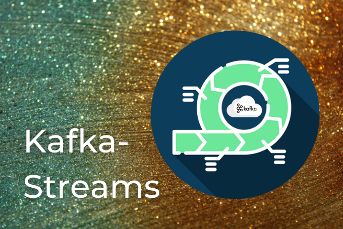
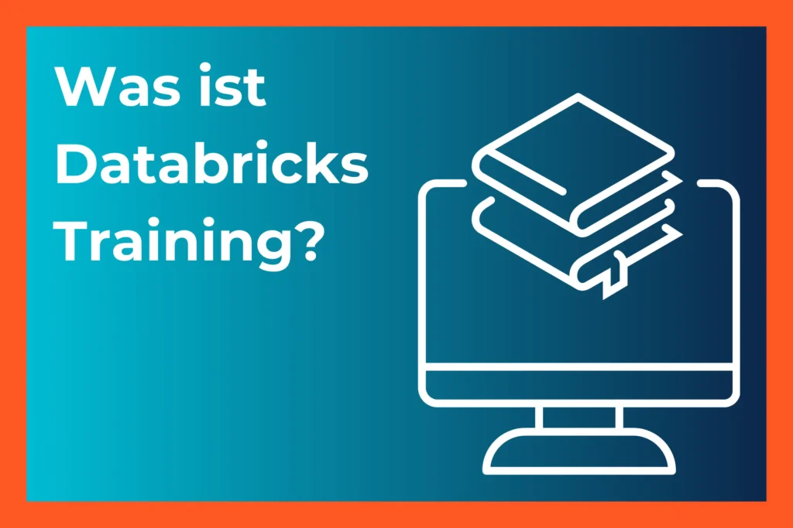

# Thinkport ausgezeichnet als  

"AWS Advanced Tier Services"  
– Ihr Cloud-Exzellenzpartner!

## Wir freuen uns, ab sofort den Titel "AWS Advanced Tier Services" tragen zu dürfen. Dies ist eine wichtige Anerkennung unserer kontinuierlichen Bemühungen, erstklassige Cloud-Dienstleistungen anzubieten.

Unser Team hat dafür unermüdlich gearbeitet und erstaunliche Erfolge erzielt:

* Mehr als 20 AWS-Zertifikate auf verschiedenen Levels wurden erworben.
* Über 20 erfolgreiche Kundenprojekte wurden abgeschlossen.
* Wir erhielten mehr als 20 positive Kundenbewertungen.
* Zahlreiche Kunden wurden erfolgreich in die Cloud migriert.
* Zusätzlich konnten wir eine beeindruckende Liste öffentlich ausgewiesener AWS-Kunden aufbauen.

Mit diesem Meilenstein verpflichten wir uns, unsere Fähigkeiten und Leistungen kontinuierlich zu verbessern. Und so die Kriterien für den AWS Advanced Tier Services-Titel jährlich neu zu erfüllen. 

Wir sind stolz darauf, nachhaltige Leistungen und hohen Einsatz für unsere Kunden zu bieten. Ein herzliches Dankeschön geht an unser engagiertes Team, das mit Leidenschaft und Engagement dazu beigetragen hat, diesen Erfolg zu realisieren. 

Ohne euer Engagement wäre dies nicht möglich gewesen!

## [Weitere Beiträge](https://thinkport.digital/blog)

### [Setup Hashicorp Nomad Ansible fail2ban](https://thinkport.digital/setup-hashicorp-nomad-ansible-fail2ban/ "Setup Hashicorp Nomad Ansible fail2ban")

[Cloud General](https://thinkport.digital/category/cloud-general/)

### [Setup Hashicorp Nomad Ansible fail2ban](https://thinkport.digital/setup-hashicorp-nomad-ansible-fail2ban/ "Setup Hashicorp Nomad Ansible fail2ban")

[Cloud General](https://thinkport.digital/category/cloud-general/)

### [Machine Learning in Production](https://thinkport.digital/machine-learning-in-production/ "Machine Learning in Production")

[Big Data](https://thinkport.digital/category/big-data/), [Cloud General](https://thinkport.digital/category/cloud-general/), [Cloud Strategie](https://thinkport.digital/category/cloud-strategie/), [Company Value](https://thinkport.digital/category/company-value/)

### [Machine Learning in Production](https://thinkport.digital/machine-learning-in-production/ "Machine Learning in Production")

[Big Data](https://thinkport.digital/category/big-data/), [Cloud General](https://thinkport.digital/category/cloud-general/), [Cloud Strategie](https://thinkport.digital/category/cloud-strategie/), [Company Value](https://thinkport.digital/category/company-value/)

### [Kafka Streams](https://thinkport.digital/kafka-streams/ "Kafka Streams")

[Cloud General](https://thinkport.digital/category/cloud-general/), [Streaming](https://thinkport.digital/category/streaming/)

### [Kafka Streams](https://thinkport.digital/kafka-streams/ "Kafka Streams")

[Cloud General](https://thinkport.digital/category/cloud-general/), [Streaming](https://thinkport.digital/category/streaming/)

### [Was ist Databricks Training?](https://thinkport.digital/was-ist-databricks-training/ "Was ist Databricks Training?")

[Big Data](https://thinkport.digital/category/big-data/), [Cloud General](https://thinkport.digital/category/cloud-general/)

### [Was ist Databricks Training?](https://thinkport.digital/was-ist-databricks-training/ "Was ist Databricks Training?")

[Big Data](https://thinkport.digital/category/big-data/), [Cloud General](https://thinkport.digital/category/cloud-general/)

### [Nomad vs Kubernetes](https://thinkport.digital/nomad-vs-kubernetes/ "Nomad vs Kubernetes")

[Cloud General](https://thinkport.digital/category/cloud-general/), [Cloud Kubernetes](https://thinkport.digital/category/cloud-kubernetes/)

### [Nomad vs Kubernetes](https://thinkport.digital/nomad-vs-kubernetes/ "Nomad vs Kubernetes")

[Cloud General](https://thinkport.digital/category/cloud-general/), [Cloud Kubernetes](https://thinkport.digital/category/cloud-kubernetes/)

### [Datenstrategie für KI Revolution](https://thinkport.digital/datenstrategie_fuer_ki/ "Datenstrategie für KI Revolution")

[Big Data](https://thinkport.digital/category/big-data/), [Cloud General](https://thinkport.digital/category/cloud-general/), [Cloud Strategie](https://thinkport.digital/category/cloud-strategie/)

### [Datenstrategie für KI Revolution](https://thinkport.digital/datenstrategie_fuer_ki/ "Datenstrategie für KI Revolution")

[Big Data](https://thinkport.digital/category/big-data/), [Cloud General](https://thinkport.digital/category/cloud-general/), [Cloud Strategie](https://thinkport.digital/category/cloud-strategie/)
