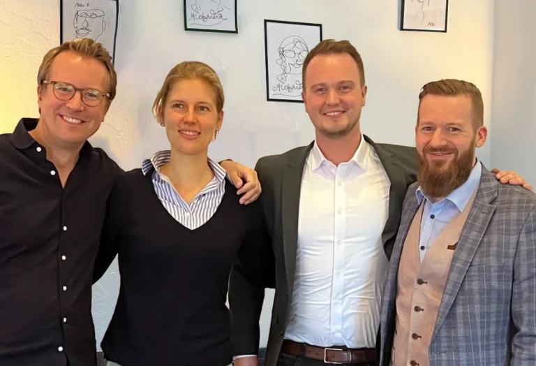
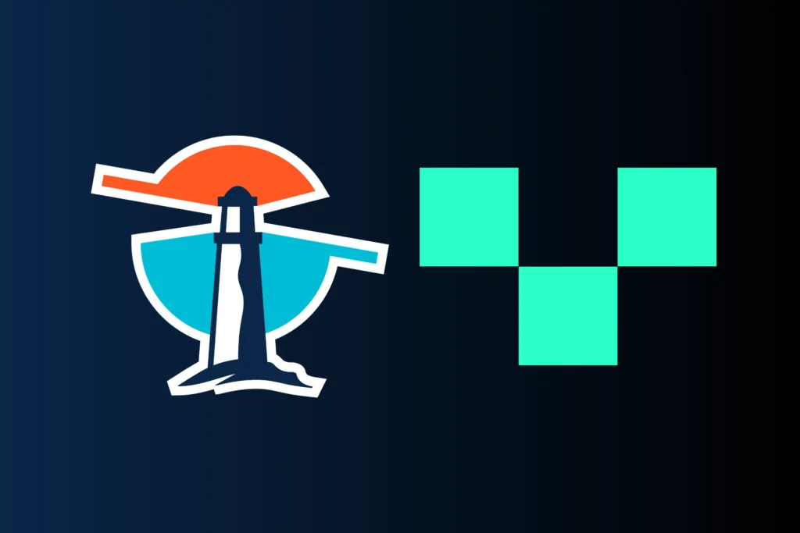

## Thinkport begrüßt die Venitus Gruppe als Wachstumsinvestor und strategischen Partner

Thinkport, ein stark wachsendes Unternehmen im Bereich Public Cloud Consulting und Software Development, hat mit der Venitus Gruppe einen langfristigen strategischen Partner und Wachstumsinvestor gewonnen. Dieser Schritt markiert einen Meilenstein in der Entwicklung des 2018 gegründeten Unternehmens. Dieser wird dazu beitragen, die Position als junger Innovationsführer in der Branche weiter zu stärken, das rasante Wachstum fortzuführen und die Strukturen für die nächste Entwicklungsphase aufzubauen.

> Tobias Drechsel und Dominik Fries, CEO und CTO von Thinkport, mit Konstanze Klasen und Max Klenner, Geschäftsführung von Venitus

Thinkport hat in den letzten fünf Jahren eine beeindruckende Reise von einem Start-up zu einem etablierten und ausgezeichneten Player in der Cloud-Technologie-Branche bestritten. Unter dem Motto „Cloud Consulting mit Startup Spirit“ gründeten Dominik Fries und Tobias Drechsel das Unternehmen im Jahr 2018. Es folgten fünf starke Jahre, in denen das Unternehmen aus Frankfurt am Main nach Leipzig, Hamburg und Berlin expandierte. Kontinuierlich stieg dabei die Mitarbeiterzahl von zwei auf 80 an. Zum Kundenportfolio gehören renommierte Namen, wie Edeka, Bayer und die Deutsche Bahn.

Das Unternehmen stellt die Geschäftsziele großer Unternehmen und DAX-Konzerne in den Mittelpunkt: Das ‚Enabling‘ von Geschäftsmodellen, eine bessere Performance und größere Agilität. Dabei werden Ressourcen noch effizienter eingesetzt und die Compliance sichergestellt. Fokussiert wird auf die Architektur und Anwendungen der drei marktführenden Public Cloud Service Partner AWS, Azure und Google Cloud. Hinzu kommen im Einzelfall Technologien weiterer Partner, die für Kunden lösungsorientiert eingesetzt werden. Hierzu zählen im Bereich der Cloud Architektur z. B. Kubernetes, Docker und Terraform. Für besonders anspruchsvolles Daten Management wird auf Apache Kafka, Solace, Databricks und Spark gesetzt. Auf diese Weise hat Thinkport besondere Kompetenzen entwickelt in den Bereichen:

* Migration und Development komplexer Cloud Architekturen
* Hybride und Multi Cloud Architekturen
* Event getriebene Streaming Architekturen
* Daten-Strategie & -Konzepte
* Machine Learning Ops + AI Enablement

„Wir sind begeistert, Venitus in der Thinkport-Familie willkommen zu heißen. Die Partnerschaft ist das folgerichtige Ergebnis kontinuierlichen Wachstums, klarer Marktpositionierung und strategischer Vision. Sie ermöglicht es, unsere Innovationskraft zu steigern, das Serviceangebot zu erweitern und unsere Markt-Reichweite zu vergrößern“, sagt Dominik Fries, Gründer und CTO von Thinkport.

<figure>

<figcaption>

Thinkport und Venitus logos

</figcaption>

</figure>

„Die Strategie von Thinkport bleibt weiterhin geprägt von Transparenz, Offenheit, Partnerschaft und einem starken Fokus auf die Bedürfnisse von Enterprise-Unternehmen. Wir freuen uns auf die gemeinsame Zukunft mit Venitus und sind davon überzeugt, dass diese Partnerschaft neue Möglichkeiten für Wachstum, Innovation und nachhaltigen Erfolg eröffnet.“

Für weitere Informationen kontaktieren Sie bitte:

Dominik Fries

_CTO Thinkport_

[dfries@thinkport.digital](mailto:dfries@thinkport.digital)

Max Klenner

_CEO Venitus_

[klenner@venitus.de](mailto:klenner@venitus.de)

 

## [Weitere Beiträge](https://thinkport.digital/blog)

### [Setup von Hashicorp Nomad](https://thinkport.digital/setup-von-hashicorp-nomad/ 'Setup von Hashicorp Nomad')

[Cloud General](https://thinkport.digital/category/cloud-general/)

### [Setup von Hashicorp Nomad](https://thinkport.digital/setup-von-hashicorp-nomad/ 'Setup von Hashicorp Nomad')

[Cloud General](https://thinkport.digital/category/cloud-general/)

### [Orthanc und Kubernetes: Sichere On-Premise und Multicloud-Lösung](https://thinkport.digital/orthanc-und-kubernetes/ 'Orthanc und Kubernetes: Sichere On-Premise und Multicloud-Lösung')

[Cloud General](https://thinkport.digital/category/cloud-general/), [Streaming](https://thinkport.digital/category/streaming/)

### [Orthanc und Kubernetes: Sichere On-Premise und Multicloud-Lösung](https://thinkport.digital/orthanc-und-kubernetes/ 'Orthanc und Kubernetes: Sichere On-Premise und Multicloud-Lösung')

[Cloud General](https://thinkport.digital/category/cloud-general/), [Streaming](https://thinkport.digital/category/streaming/)

### [Streaming-Services](https://thinkport.digital/streaming-services/ 'Streaming-Services')

[Cloud General](https://thinkport.digital/category/cloud-general/), [Streaming](https://thinkport.digital/category/streaming/)

### [Streaming-Services](https://thinkport.digital/streaming-services/ 'Streaming-Services')

[Cloud General](https://thinkport.digital/category/cloud-general/), [Streaming](https://thinkport.digital/category/streaming/)

### [Cloud Consulting for Migration to the Cloud](https://thinkport.digital/cloud-consulting-for-migration-to-the-cloud/ 'Cloud Consulting for Migration to the Cloud')

[Cloud General](https://thinkport.digital/category/cloud-general/)

### [Cloud Consulting for Migration to the Cloud](https://thinkport.digital/cloud-consulting-for-migration-to-the-cloud/ 'Cloud Consulting for Migration to the Cloud')

[Cloud General](https://thinkport.digital/category/cloud-general/)

### [Sustainability of the Cloud](https://thinkport.digital/sustainability-of-the-cloud/ 'Sustainability of the Cloud')

[Cloud General](https://thinkport.digital/category/cloud-general/)

### [Sustainability of the Cloud](https://thinkport.digital/sustainability-of-the-cloud/ 'Sustainability of the Cloud')

[Cloud General](https://thinkport.digital/category/cloud-general/)

[')](https://thinkport.digital/vom_kafka-cluster_zum_event-mesh/)

### [Vom Kafka Cluster zum Event Mesh](https://thinkport.digital/vom_kafka-cluster_zum_event-mesh/ 'Vom Kafka Cluster zum Event Mesh')

[Cloud General](https://thinkport.digital/category/cloud-general/), [Streaming](https://thinkport.digital/category/streaming/)

### [Vom Kafka Cluster zum Event Mesh](https://thinkport.digital/vom_kafka-cluster_zum_event-mesh/ 'Vom Kafka Cluster zum Event Mesh')

[Cloud General](https://thinkport.digital/category/cloud-general/), [Streaming](https://thinkport.digital/category/streaming/)
