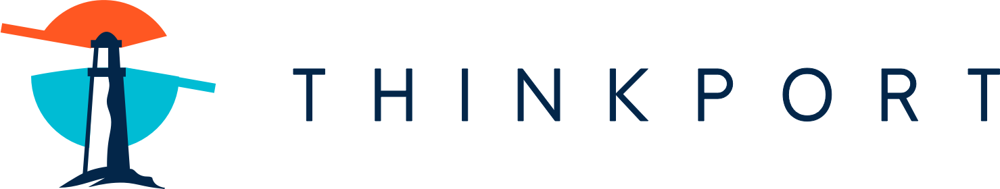

# Thinkport ist Day-1-Member von GAIA-X

NEWS

Share on facebook Share on twitter Share on linkedin Share on pinterest Share on email

## „Thinkport GmbH ist Day-1-Member von GAIA-X“

Da Cloud-Solutions immer mehr zu einem zentralen Bestandteil der Infrastruktur in europäischen Unternehmen werden, freut Thinkport mitteilen zu können, ein Day-1 Member der [GAIA-X](https://www.data-infrastructure.eu/GAIAX/Navigation/EN/Home/home.html) Initiative zu sein.

Das Projekt fördert die Entwicklung einer effizienten, wettbewerbsfähigen und sicheren Dateninfrastruktur in Europa. Es wird von Vertretern aus Wirtschaft, Wissenschaft und Politik aus verschiedenen europäischen Ländern unterstützt.

Außerdem, ist das Hauptziel von GAIA-X , die Kräfte der europäischen Länder zu bündeln, um eine neue Generation gemeinsamer Dateninfrastruktur für Staaten, Unternehmen und Bürger zu schaffen. Eine Dateninfrastruktur, die höchsten Ansprüchen in Bezug auf digitale Souveränität gerecht wird und gleichzeitig Innovationen fördern soll.

Bei Thinkport glauben wir fest an diesen Ansatz. Unser Ziel als Day-1 Member von GAIA-X ist es, einen positiven Einfluss auf die Entwicklung von [technischen Lösungen](https://thinkport.digital/cloud-consulting-fur-deutsche-grosunternehmen/) und Standards zu haben und die Zusammenarbeit und Innovation zwischen den europäischen Partnern zu fördern. Angesicht der Tatsache, dass diese Aspekte fest in den [Werten und der Vision](https://thinkport.digital/thinkport-cloud-experten-uber-uns/) unseres Unternehmens verankert sind, war es für unser Team fast schon selbstverständlich, sich der Initiative anzuschließen und diese zu unterstützen. Wir sind stolz darauf, ein Teil dieser Initiative zu sein!

## Weitere Neuigkeiten

## News Writer

Christina Friede

Business Development

Email:

[cfriede@thinkport.digital](mailto:cfriede@thinkport.digital)

-  
